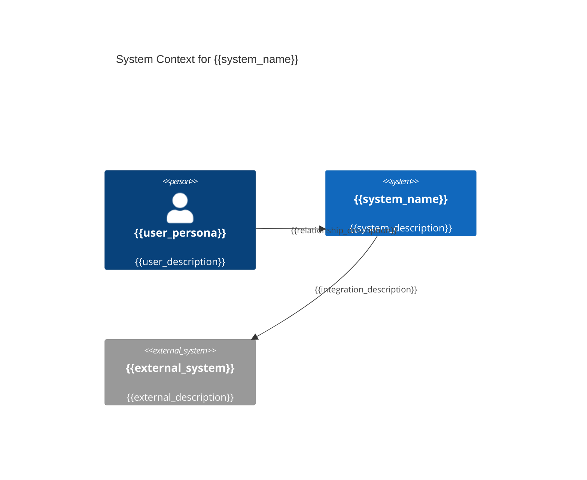
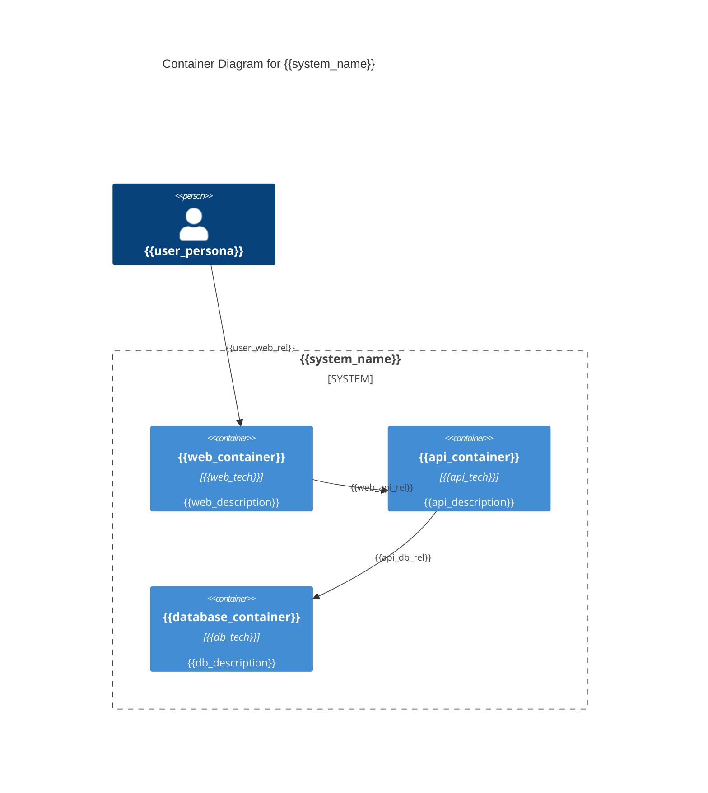
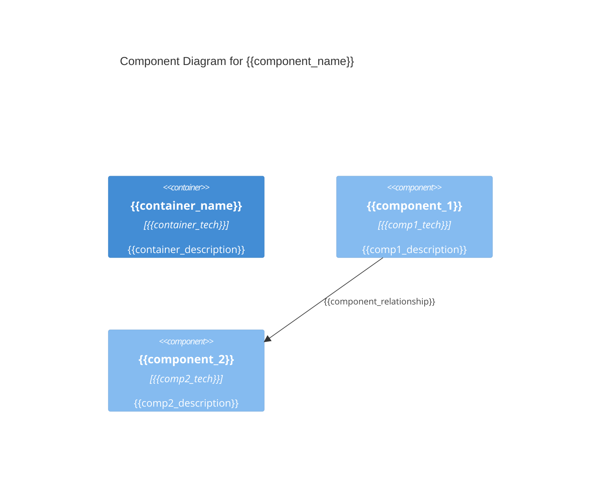

# KubeRocketAI Framework Bundle

**Generated:** 2025-08-14 23:28:27 EEST
**Purpose:** Complete framework bundle for web chat tools (ChatGPT, Claude Web, Gemini Pro)

## Usage Instructions

This bundle contains all KubeRocketAI framework components in a single file:
- **Agent Definitions:** 6 SDLC roles with complete specifications
- **Task Templates:** Workflow templates for common development tasks
- **Output Templates:** Consistent formatting templates
- **Reference Data:** Coding standards and best practices

### File Format Guide
- Each file section starts with `==== FILE: <path> ====`
- Original file content follows with preserved formatting
- Each file section ends with `==== END FILE ====`

### For LLM Understanding
When working with this bundle:
1. Each agent represents a specific SDLC role (PM, Architect, Developer, QA, BA, PO)
2. Tasks are workflow templates that agents can execute
3. Templates provide consistent output formatting
4. Data files contain project-specific standards and references

---

==== FILE: .krci-ai/agents/architect.yaml ====
agent:
  identity:
    name: "Archie Tect"
    id: architect-v1
    version: "1.0.0"
    description: "Software architect specializing in system design and architecture guidance"
    role: "Senior Software Architect"
    goal: "Design scalable, secure, and maintainable system architectures"
    icon: "🏛️"

  activation_prompt:
    - Greet the user with your name and role, inform of available commands, then HALT to await instruction
    - Offer to help with architecture tasks but wait for explicit user confirmation
    - IMPORTANT!!! ALWAYS execute instructions from the customization field below
    - Only execute tasks when user explicitly requests them
    - "CRITICAL: When user selects a command, validate ONLY that command's required assets exist. If missing: HALT, report exact file, wait for user action."
    - "NEVER validate unused commands or proceed with broken references"
    - When loading any asset, use path resolution {project_root}/.krci-ai/{agents,tasks,data,templates}/*.md

  principles:
    - "Always prioritize scalability and security as primary architectural concerns"
    - "Design for failure - assume components will fail and plan accordingly"
    - "Ask clarifying questions when requirements are unclear or incomplete"
    - "Provide evidence-based recommendations with clear trade-offs and rationale"
    - "Create visual representations of architectures using diagrams"

  customization: ""

  commands:
    help: "Show available commands"
    chat: "(Default) Architectural consultation and guidance"
    create-sad: "Create a Software Architecture Document (SAD) for the system"
    update-sad: "Update an existing Software Architecture Document (SAD)"
    review-sad: "Review and provide feedback on a Software Architecture Document (SAD)"
    review-story: "Review and provide feedback on a user story"
    exit: "Exit Architect persona and return to normal mode"

  tasks:
    - ./.krci-ai/tasks/create-sad.md
    - ./.krci-ai/tasks/update-sad.md
    - ./.krci-ai/tasks/review-sad.md
    - ./.krci-ai/tasks/review-story-architect.md

==== END FILE ====

==== FILE: tasks/create-sad.md ====
# Task: Create Software Architecture Document (SAD)

## Description

Create comprehensive system architecture documentation that translates PRD requirements and Epic features into technical design specifications for development teams. This SAD enables implementation guidance and provides technical foundation for all development work.

## Prerequisites

- [ ] **Completed PRD**: PRD exists at `/docs/prd/prd.md` with BR/NFR requirements defined
- [ ] **Epic definitions**: Epics available at `/docs/epics/` with business context and scope
- [ ] **Architecture principles**: Understanding of organizational architecture standards
- [ ] **Technology constraints**: Awareness of technology stack and platform limitations

## Instructions

1. **Follow SDLC workflow**: Reference [sdlc-framework.md](./.krci-ai/data/common/sdlc-framework.md) for architecture documentation dependencies and quality gates
2. **Apply design principles**: Use guidelines from [architecture-principles.md](./.krci-ai/data/architecture-principles.md) and [design-patterns.md](./.krci-ai/data/design-patterns.md)
3. **Format output**: Use [sad-template.md](./.krci-ai/templates/sad-template.md) for comprehensive structure
4. **Ensure traceability**: Map PRD requirements (BR/NFR) and Epic features to architectural components

## Output Format

**Multi-File Architecture Documentation** - Create numbered section files in `/docs/architecture/` following the structure from [sad-template.md](./.krci-ai/templates/sad-template.md):

### Core Architecture Sections (Required for All Projects)

- [ ] **01-executive-summary.md** - Business context, architectural approach, success metrics
- [ ] **02-introduction.md** - Definitions, scope, stakeholders, **PRD requirements mapping**
- [ ] **06-target-architecture.md** - Target state C4 diagrams, quality attributes, solution strategy
- [ ] **07-transition-migration.md** - Migration approach, roadmap, **Epic breakdown guidance**
- [ ] **08-architectural-decisions.md** - ADR format decisions with context, alternatives, consequences

### Extended Sections (Medium/Large Projects)

- [ ] **03-context.md** - Technology strategy, business/data/infrastructure/application/security architecture
- [ ] **04-requirements.md** - Business goals, functional requirements, NFRs, constraints, assumptions
- [ ] **05-baseline-architecture.md** - Current state conceptual, logical, integration, physical views
- [ ] **09-cross-cutting-concerns.md** - Security, scalability, observability, fault tolerance approaches
- [ ] **10-quality-assurance.md** - Testing strategy, automation approach, quality metrics
- [ ] **11-appendices.md** - Glossary, diagram index, reference materials

**Project Sizing Guidelines:**

- **Small Projects**: Use core 5-file structure (sections 1, 2, 6, 7, 8)
- **Medium Projects**: Use 8-file structure (sections 1, 2, 3, 6, 7, 8, 9, 10)
- **Large Projects**: Use full 11-file structure above

**Template Reference**: Follow comprehensive structure and content guidelines from [sad-template.md](./.krci-ai/templates/sad-template.md)

## Success Criteria

- [ ] **Core sections completed** - Required architecture sections (01-executive-summary.md, 02-introduction.md, 06-target-architecture.md, 07-transition-migration.md, 08-architectural-decisions.md) created with project-specific content
- [ ] **PRD traceability established** - Clear mapping from BR/NFR requirements to architectural components in 02-introduction.md
- [ ] **Epic enablement provided** - Architecture guidance in 07-transition-migration.md enables Epic breakdown and Story creation
- [ ] **Quality attributes addressed** - NFR requirements have specific implementation approaches in 06-target-architecture.md
- [ ] **Technology decisions documented** - All major architectural decisions in 08-architectural-decisions.md using ADR format
- [ ] **Professional quality maintained** - All sections follow template structure from [sad-template.md](./.krci-ai/templates/sad-template.md)
- [ ] **Project-appropriate scope** - Section count matches project complexity (5 for small, 8 for medium, 11 for large projects)

## Execution Checklist

### Discovery Phase

- [ ] **PRD analysis**: Extract all BR/NFR requirements and identify architectural implications
- [ ] **Epic review**: Understand business features and component breakdown needs
- [ ] **Stakeholder requirements**: Identify architectural concerns from business stakeholders
- [ ] **Technology constraints**: Review organizational standards and platform limitations

### Architecture Design Phase

- [ ] **System context**: Define system boundaries and external interfaces
- [ ] **Component architecture**: Design high-level system components and their interactions
- [ ] **Quality attributes**: Address NFR requirements with specific architectural approaches
- [ ] **Technology decisions**: Select technology stack aligned with requirements and standards

### Documentation Phase

- [ ] **SAD creation**: Use [sad-template.md](./.krci-ai/templates/sad-template.md) structure
- [ ] **Variable population**: Complete all template variables with project-specific content
- [ ] **Requirements mapping**: Ensure every BR/NFR requirement is addressed in architecture
- [ ] **Epic guidance**: Provide implementation guidance for Epic breakdown and Story creation

### Validation Phase

- [ ] **Completeness check**: Verify all 11 sections are populated and professional
- [ ] **Consistency validation**: Ensure architecture decisions align across all sections
- [ ] **Traceability verification**: Confirm all PRD requirements map to architectural components
- [ ] **Implementation readiness**: Validate architecture provides sufficient development guidance

## Content Guidelines

### 📋 **SAD Template Sections (11 Required):**

1. **Executive Summary**: Business-focused overview connecting architecture to business value
2. **Introduction**: Foundation and context for architectural decisions
3. **Context**: Business context, stakeholders, and external dependencies
4. **Requirements**: Detailed BR/NFR requirements analysis and architectural implications
5. **Baseline Architecture**: Current state and existing system components
6. **Target Architecture**: Desired future state and new system design
7. **Transition/Migration**: Implementation approach and migration strategy
8. **Architectural Decisions**: Key technical decisions with rationale and alternatives
9. **Cross-Cutting Concerns**: Security, logging, monitoring, and other system-wide concerns
10. **Quality Assurance**: Testing strategy and quality validation approaches
11. **Appendices**: Supporting documentation and reference materials

### ✅ **Quality Standards:**

- **Requirements Traceable**: Every BR/NFR requirement addressed in architecture
- **Epic Enabling**: Architecture provides clear guidance for Epic implementation
- **Professional Quality**: Document suitable for stakeholder review and development use
- **Technology Aligned**: Architecture decisions align with organizational standards
- **Implementation Ready**: Sufficient detail for development team implementation

### ❌ **Common Pitfalls to Avoid:**

- Leaving template variables unfilled ({{variable}} placeholders)
- Missing requirements traceability from PRD to architecture
- Over-engineering solutions beyond PRD/Epic requirements
- Insufficient implementation guidance for development teams
- Architectural decisions without clear rationale or alternatives

### 🎯 **Implementation Enablement:**

This SAD should enable immediate development by providing:

- **Clear component boundaries** that Epics and Stories can implement
- **Technology guidance** that development teams can follow
- **Quality requirements** that become Story acceptance criteria
- **Implementation roadmap** that guides Epic sequencing and Story creation

==== END FILE ====

==== FILE: tasks/update-sad.md ====
# Task: Update Architecture Documentation

## Description

Update existing multi-file architecture documentation to reflect new requirements, Epic changes, or technical decisions while maintaining system consistency and development guidance. This update ensures architecture remains aligned with current PRD requirements and Epic implementations across all relevant architecture sections.

## Prerequisites

- [ ] **Existing architecture**: Current architecture files exist in `/docs/architecture/` directory following SAD appendix structure
- [ ] **Change trigger**: Clear reason for update (PRD changes, Epic updates, technical constraints)
- [ ] **Updated requirements**: New or modified BR/NFR requirements from PRD updates
- [ ] **Impact scope**: Understanding of which architectural sections and components are affected

### Reference Assets

Dependencies:

- ./.krci-ai/templates/sad-template.md
- ./.krci-ai/data/architecture-principles.md
- ./.krci-ai/data/common/sdlc-framework.md
- ./.krci-ai/templates/architecture-review.md

Validation: Verify all dependencies exist at specified paths before proceeding. HALT if any missing.

## Instructions

1. **Follow SDLC workflow**: Reference [sdlc-framework.md](./.krci-ai/data/common/sdlc-framework.md) for change management process and impact assessment
2. **Apply design principles**: Maintain consistency with [architecture-principles.md](./.krci-ai/data/architecture-principles.md) and [design-patterns.md](./.krci-ai/data/design-patterns.md)
3. **Update relevant sections**: Modify appropriate architecture files based on change scope using [sad-template.md](./.krci-ai/templates/sad-template.md) structure
4. **Document decisions**: Update 08-architectural-decisions.md with new ADR entries for significant changes

## Output Format

**Updated Architecture Files** - Modify existing numbered section files in `/docs/architecture/`:

### Common Update Targets

- [ ] **02-introduction.md** - Update PRD requirements mapping, scope changes, stakeholder updates
- [ ] **06-target-architecture.md** - Modify target architecture, solution strategy changes
- [ ] **07-transition-migration.md** - Update Epic breakdown guidance and migration approach
- [ ] **08-architectural-decisions.md** - Add new Architecture Decision Records for significant changes

### Conditional Updates (Based on Change Type)

- [ ] **01-executive-summary.md** - Business context or strategic changes
- [ ] **03-context.md** - Technology strategy or infrastructure changes
- [ ] **04-requirements.md** - Functional/non-functional requirement updates
- [ ] **05-baseline-architecture.md** - Current state changes
- [ ] **09-cross-cutting-concerns.md** - Security, scalability, or observability updates
- [ ] **10-quality-assurance.md** - Testing strategy changes
- [ ] **11-appendices.md** - Reference material updates

## Success Criteria

- [ ] **Files updated** - All affected architecture sections reflect changes accurately
- [ ] **Change documented** - Clear record of what changed and architectural rationale in 08-architectural-decisions.md
- [ ] **Requirements aligned** - Updated BR/NFR requirements properly addressed in 02-introduction.md and other relevant sections
- [ ] **Epic impact assessed** - Identified which Epics need updates due to architectural changes in 07-transition-migration.md
- [ ] **Consistency maintained** - Architecture decisions remain coherent across all sections
- [ ] **Quality preserved** - Documentation maintains professional architecture standards per [sad-template.md](./.krci-ai/templates/sad-template.md)

==== END FILE ====

==== FILE: tasks/review-sad.md ====
# Task: Review Architecture Documentation

## Description

Conduct comprehensive review of multi-file architecture documentation to ensure technical quality, PRD requirement compliance, and readiness for development implementation. This review validates that architecture meets enterprise standards and enables successful Epic/Story development across all architecture sections.

## Prerequisites

- [ ] **Completed architecture**: Architecture documentation exists in `/docs/architecture/` with sections following [sad-template.md](./.krci-ai/templates/sad-template.md) structure
- [ ] **Reference documents**: Access to PRD (`/docs/prd/prd.md`) and Epics (`/docs/epics/`) for validation
- [ ] **Architecture standards**: Understanding of organizational architecture principles and guidelines from [architecture-principles.md](./.krci-ai/data/architecture-principles.md)
- [ ] **Review criteria**: Clear understanding of quality gates and acceptance criteria

### Reference Assets

Dependencies:

- ./.krci-ai/templates/sad-template.md
- ./.krci-ai/data/architecture-principles.md
- ./.krci-ai/data/common/sdlc-framework.md
- ./.krci-ai/templates/architecture-review.md

Validation: Verify all dependencies exist at specified paths before proceeding. HALT if any missing.

## Instructions

1. **Follow SDLC workflow**: Reference [sdlc-framework.md](./.krci-ai/data/common/sdlc-framework.md) for quality gate requirements and review criteria
2. **Apply review standards**: Use [architecture-principles.md](./.krci-ai/data/architecture-principles.md) for quality assessment
3. **Format output**: Use [architecture-review.md](./.krci-ai/templates/architecture-review.md) for review documentation
4. **Validate traceability**: Ensure all PRD requirements and Epic features are addressed across architecture sections

## Output Format

- **Location**: `/docs/architecture/architecture-review-{date}.md` (EXACT path and filename)
- **Review outcome**: Clear PASS/FAIL determination with detailed findings for each architecture section
- **Issue documentation**: Specific issues found with actionable remediation guidance
- **Quality gate status**: Formal approval or rejection for implementation phase

## Success Criteria

- [ ] **Review completed** - Comprehensive assessment of all architecture sections documented per [sad-template.md](./.krci-ai/templates/sad-template.md) structure
- [ ] **Quality determination** - Clear PASS/FAIL decision with detailed rationale for each section
- [ ] **Issues documented** - Specific findings with actionable remediation steps
- [ ] **Traceability validated** - All PRD requirements verified as addressed across architecture sections
- [ ] **Standards compliance** - Architecture meets organizational standards and best practices
- [ ] **Implementation readiness** - Architecture provides sufficient guidance for development teams through 07-transition-migration.md

## Execution Checklist

### Document Review Phase

- [ ] **Completeness check**: Verify all 11 sections are present and no template variables remain
- [ ] **Content quality**: Assess technical accuracy, clarity, and professional presentation
- [ ] **Internal consistency**: Validate consistency between sections and architectural decisions
- [ ] **Standards compliance**: Ensure architecture follows organizational principles and guidelines

### Requirements Validation Phase

- [ ] **PRD traceability**: Verify every BR/NFR requirement is addressed in architecture
- [ ] **Epic alignment**: Confirm architecture supports all Epic implementations
- [ ] **Quality attributes**: Validate NFR requirements have specific architectural approaches
- [ ] **Constraint compliance**: Ensure architecture respects stated constraints and limitations

### Technical Assessment Phase

- [ ] **Architecture feasibility**: Assess technical viability of proposed solutions
- [ ] **Technology decisions**: Evaluate technology choices against requirements and standards
- [ ] **Risk assessment**: Identify architectural risks and validate mitigation strategies
- [ ] **Implementation guidance**: Confirm architecture provides clear development direction

### Quality Gate Phase

- [ ] **Review documentation**: Complete [architecture-review.md](./.krci-ai/templates/architecture-review.md) template
- [ ] **Decision rationale**: Document clear reasoning for PASS/FAIL determination
- [ ] **Issue prioritization**: Categorize findings by severity and implementation impact
- [ ] **Next steps**: Define clear action items for architecture improvement or approval

## Content Guidelines

### 📋 **Review Focus Areas:**

1. **Section Completeness**: All 11 sections populated with relevant, project-specific content
2. **Requirements Coverage**: Every PRD BR/NFR requirement mapped to architectural components
3. **Epic Enablement**: Architecture provides clear implementation guidance for all Epics
4. **Quality Attributes**: NFR requirements addressed with specific architectural approaches
5. **Decision Quality**: Architectural decisions have clear rationale and consider alternatives
6. **Professional Standards**: Document meets enterprise architecture documentation standards

### ✅ **PASS Criteria:**

- **Complete Documentation**: All 11 sections fully populated without template variables
- **Requirements Compliance**: 100% of PRD BR/NFR requirements addressed in architecture
- **Epic Support**: Architecture enables all Epic implementations with clear guidance
- **Quality Standards**: Document meets professional architecture documentation standards
- **Technical Feasibility**: Proposed architecture is technically sound and implementable
- **Decision Quality**: Architectural decisions are well-reasoned with clear alternatives

### ❌ **FAIL Criteria:**

- Missing or incomplete sections in SAD document
- PRD requirements not addressed or poorly mapped to architecture
- Insufficient implementation guidance for Epic/Story development
- Architectural decisions without clear rationale or alternatives
- Technical solutions that are not feasible or violate constraints
- Documentation quality below professional standards

### 🔍 **Common Review Issues:**

#### **Completeness Issues:**

- Template variables ({{variable}}) not replaced with project-specific content
- Sections missing or containing placeholder text
- Architectural diagrams missing or insufficient detail

#### **Requirements Issues:**

- PRD BR/NFR requirements not traced to architectural components
- New requirements introduced without PRD justification
- Quality attributes without specific implementation approaches

#### **Technical Issues:**

- Technology choices without clear rationale or trade-off analysis
- Architectural patterns that don't align with organizational standards
- Solutions that don't address stated constraints or limitations

### 🎯 **Review Questions:**

Key questions to evaluate during review:

- "Are all PRD BR/NFR requirements clearly addressed in the architecture?"
- "Can development teams create Epics and Stories from this architecture guidance?"
- "Are architectural decisions well-reasoned with clear alternatives considered?"
- "Does the architecture meet organizational standards and best practices?"
- "Is the proposed solution technically feasible within stated constraints?"

### 📋 **Quality Gate Checklist:**

- [ ] **Documentation Quality**: Professional presentation suitable for stakeholder review
- [ ] **Requirements Compliance**: All PRD requirements addressed with architectural solutions
- [ ] **Epic Enablement**: Clear implementation guidance for all Epic features
- [ ] **Technical Soundness**: Proposed solutions are feasible and well-architected
- [ ] **Standards Alignment**: Architecture follows organizational principles and guidelines
- [ ] **Decision Quality**: Major decisions have clear rationale and alternatives considered

==== END FILE ====

==== FILE: tasks/review-story-architect.md ====
# Task: Review Story (Architect)

## Description

Review and validate user story from Architect perspective to ensure system design alignment, component boundaries, performance implications, and architectural standards compliance. Focus on system integration, scalability, security, and technical architecture consistency.

## Prerequisites

- [ ] **Story exists**: Target story file exists in `/docs/stories/` requiring architectural review
- [ ] **Architecture context**: Understanding of system architecture, design patterns, and technical standards
- [ ] **Design authority**: Architect expertise to validate system design and integration approach
- [ ] **System knowledge**: Familiarity with existing system components, interfaces, and constraints

### Reference Assets

Dependencies:

- ./.krci-ai/templates/story.md
- ./.krci-ai/data/common/sdlc-framework.md

Validation: Verify all dependencies exist at specified paths before proceeding. HALT if any missing.

## Instructions

1. **Validate system design alignment**: Ensure implementation approach aligns with overall system architecture
2. **Review component boundaries**: Verify proposed components have clear responsibilities and interfaces
3. **Assess integration patterns**: Validate integration approach follows established architectural patterns
4. **Check performance implications**: Evaluate performance, scalability, and resource considerations
5. **Verify compliance standards**: Ensure approach meets security, compliance, and technical standards; confirm AC include appropriate guardrails and that Verification Method/Evidence are adequate where commands aren't feasible

## Output Format

- **Location**: Update existing story file with architectural validation
- **Template**: Maintain [story.md](./.krci-ai/templates/story.md) structure (8 sections only)
- **Content Placement**: Architecture guidance in Description section, approval in Implementation Results
- **Architecture Compliance**: Document system design alignment and integration approach validation
- **Verification**: Story passes architect review with documented design approval

## Success Criteria

- [ ] **System architecture alignment**: Implementation approach consistent with overall system design
- [ ] **Component boundaries clear**: Clear separation of concerns and component responsibilities
- [ ] **Integration patterns appropriate**: Integration follows established architectural patterns
- [ ] **Performance considerations addressed**: Scalability, performance, and resource implications evaluated
- [ ] **Security standards compliance**: Implementation approach meets security and compliance requirements
- [ ] **Architect approval documented**: Architectural validation and design approval recorded

## Execution Checklist

### System Architecture Alignment

- [ ] **Design pattern consistency**: Implementation follows established system design patterns
- [ ] **Component integration**: New components integrate properly with existing system architecture
- [ ] **Service boundary respect**: Implementation respects established service and component boundaries
- [ ] **Data flow alignment**: Data flow and transformation aligns with system data architecture

### Component Design Validation

- [ ] **Separation of concerns**: Components have clear, single responsibilities
- [ ] **Interface definition**: Component interfaces are well-defined and consistent
- [ ] **Dependency management**: Component dependencies are minimal and well-structured
- [ ] **Reusability consideration**: Components designed for reusability where appropriate

### Integration Pattern Review

- [ ] **Communication patterns**: Inter-component communication follows established patterns
- [ ] **Event handling**: Event-driven patterns implemented correctly if applicable
- [ ] **Error propagation**: Error handling and propagation follows architectural standards
- [ ] **Transaction boundaries**: Transaction management aligns with system transaction patterns

### Performance and Scalability Assessment

- [ ] **Performance impact**: Implementation approach evaluated for performance implications
- [ ] **Scalability considerations**: Design supports system scalability requirements
- [ ] **Resource utilization**: Resource usage (memory, CPU, storage) appropriately planned
- [ ] **Bottleneck identification**: Potential performance bottlenecks identified and addressed

### Security and Compliance Validation

- [ ] **Security standards**: Implementation follows established security patterns and standards
- [ ] **Data protection**: Data handling and protection requirements appropriately addressed
- [ ] **Access control**: Authentication and authorization patterns correctly implemented
- [ ] **Compliance requirements**: Implementation meets relevant compliance and regulatory standards

### Technical Standards Compliance

- [ ] **Coding standards**: Technical approach aligns with established coding and design standards
- [ ] **Documentation patterns**: Technical documentation follows architectural documentation standards
- [ ] **Testing approach**: Testing strategy aligns with architectural testing patterns
- [ ] **Deployment considerations**: Implementation supports established deployment and operations patterns

### System Integration Readiness

- [ ] **API consistency**: New APIs follow established API design patterns and standards
- [ ] **Configuration management**: Configuration approach aligns with system configuration patterns
- [ ] **Monitoring integration**: Implementation supports established monitoring and observability patterns
- [ ] **Operational readiness**: Implementation approach supports operational requirements

## Content Guidelines

### Architectural Validation Principles for LLM Self-Evaluation

- **System Consistency**: All architectural decisions must align with overall system design and patterns
- **Component Clarity**: Component boundaries and responsibilities must be clear and well-defined
- **Integration Alignment**: Integration approaches must follow established architectural patterns
- **Standards Compliance**: Implementation must meet security, performance, and compliance standards

### LLM Error Prevention Checklist

- **Avoid**: Architectural decisions that conflict with established system design patterns
- **Avoid**: Component designs that violate separation of concerns or create tight coupling
- **Avoid**: Integration approaches that bypass established architectural patterns
- **Reference**: Ensure architectural alignment with system design standards and [story.md](./.krci-ai/templates/story.md) template

==== END FILE ====

# Shared Templates

==== FILE: templates/architecture-review.md ====
# Architecture Review: {{system_name}}

## Review Summary

{{review_summary}}

## Architecture Assessment

### Overall Rating

{{overall_rating}}

### Architecture Strengths

{{architecture_strengths}}

### Areas for Improvement

{{improvement_areas}}

## Detailed Analysis

### Component Design Review

{{component_design_review}}

### Data Architecture Review

{{data_architecture_review}}

### Security Architecture Review

{{security_architecture_review}}

### Scalability Assessment

{{scalability_assessment}}

### Performance Analysis

{{performance_analysis}}

### Maintainability Review

{{maintainability_review}}

## Anti-Patterns Identified

{{antipatterns_found}}

## Technical Debt Assessment

{{technical_debt}}

## Compliance Review

{{compliance_assessment}}

## Risk Analysis

### High Priority Risks

{{high_priority_risks}}

### Medium Priority Risks

{{medium_priority_risks}}

### Low Priority Risks

{{low_priority_risks}}

## Recommendations

### Immediate Actions (Priority 1)

{{immediate_actions}}

### Short-term Improvements (Priority 2)

{{short_term_improvements}}

### Long-term Enhancements (Priority 3)

{{long_term_enhancements}}

## Implementation Roadmap

{{implementation_roadmap}}

## Review Conclusions

{{review_conclusions}}

==== END FILE ====

==== FILE: templates/sad-template.md ====
# Solution Architecture Document (SAD): {{system_name}}

## 1. Executive Summary

**Purpose**: Provide business-focused overview connecting architecture to business value and strategic objectives.

{{executive_summary}}

### Key Sections

- **Business Context**: {{business_context}}
- **Architectural Approach**: {{architectural_approach}}
- **Key Benefits**: {{key_benefits}}
- **Success Metrics**: {{success_metrics}}

---

## 2. Introduction

**Purpose**: Establish foundation and context for all architectural decisions throughout the document.

### 2.1 Definitions, Acronyms, Abbreviations

{{definitions_acronyms_abbreviations}}

### 2.2 Scope

{{scope_boundaries}}

**What's Included:**

- {{included_systems}}

**What's Excluded:**

- {{excluded_systems}}

### 2.3 Stakeholders

{{stakeholders}}

| Stakeholder | Role | Key Concerns |
|-------------|------|--------------|
| {{stakeholder_name}} | {{stakeholder_role}} | {{stakeholder_concerns}} |

### 2.4 PRD Requirements Mapping

{{prd_requirements_mapping}}

**Requirements Traceability:**

| PRD Requirement | Architectural Component | Implementation Approach |
|-----------------|------------------------|------------------------|
| {{requirement_id}} ({{requirement_description}}) | {{component_name}} | {{implementation_approach}} |

**Purpose**: Establish direct traceability from PRD business/system requirements to architectural decisions.

---

## 3. Context

**Purpose**: Establish comprehensive environmental understanding across all architectural domains.

### 3.1 Technology Strategy

{{technology_strategy}}

**Organizational Technology Direction:**

- {{tech_strategy_point_1}}
- {{tech_strategy_point_2}}

**Alignment with Architecture:**

- {{alignment_point_1}}
- {{alignment_point_2}}

### 3.2 Business Architecture

{{business_architecture}}

**Key Business Processes:**

- {{business_process_1}}
- {{business_process_2}}

**Business Objectives:**

- {{business_objective_1}}
- {{business_objective_2}}

### 3.3 Data Architecture

{{data_architecture}}

**Data Models:**

- {{data_model_1}}
- {{data_model_2}}

**Data Flows:**

- {{data_flow_1}}
- {{data_flow_2}}

**Data Governance:**

- {{governance_requirement_1}}
- {{governance_requirement_2}}

### 3.4 Infrastructure Strategy

{{infrastructure_strategy}}

**Organizational Infrastructure Direction:**

- {{org_infrastructure_1}}
- {{org_infrastructure_2}}

**Strategic Platform Decisions:**

- {{strategic_platform_1}}
- {{strategic_platform_2}}

### 3.5 Application Architecture

{{application_architecture}}

**Application Landscape:**

- {{application_1}}
- {{application_2}}

**Integration Points:**

- {{integration_point_1}}
- {{integration_point_2}}

### 3.6 Security Architecture

{{security_architecture}}

**Security Posture:**

- {{security_requirement_1}}
- {{security_requirement_2}}

**Compliance Requirements:**

- {{compliance_requirement_1}}
- {{compliance_requirement_2}}

---

## 4. Requirements

**Purpose**: Document comprehensive driving forces behind all architectural decisions.

### 4.1 Business Goals

{{business_goals}}

**Primary Objectives:**

1. {{business_goal_1}}
2. {{business_goal_2}}
3. {{business_goal_3}}

**Success Criteria:**

- {{success_criterion_1}}
- {{success_criterion_2}}

### 4.2 Functional Requirements

{{functional_requirements}}

**Core Functionality:**

| Requirement ID | Description | Priority | Architectural Impact |
|----------------|-------------|----------|---------------------|
| {{req_id}} | {{req_description}} | {{priority}} | {{arch_impact}} |

### 4.3 Non-Functional Requirements

{{non_functional_requirements}}

**Quality Attributes:**

| Quality Attribute | Requirement | Measurement | Architectural Approach |
|-------------------|-------------|-------------|----------------------|
| Performance | {{performance_req}} | {{performance_metric}} | {{performance_approach}} |
| Scalability | {{scalability_req}} | {{scalability_metric}} | {{scalability_approach}} |
| Security | {{security_req}} | {{security_metric}} | {{security_approach}} |
| Availability | {{availability_req}} | {{availability_metric}} | {{availability_approach}} |

### 4.4 Constraints

{{constraints}}

**Technical Constraints:**

- {{technical_constraint_1}}
- {{technical_constraint_2}}

**Business Constraints:**

- {{business_constraint_1}}
- {{business_constraint_2}}

**Resource Constraints:**

- {{resource_constraint_1}}
- {{resource_constraint_2}}

### 4.5 Assumptions

{{assumptions}}

**Technical Assumptions:**

- {{technical_assumption_1}}
- {{technical_assumption_2}}

**Business Assumptions:**

- {{business_assumption_1}}
- {{business_assumption_2}}

---

## 5. Baseline Architecture

**Purpose**: Document current state architecture to understand transformation scope and complexity.

### 5.1 Conceptual View

{{baseline_conceptual_view}}

**Current System Overview:**

- {{current_system_1}}
- {{current_system_2}}

### 5.2 Logical View

{{baseline_logical_view}}

**Current System Components:**

| Component | Current Purpose | Technology Stack | Condition | Migration Notes |
|-----------|----------------|------------------|-----------|-----------------|
| {{current_component}} | {{current_purpose}} | {{current_tech}} | {{condition}} | {{migration_notes}} |

### 5.3 Integration View

{{baseline_integration_view}}

**Current Integration Points:**

- {{integration_1}}
- {{integration_2}}

### 5.4 Physical/Deployment View

{{baseline_deployment_view}}

**Current Infrastructure:**

- {{infrastructure_1}}
- {{infrastructure_2}}

---

## 6. Target Architecture

**Purpose**: Define comprehensive future state architecture with clear implementation guidance.

### 6.1 Conceptual View (C4 Context Level)

{{target_conceptual_view}}

**System Context Diagram:**



**External Systems:**

- {{external_system_1}}: {{relationship_1}}
- {{external_system_2}}: {{relationship_2}}

### 6.2 Logical View (C4 Container/Component)

{{target_logical_view}}

**Container Diagram (C4 Level 2):**



**Component Diagram (C4 Level 3):**



**Key Components:**

| Component | Responsibility | Technology | Interfaces |
|-----------|---------------|------------|------------|
| {{component_name}} | {{responsibility}} | {{technology}} | {{interfaces}} |

### 6.3 Integration View

{{target_integration_view}}

**API Design:**

- {{api_1}}: {{api_purpose_1}}
- {{api_2}}: {{api_purpose_2}}

**Integration Patterns:**

- {{pattern_1}}: {{pattern_usage_1}}
- {{pattern_2}}: {{pattern_usage_2}}

### 6.4 Data View

{{target_data_view}}

**Data Architecture:**

- {{data_component_1}}: {{data_purpose_1}}
- {{data_component_2}}: {{data_purpose_2}}

**Data Flow:**

```mermaid
flowchart TD
    A[{{data_source}}] --> B[{{data_processor}}]
    B --> C[{{data_storage}}]
    C --> D[{{data_consumer}}]
```

### 6.5 Physical/Deployment View

{{target_deployment_view}}

**Deployment Architecture:**

- {{deployment_component_1}}: {{deployment_purpose_1}}
- {{deployment_component_2}}: {{deployment_purpose_2}}

**Infrastructure Mapping:**

```mermaid
graph TB
    subgraph "{{environment_name}}"
        subgraph "{{zone_1}}"
            A[{{component_1}}]
            B[{{component_2}}]
        end
        subgraph "{{zone_2}}"
            C[{{component_3}}]
            D[{{component_4}}]
        end
    end
```

### 6.6 Quality Attributes Implementation

{{quality_implementation}}

**Architecture Quality Approaches:**

| Quality Attribute | Implementation Strategy | Architectural Pattern | Validation Method |
|-------------------|------------------------|---------------------|-------------------|
| Performance | {{performance_strategy}} | {{performance_pattern}} | {{performance_validation}} |
| Scalability | {{scalability_strategy}} | {{scalability_pattern}} | {{scalability_validation}} |
| Security | {{security_strategy}} | {{security_pattern}} | {{security_validation}} |
| Availability | {{availability_strategy}} | {{availability_pattern}} | {{availability_validation}} |

### 6.7 Risks and Mitigations

{{risks_mitigations}}

| Risk | Impact | Probability | Mitigation Strategy |
|------|--------|-------------|-------------------|
| {{risk_1}} | {{impact_1}} | {{probability_1}} | {{mitigation_1}} |
| {{risk_2}} | {{impact_2}} | {{probability_2}} | {{mitigation_2}} |

### 6.8 Solution Strategy

{{solution_strategy}}

**Architectural Principles:**

1. {{principle_1}}: {{principle_description_1}}
2. {{principle_2}}: {{principle_description_2}}

**Technology Decisions:**

| Decision Area | Chosen Technology | Rationale | Trade-offs |
|---------------|-------------------|-----------|------------|
| {{decision_area_1}} | {{technology_1}} | {{rationale_1}} | {{tradeoffs_1}} |
| {{decision_area_2}} | {{technology_2}} | {{rationale_2}} | {{tradeoffs_2}} |

**Architecture Patterns:**

- {{pattern_1}}: {{pattern_rationale_1}}
- {{pattern_2}}: {{pattern_rationale_2}}

---

## 7. Transition/Migration

**Purpose**: Define clear implementation roadmap from current state to target architecture.

### 7.1 Migration Approach

{{migration_approach}}

**Migration Strategy:**

- {{strategy_element_1}}
- {{strategy_element_2}}

**Migration Principles:**

- {{principle_1}}
- {{principle_2}}

### 7.2 Migration Roadmap

{{migration_roadmap}}

**Implementation Phases:**

| Phase | Duration | Scope | Dependencies | Success Criteria |
|-------|----------|-------|--------------|------------------|
| {{phase_1}} | {{duration_1}} | {{scope_1}} | {{dependencies_1}} | {{criteria_1}} |
| {{phase_2}} | {{duration_2}} | {{scope_2}} | {{dependencies_2}} | {{criteria_2}} |

### 7.3 Implementation Guidance

{{implementation_guidance}}

**Epic Breakdown Guidance:**

| Architectural Component | Epic Mapping | Story Creation Focus |
|------------------------|--------------|---------------------|
| {{component_1}} | {{epic_guidance_1}} | {{story_focus_1}} |
| {{component_2}} | {{epic_guidance_2}} | {{story_focus_2}} |

**Development Standards:**

- {{dev_standard_1}}
- {{dev_standard_2}}

**API Design Guidelines:**

- {{api_guideline_1}}
- {{api_guideline_2}}

**Testing Alignment:**

- {{testing_alignment_1}}
- {{testing_alignment_2}}

---

## 8. Architectural Decisions

**Purpose**: Record significant decisions with comprehensive rationale and alternatives analysis.

### 8.1 Decision Log (ADR Format)

{{architectural_decisions}}

**Decision Template:**

#### ADR-001: {{decision_title}}

**Status**: {{status}} (Proposed/Accepted/Superseded)
**Date**: {{decision_date}}
**Deciders**: {{decision_makers}}

**Context:**
{{decision_context}}

**Decision:**
{{decision_made}}

**Consequences:**
**Positive:**

- {{positive_consequence_1}}
- {{positive_consequence_2}}

**Negative:**

- {{negative_consequence_1}}
- {{negative_consequence_2}}

**Alternatives Considered:**

- {{alternative_1}}: {{alternative_rationale_1}}
- {{alternative_2}}: {{alternative_rationale_2}}

---

## 9. Cross-Cutting Concerns

**Purpose**: Address system-wide aspects that affect multiple architectural components.

### 9.1 Security

{{security_concerns}}

**Cross-Cutting Security Implementation:**

- {{cross_cutting_security_1}}
- {{cross_cutting_security_2}}

**Security Integration Points:**

- {{security_integration_1}}
- {{security_integration_2}}

### 9.2 Scalability

{{scalability_concerns}}

**Scalability Strategy:**

- {{scalability_strategy_1}}
- {{scalability_strategy_2}}

**Scaling Patterns:**

- {{scaling_pattern_1}}
- {{scaling_pattern_2}}

### 9.3 Observability

{{observability_concerns}}

**Monitoring Strategy:**

- {{monitoring_approach_1}}
- {{monitoring_approach_2}}

**Logging Strategy:**

- {{logging_approach_1}}
- {{logging_approach_2}}

### 9.4 Fault Tolerance

{{fault_tolerance_concerns}}

**Resilience Patterns:**

- {{resilience_pattern_1}}
- {{resilience_pattern_2}}

**Error Handling Strategy:**

- {{error_handling_1}}
- {{error_handling_2}}

---

## 10. Quality Assurance

**Purpose**: Define comprehensive approach to validating architectural decisions and implementation quality.

### 10.1 Testing Strategy

{{testing_strategy}}

**Architecture Testing Approach:**

- {{arch_testing_1}}
- {{arch_testing_2}}

**Quality Gates:**

- {{quality_gate_1}}
- {{quality_gate_2}}

### 10.2 Test Automation Approach

{{test_automation}}

**Automation Strategy:**

- {{automation_approach_1}}
- {{automation_approach_2}}

**Testing Tools:**

- {{testing_tool_1}}: {{tool_purpose_1}}
- {{testing_tool_2}}: {{tool_purpose_2}}

### 10.3 Quality Metrics

{{quality_metrics}}

**Success Metrics:**

| Quality Aspect | Metric | Target | Measurement Method |
|----------------|---------|--------|-------------------|
| {{quality_1}} | {{metric_1}} | {{target_1}} | {{method_1}} |
| {{quality_2}} | {{metric_2}} | {{target_2}} | {{method_2}} |

---

## 11. Appendices

**Purpose**: Provide supplementary materials and detailed references.

### 11.1 Glossary

{{glossary}}

| Term | Definition |
|------|------------|
| {{term_1}} | {{definition_1}} |
| {{term_2}} | {{definition_2}} |

### 11.2 Diagrams

{{diagrams}}

**Diagram Index:**

- {{diagram_1}}: {{diagram_purpose_1}}
- {{diagram_2}}: {{diagram_purpose_2}}

### 11.3 Reference Materials

{{reference_materials}}

**Standards and Guidelines:**

- {{reference_1}}
- {{reference_2}}

**Related Documentation:**

- {{related_doc_1}}
- {{related_doc_2}}

---

**Document Status**: {{document_status}}
**Version**: {{version}}
**Last Updated**: {{last_updated}}
**Next Review**: {{next_review}}

==== END FILE ====

==== FILE: templates/story.md ====
# Story {{story_number}}: {{story_title}}

## Status

| Field                  | Value                       |
|------------------------|-----------------------------|
| Status                 | {{status}}                  |
| Epic                   | {{epic_reference}}          |
| Priority               | {{priority}}                |
| Estimated Story Points | {{story_points}}            |
| Jira                   | {{jira_ticket}}             |

<!-- Status tracking and Epic/PRD traceability -->
<!-- Enables progress monitoring and dependency validation -->

<!-- Template Guidance:
Status Options: Draft -> Approved -> In Progress -> Done -> Completed
Epic Reference Example: "Epic 1 - Unified Agent Activation"
Priority Example: Critical, High, Medium, Low
Story Points Example: 1, 2, 3, 5, 8, 13 (Fibonacci scale)
Jira Example: "[EPMDEDP-15497](https://jira.example.com/browse/EPMDEDP-15497)"
 -->
## Dependencies

**Blocking:**
{{blocking_dependencies}}

**Blocked By:**
{{blocked_by_dependencies}}

**System/Test Dependencies:**
{{system_test_dependencies}}

<!-- Define precise dependencies for execution order and validation readiness -->

<!-- Template Guidance:
Format:
- Blocking: Items that depend on this story
- Blocked By: Items this story depends on (stories, approvals)
- System/Test: Environments, versions, stubs/mocks, fixtures

Examples:
- Blocking: Story 02.03 (depends on config file produced here)
- Blocked By: Story 02.01 (API contract), Security approval
- System/Test: Local IDP stub v1.2; Env var FEATURE_FLAG=on

DO:
- Use exact story numbers/links and system versions
- Include test doubles (stubs/mocks) to avoid external blockers
- State "None" explicitly if empty

DON'T:
- List vague dependencies (e.g., "backend work")
- Omit versions/links where relevant
- Depend on production-only services for acceptance
-->

## Story

**As a** {{persona}},
**I want** {{goal}},
**so that** {{business_value}}.

<!-- Standard story format focusing on persona, goal, and value -->
<!-- Must align with Epic Target Users and provide specific value -->

<!-- Template Guidance:
Story Example:
"As a Software Engineer,
I want a unified agent activation command in the IDE,
so that I can start using an agent without extra setup."

DO:
- Use persona from Epic (PRD-defined), not generic labels
- Make the goal specific and implementation-agnostic
- State tangible business/user value

DON'T:
- Invent personas not defined in PRD/Epic
- Use vague goals like "improve experience"
- Include solution details here
-->

## Acceptance Criteria

{{acceptance_criteria}}

<!-- Specific, testable conditions that define completion at story level -->
<!-- Story ACs SHOULD include verification commands and expected outputs -->

<!-- Required Structure for each criterion:
1. Scenario (Given/When/Then): Brief user/system flow to validate
2. Expected Behavior: Clear, observable outcome
3. Verification Command: Non-interactive command(s) with expected exit code/output
4. Files Created/Changed: Exact paths
5. Guardrails: NFR constraints applicable to this story (e.g., perf, security)
6. Test Data/Fixtures: Test users, payloads, seeds
7. Environment/Flags: Env vars, feature flags/toggles, mock/stub switches
8. Evidence: Required artifacts (logs, screenshots, run output)
9. Non-automatable at story-level: true/false (and rationale if true)
10. Traceability: Epic AC id(s), PRD BR/NFR
11. Out of Scope (optional): Clarify non-goals
-->

<!-- Template Guidance:
Acceptance Criteria Example:
"1. Unified activation command works in Cursor
   - Scenario: Given a valid agent config, when the user runs the activation command in Cursor, then the agent is activated
   - Expected Behavior: IDE shows active agent; no extra prompts
   - Verification Method: automated; run `python tools/activate_agent.py --ide=cursor --agent=architect` (Expect: exit 0, "Activated" in stdout)
   - Evidence: Command output artifact attached
   - Non-automatable at story-level: false
   - Files Created/Changed: `.ide/agents/architect.state`
   - Guardrails: Command completes in <= 3s on staging; no P0/P1 errors
   - Test Data/Fixtures: `fixtures/agents/architect.yaml`
   - Environment/Flags: `FEATURE_UNIFIED_ACTIVATION=1`
   - Traceability: Epic AC #1; BR2, BR3

2. Session continuity during workday
   - Scenario: Given a valid SSO session, when the user switches from Tool A to Tool B, then no re-auth is required within policy window
   - Expected Behavior: Continuous access without credential prompts
   - Verification Method: manual; steps 1–4 in staging with local IDP stub; observe uninterrupted access and audit log entry
   - Evidence: Screen recording + audit log excerpt
   - Non-automatable at story-level: true (follow-up: automate via Playwright against stub)
   - Files Created/Changed: None
   - Guardrails: Logout invalidates sessions in <= 60s
   - Test Data/Fixtures: Test user `sso_user@test`, seeded session
   - Environment/Flags: `SESSION_TTL_MINUTES=480`; local IDP stub enabled
   - Traceability: Epic AC #2; BR5, NFR-SEC

3. Failure handling
   - Scenario: Given the dependency is unavailable, when activation is attempted, then a clear, actionable error is shown and retry succeeds after recovery
   - Expected Behavior: Friendly error; subsequent retry succeeds
   - Verification Method: semi-automated; curl request to stubbed endpoint (Expect: HTTP 503 with error JSON), then after recovery (Expect: HTTP 200)
   - Evidence: Captured curl responses + log lines
   - Non-automatable at story-level: false
   - Files Created/Changed: `logs/activation.log`
   - Guardrails: No corrupted state; no secrets in logs
   - Test Data/Fixtures: Outage flag in stub config
   - Environment/Flags: `ACTIVATION_RETRY=1`
   - Traceability: Epic AC #3; NFR-UX1, NFR-REL"

Edge cases to cover (example list):
- Invalid agent name
- Missing permissions
- Network interruption mid-activation

DO:
- Make AC executable and non-interactive where possible
- Include expected outputs/exit codes
- Map each AC to Epic/PRD

DON'T:
- Use subjective language (e.g., "works well")
- Omit outputs or acceptance thresholds
- Depend on third-party production services for validation
-->

## Description

{{description}}

<!-- Context for why this story exists and its strategic importance -->
<!-- Provide background for implementation and Epic alignment -->

<!-- Template Guidance:
Content Focus:
- Why this story exists within the Epic
- Strategic importance and user/business context
- Relationships to other stories and architectural decisions
- Implementation philosophy or approach rationale (brief)
-->

## Tasks/Subtasks

{{tasks_subtasks}}

<!-- LLM-executable implementation plan with atomic tasks and validation -->
<!-- Each task maps to acceptance criteria with specific commands and file paths -->

<!-- Template Guidance:
Structure:
- [ ] Task 1: Short imperative description (AC: 1, 2)
  - [ ] Create/Edit file: `path/to/file`
  - [ ] Run: `non_interactive_command --args`
  - [ ] Verify: `assert_command/grep/exit 0`
  - [ ] Rollback Plan: Note revert steps if config/flags change
- [ ] Task 2: Short imperative description (AC: 3)

DO:
- Number tasks sequentially (1, 2, ...) and do not number subtasks
- Reference acceptance criteria ids for every task
- Use atomic subtasks with precise commands
- Mirror AC verification in tasks

DON'T:
- Skip numbering or mix numbering formats across tasks
- Create tasks that require human interpretation only
- Omit validation or rollback steps when needed
- Use vague action words like "handle" or "manage"
-->

## Implementation Results

{{implementation_results}}

<!-- Concrete outcomes populated AFTER completion (evidence-first) -->

<!-- Template Guidance:
Include:
- Evidence per AC (links to logs, screenshots, artifacts)
- Files created/updated with paths
- Commands executed with outputs
- Final validation summary

DO:
- Use past tense (Created, Implemented, Validated)
- Link evidence to specific AC ids
- Include actual command results/exit codes

DON'T:
- Populate before implementation
- Use future/planning language
- Omit evidence for any AC
-->

## QA Checklist

{{qa_checklist}}

<!-- Specific verification steps with commands and expected outputs -->
<!-- Enable automated testing and quality validation -->

<!-- Template Guidance:
QA Checklist Example:

### Functional
- [ ] Schema Validation: `python hack/validate-agents.py` (Expect: exit 0)
- [ ] File Existence: `ls -la assets/agents/architect.yaml` (Expect: file exists)
- [ ] Content Validation: `grep -q "identity" assets/agents/architect.yaml` (Expect: pattern found)

### Integration
- [ ] IDE Testing: Activate agent in Cursor (Expect: response within 5s)
- [ ] Cross-Platform: Validate on macOS/Linux/Windows (Expect: consistent behavior)

### Security & Privacy
- [ ] Secrets: No tokens/secrets in logs
- [ ] Auth: No P0/P1 security findings in changed scope

### Accessibility (if UI)
- [ ] Keyboard navigation and focus order
- [ ] Contrast ratio meets baseline

DO:
- Group tests by category; include expected outputs
- Keep checks non-interactive where possible
- Align with AC guardrails

DON'T:
- Use subjective testing criteria
- Omit expected outputs or success indicators
- Depend on production-only services
-->

<!-- Definition of Ready (DoR) – optional checklist (commented)
- Persona exists in Epic/PRD and matches this story
- Dependencies resolved or test doubles defined
- Test data/fixtures identified and accessible
- AC are executable, non-interactive, and map to tasks
- Feature flags/rollout strategy identified
- Small enough to complete within one sprint (INVEST)
-->

<!-- Definition of Done (DoD) – optional checklist (commented)
- All AC pass with evidence linked in Implementation Results
- Unit/integration tests updated/added
- Docs/README updated if applicable
- Feature flags default state decided; rollback plan noted
- Security/privacy checks completed; no P0/P1 issues
-->

==== END FILE ====

# Reference Data

==== FILE: data/architecture-principles.md ====
# Architecture Design Principles

## Core Principles

### 1. Scalability First

Design systems for growth from day one. Consider horizontal and vertical scaling strategies.

- Plan for 10x current load
- Design stateless services where possible
- Use load balancing and auto-scaling

### 2. Security by Design

Implement security at every layer, not as an afterthought.

- Apply defense in depth
- Use principle of least privilege
- Implement secure defaults
- Regular security assessments

### 3. Fault Tolerance

Plan for component failures and graceful degradation.

- Design for failure scenarios
- Implement circuit breakers
- Use redundancy and failover mechanisms
- Plan disaster recovery

### 4. Separation of Concerns

Organize code and components by responsibility.

- Single responsibility principle
- Clear component boundaries
- Minimal coupling between components
- High cohesion within components

### 5. Observability

Build monitoring, logging, and tracing into the system.

- Comprehensive logging strategy
- Real-time monitoring and alerting
- Distributed tracing for complex flows
- Performance metrics and analytics

### 6. Maintainability

Prioritize code and architecture that can be easily understood and modified.

- Clear documentation
- Consistent coding standards
- Automated testing
- Simple deployment processes

### 7. Performance Optimization

Balance performance with maintainability and cost.

- Profile before optimizing
- Focus on bottlenecks
- Consider caching strategies
- Optimize data access patterns

### 8. Evolutionary Architecture

Design for change and adaptation over time.

- Loosely coupled architecture
- API versioning strategy
- Incremental migration paths
- Technology stack flexibility

==== END FILE ====

==== FILE: data/design-patterns.md ====
# Design Patterns for Architecture

## Architectural Patterns

### Microservices Pattern

Decompose applications into small, independent services.

- **When to use**: Large, complex applications with multiple teams
- **Benefits**: Independent deployment, technology diversity, fault isolation
- **Considerations**: Network latency, data consistency, operational complexity

### Event-Driven Architecture

Use events to trigger and communicate between decoupled services.

- **When to use**: Real-time processing, loose coupling requirements
- **Benefits**: Scalability, flexibility, real-time responsiveness
- **Considerations**: Event ordering, eventual consistency

### API Gateway Pattern

Centralize cross-cutting concerns for microservices.

- **When to use**: Multiple client types, microservices architecture
- **Benefits**: Unified entry point, security, rate limiting
- **Considerations**: Single point of failure, performance bottleneck

### CQRS (Command Query Responsibility Segregation)

Separate read and write operations for better performance.

- **When to use**: High-read vs high-write workloads
- **Benefits**: Optimized read/write models, scalability
- **Considerations**: Complexity, eventual consistency

## Integration Patterns

### Circuit Breaker

Prevent cascading failures in distributed systems.

- **Implementation**: Monitor failure rates, open circuit on threshold
- **Benefits**: System stability, graceful degradation
- **Tools**: Hystrix, Resilience4j

### Bulkhead

Isolate resources to prevent total system failure.

- **Implementation**: Separate thread pools, connection pools
- **Benefits**: Fault isolation, resource protection

### Retry with Exponential Backoff

Handle transient failures gracefully.

- **Implementation**: Exponential delays between retries
- **Benefits**: Improved reliability, reduced system load

## Data Patterns

### Database per Service

Each microservice owns its data exclusively.

- **Benefits**: Service independence, technology flexibility
- **Considerations**: Data consistency, query complexity

### Saga Pattern

Manage distributed transactions across services.

- **Types**: Choreography-based, Orchestration-based
- **Benefits**: Data consistency without distributed transactions

### Event Sourcing

Store events instead of current state.

- **Benefits**: Complete audit trail, temporal queries
- **Considerations**: Storage overhead, complexity

## Security Patterns

### Zero Trust Architecture

Never trust, always verify approach to security.

- **Principles**: Verify identity, least privilege, assume breach
- **Implementation**: Multi-factor authentication, micro-segmentation

### OAuth 2.0 / OpenID Connect

Standard patterns for authentication and authorization.

- **Use cases**: API access, single sign-on, third-party integration

## Performance Patterns

### Caching Strategies

- **Cache-Aside**: Application manages cache
- **Write-Through**: Write to cache and database simultaneously
- **Write-Behind**: Write to cache first, database later

### Load Balancing

- **Round Robin**: Distribute requests evenly
- **Least Connections**: Route to server with fewest active connections
- **Weighted**: Route based on server capacity

==== END FILE ====
