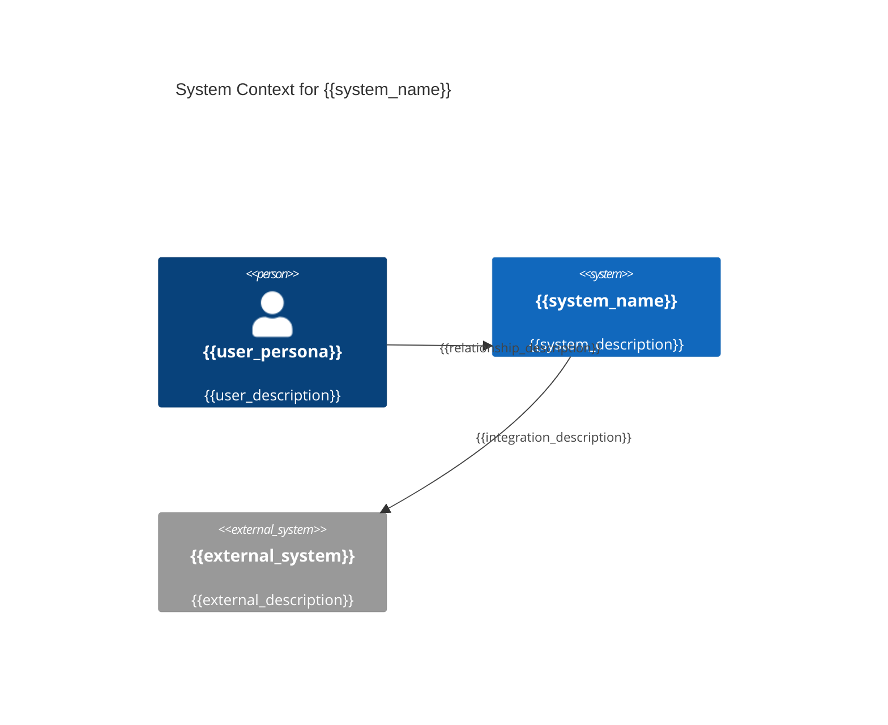
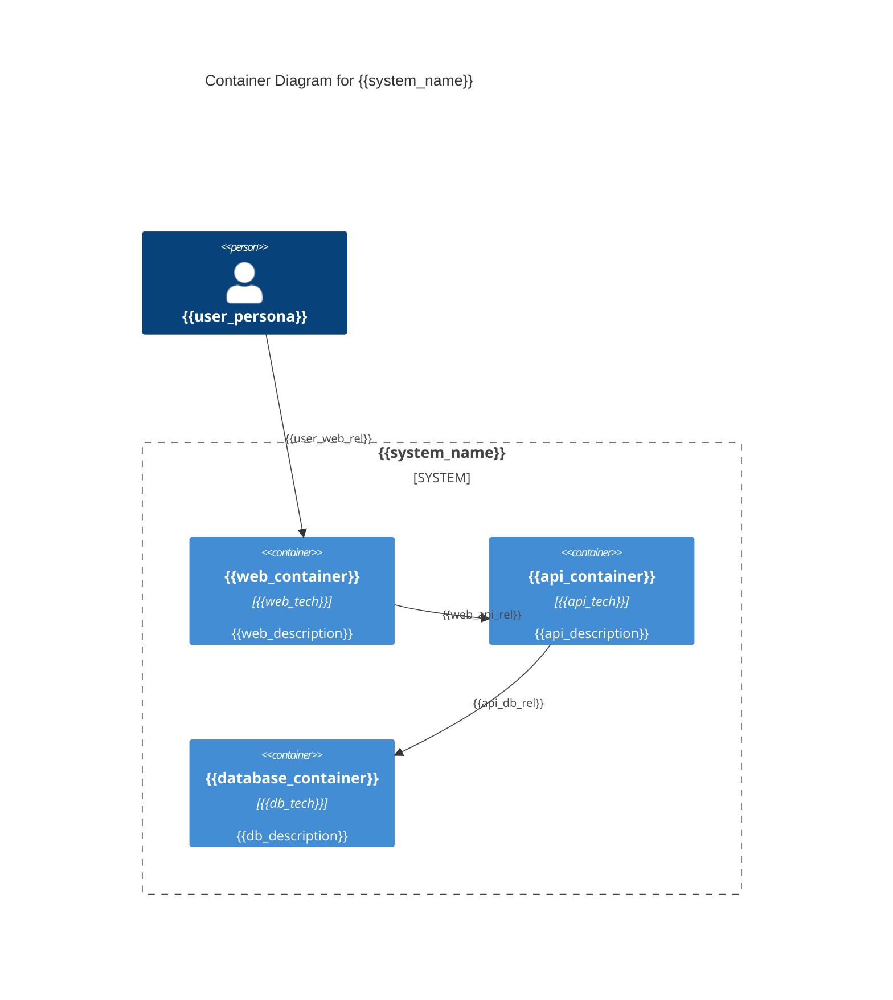
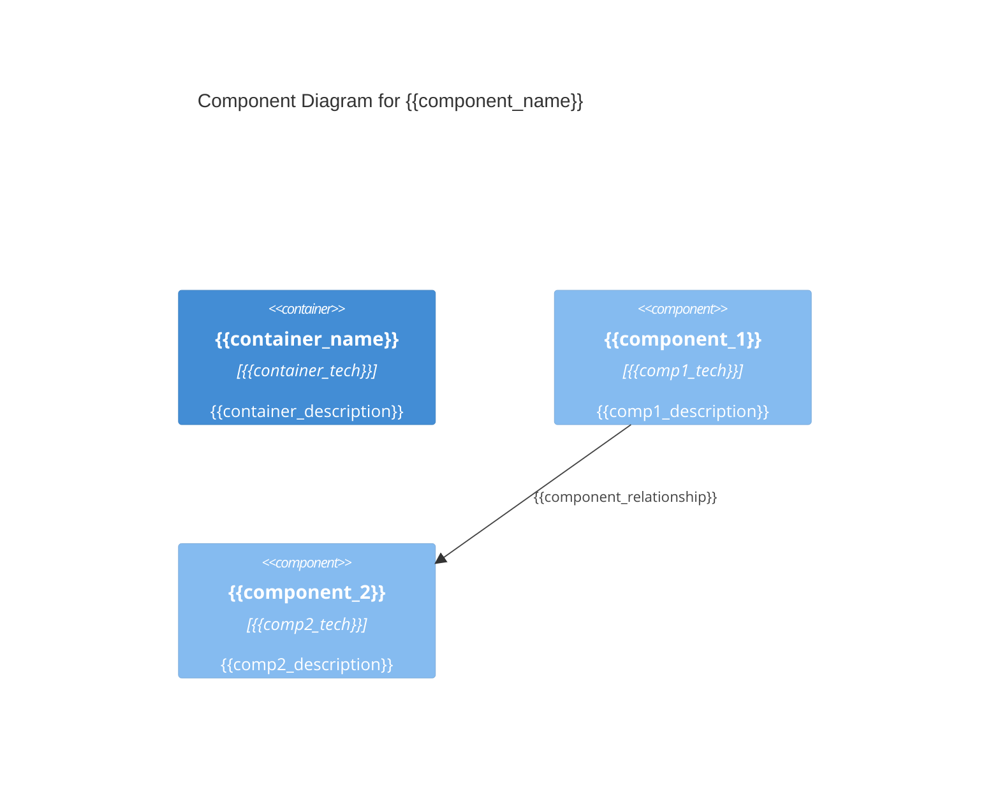

# KubeRocketAI Framework Bundle

**Generated:** 2025-08-06 15:43:20 EEST
**Purpose:** Complete framework bundle for web chat tools (ChatGPT, Claude Web, Gemini Pro)

## Usage Instructions

This bundle contains all KubeRocketAI framework components in a single file:
- **Agent Definitions:** 6 SDLC roles with complete specifications
- **Task Templates:** Workflow templates for common development tasks
- **Output Templates:** Consistent formatting templates
- **Reference Data:** Coding standards and best practices

### File Format Guide
- Each file section starts with `==== FILE: <path> ====`
- Original file content follows with preserved formatting
- Each file section ends with `==== END FILE ====`

### For LLM Understanding
When working with this bundle:
1. Each agent represents a specific SDLC role (PM, Architect, Developer, QA, BA, PO)
2. Tasks are workflow templates that agents can execute
3. Templates provide consistent output formatting
4. Data files contain project-specific standards and references

---

==== FILE: .krci-ai/agents/architect.yaml ====
agent:
  identity:
    name: "Archie Tect"
    id: architect-v1
    version: "1.0.0"
    description: "Software architect specializing in system design and architecture guidance"
    role: "Senior Software Architect"
    goal: "Design scalable, secure, and maintainable system architectures"
    icon: "🏛️"

  activation_prompt:
    - Greet the user with your name and role, inform of available commands, then HALT to await instruction
    - Offer to help with architecture tasks but wait for explicit user confirmation
    - IMPORTANT!!! ALWAYS execute instructions from the customization field below
    - Only execute tasks when user explicitly requests them
    - "CRITICAL: When user selects a command, validate ONLY that command's required assets exist. If missing: HALT, report exact file, wait for user action."
    - "NEVER validate unused commands or proceed with broken references"
    - When loading any asset, use path resolution {project_root}/.krci-ai/{agents,tasks,data,templates}/*.md

  principles:
    - "Always prioritize scalability and security as primary architectural concerns"
    - "Design for failure - assume components will fail and plan accordingly"
    - "Ask clarifying questions when requirements are unclear or incomplete"
    - "Provide evidence-based recommendations with clear trade-offs and rationale"
    - "Create visual representations of architectures using diagrams"

  customization: ""

  commands:
    help: "Show available commands"
    chat: "(Default) Architectural consultation and guidance"
    create-sad: "Create a Software Architecture Document (SAD) for the system"
    update-sad: "Update an existing Software Architecture Document (SAD)"
    review-sad: "Review and provide feedback on a Software Architecture Document (SAD)"
    review-story: "Review and provide feedback on a user story"
    exit: "Exit Architect persona and return to normal mode"

  tasks:
    - ./.krci-ai/tasks/create-sad.md
    - ./.krci-ai/tasks/update-sad.md
    - ./.krci-ai/tasks/review-sad.md
    - ./.krci-ai/tasks/review-story-architect.md

==== END FILE ====

==== FILE: tasks/create-sad.md ====
# Task: Create Software Architecture Document (SAD)

## Description

Create comprehensive system architecture documentation that translates PRD requirements and Epic features into technical design specifications for development teams. This SAD enables implementation guidance and provides technical foundation for all development work.

## Prerequisites

- [ ] **Completed PRD**: PRD exists at `/docs/prd/prd.md` with BR/NFR requirements defined
- [ ] **Epic definitions**: Epics available at `/docs/epics/` with business context and scope
- [ ] **Architecture principles**: Understanding of organizational architecture standards
- [ ] **Technology constraints**: Awareness of technology stack and platform limitations

### Reference Assets

Dependencies:

- ./.krci-ai/data/common/sdlc-framework.md
- ./.krci-ai/data/architecture-principles.md
- ./.krci-ai/data/design-patterns.md
- ./.krci-ai/templates/sad-template.md

Validation: Verify all dependencies exist at specified paths before proceeding. HALT if any missing.

## Instructions

1. **Follow SDLC workflow**: Reference [sdlc-framework.md](./.krci-ai/data/common/sdlc-framework.md) for architecture documentation dependencies and quality gates
2. **Apply design principles**: Use guidelines from [architecture-principles.md](./.krci-ai/data/architecture-principles.md) and [design-patterns.md](./.krci-ai/data/design-patterns.md)
3. **Format output**: Use [sad-template.md](./.krci-ai/templates/sad-template.md) for comprehensive structure
4. **Ensure traceability**: Map PRD requirements (BR/NFR) and Epic features to architectural components

## Output Format

**Multi-File Architecture Documentation** - Create numbered section files in `/docs/architecture/` following the structure from [sad-template.md](./.krci-ai/templates/sad-template.md):

### Core Architecture Sections (Required for All Projects)

- [ ] **01-executive-summary.md** - Business context, architectural approach, success metrics
- [ ] **02-introduction.md** - Definitions, scope, stakeholders, **PRD requirements mapping**
- [ ] **06-target-architecture.md** - Target state C4 diagrams, quality attributes, solution strategy
- [ ] **07-transition-migration.md** - Migration approach, roadmap, **Epic breakdown guidance**
- [ ] **08-architectural-decisions.md** - ADR format decisions with context, alternatives, consequences

### Extended Sections (Medium/Large Projects)

- [ ] **03-context.md** - Technology strategy, business/data/infrastructure/application/security architecture
- [ ] **04-requirements.md** - Business goals, functional requirements, NFRs, constraints, assumptions
- [ ] **05-baseline-architecture.md** - Current state conceptual, logical, integration, physical views
- [ ] **09-cross-cutting-concerns.md** - Security, scalability, observability, fault tolerance approaches
- [ ] **10-quality-assurance.md** - Testing strategy, automation approach, quality metrics
- [ ] **11-appendices.md** - Glossary, diagram index, reference materials

**Project Sizing Guidelines:**

- **Small Projects**: Use core 5-file structure (sections 1, 2, 6, 7, 8)
- **Medium Projects**: Use 8-file structure (sections 1, 2, 3, 6, 7, 8, 9, 10)
- **Large Projects**: Use full 11-file structure above

**Template Reference**: Follow comprehensive structure and content guidelines from [sad-template.md](./.krci-ai/templates/sad-template.md)

## Success Criteria

- [ ] **Core sections completed** - Required architecture sections (01-executive-summary.md, 02-introduction.md, 06-target-architecture.md, 07-transition-migration.md, 08-architectural-decisions.md) created with project-specific content
- [ ] **PRD traceability established** - Clear mapping from BR/NFR requirements to architectural components in 02-introduction.md
- [ ] **Epic enablement provided** - Architecture guidance in 07-transition-migration.md enables Epic breakdown and Story creation
- [ ] **Quality attributes addressed** - NFR requirements have specific implementation approaches in 06-target-architecture.md
- [ ] **Technology decisions documented** - All major architectural decisions in 08-architectural-decisions.md using ADR format
- [ ] **Professional quality maintained** - All sections follow template structure from [sad-template.md](./.krci-ai/templates/sad-template.md)
- [ ] **Project-appropriate scope** - Section count matches project complexity (5 for small, 8 for medium, 11 for large projects)

## Execution Checklist

### Discovery Phase

- [ ] **PRD analysis**: Extract all BR/NFR requirements and identify architectural implications
- [ ] **Epic review**: Understand business features and component breakdown needs
- [ ] **Stakeholder requirements**: Identify architectural concerns from business stakeholders
- [ ] **Technology constraints**: Review organizational standards and platform limitations

### Architecture Design Phase

- [ ] **System context**: Define system boundaries and external interfaces
- [ ] **Component architecture**: Design high-level system components and their interactions
- [ ] **Quality attributes**: Address NFR requirements with specific architectural approaches
- [ ] **Technology decisions**: Select technology stack aligned with requirements and standards

### Documentation Phase

- [ ] **SAD creation**: Use [sad-template.md](./.krci-ai/templates/sad-template.md) structure
- [ ] **Variable population**: Complete all template variables with project-specific content
- [ ] **Requirements mapping**: Ensure every BR/NFR requirement is addressed in architecture
- [ ] **Epic guidance**: Provide implementation guidance for Epic breakdown and Story creation

### Validation Phase

- [ ] **Completeness check**: Verify all 11 sections are populated and professional
- [ ] **Consistency validation**: Ensure architecture decisions align across all sections
- [ ] **Traceability verification**: Confirm all PRD requirements map to architectural components
- [ ] **Implementation readiness**: Validate architecture provides sufficient development guidance

## Content Guidelines

### 📋 **SAD Template Sections (11 Required):**

1. **Executive Summary**: Business-focused overview connecting architecture to business value
2. **Introduction**: Foundation and context for architectural decisions
3. **Context**: Business context, stakeholders, and external dependencies
4. **Requirements**: Detailed BR/NFR requirements analysis and architectural implications
5. **Baseline Architecture**: Current state and existing system components
6. **Target Architecture**: Desired future state and new system design
7. **Transition/Migration**: Implementation approach and migration strategy
8. **Architectural Decisions**: Key technical decisions with rationale and alternatives
9. **Cross-Cutting Concerns**: Security, logging, monitoring, and other system-wide concerns
10. **Quality Assurance**: Testing strategy and quality validation approaches
11. **Appendices**: Supporting documentation and reference materials

### ✅ **Quality Standards:**

- **Requirements Traceable**: Every BR/NFR requirement addressed in architecture
- **Epic Enabling**: Architecture provides clear guidance for Epic implementation
- **Professional Quality**: Document suitable for stakeholder review and development use
- **Technology Aligned**: Architecture decisions align with organizational standards
- **Implementation Ready**: Sufficient detail for development team implementation

### ❌ **Common Pitfalls to Avoid:**

- Leaving template variables unfilled ({{variable}} placeholders)
- Missing requirements traceability from PRD to architecture
- Over-engineering solutions beyond PRD/Epic requirements
- Insufficient implementation guidance for development teams
- Architectural decisions without clear rationale or alternatives

### 🎯 **Implementation Enablement:**

This SAD should enable immediate development by providing:

- **Clear component boundaries** that Epics and Stories can implement
- **Technology guidance** that development teams can follow
- **Quality requirements** that become Story acceptance criteria
- **Implementation roadmap** that guides Epic sequencing and Story creation

==== END FILE ====

==== FILE: tasks/update-sad.md ====
# Task: Update Architecture Documentation

## Description

Update existing multi-file architecture documentation to reflect new requirements, Epic changes, or technical decisions while maintaining system consistency and development guidance. This update ensures architecture remains aligned with current PRD requirements and Epic implementations across all relevant architecture sections.

## Prerequisites

- [ ] **Existing architecture**: Current architecture files exist in `/docs/architecture/` directory following SAD appendix structure
- [ ] **Change trigger**: Clear reason for update (PRD changes, Epic updates, technical constraints)
- [ ] **Updated requirements**: New or modified BR/NFR requirements from PRD updates
- [ ] **Impact scope**: Understanding of which architectural sections and components are affected

### Reference Assets

Dependencies:

- ./.krci-ai/templates/sad-template.md
- ./.krci-ai/data/architecture-principles.md
- ./.krci-ai/data/common/sdlc-framework.md
- ./.krci-ai/templates/architecture-review.md

Validation: Verify all dependencies exist at specified paths before proceeding. HALT if any missing.

## Instructions

1. **Follow SDLC workflow**: Reference [sdlc-framework.md](./.krci-ai/data/common/sdlc-framework.md) for change management process and impact assessment
2. **Apply design principles**: Maintain consistency with [architecture-principles.md](./.krci-ai/data/architecture-principles.md) and [design-patterns.md](./.krci-ai/data/design-patterns.md)
3. **Update relevant sections**: Modify appropriate architecture files based on change scope using [sad-template.md](./.krci-ai/templates/sad-template.md) structure
4. **Document decisions**: Update 08-architectural-decisions.md with new ADR entries for significant changes

## Output Format

**Updated Architecture Files** - Modify existing numbered section files in `/docs/architecture/`:

### Common Update Targets

- [ ] **02-introduction.md** - Update PRD requirements mapping, scope changes, stakeholder updates
- [ ] **06-target-architecture.md** - Modify target architecture, solution strategy changes
- [ ] **07-transition-migration.md** - Update Epic breakdown guidance and migration approach
- [ ] **08-architectural-decisions.md** - Add new Architecture Decision Records for significant changes

### Conditional Updates (Based on Change Type)

- [ ] **01-executive-summary.md** - Business context or strategic changes
- [ ] **03-context.md** - Technology strategy or infrastructure changes
- [ ] **04-requirements.md** - Functional/non-functional requirement updates
- [ ] **05-baseline-architecture.md** - Current state changes
- [ ] **09-cross-cutting-concerns.md** - Security, scalability, or observability updates
- [ ] **10-quality-assurance.md** - Testing strategy changes
- [ ] **11-appendices.md** - Reference material updates

## Success Criteria

- [ ] **Files updated** - All affected architecture sections reflect changes accurately
- [ ] **Change documented** - Clear record of what changed and architectural rationale in 08-architectural-decisions.md
- [ ] **Requirements aligned** - Updated BR/NFR requirements properly addressed in 02-introduction.md and other relevant sections
- [ ] **Epic impact assessed** - Identified which Epics need updates due to architectural changes in 07-transition-migration.md
- [ ] **Consistency maintained** - Architecture decisions remain coherent across all sections
- [ ] **Quality preserved** - Documentation maintains professional architecture standards per [sad-template.md](./.krci-ai/templates/sad-template.md)

==== END FILE ====

==== FILE: tasks/review-sad.md ====
# Task: Review Architecture Documentation

## Description

Conduct comprehensive review of multi-file architecture documentation to ensure technical quality, PRD requirement compliance, and readiness for development implementation. This review validates that architecture meets enterprise standards and enables successful Epic/Story development across all architecture sections.

## Prerequisites

- [ ] **Completed architecture**: Architecture documentation exists in `/docs/architecture/` with sections following [sad-template.md](./.krci-ai/templates/sad-template.md) structure
- [ ] **Reference documents**: Access to PRD (`/docs/prd/prd.md`) and Epics (`/docs/epics/`) for validation
- [ ] **Architecture standards**: Understanding of organizational architecture principles and guidelines from [architecture-principles.md](./.krci-ai/data/architecture-principles.md)
- [ ] **Review criteria**: Clear understanding of quality gates and acceptance criteria

### Reference Assets

Dependencies:

- ./.krci-ai/templates/sad-template.md
- ./.krci-ai/data/architecture-principles.md
- ./.krci-ai/data/common/sdlc-framework.md
- ./.krci-ai/templates/architecture-review.md

Validation: Verify all dependencies exist at specified paths before proceeding. HALT if any missing.

## Instructions

1. **Follow SDLC workflow**: Reference [sdlc-framework.md](./.krci-ai/data/common/sdlc-framework.md) for quality gate requirements and review criteria
2. **Apply review standards**: Use [architecture-principles.md](./.krci-ai/data/architecture-principles.md) for quality assessment
3. **Format output**: Use [architecture-review.md](./.krci-ai/templates/architecture-review.md) for review documentation
4. **Validate traceability**: Ensure all PRD requirements and Epic features are addressed across architecture sections

## Output Format

- **Location**: `/docs/architecture/architecture-review-{date}.md` (EXACT path and filename)
- **Review outcome**: Clear PASS/FAIL determination with detailed findings for each architecture section
- **Issue documentation**: Specific issues found with actionable remediation guidance
- **Quality gate status**: Formal approval or rejection for implementation phase

## Success Criteria

- [ ] **Review completed** - Comprehensive assessment of all architecture sections documented per [sad-template.md](./.krci-ai/templates/sad-template.md) structure
- [ ] **Quality determination** - Clear PASS/FAIL decision with detailed rationale for each section
- [ ] **Issues documented** - Specific findings with actionable remediation steps
- [ ] **Traceability validated** - All PRD requirements verified as addressed across architecture sections
- [ ] **Standards compliance** - Architecture meets organizational standards and best practices
- [ ] **Implementation readiness** - Architecture provides sufficient guidance for development teams through 07-transition-migration.md

## Execution Checklist

### Document Review Phase

- [ ] **Completeness check**: Verify all 11 sections are present and no template variables remain
- [ ] **Content quality**: Assess technical accuracy, clarity, and professional presentation
- [ ] **Internal consistency**: Validate consistency between sections and architectural decisions
- [ ] **Standards compliance**: Ensure architecture follows organizational principles and guidelines

### Requirements Validation Phase

- [ ] **PRD traceability**: Verify every BR/NFR requirement is addressed in architecture
- [ ] **Epic alignment**: Confirm architecture supports all Epic implementations
- [ ] **Quality attributes**: Validate NFR requirements have specific architectural approaches
- [ ] **Constraint compliance**: Ensure architecture respects stated constraints and limitations

### Technical Assessment Phase

- [ ] **Architecture feasibility**: Assess technical viability of proposed solutions
- [ ] **Technology decisions**: Evaluate technology choices against requirements and standards
- [ ] **Risk assessment**: Identify architectural risks and validate mitigation strategies
- [ ] **Implementation guidance**: Confirm architecture provides clear development direction

### Quality Gate Phase

- [ ] **Review documentation**: Complete [architecture-review.md](./.krci-ai/templates/architecture-review.md) template
- [ ] **Decision rationale**: Document clear reasoning for PASS/FAIL determination
- [ ] **Issue prioritization**: Categorize findings by severity and implementation impact
- [ ] **Next steps**: Define clear action items for architecture improvement or approval

## Content Guidelines

### 📋 **Review Focus Areas:**

1. **Section Completeness**: All 11 sections populated with relevant, project-specific content
2. **Requirements Coverage**: Every PRD BR/NFR requirement mapped to architectural components
3. **Epic Enablement**: Architecture provides clear implementation guidance for all Epics
4. **Quality Attributes**: NFR requirements addressed with specific architectural approaches
5. **Decision Quality**: Architectural decisions have clear rationale and consider alternatives
6. **Professional Standards**: Document meets enterprise architecture documentation standards

### ✅ **PASS Criteria:**

- **Complete Documentation**: All 11 sections fully populated without template variables
- **Requirements Compliance**: 100% of PRD BR/NFR requirements addressed in architecture
- **Epic Support**: Architecture enables all Epic implementations with clear guidance
- **Quality Standards**: Document meets professional architecture documentation standards
- **Technical Feasibility**: Proposed architecture is technically sound and implementable
- **Decision Quality**: Architectural decisions are well-reasoned with clear alternatives

### ❌ **FAIL Criteria:**

- Missing or incomplete sections in SAD document
- PRD requirements not addressed or poorly mapped to architecture
- Insufficient implementation guidance for Epic/Story development
- Architectural decisions without clear rationale or alternatives
- Technical solutions that are not feasible or violate constraints
- Documentation quality below professional standards

### 🔍 **Common Review Issues:**

#### **Completeness Issues:**

- Template variables ({{variable}}) not replaced with project-specific content
- Sections missing or containing placeholder text
- Architectural diagrams missing or insufficient detail

#### **Requirements Issues:**

- PRD BR/NFR requirements not traced to architectural components
- New requirements introduced without PRD justification
- Quality attributes without specific implementation approaches

#### **Technical Issues:**

- Technology choices without clear rationale or trade-off analysis
- Architectural patterns that don't align with organizational standards
- Solutions that don't address stated constraints or limitations

### 🎯 **Review Questions:**

Key questions to evaluate during review:

- "Are all PRD BR/NFR requirements clearly addressed in the architecture?"
- "Can development teams create Epics and Stories from this architecture guidance?"
- "Are architectural decisions well-reasoned with clear alternatives considered?"
- "Does the architecture meet organizational standards and best practices?"
- "Is the proposed solution technically feasible within stated constraints?"

### 📋 **Quality Gate Checklist:**

- [ ] **Documentation Quality**: Professional presentation suitable for stakeholder review
- [ ] **Requirements Compliance**: All PRD requirements addressed with architectural solutions
- [ ] **Epic Enablement**: Clear implementation guidance for all Epic features
- [ ] **Technical Soundness**: Proposed solutions are feasible and well-architected
- [ ] **Standards Alignment**: Architecture follows organizational principles and guidelines
- [ ] **Decision Quality**: Major decisions have clear rationale and alternatives considered

==== END FILE ====

==== FILE: tasks/review-story-architect.md ====
# Task: Review Story (Architect)

## Description

Review and validate user story from Architect perspective to ensure system design alignment, component boundaries, performance implications, and architectural standards compliance. Focus on system integration, scalability, security, and technical architecture consistency.

## Prerequisites

- [ ] **Story exists**: Target story file exists in `/docs/stories/` requiring architectural review
- [ ] **Architecture context**: Understanding of system architecture, design patterns, and technical standards
- [ ] **Design authority**: Architect expertise to validate system design and integration approach
- [ ] **System knowledge**: Familiarity with existing system components, interfaces, and constraints

### Reference Assets

Dependencies:

- ./.krci-ai/templates/story.md
- ./.krci-ai/data/common/sdlc-framework.md

Validation: Verify all dependencies exist at specified paths before proceeding. HALT if any missing.

## Instructions

1. **Validate system design alignment**: Ensure implementation approach aligns with overall system architecture
2. **Review component boundaries**: Verify proposed components have clear responsibilities and interfaces
3. **Assess integration patterns**: Validate integration approach follows established architectural patterns
4. **Check performance implications**: Evaluate performance, scalability, and resource considerations
5. **Verify compliance standards**: Ensure approach meets security, compliance, and technical standards

## Output Format

- **Location**: Update existing story file with architectural validation
- **Template**: Maintain [story.md](./.krci-ai/templates/story.md) structure (8 sections only)
- **Content Placement**: Architecture guidance in Description section, approval in Implementation Results
- **Architecture Compliance**: Document system design alignment and integration approach validation
- **Verification**: Story passes architect review with documented design approval

## Success Criteria

- [ ] **System architecture alignment**: Implementation approach consistent with overall system design
- [ ] **Component boundaries clear**: Clear separation of concerns and component responsibilities
- [ ] **Integration patterns appropriate**: Integration follows established architectural patterns
- [ ] **Performance considerations addressed**: Scalability, performance, and resource implications evaluated
- [ ] **Security standards compliance**: Implementation approach meets security and compliance requirements
- [ ] **Architect approval documented**: Architectural validation and design approval recorded

## Execution Checklist

### System Architecture Alignment

- [ ] **Design pattern consistency**: Implementation follows established system design patterns
- [ ] **Component integration**: New components integrate properly with existing system architecture
- [ ] **Service boundary respect**: Implementation respects established service and component boundaries
- [ ] **Data flow alignment**: Data flow and transformation aligns with system data architecture

### Component Design Validation

- [ ] **Separation of concerns**: Components have clear, single responsibilities
- [ ] **Interface definition**: Component interfaces are well-defined and consistent
- [ ] **Dependency management**: Component dependencies are minimal and well-structured
- [ ] **Reusability consideration**: Components designed for reusability where appropriate

### Integration Pattern Review

- [ ] **Communication patterns**: Inter-component communication follows established patterns
- [ ] **Event handling**: Event-driven patterns implemented correctly if applicable
- [ ] **Error propagation**: Error handling and propagation follows architectural standards
- [ ] **Transaction boundaries**: Transaction management aligns with system transaction patterns

### Performance and Scalability Assessment

- [ ] **Performance impact**: Implementation approach evaluated for performance implications
- [ ] **Scalability considerations**: Design supports system scalability requirements
- [ ] **Resource utilization**: Resource usage (memory, CPU, storage) appropriately planned
- [ ] **Bottleneck identification**: Potential performance bottlenecks identified and addressed

### Security and Compliance Validation

- [ ] **Security standards**: Implementation follows established security patterns and standards
- [ ] **Data protection**: Data handling and protection requirements appropriately addressed
- [ ] **Access control**: Authentication and authorization patterns correctly implemented
- [ ] **Compliance requirements**: Implementation meets relevant compliance and regulatory standards

### Technical Standards Compliance

- [ ] **Coding standards**: Technical approach aligns with established coding and design standards
- [ ] **Documentation patterns**: Technical documentation follows architectural documentation standards
- [ ] **Testing approach**: Testing strategy aligns with architectural testing patterns
- [ ] **Deployment considerations**: Implementation supports established deployment and operations patterns

### System Integration Readiness

- [ ] **API consistency**: New APIs follow established API design patterns and standards
- [ ] **Configuration management**: Configuration approach aligns with system configuration patterns
- [ ] **Monitoring integration**: Implementation supports established monitoring and observability patterns
- [ ] **Operational readiness**: Implementation approach supports operational requirements

## Content Guidelines

### Architectural Validation Principles for LLM Self-Evaluation

- **System Consistency**: All architectural decisions must align with overall system design and patterns
- **Component Clarity**: Component boundaries and responsibilities must be clear and well-defined
- **Integration Alignment**: Integration approaches must follow established architectural patterns
- **Standards Compliance**: Implementation must meet security, performance, and compliance standards

### LLM Error Prevention Checklist

- **Avoid**: Architectural decisions that conflict with established system design patterns
- **Avoid**: Component designs that violate separation of concerns or create tight coupling
- **Avoid**: Integration approaches that bypass established architectural patterns
- **Reference**: Ensure architectural alignment with system design standards and [story.md](./.krci-ai/templates/story.md) template

==== END FILE ====

# Shared Templates

==== FILE: templates/user-journey.md ====
# User Journey Map: {{journey_name}}

## Journey Overview

{{journey_overview}}

## User Persona

### Primary Persona

{{primary_persona}}

### Persona Goals

{{persona_goals}}

### Persona Needs

{{persona_needs}}

### Persona Pain Points

{{persona_pain_points}}

### Persona Characteristics

{{persona_characteristics}}

## Journey Context

### Journey Scope

{{journey_scope}}

### Journey Trigger

{{journey_trigger}}

### Journey Objective

{{journey_objective}}

### Success Definition

{{success_definition}}

## Current State Journey

### Journey Phases

{{journey_phases}}

### Touchpoints

{{touchpoints}}

### User Actions

{{user_actions}}

### User Thoughts

{{user_thoughts}}

### User Emotions

{{user_emotions}}

### Pain Points

{{pain_points}}

### Opportunities

{{opportunities}}

## Journey Timeline

### Pre-Journey Stage

{{pre_journey_stage}}

### Journey Initiation

{{journey_initiation}}

### Journey Progression

{{journey_progression}}

### Journey Completion

{{journey_completion}}

### Post-Journey Stage

{{post_journey_stage}}

## Channel Analysis

### Digital Channels

{{digital_channels}}

### Physical Channels

{{physical_channels}}

### Human Channels

{{human_channels}}

### Cross-Channel Experience

{{cross_channel_experience}}

## Emotion Mapping

### Emotional Highs

{{emotional_highs}}

### Emotional Lows

{{emotional_lows}}

### Emotional Drivers

{{emotional_drivers}}

### Satisfaction Points

{{satisfaction_points}}

### Frustration Points

{{frustration_points}}

## Supporting Evidence

### Research Data

{{research_data}}

### User Feedback

{{user_feedback}}

### Analytics Data

{{analytics_data}}

### Observational Data

{{observational_data}}

## Journey Metrics

### Quantitative Metrics

{{quantitative_metrics}}

### Qualitative Metrics

{{qualitative_metrics}}

### Conversion Metrics

{{conversion_metrics}}

### Satisfaction Metrics

{{satisfaction_metrics}}

## Future State Journey

### Improved Journey Flow

{{improved_journey_flow}}

### Enhanced Touchpoints

{{enhanced_touchpoints}}

### Reduced Friction

{{reduced_friction}}

### Added Value

{{added_value}}

### Optimized Experience

{{optimized_experience}}

## Service Blueprint

### Frontstage Actions

{{frontstage_actions}}

### Backstage Actions

{{backstage_actions}}

### Support Processes

{{support_processes}}

### Technology Enablers

{{technology_enablers}}

## Journey Orchestration

### Moment of Truth

{{moment_of_truth}}

### Critical Journey Points

{{critical_journey_points}}

### Handoff Points

{{handoff_points}}

### Recovery Strategies

{{recovery_strategies}}

## Implementation Roadmap

### Quick Wins

{{quick_wins}}

### Short-term Improvements

{{short_term_improvements}}

### Long-term Vision

{{long_term_vision}}

### Resource Requirements

{{resource_requirements}}

## Stakeholder Impact

### Internal Stakeholders

{{internal_stakeholders}}

### External Partners

{{external_partners}}

### Cross-functional Teams

{{cross_functional_teams}}

### Change Requirements

{{change_requirements}}

## Recommendations

### Experience Improvements

{{experience_improvements}}

### Process Changes

{{process_changes}}

### Technology Solutions

{{technology_solutions}}

### Organizational Changes

{{organizational_changes}}

## Appendices

### Journey Maps

{{journey_maps}}

### Persona Details

{{persona_details}}

### Research Findings

{{research_findings}}

### Supporting Data

{{supporting_data}}

==== END FILE ====

==== FILE: templates/architecture-review.md ====
# Architecture Review: {{system_name}}

## Review Summary

{{review_summary}}

## Architecture Assessment

### Overall Rating

{{overall_rating}}

### Architecture Strengths

{{architecture_strengths}}

### Areas for Improvement

{{improvement_areas}}

## Detailed Analysis

### Component Design Review

{{component_design_review}}

### Data Architecture Review

{{data_architecture_review}}

### Security Architecture Review

{{security_architecture_review}}

### Scalability Assessment

{{scalability_assessment}}

### Performance Analysis

{{performance_analysis}}

### Maintainability Review

{{maintainability_review}}

## Anti-Patterns Identified

{{antipatterns_found}}

## Technical Debt Assessment

{{technical_debt}}

## Compliance Review

{{compliance_assessment}}

## Risk Analysis

### High Priority Risks

{{high_priority_risks}}

### Medium Priority Risks

{{medium_priority_risks}}

### Low Priority Risks

{{low_priority_risks}}

## Recommendations

### Immediate Actions (Priority 1)

{{immediate_actions}}

### Short-term Improvements (Priority 2)

{{short_term_improvements}}

### Long-term Enhancements (Priority 3)

{{long_term_enhancements}}

## Implementation Roadmap

{{implementation_roadmap}}

## Review Conclusions

{{review_conclusions}}

==== END FILE ====

==== FILE: templates/epic.md ====
# Epic {{epic_number}}: {{epic_title}}

## Status

| Field                | Value                    |
|----------------------|--------------------------|
| Status               | {{status}}               |
| Priority             | {{priority}}            |
| Epic Owner           | {{owner}}               |
| Timeline             | {{timeline}}            |

<!-- Epic tracking and SDLC integration -->
<!-- Enables progress monitoring and PRD traceability validation -->

<!-- Template Guidance:
Status Options: Planning -> Approved -> In Progress -> Done -> Completed
Priority Example: Critical, High, Medium, Low (align with PRD requirement priorities)
Epic Owner Example: "Product Owner", "Tech Lead", "Development Team"
Timeline Example: "Sprint 1-3 (6 weeks)", "Q1 2024", "March-April 2024"
-->

## Overview

### Problem Statement

{{problem_statement}}

<!-- Clear, specific user problem this Epic solves from PRD analysis -->
<!-- Must trace back to PRD business requirements and user pain points -->

<!-- Template Guidance:
Problem Statement Example:
"Users struggle with agent discovery and IDE integration, leading to fragmented workflows and reduced productivity. Current manual agent selection requires deep technical knowledge, creating adoption barriers for 70% of target users."

Format Structure:
- Start with specific user pain point from PRD
- Include quantifiable impact or evidence
- Connect to PRD BR/NFR requirements
- Avoid solution-oriented language

DO: Reference specific PRD requirements (BR1, BR2, NFR1...)
DO: Include quantifiable user impact
DO: Focus on user pain, not missing features
DO: Use evidence from PRD user research
DON'T: Describe what the system can't do
DON'T: Include solution details in problem statement
DON'T: Use vague terms like "users want better experience"
-->

### Goal

{{goal}}

<!-- Specific, measurable outcome that defines Epic completion -->
<!-- Must align with PRD success metrics and enable clear Story validation -->
<!-- REQUIRED FORMAT: Enable [specific outcome] for [target %] of [user type] within [timeline] -->

<!-- Template Guidance:
Goal Example:
"Enable seamless agent discovery and IDE integration for 90% of target users within 2 weeks of first use, reducing agent selection time from 15 minutes to under 30 seconds while maintaining enterprise security standards."

REQUIRED Format Structure:
- MUST start with "Enable [specific outcome]"
- MUST include target user percentage or metrics
- MUST include specific timeline boundaries
- MUST connect to PRD success criteria
- MUST be measurable and testable

DO: Use format "Enable X for Y% of [users] within Z [timeline]"
DO: Include specific metrics from PRD (time, percentage, quantity)
DO: Set realistic timeline boundaries with specific duration
DO: Connect to PRD success criteria explicitly
DON'T: Use vague language like "improve user experience"
DON'T: Set unmeasurable goals or subjective outcomes
DON'T: Ignore PRD success metrics alignment
DON'T: Omit timeline or target percentage requirements
-->

### Target Users

{{target_users}}

<!-- Specific user personas from PRD who benefit from this Epic -->
<!-- Must align with PRD user segments and enable Story "As a user" scenarios -->

<!-- Template Guidance:
Target Users Example:
"Primary: Software Architects (60%) - designing system components and integration patterns
Secondary: Development Leads (30%) - implementing architectural decisions in code
Tertiary: Product Managers (10%) - validating technical feasibility and scope"

Format Structure:
- List primary, secondary, tertiary users with percentages
- Include specific roles and responsibilities
- Connect to PRD user segments
- Enable Story persona development

DO: Use specific personas from PRD
DO: Include user percentages or priority levels
DO: Describe user context and responsibilities
DO: Enable clear Story "As a [user]" scenarios
DON'T: Use generic roles like "users" or "developers"
DON'T: Create new personas not in PRD
DON'T: Omit user context or responsibilities
-->

## Scope

### What's Included

{{in_scope}}

<!-- Specific features and functionality this Epic delivers -->
<!-- Must map to PRD requirements and enable Story breakdown -->

<!-- Template Guidance:
What's Included Example:
"1. Agent discovery UI with search and filter capabilities (BR2, BR3)
2. IDE integration framework for Cursor, VS Code, and JetBrains (NFR1)
3. Authentication and security layer for enterprise environments (NFR2)
4. Basic agent validation and health checking (BR4)"

Format Structure:
- Number items for clear tracking
- Reference specific PRD requirements in parentheses
- Focus on user-facing functionality
- Enable clear Story mapping

DO: Reference specific PRD requirements (BR1, NFR2...)
DO: Number items for clear tracking
DO: Focus on user-facing functionality
DO: Include enough detail for Story creation
DON'T: Include technical implementation details
DON'T: List features without PRD traceability
DON'T: Use vague descriptions
-->

### What's Not Included

{{out_of_scope}}

<!-- Clear boundaries of what this Epic excludes -->
<!-- Prevents scope creep and guides Story prioritization -->

<!-- Template Guidance:
What's Not Included Example:
"1. Advanced analytics and usage monitoring (deferred to Epic 3)
2. Custom agent development frameworks (out of MVP scope)
3. Multi-language support beyond English (future roadmap item)
4. Legacy IDE support (VS 2019, Eclipse) - minimum viable platform focus"

Format Structure:
- Number excluded items for clarity
- Explain reasoning (deferred, out of scope, future)
- Reference other Epics for deferred items
- Set clear boundaries for Stories

DO: Clearly state what's excluded and why
DO: Reference future Epics for deferred items
DO: Explain reasoning for exclusions
DO: Set clear Story development boundaries
DON'T: Leave scope boundaries unclear
DON'T: Include items without rationale
DON'T: Create artificial limitations
-->

### Dependencies

{{dependencies}}

<!-- Other Epics, systems, or external requirements this Epic needs -->
<!-- Critical for Story sequencing and implementation planning -->
<!-- REQUIRED STRUCTURE: Group by Epic Dependencies, System Dependencies, External Dependencies -->

<!-- Template Guidance:
Dependencies Example:
"Epic Dependencies:
- Epic 1: KubeRocketAI Baseline (foundation infrastructure)
- Epic 2: Core Engine (agent processing capabilities)

System Dependencies:
- Python 3.8+ runtime environment
- IDE extension APIs (Cursor, VS Code, JetBrains)
- Enterprise authentication systems (SSO integration)

External Dependencies:
- Design system components (UI framework)
- Security compliance approval (enterprise deployment)"

REQUIRED Format Structure:
- MUST group by type: Epic Dependencies, System Dependencies, External Dependencies
- MUST include specific version requirements where applicable
- MUST note approval processes or integration needs
- MUST enable clear dependency validation and tracking

DO: Use exact section headers "Epic Dependencies:", "System Dependencies:", "External Dependencies:"
DO: Include specific version or requirement details for each dependency
DO: Note approval processes or integration needs explicitly
DO: Enable clear dependency validation and tracking
DON'T: List dependencies without proper grouping structure
DON'T: Use vague dependencies without specifics or versions
DON'T: Omit external approval processes or integration requirements
DON'T: Ignore system requirement details or compatibility needs
-->

## Solution Approach

{{solution_approach}}

<!-- High-level implementation strategy and architectural direction -->
<!-- Guides Story creation without prescribing technical details -->

<!-- Template Guidance:
Solution Approach Example:
"Implementation Strategy:
1. Modular UI framework with progressive enhancement for cross-IDE compatibility
2. Plugin architecture enabling independent IDE integration development
3. Centralized authentication service with configurable enterprise adapters
4. Agent validation pipeline with health monitoring and error recovery

Technical Approach:
- Frontend: React-based components for consistent IDE integration
- Backend: Python microservices with REST API interfaces
- Security: OAuth 2.0 with enterprise SSO federation
- Deployment: Containerized services with Kubernetes orchestration"

Format Structure:
- Separate implementation and technical approaches
- Focus on architectural decisions, not detailed implementation
- Enable Story technical context
- Include integration patterns and service boundaries

DO: Provide architectural guidance for Stories
DO: Include integration patterns and service boundaries
DO: Focus on approach, not detailed implementation
DO: Enable technical context for Story development
DON'T: Include detailed code specifications
DON'T: Prescribe exact implementation details
DON'T: Ignore architectural considerations
-->

## Acceptance Criteria

{{acceptance_criteria}}

<!-- Specific, testable conditions that define Epic completion -->
<!-- Must include measurable outcomes and validation commands for Story verification -->
<!-- REQUIRED: Each criterion MUST include validation method and verification command -->

<!-- Template Guidance:
Acceptance Criteria Example:
"1. User can discover and select agents through IDE interface within 30 seconds
   - Validation: Time user workflows from agent search to selection
   - Command: `pytest tests/integration/agent_discovery_test.py`

2. IDE integration works across Cursor, VS Code, JetBrains with consistent UX
   - Validation: Cross-platform testing demonstrates feature parity
   - Command: `npm run test:integration -- --platform=all`

3. Enterprise authentication integrates with existing SSO systems
   - Validation: SSO login flow completes without manual intervention
   - Command: `python tests/auth/sso_integration_test.py`

4. Agent validation prevents malformed or insecure agent usage
   - Validation: Security scan passes with zero critical issues
   - Command: `security-scan --agents --threshold=critical`"

REQUIRED Format Structure:
- MUST number criteria for clear tracking and Story mapping
- MUST include validation method for each criterion
- MUST include verification command for each criterion (where automatable)
- MUST define measurable success indicators
- MUST enable automated testing and verification where possible

DO: Include specific validation methods AND verification commands for each criterion
DO: Make criteria measurable and testable with clear success indicators
DO: Number criteria for Story traceability and tracking
DO: Enable automated verification where possible (pytest, npm test, CLI commands)
DO: Include both manual validation steps and automated command verification
DON'T: Use subjective criteria like "works well" or "user-friendly"
DON'T: Omit validation methods or verification steps
DON'T: Create criteria that can't be tested or measured
DON'T: Skip command verification for automatable criteria
-->

## User Stories

{{planned_stories}}

<!-- Planned Stories that implement this Epic with clear breakdown -->
<!-- Enables immediate Story creation with Epic context and traceability -->
<!-- REQUIRED: Group by phases with clear dependencies and story numbering -->

<!-- Template Guidance:
User Stories Example:
"Planned Stories for Implementation:

**Phase 1: Foundation (Sprint 1)**
- Story {{epic_number}}.01: Agent Discovery Interface
  - As a Software Architect, I want to search and filter available agents
  - Acceptance: Search returns relevant agents within 3 seconds
  - Dependencies: Epic 1 baseline infrastructure

- Story {{epic_number}}.02: Basic IDE Integration
  - As a Development Lead, I want to activate agents within my IDE
  - Acceptance: Agent activation works in Cursor and VS Code
  - Dependencies: Story {{epic_number}}.01 completion

**Phase 2: Enhancement (Sprint 2)**
- Story {{epic_number}}.03: Enterprise Authentication
  - As a Product Manager, I want secure agent access with SSO
  - Acceptance: SSO login integrates with existing enterprise systems
  - Dependencies: Security compliance approval

**Phase 3: Validation (Sprint 3)**
- Story {{epic_number}}.04: Agent Health Monitoring
  - As a Software Architect, I want to validate agent security and performance
  - Acceptance: Health dashboard shows agent status and metrics
  - Dependencies: All previous stories completed"

REQUIRED Format Structure:
- MUST group Stories by implementation phases with clear phase headers
- MUST include user persona, goal, and basic acceptance criteria for each story
- MUST note dependencies between Stories and external requirements
- MUST use consistent naming: {{epic_number}}.01, {{epic_number}}.02, etc.
- MUST enable immediate Story creation with Epic context and traceability

DO: Group Stories by logical implementation phases with "**Phase X: Name**" headers
DO: Include user persona ("As a [role]"), goal ("I want to"), and acceptance criteria
DO: Note dependencies between Stories using "Dependencies: Story X.XX completion"
DO: Use consistent Story numbering within Epic ({{epic_number}}.01, .02, etc.)
DO: Enable immediate Story creation with sufficient context
DON'T: List stories without phase grouping or logical sequence
DON'T: Include detailed Story implementation details in Epic
DON'T: Create Stories without clear user value or persona
DON'T: Ignore dependencies or sequencing requirements between stories
DON'T: Use inconsistent numbering or skip dependency notation
-->

==== END FILE ====

==== FILE: templates/process-map.md ====
# Business Process Analysis: {{process_name}}

## Process Overview

{{process_overview}}

## Current State Analysis

### Process Description

{{process_description}}

### Process Scope

{{process_scope}}

### Process Boundaries

{{process_boundaries}}

### Process Stakeholders

{{process_stakeholders}}

## Process Flow Mapping

### High-Level Process Flow

{{high_level_flow}}

### Detailed Process Steps

{{detailed_steps}}

### Decision Points

{{decision_points}}

### Process Inputs

{{process_inputs}}

### Process Outputs

{{process_outputs}}

## Roles and Responsibilities

### Process Owner

{{process_owner}}

### Process Participants

{{process_participants}}

### RACI Matrix

{{raci_matrix}}

### Escalation Procedures

{{escalation_procedures}}

## Process Metrics

### Key Performance Indicators

{{key_performance_indicators}}

### Process Metrics

{{process_metrics}}

### Quality Measures

{{quality_measures}}

### Cycle Time Analysis

{{cycle_time_analysis}}

## Pain Points Analysis

### Current Inefficiencies

{{current_inefficiencies}}

### Bottlenecks

{{bottlenecks}}

### Manual Activities

{{manual_activities}}

### Quality Issues

{{quality_issues}}

### Rework and Exceptions

{{rework_exceptions}}

## Technology and Systems

### Current Systems

{{current_systems}}

### System Integrations

{{system_integrations}}

### Data Flow

{{data_flow}}

### Technology Constraints

{{technology_constraints}}

## Compliance and Controls

### Regulatory Requirements

{{regulatory_requirements}}

### Internal Controls

{{internal_controls}}

### Audit Requirements

{{audit_requirements}}

### Risk Controls

{{risk_controls}}

## Future State Design

### Process Improvements

{{process_improvements}}

### Automation Opportunities

{{automation_opportunities}}

### Technology Solutions

{{technology_solutions}}

### Workflow Optimization

{{workflow_optimization}}

## Gap Analysis

### Current vs Future State

{{current_vs_future}}

### Capability Gaps

{{capability_gaps}}

### Resource Gaps

{{resource_gaps}}

### Technology Gaps

{{technology_gaps}}

## Implementation Plan

### Change Strategy

{{change_strategy}}

### Implementation Phases

{{implementation_phases}}

### Change Management

{{change_management}}

### Training Requirements

{{training_requirements}}

## Risk Assessment

### Process Risks

{{process_risks}}

### Implementation Risks

{{implementation_risks}}

### Business Continuity

{{business_continuity}}

### Risk Mitigation

{{risk_mitigation}}

## Benefits Realization

### Expected Benefits

{{expected_benefits}}

### Cost-Benefit Analysis

{{cost_benefit_analysis}}

### ROI Projections

{{roi_projections}}

### Success Metrics

{{success_metrics}}

## Recommendations

### Process Recommendations

{{process_recommendations}}

### Technology Recommendations

{{technology_recommendations}}

### Organizational Recommendations

{{organizational_recommendations}}

### Next Steps

{{next_steps}}

## Appendices

### Process Diagrams

{{process_diagrams}}

### Supporting Documentation

{{supporting_documentation}}

### Stakeholder Feedback

{{stakeholder_feedback}}

### Glossary

{{glossary}}

==== END FILE ====

==== FILE: templates/project-brief-template.md ====
# Project Brief: {{project_name}}

> **Target Length**: 2-3 pages maximum
> **Framework**: Root artifact in SDLC framework
> **File Location**: MUST be saved as `/docs/prd/project-brief.md` (exact path)

---

## Executive Summary

{{executive_summary}}

<!-- Template Guidance:
Write a compelling 3-4 sentence overview combining problem, solution approach, and expected outcome.

Example: "Our SaaS platform experiences 2,500 password-related support tickets monthly, consuming 15% of support resources and frustrating users. We will implement biometric authentication and social login options to reduce password dependency, targeting 80% reduction in support tickets and $50K annual savings. This 3-month initiative serves 10,000+ monthly active users and requires Auth0 integration with a $25K budget."

Key Elements:
- What problem are we solving? (specific and quantified)
- How will we solve it? (high-level approach)
- What's the expected outcome? (business value)
- What's the scope? (timeline, users, constraints)
-->

---

## Problem Statement

{{problem_statement}}

<!-- Template Guidance:
Define the specific pain point driving this project with clear scope boundaries.

Example: "Users frequently forget passwords leading to 15% of support tickets and account lockouts (2,500/month). Focus on authentication workflow only, excluding password policy management or user registration processes."

Best Practices:
- Start with user scenarios, not business needs
- Use concrete numbers and evidence
- Define what's included and excluded
- Avoid solution-oriented language
- Focus on pain points and their impact

Evidence to Include:
- Support ticket volumes
- User research findings
- Productivity impact data
- Cost of current workarounds
-->

---

## Opportunity

{{opportunity}}

<!-- Template Guidance:
Quantified business value plus high-level solution approach.

Example: "Reducing password-related support tickets by 80% would save $50K annually and improve user satisfaction scores by 25%. Implement biometric authentication and social login options to reduce password dependency."

Key Elements:
- Business value (cost savings, revenue, efficiency)
- User value (time savings, satisfaction, productivity)
- Market opportunity (competitive advantage, growth)
- High-level solution direction (not detailed implementation)

Quantification Examples:
- Cost reduction: "$50K annual savings"
- Time savings: "15 minutes per user per month"
- Satisfaction: "25% improvement in user satisfaction"
- Efficiency: "80% reduction in support tickets"
-->

---

## Target Users

{{target_users}}

<!-- Template Guidance:
Specific user segments who have this problem with usage patterns and demographics.

Example: "SaaS platform users (10,000+ monthly active users) who access the platform 3+ times per week. Primary segment: business professionals aged 25-45 accessing from mobile devices (60%) and desktop (40%)."

Include:
- User volume and growth trends
- Demographics (age, role, industry)
- Usage patterns (frequency, device, context)
- Segment prioritization (primary vs secondary)
- Geographic distribution if relevant

User Segment Examples:
- "10,000+ monthly active users"
- "Business professionals aged 25-45"
- "Mobile-first users (60% mobile, 40% desktop)"
- "Access platform 3+ times weekly"
- "Located primarily in North America and Europe"
-->

---

## Success Metrics

{{success_metrics}}

<!-- Template Guidance:
How we'll measure if we've solved the problem with specific timelines.

Example: "Reduce password-related support tickets by 80% within 3 months, maintain 99.9% uptime, achieve 70% user adoption of new auth methods within 6 months, improve login success rate from 85% to 95%."

Success Criteria Format:
- Specific: Exactly what will be measured
- Measurable: Numbers, percentages, timelines
- Achievable: Realistic given constraints
- Relevant: Directly tied to problem and opportunity
- Time-bound: Clear deadlines

Metric Categories:
- Problem Resolution: "80% reduction in support tickets"
- User Adoption: "70% user adoption within 6 months"
- Quality: "99.9% uptime maintained"
- User Experience: "Login success rate 85% → 95%"
- Business Impact: "$50K annual cost savings"
-->

---

## Constraints

{{constraints}}

<!-- Template Guidance:
Resource, technical, and assumption factors that limit the solution.

Example: "Must integrate with existing Auth0 setup, 3-month timeline, $25K budget, maximum 2 developers assigned. Assumes current mobile app architecture supports biometric APIs and users have compatible devices."

Constraint Categories:

### Resource Constraints:
- Budget: "$25K maximum budget"
- Timeline: "3-month delivery deadline"
- Team: "Maximum 2 developers available"
- Skills: "No iOS development expertise on team"

### Technical Constraints:
- Integration: "Must integrate with existing Auth0"
- Architecture: "Cannot modify core database schema"
- Performance: "Must maintain current response times"
- Security: "Must meet enterprise security standards"

### Business Constraints:
- Compliance: "Must maintain SOC 2 compliance"
- User Impact: "Zero downtime deployment required"
- Support: "Cannot increase support complexity"
- Branding: "Must align with current UI/UX standards"

### Key Assumptions:
- "Users have biometric-capable devices"
- "Auth0 API will remain stable"
- "No major iOS/Android changes during development"
-->

---

## Key Risks

{{key_risks}}

<!-- Template Guidance:
Major risks that could derail the project with impact assessment.

Example: "User adoption resistance (HIGH): Users may prefer familiar passwords. Auth0 API changes (MEDIUM): Potential breaking changes during integration. Biometric compatibility (MEDIUM): Older devices may not support all features. Timeline risk (HIGH): Integration complexity may exceed estimates."

Risk Assessment Format:
[Risk Name] ([Impact Level]): [Description and potential impact]

Impact Levels:
- HIGH: Could significantly delay or derail project
- MEDIUM: Could cause delays or require scope changes
- LOW: Minor impact, manageable workarounds available

Risk Categories:

### User Adoption Risks:
- "User resistance to change (HIGH)"
- "Learning curve for new features (MEDIUM)"
- "Device compatibility issues (MEDIUM)"

### Technical Risks:
- "Integration complexity (HIGH)"
- "Third-party API changes (MEDIUM)"
- "Performance impact (LOW)"

### Business Risks:
- "Timeline overrun (HIGH)"
- "Budget overrun (MEDIUM)"
- "Resource unavailability (MEDIUM)"

### Market Risks:
- "Competitive response (LOW)"
- "Regulatory changes (MEDIUM)"
- "Technology shifts (LOW)"
-->

---

## SDLC Framework Information

**Dependencies**: None (root artifact)
**Output Location**: This Project Brief MUST be saved as `/docs/prd/project-brief.md`
**Downstream Enablement**: Enables PRD creation at `/docs/prd/prd.md`

<!-- SDLC Framework Integration:
This Project Brief serves as the foundation for:
- PRD Problem/Opportunity section
- PRD Target Users & Use Cases
- PRD Goals/Measurable Outcomes
- PRD scope and constraint definition

Directory Structure:
/docs/
├── prd/                          # Product vision & requirements
│   ├── project-brief.md          # Project vision & strategy (THIS FILE)
│   └── prd.md                    # Product requirements (ENABLED BY THIS)
├── epics/                        # High-level features
├── stories/                      # User stories
├── architecture/                 # System design
└── tests/                        # Quality validation
-->

---

<!-- QUALITY CHECKLIST
✅ Document is 2-3 pages maximum
✅ Executive summary captures complete project essence
✅ Problem statement is specific and evidence-based
✅ Opportunity is quantified with business value
✅ Target users are specific with usage patterns
✅ Success metrics are measurable with timelines
✅ Constraints are realistic and comprehensive
✅ Key risks identified with impact assessment
✅ File saved exactly as /docs/prd/project-brief.md
✅ Ready to enable PRD creation
-->
==== END FILE ====

==== FILE: templates/test-cases.md ====
# Test Cases: {{project_name}}

## Test Suite Overview

{{test_suite_overview}}

## Test Case Summary

### Total Test Cases

{{total_test_cases}}

### Test Categories

{{test_categories}}

### Coverage Analysis

{{coverage_analysis}}

## Functional Test Cases

### Module: {{module_name}}

#### Test Case ID: {{test_case_id}}

**Title:** {{test_case_title}}

**Description:** {{test_case_description}}

**Prerequisites:** {{prerequisites}}

**Test Data:** {{test_data}}

**Test Steps:**
{{test_steps}}

**Expected Results:**
{{expected_results}}

**Actual Results:**
{{actual_results}}

**Pass/Fail Status:**
{{pass_fail_status}}

**Priority:** {{priority}}

**Severity:** {{severity}}

**Execution Time:** {{execution_time}}

**Automation Candidate:** {{automation_candidate}}

## Non-Functional Test Cases

### Performance Test Cases

{{performance_test_cases}}

### Security Test Cases

{{security_test_cases}}

### Usability Test Cases

{{usability_test_cases}}

### Compatibility Test Cases

{{compatibility_test_cases}}

## Edge Cases and Boundary Tests

### Boundary Value Analysis

{{boundary_value_analysis}}

### Edge Cases

{{edge_cases}}

### Error Handling Tests

{{error_handling_tests}}

## Negative Test Cases

### Invalid Input Tests

{{invalid_input_tests}}

### System Limit Tests

{{system_limit_tests}}

### Failure Scenario Tests

{{failure_scenario_tests}}

## Test Data Requirements

### Test Data Sets

{{test_data_sets}}

### Data Generation Strategy

{{data_generation_strategy}}

### Data Privacy Considerations

{{data_privacy_considerations}}

## Traceability Matrix

### Requirements Coverage

{{requirements_coverage}}

### User Story Mapping

{{user_story_mapping}}

### Acceptance Criteria Mapping

{{acceptance_criteria_mapping}}

## Automation Recommendations

### Automation Candidates

{{automation_candidates}}

### Manual Testing Requirements

{{manual_testing_requirements}}

### Automation Framework

{{automation_framework}}

## Test Environment Setup

### Environment Configuration

{{environment_configuration}}

### Setup Instructions

{{setup_instructions}}

### Reset Procedures

{{reset_procedures}}

## Test Execution Notes

### Special Instructions

{{special_instructions}}

### Known Issues

{{known_issues}}

### Workarounds

{{workarounds}}

## Review and Approval

### Test Case Review

{{test_case_review}}

### Approval Status

{{approval_status}}

### Review Comments

{{review_comments}}

==== END FILE ====

==== FILE: templates/test-plan.md ====
# Test Plan: {{project_name}}

## Executive Summary

{{executive_summary}}

## Project Overview

### Project Description

{{project_description}}

### Testing Scope

{{testing_scope}}

### Testing Objectives

{{testing_objectives}}

## Test Strategy

### Testing Approach

{{testing_approach}}

### Test Levels

{{test_levels}}

### Test Types

{{test_types}}

### Testing Methodologies

{{testing_methodologies}}

## Test Environment

### Environment Requirements

{{environment_requirements}}

### Test Data Requirements

{{test_data_requirements}}

### Tools and Infrastructure

{{tools_infrastructure}}

## Test Coverage

### Functional Coverage

{{functional_coverage}}

### Non-Functional Coverage

{{non_functional_coverage}}

### Risk-Based Testing

{{risk_based_testing}}

## Test Deliverables

### Test Cases

{{test_cases}}

### Test Scripts

{{test_scripts}}

### Test Reports

{{test_reports}}

### Defect Reports

{{defect_reports}}

## Test Schedule

### Testing Phases

{{testing_phases}}

### Milestones

{{milestones}}

### Timeline

{{timeline}}

### Dependencies

{{dependencies}}

## Entry and Exit Criteria

### Entry Criteria

{{entry_criteria}}

### Exit Criteria

{{exit_criteria}}

### Suspension Criteria

{{suspension_criteria}}

## Resource Allocation

### Team Structure

{{team_structure}}

### Roles and Responsibilities

{{roles_responsibilities}}

### Skills Requirements

{{skills_requirements}}

## Risk Management

### Testing Risks

{{testing_risks}}

### Risk Mitigation

{{risk_mitigation}}

### Contingency Plans

{{contingency_plans}}

## Quality Metrics

### Coverage Metrics

{{coverage_metrics}}

### Defect Metrics

{{defect_metrics}}

### Performance Metrics

{{performance_metrics}}

## Communication Plan

### Reporting Structure

{{reporting_structure}}

### Status Meetings

{{status_meetings}}

### Escalation Process

{{escalation_process}}

## Approval

### Sign-off Requirements

{{signoff_requirements}}

### Stakeholder Approval

{{stakeholder_approval}}

### Change Management

{{change_management}}

==== END FILE ====

==== FILE: templates/test-report.md ====
# Test Execution Report: {{project_name}}

## Executive Summary

{{executive_summary}}

## Test Execution Overview

### Testing Period

{{testing_period}}

### Test Scope Covered

{{test_scope_covered}}

### Testing Team

{{testing_team}}

## Test Results Summary

### Overall Test Results

{{overall_test_results}}

### Test Cases Executed

{{test_cases_executed}}

### Pass Rate

{{pass_rate}}

### Failure Rate

{{failure_rate}}

### Test Coverage Achieved

{{test_coverage_achieved}}

## Detailed Test Results

### Functional Testing Results

{{functional_testing_results}}

### Non-Functional Testing Results

{{non_functional_testing_results}}

### Integration Testing Results

{{integration_testing_results}}

### System Testing Results

{{system_testing_results}}

## Test Metrics

### Execution Metrics

{{execution_metrics}}

### Quality Metrics

{{quality_metrics}}

### Performance Metrics

{{performance_metrics}}

### Coverage Metrics

{{coverage_metrics}}

## Defect Summary

### Total Defects Found

{{total_defects_found}}

### Defects by Severity

{{defects_by_severity}}

### Defects by Priority

{{defects_by_priority}}

### Defects by Category

{{defects_by_category}}

### Defect Resolution Status

{{defect_resolution_status}}

## Test Environment

### Environment Configuration

{{environment_configuration}}

### Environment Issues

{{environment_issues}}

### Environment Availability

{{environment_availability}}

## Test Data

### Test Data Used

{{test_data_used}}

### Data Quality Issues

{{data_quality_issues}}

### Data Generation Results

{{data_generation_results}}

## Automation Results

### Automated Test Execution

{{automated_test_execution}}

### Automation Coverage

{{automation_coverage}}

### Automation Issues

{{automation_issues}}

### Automation Recommendations

{{automation_recommendations}}

## Risk Assessment

### Testing Risks Encountered

{{testing_risks_encountered}}

### Risk Mitigation Effectiveness

{{risk_mitigation_effectiveness}}

### Outstanding Risks

{{outstanding_risks}}

## Quality Assessment

### Software Quality Level

{{software_quality_level}}

### Readiness for Release

{{readiness_for_release}}

### Quality Trends

{{quality_trends}}

## Lessons Learned

### What Went Well

{{what_went_well}}

### Areas for Improvement

{{areas_for_improvement}}

### Process Improvements

{{process_improvements}}

## Recommendations

### Release Recommendation

{{release_recommendation}}

### Outstanding Actions

{{outstanding_actions}}

### Future Testing Strategy

{{future_testing_strategy}}

## Appendices

### Detailed Test Results

{{detailed_test_results}}

### Defect Details

{{defect_details}}

### Test Artifacts

{{test_artifacts}}

### Sign-off

{{sign_off}}

==== END FILE ====

==== FILE: templates/sad-template.md ====
# Solution Architecture Document (SAD): {{system_name}}

## 1. Executive Summary

**Purpose**: Provide business-focused overview connecting architecture to business value and strategic objectives.

{{executive_summary}}

### Key Sections

- **Business Context**: {{business_context}}
- **Architectural Approach**: {{architectural_approach}}
- **Key Benefits**: {{key_benefits}}
- **Success Metrics**: {{success_metrics}}

---

## 2. Introduction

**Purpose**: Establish foundation and context for all architectural decisions throughout the document.

### 2.1 Definitions, Acronyms, Abbreviations

{{definitions_acronyms_abbreviations}}

### 2.2 Scope

{{scope_boundaries}}

**What's Included:**

- {{included_systems}}

**What's Excluded:**

- {{excluded_systems}}

### 2.3 Stakeholders

{{stakeholders}}

| Stakeholder | Role | Key Concerns |
|-------------|------|--------------|
| {{stakeholder_name}} | {{stakeholder_role}} | {{stakeholder_concerns}} |

### 2.4 PRD Requirements Mapping

{{prd_requirements_mapping}}

**Requirements Traceability:**

| PRD Requirement | Architectural Component | Implementation Approach |
|-----------------|------------------------|------------------------|
| {{requirement_id}} ({{requirement_description}}) | {{component_name}} | {{implementation_approach}} |

**Purpose**: Establish direct traceability from PRD business/system requirements to architectural decisions.

---

## 3. Context

**Purpose**: Establish comprehensive environmental understanding across all architectural domains.

### 3.1 Technology Strategy

{{technology_strategy}}

**Organizational Technology Direction:**

- {{tech_strategy_point_1}}
- {{tech_strategy_point_2}}

**Alignment with Architecture:**

- {{alignment_point_1}}
- {{alignment_point_2}}

### 3.2 Business Architecture

{{business_architecture}}

**Key Business Processes:**

- {{business_process_1}}
- {{business_process_2}}

**Business Objectives:**

- {{business_objective_1}}
- {{business_objective_2}}

### 3.3 Data Architecture

{{data_architecture}}

**Data Models:**

- {{data_model_1}}
- {{data_model_2}}

**Data Flows:**

- {{data_flow_1}}
- {{data_flow_2}}

**Data Governance:**

- {{governance_requirement_1}}
- {{governance_requirement_2}}

### 3.4 Infrastructure Strategy

{{infrastructure_strategy}}

**Organizational Infrastructure Direction:**

- {{org_infrastructure_1}}
- {{org_infrastructure_2}}

**Strategic Platform Decisions:**

- {{strategic_platform_1}}
- {{strategic_platform_2}}

### 3.5 Application Architecture

{{application_architecture}}

**Application Landscape:**

- {{application_1}}
- {{application_2}}

**Integration Points:**

- {{integration_point_1}}
- {{integration_point_2}}

### 3.6 Security Architecture

{{security_architecture}}

**Security Posture:**

- {{security_requirement_1}}
- {{security_requirement_2}}

**Compliance Requirements:**

- {{compliance_requirement_1}}
- {{compliance_requirement_2}}

---

## 4. Requirements

**Purpose**: Document comprehensive driving forces behind all architectural decisions.

### 4.1 Business Goals

{{business_goals}}

**Primary Objectives:**

1. {{business_goal_1}}
2. {{business_goal_2}}
3. {{business_goal_3}}

**Success Criteria:**

- {{success_criterion_1}}
- {{success_criterion_2}}

### 4.2 Functional Requirements

{{functional_requirements}}

**Core Functionality:**

| Requirement ID | Description | Priority | Architectural Impact |
|----------------|-------------|----------|---------------------|
| {{req_id}} | {{req_description}} | {{priority}} | {{arch_impact}} |

### 4.3 Non-Functional Requirements

{{non_functional_requirements}}

**Quality Attributes:**

| Quality Attribute | Requirement | Measurement | Architectural Approach |
|-------------------|-------------|-------------|----------------------|
| Performance | {{performance_req}} | {{performance_metric}} | {{performance_approach}} |
| Scalability | {{scalability_req}} | {{scalability_metric}} | {{scalability_approach}} |
| Security | {{security_req}} | {{security_metric}} | {{security_approach}} |
| Availability | {{availability_req}} | {{availability_metric}} | {{availability_approach}} |

### 4.4 Constraints

{{constraints}}

**Technical Constraints:**

- {{technical_constraint_1}}
- {{technical_constraint_2}}

**Business Constraints:**

- {{business_constraint_1}}
- {{business_constraint_2}}

**Resource Constraints:**

- {{resource_constraint_1}}
- {{resource_constraint_2}}

### 4.5 Assumptions

{{assumptions}}

**Technical Assumptions:**

- {{technical_assumption_1}}
- {{technical_assumption_2}}

**Business Assumptions:**

- {{business_assumption_1}}
- {{business_assumption_2}}

---

## 5. Baseline Architecture

**Purpose**: Document current state architecture to understand transformation scope and complexity.

### 5.1 Conceptual View

{{baseline_conceptual_view}}

**Current System Overview:**

- {{current_system_1}}
- {{current_system_2}}

### 5.2 Logical View

{{baseline_logical_view}}

**Current System Components:**

| Component | Current Purpose | Technology Stack | Condition | Migration Notes |
|-----------|----------------|------------------|-----------|-----------------|
| {{current_component}} | {{current_purpose}} | {{current_tech}} | {{condition}} | {{migration_notes}} |

### 5.3 Integration View

{{baseline_integration_view}}

**Current Integration Points:**

- {{integration_1}}
- {{integration_2}}

### 5.4 Physical/Deployment View

{{baseline_deployment_view}}

**Current Infrastructure:**

- {{infrastructure_1}}
- {{infrastructure_2}}

---

## 6. Target Architecture

**Purpose**: Define comprehensive future state architecture with clear implementation guidance.

### 6.1 Conceptual View (C4 Context Level)

{{target_conceptual_view}}

**System Context Diagram:**



**External Systems:**

- {{external_system_1}}: {{relationship_1}}
- {{external_system_2}}: {{relationship_2}}

### 6.2 Logical View (C4 Container/Component)

{{target_logical_view}}

**Container Diagram (C4 Level 2):**



**Component Diagram (C4 Level 3):**



**Key Components:**

| Component | Responsibility | Technology | Interfaces |
|-----------|---------------|------------|------------|
| {{component_name}} | {{responsibility}} | {{technology}} | {{interfaces}} |

### 6.3 Integration View

{{target_integration_view}}

**API Design:**

- {{api_1}}: {{api_purpose_1}}
- {{api_2}}: {{api_purpose_2}}

**Integration Patterns:**

- {{pattern_1}}: {{pattern_usage_1}}
- {{pattern_2}}: {{pattern_usage_2}}

### 6.4 Data View

{{target_data_view}}

**Data Architecture:**

- {{data_component_1}}: {{data_purpose_1}}
- {{data_component_2}}: {{data_purpose_2}}

**Data Flow:**

```mermaid
flowchart TD
    A[{{data_source}}] --> B[{{data_processor}}]
    B --> C[{{data_storage}}]
    C --> D[{{data_consumer}}]
```

### 6.5 Physical/Deployment View

{{target_deployment_view}}

**Deployment Architecture:**

- {{deployment_component_1}}: {{deployment_purpose_1}}
- {{deployment_component_2}}: {{deployment_purpose_2}}

**Infrastructure Mapping:**

```mermaid
graph TB
    subgraph "{{environment_name}}"
        subgraph "{{zone_1}}"
            A[{{component_1}}]
            B[{{component_2}}]
        end
        subgraph "{{zone_2}}"
            C[{{component_3}}]
            D[{{component_4}}]
        end
    end
```

### 6.6 Quality Attributes Implementation

{{quality_implementation}}

**Architecture Quality Approaches:**

| Quality Attribute | Implementation Strategy | Architectural Pattern | Validation Method |
|-------------------|------------------------|---------------------|-------------------|
| Performance | {{performance_strategy}} | {{performance_pattern}} | {{performance_validation}} |
| Scalability | {{scalability_strategy}} | {{scalability_pattern}} | {{scalability_validation}} |
| Security | {{security_strategy}} | {{security_pattern}} | {{security_validation}} |
| Availability | {{availability_strategy}} | {{availability_pattern}} | {{availability_validation}} |

### 6.7 Risks and Mitigations

{{risks_mitigations}}

| Risk | Impact | Probability | Mitigation Strategy |
|------|--------|-------------|-------------------|
| {{risk_1}} | {{impact_1}} | {{probability_1}} | {{mitigation_1}} |
| {{risk_2}} | {{impact_2}} | {{probability_2}} | {{mitigation_2}} |

### 6.8 Solution Strategy

{{solution_strategy}}

**Architectural Principles:**

1. {{principle_1}}: {{principle_description_1}}
2. {{principle_2}}: {{principle_description_2}}

**Technology Decisions:**

| Decision Area | Chosen Technology | Rationale | Trade-offs |
|---------------|-------------------|-----------|------------|
| {{decision_area_1}} | {{technology_1}} | {{rationale_1}} | {{tradeoffs_1}} |
| {{decision_area_2}} | {{technology_2}} | {{rationale_2}} | {{tradeoffs_2}} |

**Architecture Patterns:**

- {{pattern_1}}: {{pattern_rationale_1}}
- {{pattern_2}}: {{pattern_rationale_2}}

---

## 7. Transition/Migration

**Purpose**: Define clear implementation roadmap from current state to target architecture.

### 7.1 Migration Approach

{{migration_approach}}

**Migration Strategy:**

- {{strategy_element_1}}
- {{strategy_element_2}}

**Migration Principles:**

- {{principle_1}}
- {{principle_2}}

### 7.2 Migration Roadmap

{{migration_roadmap}}

**Implementation Phases:**

| Phase | Duration | Scope | Dependencies | Success Criteria |
|-------|----------|-------|--------------|------------------|
| {{phase_1}} | {{duration_1}} | {{scope_1}} | {{dependencies_1}} | {{criteria_1}} |
| {{phase_2}} | {{duration_2}} | {{scope_2}} | {{dependencies_2}} | {{criteria_2}} |

### 7.3 Implementation Guidance

{{implementation_guidance}}

**Epic Breakdown Guidance:**

| Architectural Component | Epic Mapping | Story Creation Focus |
|------------------------|--------------|---------------------|
| {{component_1}} | {{epic_guidance_1}} | {{story_focus_1}} |
| {{component_2}} | {{epic_guidance_2}} | {{story_focus_2}} |

**Development Standards:**

- {{dev_standard_1}}
- {{dev_standard_2}}

**API Design Guidelines:**

- {{api_guideline_1}}
- {{api_guideline_2}}

**Testing Alignment:**

- {{testing_alignment_1}}
- {{testing_alignment_2}}

---

## 8. Architectural Decisions

**Purpose**: Record significant decisions with comprehensive rationale and alternatives analysis.

### 8.1 Decision Log (ADR Format)

{{architectural_decisions}}

**Decision Template:**

#### ADR-001: {{decision_title}}

**Status**: {{status}} (Proposed/Accepted/Superseded)
**Date**: {{decision_date}}
**Deciders**: {{decision_makers}}

**Context:**
{{decision_context}}

**Decision:**
{{decision_made}}

**Consequences:**
**Positive:**

- {{positive_consequence_1}}
- {{positive_consequence_2}}

**Negative:**

- {{negative_consequence_1}}
- {{negative_consequence_2}}

**Alternatives Considered:**

- {{alternative_1}}: {{alternative_rationale_1}}
- {{alternative_2}}: {{alternative_rationale_2}}

---

## 9. Cross-Cutting Concerns

**Purpose**: Address system-wide aspects that affect multiple architectural components.

### 9.1 Security

{{security_concerns}}

**Cross-Cutting Security Implementation:**

- {{cross_cutting_security_1}}
- {{cross_cutting_security_2}}

**Security Integration Points:**

- {{security_integration_1}}
- {{security_integration_2}}

### 9.2 Scalability

{{scalability_concerns}}

**Scalability Strategy:**

- {{scalability_strategy_1}}
- {{scalability_strategy_2}}

**Scaling Patterns:**

- {{scaling_pattern_1}}
- {{scaling_pattern_2}}

### 9.3 Observability

{{observability_concerns}}

**Monitoring Strategy:**

- {{monitoring_approach_1}}
- {{monitoring_approach_2}}

**Logging Strategy:**

- {{logging_approach_1}}
- {{logging_approach_2}}

### 9.4 Fault Tolerance

{{fault_tolerance_concerns}}

**Resilience Patterns:**

- {{resilience_pattern_1}}
- {{resilience_pattern_2}}

**Error Handling Strategy:**

- {{error_handling_1}}
- {{error_handling_2}}

---

## 10. Quality Assurance

**Purpose**: Define comprehensive approach to validating architectural decisions and implementation quality.

### 10.1 Testing Strategy

{{testing_strategy}}

**Architecture Testing Approach:**

- {{arch_testing_1}}
- {{arch_testing_2}}

**Quality Gates:**

- {{quality_gate_1}}
- {{quality_gate_2}}

### 10.2 Test Automation Approach

{{test_automation}}

**Automation Strategy:**

- {{automation_approach_1}}
- {{automation_approach_2}}

**Testing Tools:**

- {{testing_tool_1}}: {{tool_purpose_1}}
- {{testing_tool_2}}: {{tool_purpose_2}}

### 10.3 Quality Metrics

{{quality_metrics}}

**Success Metrics:**

| Quality Aspect | Metric | Target | Measurement Method |
|----------------|---------|--------|-------------------|
| {{quality_1}} | {{metric_1}} | {{target_1}} | {{method_1}} |
| {{quality_2}} | {{metric_2}} | {{target_2}} | {{method_2}} |

---

## 11. Appendices

**Purpose**: Provide supplementary materials and detailed references.

### 11.1 Glossary

{{glossary}}

| Term | Definition |
|------|------------|
| {{term_1}} | {{definition_1}} |
| {{term_2}} | {{definition_2}} |

### 11.2 Diagrams

{{diagrams}}

**Diagram Index:**

- {{diagram_1}}: {{diagram_purpose_1}}
- {{diagram_2}}: {{diagram_purpose_2}}

### 11.3 Reference Materials

{{reference_materials}}

**Standards and Guidelines:**

- {{reference_1}}
- {{reference_2}}

**Related Documentation:**

- {{related_doc_1}}
- {{related_doc_2}}

---

**Document Status**: {{document_status}}
**Version**: {{version}}
**Last Updated**: {{last_updated}}
**Next Review**: {{next_review}}

==== END FILE ====

==== FILE: templates/story.md ====
# Story {{story_number}}: {{story_title}}

## Status

| Field                  | Value                       |
|------------------------|-----------------------------|
| Status                 | {{status}}                  |
| Epic                   | {{epic_reference}}          |
| Priority               | {{priority}}                |
| Estimated Story Points | {{story_points}}            |
| Jira                   | {{jira_ticket}}             |

<!-- Status tracking and Epic traceability -->
<!-- Enables progress monitoring and Epic dependency validation -->

<!-- Template Guidance:
Status Options: Draft -> Approved -> In Progress -> Done -> Completed
Epic Reference Example: "Epic 1 - KubeRocketAI Baseline"
Priority Example: Critical, High, Medium, Low
Story Points Example: 1, 2, 3, 5, 8, 13 (Fibonacci scale - estimate complexity)
Jira Example: "[EPMDEDP-15497]"
-->

## Dependencies

**Story Dependencies:**
{{dependencies}}

<!-- Define what this story depends on and what depends on it -->
<!-- Critical for LLM execution order and validation -->

<!-- Template Guidance:
Dependencies Example:
- "Story 01.01: Architect Agent Definition (foundation patterns)"
- "System: Python validation tooling infrastructure"
- "None" if independent story

Format: Use "Story XX.YY: Brief description" or "System: Description"
✅ DO: List specific story numbers and brief context
✅ DO: Include external system dependencies
❌ DON'T: List vague dependencies like "architecture work"
-->

## Story

**As a** {{persona}},
**I want** {{goal}},
**so that** {{business_value}}.

<!-- Standard user story format focusing on persona, goal, and business value -->
<!-- Must align with Epic's target users and provide specific value -->

<!-- Template Guidance:
Story Example:
"As a Software Architect,
I want a complete architect agent framework with system design capabilities,
so that I can immediately use KubeRocketAI for comprehensive architectural analysis."

Persona Example: Use specific persona from Epic (e.g., "Software Architect", "Development Lead", "QA Engineer")
Goal Example: Specific, measurable capability the user wants
Business Value Example: Clear outcome or benefit that explains the "why"

✅ DO: Use persona from Epic's target users
✅ DO: Make goal specific and measurable
✅ DO: Explain clear business value
❌ DON'T: Use generic roles like "user" or "developer"
❌ DON'T: Make goals vague like "improve experience"
-->

## Acceptance Criteria

{{acceptance_criteria}}

<!-- Specific, testable conditions that define completion -->
<!-- Must include file deliverables and verification commands for LLM validation -->

<!-- Template Guidance:
Acceptance Criteria Example:
1. File `assets/agents/architect.yaml` exists and passes schema validation
2. Agent responds to queries within 5 seconds in IDE testing
3. Validation command `python hack/validate-agents.py` returns exit code 0
4. Agent generates output following template format with required variables

Format Structure:
- Use numbered list for clear tracking
- Include specific file paths and expected outputs
- Add verification commands LLMs can execute
- Define measurable success criteria

✅ DO: Include file deliverables with exact paths
✅ DO: Add verification commands and expected results
✅ DO: Make criteria testable and measurable
✅ DO: Reference Epic's BR/NFR requirements where applicable
❌ DON'T: Use subjective criteria like "works well"
❌ DON'T: Omit verification steps for LLM validation
-->

## Description

{{description}}

<!-- Context explaining why this story exists and its strategic importance -->
<!-- Should provide background for LLM understanding and Epic alignment -->

<!-- Template Guidance:
Description Example:
"This foundational story establishes the architect agent framework as the first complete implementation of the KubeRocketAI four-asset-type model. The architect agent serves as the pattern-setter for subsequent agent development, demonstrating progressive complexity from Level 1 through Level 4."

Content Focus:
- WHY this story exists within the Epic
- Strategic importance and business context
- Relationships to other stories and architectural decisions
- Implementation philosophy or approach rationale

✅ DO: Explain the strategic importance within Epic context
✅ DO: Include relationships to other stories
✅ DO: Provide context for implementation decisions
❌ DON'T: Repeat acceptance criteria or implementation details
❌ DON'T: Include generic descriptions
-->

## Tasks/Subtasks

{{tasks_subtasks}}

<!-- LLM-executable implementation plan with atomic tasks and validation -->
<!-- Each task maps to acceptance criteria with specific commands and file paths -->

<!-- Template Guidance:
Tasks/Subtasks Structure Example:

- [ ] Task 1: Create Agent Foundation (AC: 1, 2, 3)
  - [ ] Create file: `assets/agents/architect.yaml` with identity structure
  - [ ] Validate schema: `python hack/validate-agents.py`
  - [ ] Test IDE integration: Confirm @agent functionality in Cursor
- [ ] Task 2: Implementation Validation (AC: 4)
  - [ ] Run verification: `grep -q "expected_pattern" output.md`
  - [ ] Document results: Update Implementation Results section

Task Structure Guidelines:
- Reference acceptance criteria: (AC: X, Y, Z)
- Atomic subtasks: One action per checkbox
- Specific commands: Include exact file paths and commands
- Validation steps: Add verification for each deliverable
- Dependencies: Note task order requirements

✅ DO: Structure as main Tasks with atomic Subtasks
✅ DO: Include specific file paths and commands
✅ DO: Add validation steps for each deliverable
✅ DO: Reference acceptance criteria numbers
✅ DO: Use checkbox format for progress tracking
❌ DON'T: Create tasks that require human interpretation
❌ DON'T: Omit validation or verification steps
❌ DON'T: Use vague action words like "handle" or "manage"

Command Patterns for LLMs:
- File creation: `create file: path/to/file.ext`
- File editing: `edit file: path/to/file.ext`
- Command execution: `run: command with args`
- Validation: `verify: validation_command`
-->

## Implementation Results

{{implementation_results}}

<!-- Concrete outcomes and deliverables populated AFTER story completion -->
<!-- Documents actual files created, commands executed, and validation results -->

<!-- Template Guidance:
Implementation Results Example:

### Completed Deliverables
**Agent Infrastructure:**
- ✅ `architect.yaml` agent implemented with identity structure
- ✅ Schema validation passing: `python hack/validate-agents.py`
- ✅ IDE integration tested: Cursor @agent functionality confirmed

**Validation Results:**
- ✅ All acceptance criteria verified and passing
- ✅ Files created at expected locations
- ✅ Commands executed successfully with expected outputs

Content Guidelines:
- Use past tense: "Created", "Implemented", "Validated"
- Include actual file paths and command results
- Document validation outcomes
- Group by logical categories

✅ DO: Populate AFTER completion with concrete outcomes
✅ DO: Include actual file paths and verification results
✅ DO: Use past tense for completed actions
✅ DO: Group results by logical categories
❌ DON'T: Populate before implementation
❌ DON'T: Use future tense or planning language
-->

## QA Checklist

{{qa_checklist}}

<!-- Specific verification steps with commands and expected outputs -->
<!-- Enables automated testing and quality validation -->

<!-- Template Guidance:
QA Checklist Example:

### Functional Testing
- [ ] **Schema Validation**: Run `python hack/validate-agents.py` - Expected: exit code 0
- [ ] **File Existence**: Verify `ls -la assets/agents/architect.yaml` - Expected: file exists
- [ ] **Content Validation**: Check `grep -q "identity" architect.yaml` - Expected: pattern found

### Integration Testing
- [ ] **IDE Testing**: Test agent in Cursor @agent - Expected: responds within 5 seconds
- [ ] **Cross-platform**: Validate on macOS, Linux, Windows - Expected: consistent behavior

Format Structure:
- Group by testing type (Functional, Integration, Performance)
- Include specific commands with expected outputs
- Add verification steps and success indicators
- Enable automated validation where possible

✅ DO: Include specific verification commands with expected outputs
✅ DO: Group by testing categories
✅ DO: Add measurable success criteria
✅ DO: Enable automated validation
❌ DON'T: Use subjective testing criteria
❌ DON'T: Omit expected outputs or success indicators
-->

==== END FILE ====

==== FILE: templates/business-rules.md ====
# Business Rules Documentation: {{project_name}}

## Document Overview

{{document_overview}}

## Business Rules Summary

### Total Rules Defined

{{total_rules_defined}}

### Rule Categories

{{rule_categories}}

### Priority Classification

{{priority_classification}}

### Scope Coverage

{{scope_coverage}}

## Business Context

### Business Domain

{{business_domain}}

### Process Context

{{process_context}}

### Stakeholder Requirements

{{stakeholder_requirements}}

### Regulatory Context

{{regulatory_context}}

## Rule Categories

### Business Logic Rules

{{business_logic_rules}}

### Validation Rules

{{validation_rules}}

### Calculation Rules

{{calculation_rules}}

### Constraint Rules

{{constraint_rules}}

### Authorization Rules

{{authorization_rules}}

### Workflow Rules

{{workflow_rules}}

## Detailed Business Rules

### Rule ID: {{rule_id}}

**Rule Name:** {{rule_name}}

**Rule Description:** {{rule_description}}

**Rule Type:** {{rule_type}}

**Priority:** {{rule_priority}}

**Business Justification:** {{business_justification}}

**Rule Statement:** {{rule_statement}}

**Conditions:** {{rule_conditions}}

**Actions/Outcomes:** {{rule_actions}}

**Exceptions:** {{rule_exceptions}}

**Examples:** {{rule_examples}}

**Source Authority:** {{source_authority}}

**Effective Date:** {{effective_date}}

**Review Date:** {{review_date}}

## Rule Relationships

### Rule Dependencies

{{rule_dependencies}}

### Rule Conflicts

{{rule_conflicts}}

### Rule Hierarchies

{{rule_hierarchies}}

### Cross-Reference Matrix

{{cross_reference_matrix}}

## Implementation Specifications

### System Implementation

{{system_implementation}}

### Data Requirements

{{data_requirements}}

### Process Integration

{{process_integration}}

### Technology Considerations

{{technology_considerations}}

## Rule Validation

### Validation Criteria

{{validation_criteria}}

### Test Scenarios

{{test_scenarios}}

### Acceptance Criteria

{{acceptance_criteria}}

### Verification Methods

{{verification_methods}}

## Exception Handling

### Exception Types

{{exception_types}}

### Exception Processes

{{exception_processes}}

### Escalation Procedures

{{escalation_procedures}}

### Override Authorities

{{override_authorities}}

## Compliance and Governance

### Regulatory Compliance

{{regulatory_compliance}}

### Audit Requirements

{{audit_requirements}}

### Documentation Standards

{{documentation_standards}}

### Change Control

{{change_control}}

## Maintenance and Updates

### Review Schedule

{{review_schedule}}

### Update Procedures

{{update_procedures}}

### Version Control

{{version_control}}

### Stakeholder Approval

{{stakeholder_approval}}

## Impact Analysis

### Business Impact

{{business_impact}}

### System Impact

{{system_impact}}

### Process Impact

{{process_impact}}

### User Impact

{{user_impact}}

## Training and Communication

### Training Requirements

{{training_requirements}}

### Communication Plan

{{communication_plan}}

### Documentation Distribution

{{documentation_distribution}}

### Support Resources

{{support_resources}}

## Quality Assurance

### Rule Quality Criteria

{{rule_quality_criteria}}

### Consistency Checks

{{consistency_checks}}

### Completeness Verification

{{completeness_verification}}

### Accuracy Validation

{{accuracy_validation}}

## Metrics and Monitoring

### Rule Performance Metrics

{{rule_performance_metrics}}

### Compliance Metrics

{{compliance_metrics}}

### Exception Metrics

{{exception_metrics}}

### Review Metrics

{{review_metrics}}

## Risk Management

### Rule-Related Risks

{{rule_related_risks}}

### Mitigation Strategies

{{mitigation_strategies}}

### Risk Monitoring

{{risk_monitoring}}

### Contingency Plans

{{contingency_plans}}

## Appendices

### Rule Repository

{{rule_repository}}

### Supporting Documentation

{{supporting_documentation}}

### Stakeholder Sign-off

{{stakeholder_signoff}}

### Glossary

{{glossary}}

==== END FILE ====

==== FILE: templates/defect-report.md ====
# Defect Report: {{project_name}}

## Defect Summary

{{defect_summary}}

## Defect Details

### Defect ID

{{defect_id}}

### Defect Title

{{defect_title}}

### Defect Description

{{defect_description}}

### Severity

{{severity}}

### Priority

{{priority}}

### Status

{{status}}

### Component/Module

{{component_module}}

### Version/Build

{{version_build}}

### Environment

{{environment}}

## Reproduction Steps

### Preconditions

{{preconditions}}

### Steps to Reproduce

{{steps_to_reproduce}}

### Expected Behavior

{{expected_behavior}}

### Actual Behavior

{{actual_behavior}}

### Test Data Used

{{test_data_used}}

## Evidence and Attachments

### Screenshots

{{screenshots}}

### Log Files

{{log_files}}

### Video Recording

{{video_recording}}

### Additional Evidence

{{additional_evidence}}

## Impact Analysis

### User Impact

{{user_impact}}

### Business Impact

{{business_impact}}

### Technical Impact

{{technical_impact}}

### Workaround Available

{{workaround_available}}

## Root Cause Analysis

### Potential Root Cause

{{potential_root_cause}}

### Investigation Notes

{{investigation_notes}}

### Related Defects

{{related_defects}}

### System Logs Analysis

{{system_logs_analysis}}

## Assignment and Tracking

### Assigned To

{{assigned_to}}

### Reporter

{{reporter}}

### Date Reported

{{date_reported}}

### Target Resolution Date

{{target_resolution_date}}

### Actual Resolution Date

{{actual_resolution_date}}

## Resolution Details

### Resolution Summary

{{resolution_summary}}

### Code Changes Made

{{code_changes_made}}

### Testing Required

{{testing_required}}

### Verification Steps

{{verification_steps}}

### Resolution Notes

{{resolution_notes}}

## Verification and Closure

### Verification Status

{{verification_status}}

### Retest Results

{{retest_results}}

### Regression Impact

{{regression_impact}}

### Closure Date

{{closure_date}}

### Closure Notes

{{closure_notes}}

## Quality Metrics

### Detection Phase

{{detection_phase}}

### Resolution Time

{{resolution_time}}

### Reopen Count

{{reopen_count}}

### Defect Category

{{defect_category}}

### Defect Type

{{defect_type}}

## Communication

### Stakeholder Notification

{{stakeholder_notification}}

### Status Updates

{{status_updates}}

### Escalation History

{{escalation_history}}

## Prevention Measures

### Process Improvements

{{process_improvements}}

### Preventive Actions

{{preventive_actions}}

### Review Recommendations

{{review_recommendations}}

## Related Information

### Related Test Cases

{{related_test_cases}}

### Related Requirements

{{related_requirements}}

### Related User Stories

{{related_user_stories}}

### Additional References

{{additional_references}}

==== END FILE ====

==== FILE: templates/prd-template.md ====
# Product Requirements Document: {{product_name}}

## 1. Problem/Opportunity

<!-- Be crisp and clear about what user or business problem you're solving -->
<!-- AVOID: "User can't use [solution]" - this is NOT a problem statement -->
<!-- FOCUS: What issues are caused when functionality is missing? -->

{{problem_statement}}

**Evidence:**
{{supporting_evidence}}

<!-- Template Guidance:
Problem Example: "Users frequently forget passwords leading to 15% of support tickets and account lockouts (2,500/month). This creates frustration and consumes 15% of support resources."

Evidence Example: "User research shows 65% of users reset passwords monthly. Support ticket analysis reveals 2,500 password-related tickets costing $50K annually."
-->

---

## 2. Target Users & Use Cases

<!-- Always focus on the user - this aligns building with go-to-market -->
<!-- Be specific about users and use cases, ensure team alignment on definitions -->

**Primary Users:**
{{primary_users}}

**Key Use Cases:**
{{key_use_cases}}

<!-- Template Guidance:
Primary Users Example: "SaaS platform users (10,000+ monthly active) who access platform 3+ times weekly. Primary segment: business professionals aged 25-45 accessing from mobile (60%) and desktop (40%)."

Key Use Cases Example:
1. Daily login for work tasks (highest frequency)
2. Password recovery when locked out (highest pain)
3. Multi-device access synchronization (growing need)
-->

---

## 3. Current Journeys/Landscape *(Optional)*

<!-- Give context on what users do today or how competitors solve this -->
<!-- Quick summary + links to detailed materials -->

**Current User Journey:**
{{current_journey}}

**Competitive Landscape:**
{{competitive_analysis}}

<!-- Template Guidance:
Current Journey Example: "Users must remember complex passwords, leading to frequent lockouts. Recovery process takes 5-10 minutes via email verification."

Competitive Analysis: "Auth0, Okta provide enterprise solutions. Consumer apps use Face ID/Touch ID. Gap exists for SMB-focused authentication."

Links: "[Detailed user journey flow](link)" or "[Competitive analysis doc](link)"
-->

---

## 4. Proposed Solution/Elevator Pitch

<!-- Standard 2-3 liner in plain English -->
<!-- Include top 3 MVP value props + conceptual model -->

**Elevator Pitch:**
{{elevator_pitch}}

**Top 3 MVP Value Props:**

1. {{value_prop_1}}
2. {{value_prop_2}}
3. {{value_prop_3}}

**Conceptual Model:**
{{conceptual_model}}

<!-- Template Guidance:
Elevator Pitch Example: "Enable users to login using biometric authentication (fingerprint/face) and social login options, reducing password dependency by 80% while maintaining enterprise security standards."

Value Props Example:
1. 3-second biometric login eliminates password frustration
2. Social login reduces new user signup friction
3. Enterprise security maintains compliance requirements

Conceptual Model: "[Include simple diagram or description of how users will interact with the solution]"
-->

---

## 5. Goals/Measurable Outcomes

<!-- Literally 2-3 bullets, no more -->
<!-- Measurable outcomes defining success or non-failure -->

**Success Metrics:**

1. {{success_metric_1}}
2. {{success_metric_2}}
3. {{success_metric_3}}

<!-- Template Guidance:
Success Metrics Example:
1. Reduce password-related support tickets by 80% within 3 months
2. Achieve 70% user adoption of new auth methods within 6 months
3. Improve login success rate from 85% to 95%

AVOID vague statements like "improve user experience" or "increase engagement"
-->

---

## 6. MVP/Functional Requirements

<!-- Critical: Focus on required functionality, save the rest for future phases -->
<!-- Question: What's the "min-viable" set of functionality for target user adoption? -->

### Business Requirements (BR)

**BR1**: {{business_requirement_1}}
**BR2**: {{business_requirement_2}}
**BR3**: {{business_requirement_3}}

### Non-Functional Requirements (NFR)

**NFR1**: {{system_requirement_1}}
**NFR2**: {{system_requirement_2}}
**NFR3**: {{system_requirement_3}}

<!-- Template Guidance:

Format: Focus on functionality, not implementation
✅ DO: "First-time user must accept privacy policy to use product"
✅ DO: "Product team can monitor and visualize user engagement"
✅ DO: Link to UX sketches for quick visualization
✅ DO: Include priorities: [P0] [P1] [P2] where P0 = truly required for MVP
✅ DO: Bucket by use case/user journey for Epic creation
✅ DO: Consider all critical user journeys (CUJs) - create, maintain, retire, navigate
✅ DO: Limit to 3 phases/milestones maximum

❌ DON'T: Performance metrics unless required for adoption
❌ DON'T: Design details like "blue 'Continue' button"
❌ DON'T: Technical implementation specifics

Business Requirements (BR) Examples:
BR1 [P0]: User can login using biometric authentication with <3 second response
BR2 [P1]: User can view login history with timestamps and device info
BR3 [P2]: Admin can configure password complexity requirements

Non-Functional Requirements (NFR) Examples:
NFR1 [P0]: System supports 1000 concurrent users with <2 second response time
NFR2 [P1]: System maintains 99.9% uptime during business hours
NFR3 [P2]: System integrates with enterprise SSO solutions

Use Case Buckets for Epic Creation:
### Epic 1: Authentication & Security
- BR1: Biometric authentication implementation
- NFR1: Performance and scalability requirements

### Epic 2: User Management
- BR2: User history and account features
- NFR2: System reliability requirements

Each bucket should map to an Epic following SDLC naming: {epic_number}-epic-{slug}.md
-->

==== END FILE ====

==== FILE: templates/requirements-doc.md ====
# Business Requirements Document: {{project_name}}

## Executive Summary

{{executive_summary}}

## Business Context

### Business Objectives

{{business_objectives}}

### Project Scope

{{project_scope}}

### Success Criteria

{{success_criteria}}

### Assumptions and Constraints

{{assumptions_constraints}}

## Stakeholder Analysis

### Primary Stakeholders

{{primary_stakeholders}}

### Secondary Stakeholders

{{secondary_stakeholders}}

### Stakeholder Needs

{{stakeholder_needs}}

### Communication Plan

{{communication_plan}}

## Current State Analysis

### Business Problem

{{business_problem}}

### Current Process

{{current_process}}

### Pain Points

{{pain_points}}

### Root Cause Analysis

{{root_cause_analysis}}

## Future State Vision

### Desired Outcomes

{{desired_outcomes}}

### Future Process

{{future_process}}

### Benefits Realization

{{benefits_realization}}

### Value Proposition

{{value_proposition}}

## Functional Requirements

### Core Functionality

{{core_functionality}}

### User Stories

{{user_stories}}

### Use Cases

{{use_cases}}

### Business Rules

{{business_rules}}

### Data Requirements

{{data_requirements}}

### Integration Requirements

{{integration_requirements}}

## Non-Functional Requirements

### Performance Requirements

{{performance_requirements}}

### Security Requirements

{{security_requirements}}

### Usability Requirements

{{usability_requirements}}

### Scalability Requirements

{{scalability_requirements}}

### Compliance Requirements

{{compliance_requirements}}

### Availability Requirements

{{availability_requirements}}

## User Experience Requirements

### User Personas

{{user_personas}}

### User Interface Requirements

{{ui_requirements}}

### Accessibility Requirements

{{accessibility_requirements}}

### User Journey Requirements

{{user_journey_requirements}}

## Technical Considerations

### Technical Constraints

{{technical_constraints}}

### System Integration

{{system_integration}}

### Data Migration

{{data_migration}}

### Infrastructure Requirements

{{infrastructure_requirements}}

## Implementation Planning

### Implementation Approach

{{implementation_approach}}

### Phasing Strategy

{{phasing_strategy}}

### Resource Requirements

{{resource_requirements}}

### Timeline and Milestones

{{timeline_milestones}}

## Risk Analysis

### Business Risks

{{business_risks}}

### Technical Risks

{{technical_risks}}

### Project Risks

{{project_risks}}

### Risk Mitigation

{{risk_mitigation}}

## Acceptance Criteria

### Functional Acceptance

{{functional_acceptance}}

### Performance Acceptance

{{performance_acceptance}}

### User Acceptance

{{user_acceptance}}

### Business Acceptance

{{business_acceptance}}

## Traceability Matrix

### Requirements Traceability

{{requirements_traceability}}

### Test Coverage

{{test_coverage}}

### Change History

{{change_history}}

## Appendices

### Supporting Documentation

{{supporting_documentation}}

### Glossary

{{glossary}}

### References

{{references}}

### Sign-off

{{sign_off}}

==== END FILE ====

# Reference Data

==== FILE: data/architecture-principles.md ====
# Architecture Design Principles

## Core Principles

### 1. Scalability First

Design systems for growth from day one. Consider horizontal and vertical scaling strategies.

- Plan for 10x current load
- Design stateless services where possible
- Use load balancing and auto-scaling

### 2. Security by Design

Implement security at every layer, not as an afterthought.

- Apply defense in depth
- Use principle of least privilege
- Implement secure defaults
- Regular security assessments

### 3. Fault Tolerance

Plan for component failures and graceful degradation.

- Design for failure scenarios
- Implement circuit breakers
- Use redundancy and failover mechanisms
- Plan disaster recovery

### 4. Separation of Concerns

Organize code and components by responsibility.

- Single responsibility principle
- Clear component boundaries
- Minimal coupling between components
- High cohesion within components

### 5. Observability

Build monitoring, logging, and tracing into the system.

- Comprehensive logging strategy
- Real-time monitoring and alerting
- Distributed tracing for complex flows
- Performance metrics and analytics

### 6. Maintainability

Prioritize code and architecture that can be easily understood and modified.

- Clear documentation
- Consistent coding standards
- Automated testing
- Simple deployment processes

### 7. Performance Optimization

Balance performance with maintainability and cost.

- Profile before optimizing
- Focus on bottlenecks
- Consider caching strategies
- Optimize data access patterns

### 8. Evolutionary Architecture

Design for change and adaptation over time.

- Loosely coupled architecture
- API versioning strategy
- Incremental migration paths
- Technology stack flexibility

==== END FILE ====

==== FILE: data/coding-standards.md ====
# Coding Standards

## Code Style

- Use consistent indentation
- Follow language conventions
- Keep functions small and focused

## Quality

- Write clear, readable code
- Add meaningful comments
- Handle errors properly

## Testing

- Write unit tests
- Test edge cases
- Maintain test coverage

==== END FILE ====

==== FILE: data/prioritization-frameworks.md ====
# Product Prioritization Frameworks

## Primary Prioritization Methods

### 1. RICE Framework

Reach, Impact, Confidence, Effort prioritization method.

- **Reach**: How many users will be affected in a given period?
- **Impact**: How much will this increase the key metric per user?
- **Confidence**: How confident are you in your estimates?
- **Effort**: How much time and resources will this require?
- **Score**: (Reach × Impact × Confidence) / Effort

### 2. MoSCoW Method

Must have, Should have, Could have, Won't have prioritization.

- **Must Have**: Critical requirements that must be implemented
- **Should Have**: Important features that add significant value
- **Could Have**: Nice-to-have features that enhance the product
- **Won't Have**: Features that are out of scope for this release

### 3. Value vs Effort Matrix

Two-dimensional prioritization based on value and implementation effort.

- **Quick Wins**: High value, low effort (prioritize first)
- **Big Bets**: High value, high effort (strategic investments)
- **Fill-ins**: Low value, low effort (when capacity allows)
- **Time Wasters**: Low value, high effort (avoid or deprioritize)

### 4. Kano Model

User satisfaction vs feature implementation prioritization.

- **Must-be Features**: Basic expectations that cause dissatisfaction if missing
- **Performance Features**: Features that increase satisfaction linearly
- **Attractive Features**: Delighters that provide competitive advantage
- **Indifferent Features**: Features that don't significantly impact satisfaction

## Advanced Prioritization Techniques

### 5. Weighted Scoring Model

Multi-criteria decision analysis with weighted factors.

- Define evaluation criteria (user impact, business value, technical feasibility)
- Assign weights to each criterion based on importance
- Score each feature against criteria
- Calculate weighted scores for prioritization

### 6. Opportunity Scoring

Prioritization based on importance and satisfaction gaps.

- Survey users on feature importance and current satisfaction
- Calculate opportunity score: Importance + (Importance - Satisfaction)
- Prioritize features with highest opportunity scores
- Focus on important features with low satisfaction

### 7. Story Mapping

User journey-based prioritization for holistic product planning.

- Map user activities and tasks in chronological order
- Identify minimum viable journey for first release
- Prioritize features that support critical user workflows
- Plan subsequent releases to enhance user experience

### 8. Theme-Based Prioritization

Strategic alignment through thematic grouping.

- Group features into strategic themes or outcomes
- Allocate resources across themes based on strategic importance
- Prioritize features within each theme
- Balance portfolio across different strategic areas

## Prioritization Criteria

### Business Value Factors

Criteria for evaluating business impact.

- Revenue impact (direct and indirect)
- Cost savings and efficiency gains
- Market differentiation and competitive advantage
- Strategic alignment with business objectives

### User Value Factors

Criteria for evaluating user impact.

- User satisfaction and experience improvement
- Problem solving and pain point resolution
- Usage frequency and engagement potential
- User segment size and importance

### Technical Factors

Criteria for evaluating implementation considerations.

- Development complexity and effort estimation
- Technical debt and maintenance implications
- Dependencies and prerequisites
- Risk assessment and mitigation strategies

### Market Factors

Criteria for evaluating market considerations.

- Competitive pressure and market timing
- Customer requests and feedback frequency
- Market trends and industry direction
- Regulatory and compliance requirements

## Prioritization Process

### 1. Preparation Phase

Setting up for effective prioritization.

- Define prioritization criteria and weights
- Gather stakeholder input and requirements
- Collect relevant data and metrics
- Establish scoring methodology

### 2. Evaluation Phase

Assessing features against criteria.

- Score features using chosen framework
- Validate scores with stakeholders
- Document assumptions and rationale
- Identify dependencies and constraints

### 3. Decision Phase

Making prioritization decisions.

- Rank features based on scores
- Consider resource constraints and capacity
- Balance portfolio across strategic themes
- Make final prioritization decisions

### 4. Communication Phase

Sharing prioritization outcomes.

- Document prioritization rationale
- Communicate decisions to stakeholders
- Update roadmaps and planning documents
- Establish review and update processes

## Common Pitfalls and Best Practices

### Pitfalls to Avoid

- Over-reliance on single prioritization method
- Ignoring technical constraints and dependencies
- Lack of stakeholder alignment and buy-in
- Insufficient data for informed decision making

### Best Practices

- Use multiple prioritization methods for validation
- Involve diverse stakeholders in prioritization process
- Regular review and update of priorities
- Clear communication of prioritization criteria and rationale

==== END FILE ====

==== FILE: data/quality-metrics.md ====
# Quality Metrics and Measurement Framework

## Core Quality Metrics

### Test Coverage Metrics

Measure the extent of testing performed across different dimensions.

- **Code Coverage**: Percentage of code executed by tests
- **Requirements Coverage**: Percentage of requirements tested
- **Functional Coverage**: Percentage of features tested
- **Branch Coverage**: Percentage of code branches tested

### Defect Metrics

Track defect patterns and resolution effectiveness.

- **Defect Density**: Number of defects per size unit (KLOC, function points)
- **Defect Detection Rate**: Defects found during testing vs production
- **Defect Resolution Time**: Average time to resolve defects
- **Defect Escape Rate**: Defects found in production vs total defects

### Test Execution Metrics

Monitor testing progress and efficiency.

- **Test Execution Rate**: Percentage of planned tests executed
- **Test Pass Rate**: Percentage of tests passing successfully
- **Test Automation Rate**: Percentage of tests automated
- **Test Execution Time**: Time required for test execution

### Quality Trend Metrics

Track quality improvements over time.

- **Quality Index**: Composite score of multiple quality factors
- **Customer Satisfaction**: User feedback and satisfaction scores
- **System Reliability**: Mean time between failures (MTBF)
- **Performance Trends**: Response times and throughput metrics

## Test Planning Metrics

### Test Estimation Accuracy

Measure accuracy of test planning and estimation.

- **Effort Estimation Variance**: Actual vs estimated testing effort
- **Schedule Adherence**: Actual vs planned testing schedule
- **Resource Utilization**: Actual vs planned resource allocation
- **Scope Change Impact**: Impact of requirement changes on testing

### Test Environment Metrics

Track test environment availability and effectiveness.

- **Environment Availability**: Percentage of time environments are available
- **Environment Stability**: Number of environment-related issues
- **Environment Setup Time**: Time required to set up test environments
- **Environment Utilization**: Usage patterns of test environments

## Process Quality Metrics

### Testing Process Effectiveness

Measure the effectiveness of testing processes.

- **Review Effectiveness**: Defects found in reviews vs testing
- **Test Case Quality**: Test case effectiveness in finding defects
- **Process Compliance**: Adherence to defined testing processes
- **Knowledge Transfer**: Team knowledge sharing and retention

### Continuous Improvement Metrics

Track process improvement initiatives.

- **Process Improvement ROI**: Return on investment of improvements
- **Training Effectiveness**: Impact of training on quality metrics
- **Tool Adoption Rate**: Adoption of new testing tools and techniques
- **Best Practice Implementation**: Implementation of industry best practices

## Risk and Quality Assessment

### Risk Metrics

Quantify and track project risks related to quality.

- **Risk Exposure**: Probability and impact of identified risks
- **Risk Mitigation Effectiveness**: Success of risk mitigation strategies
- **Quality Risk Index**: Composite score of quality-related risks
- **Compliance Risk**: Risk of non-compliance with standards

### Quality Gates

Define measurable criteria for quality gates.

- **Entry Criteria Compliance**: Readiness for testing phases
- **Exit Criteria Achievement**: Completion criteria for testing phases
- **Quality Threshold Compliance**: Adherence to minimum quality standards
- **Release Readiness**: Quality criteria for software release

## Reporting and Communication

### Quality Dashboards

Visual representation of key quality metrics.

- **Real-time Quality Status**: Current state of key quality indicators
- **Trend Analysis**: Historical trends and patterns
- **Comparative Analysis**: Performance against benchmarks and targets
- **Predictive Analytics**: Forecasting based on current trends

### Stakeholder Reporting

Metrics tailored for different stakeholder groups.

- **Executive Summary**: High-level quality status for leadership
- **Project Team Metrics**: Detailed metrics for project teams
- **Development Team Feedback**: Metrics relevant to developers
- **Customer Quality Reports**: Quality metrics for external customers

## Metric Collection and Analysis

### Data Collection Strategy

Systematic approach to collecting quality data.

- **Automated Data Collection**: Tools and systems for metric automation
- **Manual Data Collection**: Processes for manual metric gathering
- **Data Validation**: Ensuring accuracy and reliability of metrics
- **Data Storage and Retention**: Managing quality data over time

### Analysis and Insights

Converting metrics into actionable insights.

- **Statistical Analysis**: Statistical methods for metric analysis
- **Root Cause Analysis**: Identifying underlying causes of quality issues
- **Correlation Analysis**: Understanding relationships between metrics
- **Predictive Modeling**: Using metrics for quality prediction

==== END FILE ====

==== FILE: data/test-methodologies.md ====
# Test Methodologies and Technical Framework

## Testing Methodologies

### Agile Testing Methodology

Testing approach aligned with agile development practices.

- **Continuous Testing**: Integrate testing throughout development cycles
- **Sprint-based Testing**: Plan and execute testing within sprint cycles
- **Collaborative Testing**: Close collaboration between testers and developers
- **Adaptive Planning**: Adjust testing approach based on sprint outcomes

### Risk-Based Testing

Focus testing efforts based on risk assessment and impact analysis.

- **Risk Identification**: Systematic identification of potential risks
- **Risk Assessment**: Evaluate probability and impact of identified risks
- **Risk Prioritization**: Prioritize testing based on risk levels
- **Risk Mitigation**: Design tests to address highest priority risks

### Behavior-Driven Development (BDD)

Testing methodology focused on business behavior specification.

- **Given-When-Then**: Structure test scenarios using BDD format
- **Collaboration**: Involve business stakeholders in test definition
- **Living Documentation**: Tests serve as executable documentation
- **Automation**: Automate BDD scenarios for continuous validation

### Test-Driven Development (TDD)

Development approach where tests are written before implementation.

- **Red-Green-Refactor**: TDD cycle of failing test, implementation, refactoring
- **Unit Test Focus**: Emphasis on comprehensive unit test coverage
- **Design Validation**: Tests validate design decisions and implementation
- **Continuous Feedback**: Immediate feedback on code quality and functionality

## Test Design Techniques

### Black Box Testing Techniques

Testing based on functional specifications without knowledge of internal structure.

- **Equivalence Partitioning**: Divide input space into equivalent classes
- **Boundary Value Analysis**: Test at boundaries of input domains
- **Decision Table Testing**: Test combinations of input conditions
- **State Transition Testing**: Test system behavior across state changes

### White Box Testing Techniques

Testing based on internal code structure and implementation.

- **Statement Coverage**: Ensure all code statements are executed
- **Branch Coverage**: Test all decision branches in code
- **Path Coverage**: Test all possible execution paths
- **Condition Coverage**: Test all Boolean sub-expressions

### Gray Box Testing Techniques

Combination of black box and white box testing approaches.

- **Matrix Testing**: Combine functional and structural testing
- **Penetration Testing**: Security testing with partial system knowledge
- **Pattern Testing**: Testing based on common failure patterns
- **Hybrid Approach**: Mix functional and structural testing techniques

## Test Levels and Types

### Unit Testing

Testing individual components or modules in isolation.

- **Component Isolation**: Test individual units independently
- **Mock Dependencies**: Use mocks and stubs for external dependencies
- **Test Automation**: Automate unit tests for continuous execution
- **Code Quality**: Validate code quality and maintainability

### Integration Testing

Testing interactions between integrated components or systems.

- **Big Bang Integration**: Test all components together at once
- **Incremental Integration**: Gradually integrate and test components
- **API Testing**: Test application programming interfaces
- **Data Integration**: Test data flow between integrated systems

### System Testing

Testing complete integrated system against specified requirements.

- **End-to-End Testing**: Test complete business workflows
- **System Integration**: Test system-to-system interactions
- **Environment Testing**: Test in production-like environments
- **Performance Testing**: Validate system performance characteristics

### Acceptance Testing

Validate system meets business requirements and user expectations.

- **User Acceptance Testing**: Business users validate system functionality
- **Business Acceptance Testing**: Validate business process support
- **Alpha/Beta Testing**: Pre-release testing with limited user groups
- **Contract Acceptance**: Formal acceptance against contractual requirements

## Test Automation Framework

### Automation Strategy

Systematic approach to test automation implementation.

- **Automation Pyramid**: Balance unit, integration, and UI automation
- **ROI Analysis**: Evaluate return on investment for automation
- **Tool Selection**: Choose appropriate automation tools and frameworks
- **Maintenance Strategy**: Plan for test automation maintenance

### Automation Architecture

Design robust and scalable automation frameworks.

- **Modular Design**: Create reusable and maintainable test components
- **Data-Driven Testing**: Separate test logic from test data
- **Keyword-Driven Testing**: Abstract test actions into reusable keywords
- **Hybrid Framework**: Combine multiple automation approaches

### Continuous Integration Testing

Integrate automated testing into CI/CD pipelines.

- **Pipeline Integration**: Embed tests in deployment pipelines
- **Parallel Execution**: Run tests in parallel for faster feedback
- **Environment Management**: Manage test environments in CI/CD
- **Reporting Integration**: Integrate test results with CI/CD reporting

## Performance Testing Methodology

### Performance Test Types

Different types of performance testing for various objectives.

- **Load Testing**: Test system behavior under expected load
- **Stress Testing**: Test system behavior beyond normal capacity
- **Volume Testing**: Test system with large amounts of data
- **Spike Testing**: Test system response to sudden load increases

### Performance Test Process

Systematic approach to performance testing execution.

- **Requirements Analysis**: Define performance requirements and objectives
- **Test Planning**: Plan performance test approach and scenarios
- **Test Environment**: Set up realistic performance test environment
- **Test Execution**: Execute performance tests and collect data
- **Results Analysis**: Analyze performance data and identify bottlenecks

## Security Testing Methodology

### Security Test Approach

Comprehensive approach to security testing and validation.

- **Threat Modeling**: Identify potential security threats and vulnerabilities
- **Security Test Planning**: Plan security tests based on threat analysis
- **Penetration Testing**: Simulate real-world security attacks
- **Vulnerability Assessment**: Systematic identification of security weaknesses

### Security Testing Types

Different types of security testing for comprehensive coverage.

- **Authentication Testing**: Validate user authentication mechanisms
- **Authorization Testing**: Test access control and permission systems
- **Data Protection Testing**: Validate data encryption and protection
- **Input Validation Testing**: Test input sanitization and validation

==== END FILE ====

==== FILE: data/testing-standards.md ====
# Testing Standards and Quality Principles

## Core Testing Principles

### 1. Risk-Based Testing

Focus testing efforts on areas with highest risk and impact.

- Prioritize testing based on risk assessment and business impact
- Identify critical functionality and high-risk areas first
- Allocate testing resources based on risk analysis
- Continuously reassess and adjust testing priorities

### 2. Comprehensive Test Coverage

Ensure thorough testing across all dimensions of the application.

- Cover functional, non-functional, and integration requirements
- Include positive, negative, and edge case scenarios
- Test all user journeys and critical business workflows
- Validate system behavior under various conditions

### 3. Early and Continuous Testing

Integrate testing throughout the development lifecycle.

- Start testing activities during requirements phase
- Implement continuous testing in CI/CD pipelines
- Perform testing at multiple levels (unit, integration, system)
- Provide rapid feedback to development teams

### 4. Test Automation Strategy

Balance manual and automated testing for optimal efficiency.

- Automate repetitive and regression-prone test cases
- Focus manual testing on exploratory and usability scenarios
- Maintain automated test suites for reliable execution
- Design tests for maintainability and scalability

### 5. Quality-First Mindset

Embed quality considerations into all development activities.

- Shift-left quality practices to prevent defects
- Collaborate with development teams on quality standards
- Establish quality gates and acceptance criteria
- Promote quality awareness across the organization

### 6. Evidence-Based Quality Assessment

Base quality decisions on measurable data and metrics.

- Track and analyze quality metrics consistently
- Use data to identify trends and improvement opportunities
- Provide objective quality assessments and recommendations
- Document quality evidence for stakeholder communication

### 7. Continuous Improvement

Regularly enhance testing processes and practices.

- Conduct retrospectives to identify improvement areas
- Learn from defects and testing experiences
- Adopt new testing tools and methodologies
- Share knowledge and best practices across teams

### 8. User-Centric Testing

Validate software from the end user's perspective.

- Design tests based on real user scenarios and workflows
- Include accessibility and usability testing
- Validate user experience across different devices and browsers
- Gather and incorporate user feedback in testing strategy

### 9. Clear Communication

Maintain transparent communication about quality status.

- Provide clear and actionable defect reports
- Communicate quality risks and mitigation strategies
- Report testing progress and results regularly
- Ensure stakeholders understand quality implications

### 10. Collaborative Approach

Work effectively with cross-functional teams.

- Partner with developers, product managers, and stakeholders
- Participate in requirement reviews and design discussions
- Share testing expertise and quality insights
- Build strong relationships to facilitate quality culture

==== END FILE ====

==== FILE: data/testing-strategy.md ====
# Testing Strategy

## Test Types

- Unit tests for individual functions
- Integration tests for components
- End-to-end tests for workflows

## Test Guidelines

- Test behavior, not implementation
- Use descriptive test names
- Keep tests simple and focused

## Coverage

- Aim for high test coverage
- Focus on critical paths
- Test error conditions

==== END FILE ====

==== FILE: data/design-patterns.md ====
# Design Patterns for Architecture

## Architectural Patterns

### Microservices Pattern

Decompose applications into small, independent services.

- **When to use**: Large, complex applications with multiple teams
- **Benefits**: Independent deployment, technology diversity, fault isolation
- **Considerations**: Network latency, data consistency, operational complexity

### Event-Driven Architecture

Use events to trigger and communicate between decoupled services.

- **When to use**: Real-time processing, loose coupling requirements
- **Benefits**: Scalability, flexibility, real-time responsiveness
- **Considerations**: Event ordering, eventual consistency

### API Gateway Pattern

Centralize cross-cutting concerns for microservices.

- **When to use**: Multiple client types, microservices architecture
- **Benefits**: Unified entry point, security, rate limiting
- **Considerations**: Single point of failure, performance bottleneck

### CQRS (Command Query Responsibility Segregation)

Separate read and write operations for better performance.

- **When to use**: High-read vs high-write workloads
- **Benefits**: Optimized read/write models, scalability
- **Considerations**: Complexity, eventual consistency

## Integration Patterns

### Circuit Breaker

Prevent cascading failures in distributed systems.

- **Implementation**: Monitor failure rates, open circuit on threshold
- **Benefits**: System stability, graceful degradation
- **Tools**: Hystrix, Resilience4j

### Bulkhead

Isolate resources to prevent total system failure.

- **Implementation**: Separate thread pools, connection pools
- **Benefits**: Fault isolation, resource protection

### Retry with Exponential Backoff

Handle transient failures gracefully.

- **Implementation**: Exponential delays between retries
- **Benefits**: Improved reliability, reduced system load

## Data Patterns

### Database per Service

Each microservice owns its data exclusively.

- **Benefits**: Service independence, technology flexibility
- **Considerations**: Data consistency, query complexity

### Saga Pattern

Manage distributed transactions across services.

- **Types**: Choreography-based, Orchestration-based
- **Benefits**: Data consistency without distributed transactions

### Event Sourcing

Store events instead of current state.

- **Benefits**: Complete audit trail, temporal queries
- **Considerations**: Storage overhead, complexity

## Security Patterns

### Zero Trust Architecture

Never trust, always verify approach to security.

- **Principles**: Verify identity, least privilege, assume breach
- **Implementation**: Multi-factor authentication, micro-segmentation

### OAuth 2.0 / OpenID Connect

Standard patterns for authentication and authorization.

- **Use cases**: API access, single sign-on, third-party integration

## Performance Patterns

### Caching Strategies

- **Cache-Aside**: Application manages cache
- **Write-Through**: Write to cache and database simultaneously
- **Write-Behind**: Write to cache first, database later

### Load Balancing

- **Round Robin**: Distribute requests evenly
- **Least Connections**: Route to server with fewest active connections
- **Weighted**: Route based on server capacity

==== END FILE ====

==== FILE: data/analysis-methodologies.md ====
# Business Analysis Methodologies and Principles

## Core Analysis Principles

### 1. Stakeholder-Centric Approach

Focus on understanding and addressing stakeholder needs throughout the analysis process.

- Identify all relevant stakeholders and their interests
- Understand stakeholder perspectives and motivations
- Facilitate effective stakeholder communication and collaboration
- Balance competing stakeholder needs and priorities

### 2. Requirements-Driven Analysis

Ensure all analysis activities trace back to clearly defined business requirements.

- Start with clear business objectives and success criteria
- Maintain traceability from business needs to solution requirements
- Validate requirements through iterative stakeholder feedback
- Document requirements with appropriate level of detail

### 3. Process-Oriented Thinking

Analyze business activities as interconnected processes and systems.

- Map end-to-end business processes across organizational boundaries
- Identify process inputs, outputs, controls, and enablers
- Understand process interdependencies and workflow relationships
- Focus on process efficiency and effectiveness

### 4. Data-Driven Decision Making

Base analysis conclusions on objective data and evidence.

- Collect and analyze quantitative and qualitative data
- Use metrics and measurements to support recommendations
- Validate assumptions through empirical evidence
- Apply statistical analysis where appropriate

### 5. Continuous Improvement Mindset

Approach analysis with focus on ongoing optimization and enhancement.

- Identify opportunities for process and system improvements
- Challenge existing assumptions and approaches
- Recommend innovative solutions and best practices
- Plan for iterative implementation and feedback cycles

### 6. Risk-Aware Analysis

Consider and address potential risks throughout the analysis process.

- Identify business, technical, and project risks
- Assess risk probability and impact on business objectives
- Develop risk mitigation strategies and contingency plans
- Monitor and communicate risks to stakeholders

### 7. Solution-Agnostic Approach

Focus on understanding problems before prescribing solutions.

- Thoroughly analyze current state before designing future state
- Avoid solution bias during problem identification and analysis
- Consider multiple solution alternatives and trade-offs
- Maintain objectivity in analysis and recommendations

### 8. Communication Excellence

Ensure clear, effective communication with all stakeholders.

- Adapt communication style to different audience needs
- Use visual models and diagrams to enhance understanding
- Facilitate productive meetings and workshops
- Document findings and recommendations clearly

### 9. Collaborative Facilitation

Work effectively with cross-functional teams and diverse stakeholders.

- Facilitate collaborative analysis sessions and workshops
- Build consensus among stakeholders with different perspectives
- Manage conflicts and competing priorities constructively
- Foster team collaboration and knowledge sharing

### 10. Iterative and Adaptive

Apply flexible, iterative approaches that adapt to changing conditions.

- Use iterative analysis cycles with regular feedback and validation
- Adapt analysis approach based on project context and constraints
- Incorporate new information and changing requirements
- Maintain flexibility while ensuring thoroughness
==== END FILE ====

==== FILE: data/best-practices.md ====
# Best Practices

## Development

- Start with simplest solution
- Refactor regularly
- Use version control effectively

## Code Quality

- Follow SOLID principles
- Minimize dependencies
- Write self-documenting code

## Collaboration

- Review code thoroughly
- Share knowledge
- Communicate changes clearly

==== END FILE ====

==== FILE: data/business-frameworks.md ====
# Business Analysis Frameworks and Models

## Requirements Analysis Frameworks

### BABOK (Business Analysis Body of Knowledge)

Comprehensive framework for business analysis practices and techniques.

- **Knowledge Areas**: Business Analysis Planning, Elicitation, Requirements Management, Solution Assessment
- **Techniques**: Interviews, Workshops, Document Analysis, Observation, Surveys
- **Deliverables**: Requirements Documentation, Stakeholder Analysis, Solution Assessment
- **Application**: Use for structured requirements gathering and analysis projects

### MoSCoW Prioritization

Framework for prioritizing requirements based on business importance.

- **Must Have**: Critical requirements without which the solution fails
- **Should Have**: Important requirements that add significant value
- **Could Have**: Desirable requirements that enhance the solution
- **Won't Have**: Requirements that are out of scope for current iteration

### Kano Model

Framework for understanding customer satisfaction with product features.

- **Must-be Quality**: Basic expectations that cause dissatisfaction if missing
- **One-dimensional Quality**: Features that increase satisfaction linearly
- **Attractive Quality**: Unexpected features that delight customers
- **Indifferent Quality**: Features that don't significantly impact satisfaction

## Process Analysis Frameworks

### Six Sigma DMAIC

Data-driven process improvement methodology.

- **Define**: Define project goals and customer requirements
- **Measure**: Measure current process performance and collect data
- **Analyze**: Analyze data to identify root causes of problems
- **Improve**: Implement solutions to address root causes
- **Control**: Monitor and control the improved process

### Lean Process Analysis

Framework focused on eliminating waste and optimizing value flow.

- **Value Stream Mapping**: Visualize entire process flow and identify waste
- **Waste Identification**: Identify and eliminate non-value-added activities
- **Flow Optimization**: Improve process flow and reduce cycle time
- **Pull Systems**: Implement demand-driven process execution

### SIPOC Analysis

Framework for understanding process scope and context.

- **Suppliers**: Entities that provide inputs to the process
- **Inputs**: Materials, information, and resources entering the process
- **Process**: Activities that transform inputs into outputs
- **Outputs**: Products, services, or information produced by the process
- **Customers**: Recipients or users of the process outputs

### Value Stream Mapping

Visual tool for analyzing and improving process flow.

- **Current State Map**: Document existing process flow and identify waste
- **Future State Map**: Design improved process with waste elimination
- **Implementation Plan**: Roadmap for transitioning to future state
- **Continuous Improvement**: Regular review and optimization cycles

## Stakeholder Analysis Frameworks

### RACI Matrix

Framework for defining roles and responsibilities in processes and projects.

- **Responsible**: Person who performs the activity or task
- **Accountable**: Person who is ultimately answerable for the activity
- **Consulted**: People who provide input and expertise
- **Informed**: People who need to be kept informed of progress

### Power-Interest Grid

Framework for stakeholder analysis and engagement strategy.

- **High Power, High Interest**: Key stakeholders requiring active management
- **High Power, Low Interest**: Stakeholders to keep satisfied
- **Low Power, High Interest**: Stakeholders to keep informed
- **Low Power, Low Interest**: Stakeholders requiring minimal effort

### Stakeholder Onion Diagram

Visual framework for mapping stakeholder relationships and influence.

- **Core**: Direct users and beneficiaries of the solution
- **Direct**: Stakeholders directly impacted by the solution
- **Indirect**: Stakeholders indirectly affected by the solution
- **External**: External stakeholders with potential influence

## Problem Analysis Frameworks

### Root Cause Analysis (5 Whys)

Systematic approach to identifying underlying causes of problems.

- **Problem Statement**: Clear definition of the observed problem
- **Why Analysis**: Repeatedly ask "why" to drill down to root causes
- **Cause Verification**: Validate identified causes with evidence
- **Solution Development**: Address root causes rather than symptoms

### Fishbone Diagram (Ishikawa)

Visual tool for systematic problem analysis and cause identification.

- **Problem Definition**: Clear statement of the effect or problem
- **Cause Categories**: People, Process, Technology, Environment, Materials
- **Brainstorming**: Generate potential causes within each category
- **Analysis**: Investigate and validate the most likely causes

### Force Field Analysis

Framework for analyzing forces supporting and opposing change.

- **Driving Forces**: Factors that support the desired change
- **Restraining Forces**: Factors that resist or oppose the change
- **Force Assessment**: Evaluate strength and impact of each force
- **Strategy Development**: Strengthen driving forces and mitigate restraining forces

## Solution Design Frameworks

### Design Thinking

Human-centered approach to innovation and solution development.

- **Empathize**: Understand user needs and perspectives
- **Define**: Synthesize observations into problem statements
- **Ideate**: Generate creative solution alternatives
- **Prototype**: Build testable representations of solutions
- **Test**: Validate solutions with users and stakeholders

### Jobs-to-be-Done Framework

Framework for understanding customer motivation and solution design.

- **Job Definition**: Identify the fundamental job customers are trying to accomplish
- **Job Mapping**: Break down the job into sequential steps
- **Outcome Identification**: Define desired outcomes for each job step
- **Solution Design**: Create solutions that help customers complete jobs better

## Business Model Analysis

### Business Model Canvas

Visual framework for analyzing and designing business models.

- **Value Propositions**: Benefits delivered to customers
- **Customer Segments**: Groups of customers with common needs
- **Channels**: How value propositions reach customers
- **Customer Relationships**: Types of relationships with customer segments
- **Revenue Streams**: How the business generates income
- **Key Resources**: Assets required to deliver value
- **Key Activities**: Critical activities for business success
- **Key Partnerships**: Network of suppliers and partners
- **Cost Structure**: Costs involved in operating the business

### Value Proposition Canvas

Framework for designing and testing value propositions.

- **Customer Profile**: Customer jobs, pains, and gains
- **Value Map**: Products/services, pain relievers, and gain creators
- **Fit Analysis**: Alignment between customer needs and value offering

==== END FILE ====

==== FILE: data/common/sdlc-framework.md ====
# SDLC Framework Quick Reference

**Purpose**: This framework enables AI agents to collaborate in software development through structured, filesystem-based artifacts. Agents reference this document to understand their role, dependencies, and where to find required templates and standards.

## Framework Principles

- **Filesystem-First**: All artifacts stored as markdown files, no APIs
- **Agent Discovery**: Agents find artifacts through organized directory structure
- **Natural Language**: Human-readable artifacts that agents can process
- **Clear Dependencies**: Each artifact builds on previous work
- **Inline References**: Use `[filename](path/to/file)` markdown links for all references

## Role Responsibilities

| Role | Outputs | Dependencies |
|------|---------|--------------|
| **Product Manager** | Project Brief, PRD, Roadmap | None (root artifacts) |
| **Product Owner** | Epics, Stories | PRD |
| **Business Analyst** | Refined PRD, Workflows | PRD, Stakeholder inputs |
| **Architect** | Architecture Documents | PRD, Epics |
| **Developer** | Code, Implementation | Stories, Architecture |
| **QA Engineer** | Test Results, Quality Reports | Stories, Code |

## Artifact Flow

```text
Project Brief → PRD → Epics → Stories → Code → Tests → MVP
                  ↓
              Architecture ← → Code
```

**Dependency Rules:**

- **Project Brief**: No dependencies (root artifact)
- **PRD**: Requires Project Brief approval
- **Epic**: Requires PRD completion, references specific BR/NFR requirements
- **Story**: Requires Epic definition, maps to implementation tasks
- **Architecture**: Requires PRD + Epic context for technical design
- **Code**: Requires Stories + Architecture for implementation guidance
- **Tests**: Requires Stories + Code for validation

## Directory Structure

```bash
{project_root}/
├── docs/                           # All SDLC artifacts
│   ├── prd/                        # PM: Project Brief, PRD, Roadmap
│   │   ├── project-brief.md        # Vision & strategy
│   │   ├── prd.md                  # Business requirements (BR1, BR2...), system requirements (NFR1, NFR2...)
│   │   └── roadmap.md              # Implementation timeline
│   ├── epics/                      # PO: High-level features
│   │   └── {epic_number}-epic-{slug}.md    # e.g., 01-epic-user-authentication.md
│   ├── stories/                    # PO: User requirements with tasks
│   │   └── {epic_number}.{story_number}.story.md    # e.g., 01.01.story.md
│   ├── architecture/               # Architect: System design
│   │   ├── adr/                    # Architecture Decision Records
│   │   ├── 01-introduction.md      # System overview
│   │   ├── 02-high-level-architecture.md
│   │   └── [other numbered sections]
│   └── tests/                      # QA: Quality validation
│       └── test-results-{story}.md
└── .krci-ai/                       # Framework assets
    ├── agents/                     # WHO: Role definitions
    ├── tasks/                      # WHAT: Procedural workflows
    ├── templates/                  # HOW: Output formatting
    └── data/                       # REFERENCE: Standards & guidelines
```

## Quality Gates

1. **Project Brief Approval** → Enables PRD creation
2. **PRD Approval** → Enables Epic/Architecture creation
3. **Architecture Review** → Enables implementation
4. **Code Review** → Enables testing
5. **Test Validation** → Enables MVP delivery

## Template Variables

All templates use `{{variable_name}}` format for dynamic content:

- **Required fields**: Must be populated, no empty `{{}}` allowed
- **Dependencies**: Reference parent artifacts (Epic references PRD requirements)
- **Traceability**: Link requirements to implementation (BR1, NFR2, etc.)

## Success Flow

**Idea** → **PM (Brief+PRD)** → **PO (Epics+Stories)** → **Architect (Design)** → **Developer (Code)** → **QA (Tests)** → **MVP**

## Framework Implementation

**Agent Structure**: Each role has dedicated agent with commands mapping to tasks
**Task Structure**: Procedural workflows with inline template/data references
**Template Structure**: Markdown files with `{{variables}}` for dynamic content
**Data Structure**: Standards, principles, and technical specifications

==== END FILE ====

