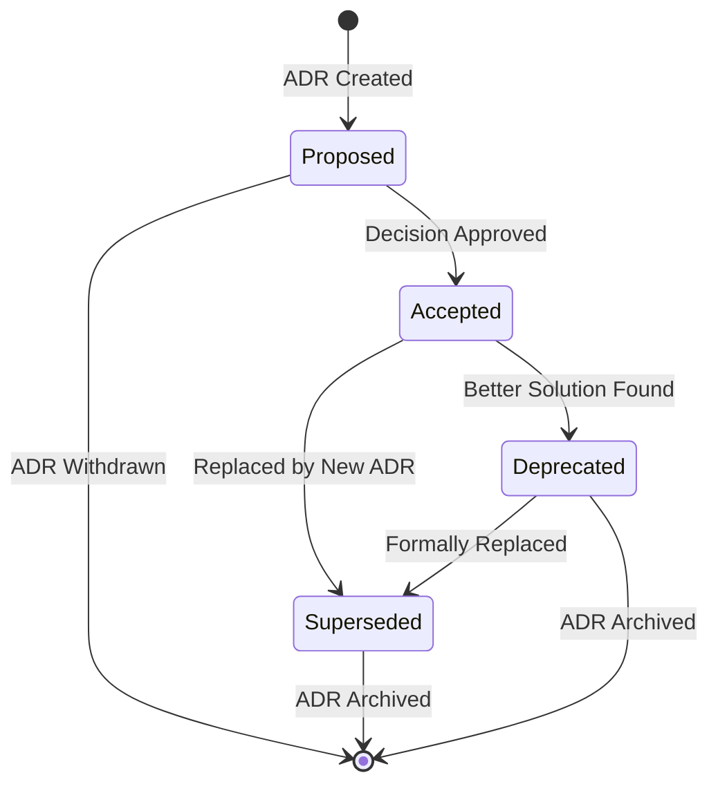

# Architecture Decision Record (ADR) Template

## Overview

Architecture Decision Records (ADRs) document significant architectural decisions made during project development. This template ensures consistent documentation of decision context, rationale, consequences, and alternatives.

---

## ADR Template Format

### ADR-{{adr_number}}: {{decision_title}}

**Status**: {{status}} (Proposed/Accepted/Deprecated/Superseded)
**Date**: {{decision_date}} (YYYY-MM-DD format)
**Deciders**: {{decision_makers}} (Names of decision makers)
**Consulted**: {{stakeholders_consulted}} (Names of stakeholders consulted)
**Informed**: {{stakeholders_informed}} (Names of stakeholders informed)

#### Context

{{context_description}}

**Problem Statement:**
{{problem_statement}}

**Constraints:**

- {{constraint_1}}
- {{constraint_2}}
- {{constraint_3}}

**Success Criteria:**

- {{success_criterion_1}}
- {{success_criterion_2}}
- {{success_criterion_3}}

#### Decision

{{decision_made}}

**Rationale:**
{{decision_rationale}}

**Implementation Approach:**
{{implementation_approach}}

#### Consequences

**Positive Consequences:**

- {{positive_consequence_1}}
- {{positive_consequence_2}}
- {{positive_consequence_3}}

**Negative Consequences:**

- {{negative_consequence_1}}
- {{negative_consequence_2}}
- {{negative_consequence_3}}

**Risks:**

- {{risk_1}}: {{risk_mitigation_1}}
- {{risk_2}}: {{risk_mitigation_2}}

#### Alternatives Considered

**Alternative 1: {{alternative_1_name}}**

- **Description**: {{alternative_1_description}}
- **Pros**: {{alternative_1_pros}}
- **Cons**: {{alternative_1_cons}}
- **Why Rejected**: {{alternative_1_rejection_reason}}

**Alternative 2: {{alternative_2_name}}**

- **Description**: {{alternative_2_description}}
- **Pros**: {{alternative_2_pros}}
- **Cons**: {{alternative_2_cons}}
- **Why Rejected**: {{alternative_2_rejection_reason}}

#### Implementation Notes

{{implementation_notes}}

**Dependencies:**

- {{dependency_1}}
- {{dependency_2}}

**Timeline:**

- {{timeline_milestone_1}}
- {{timeline_milestone_2}}

**Validation Criteria:**

- {{validation_criterion_1}}
- {{validation_criterion_2}}

#### References

- {{reference_1}}
- {{reference_2}}
- {{reference_3}}

---

## ADR Status Lifecycle

### Status Definitions

**Proposed**

- Initial state when ADR is created for review
- Decision not yet finalized
- Under discussion and evaluation

**Accepted**

- Decision approved and ready for implementation
- Team consensus achieved
- Implementation may proceed

**Deprecated**

- Decision no longer recommended but still in use
- Superseded by better approaches
- Legacy systems may still use this decision

**Superseded**

- Decision replaced by newer ADR
- Should reference superseding ADR
- No longer valid for new implementations

### Status Transitions

---

## ADR Categories and Examples

### Technology Stack Decisions

#### Example: ADR-001: Database Technology Selection

**Status**: Accepted
**Date**: 2024-01-15
**Deciders**: Solutions Architect, Tech Lead, DBA

**Context:**
We need to select a database technology for our new user management system that will handle 100,000+ users with complex relational data and reporting requirements.

**Decision:**
Use PostgreSQL as the primary database technology.

**Consequences:**
**Positive:**

- Strong ACID compliance for data integrity
- Excellent performance with complex queries
- Rich ecosystem and tooling
- Open source with enterprise support options

**Negative:**

- Higher operational complexity than NoSQL alternatives
- Requires specialized PostgreSQL expertise
- Vertical scaling limitations at extreme scale

**Alternatives Considered:**

- **MongoDB**: Rejected due to lack of ACID compliance
- **MySQL**: Rejected due to advanced feature limitations
- **Amazon DynamoDB**: Rejected due to vendor lock-in concerns

### Architecture Pattern Decisions

#### Example: ADR-002: Microservices vs Monolithic Architecture

**Status**: Accepted
**Date**: 2024-01-20
**Deciders**: Solutions Architect, Engineering Manager

**Context:**
System complexity requires 50+ API endpoints with multiple business domains and team scaling to 15+ developers.

**Decision:**
Implement microservices architecture with domain-driven service boundaries.

**Consequences:**
**Positive:**

- Independent deployment and scaling
- Technology diversity per service
- Team autonomy and parallel development
- Fault isolation between services

**Negative:**

- Increased operational complexity
- Network latency between services
- Data consistency challenges
- Debugging complexity across services

### Integration Decisions

#### Example: ADR-003: API Communication Protocol

**Status**: Accepted
**Date**: 2024-01-25
**Deciders**: Solutions Architect, API Team Lead

**Context:**
Need standardized communication protocol between microservices and external client applications.

**Decision:**
Use REST APIs with JSON for external interfaces and gRPC for internal service communication.

**Consequences:**
**Positive:**

- REST provides standard external API interface
- gRPC offers better performance for internal calls
- Strong typing with Protocol Buffers
- Excellent tooling and code generation

**Negative:**

- Dual protocol complexity
- Learning curve for gRPC
- Protocol buffer schema management

---

## SDLC Integration Guidelines

### PRD Requirements Traceability

Each ADR should reference specific PRD requirements that drove the decision:

- **Business Requirements (BR)**: Which business needs influenced this decision
- **Non-Functional Requirements (NFR)**: Which quality attributes were considered
- **Constraints**: Which limitations shaped the decision space

### Epic/Story Impact

Document how architectural decisions affect Epic and Story development:

- **Epic Breakdown**: How decision impacts Epic structure
- **Story Dependencies**: Which stories require this decision to be implemented
- **Development Impact**: How decision affects development team workflow
- **Testing Impact**: How decision affects testing strategy and approach

### Implementation Guidance

Provide specific guidance for development teams:

- **Development Standards**: Coding practices required by decision
- **Technology Requirements**: Tools, frameworks, libraries needed
- **Configuration Guidelines**: Environment and deployment requirements
- **Monitoring Requirements**: Observability needed for decision implementation

---

## ADR Management Best Practices

### Creation Guidelines

1. **One Decision Per ADR**: Focus on single, significant architectural decision
2. **Timely Documentation**: Create ADR close to decision-making time
3. **Stakeholder Involvement**: Include relevant technical and business stakeholders
4. **Clear Problem Statement**: Articulate the specific problem being solved
5. **Comprehensive Alternatives**: Consider and document multiple options

### Documentation Quality

1. **Objective Language**: Use factual, non-emotional language
2. **Specific Consequences**: Avoid vague statements, be specific about impacts
3. **Actionable Implementation**: Provide clear guidance for implementation
4. **Future Maintenance**: Consider long-term implications and maintenance
5. **Reference Links**: Include relevant documentation and standards

### Review and Approval

1. **Peer Review**: Have other architects review ADR before acceptance
2. **Stakeholder Review**: Include business stakeholders for business-impacting decisions
3. **Technical Review**: Validate technical feasibility and alignment
4. **Timeline Consideration**: Ensure decision timeline aligns with project needs
5. **Documentation Updates**: Update related architecture documents

### Maintenance and Evolution

1. **Regular Review**: Periodically review ADRs for currency and relevance
2. **Status Updates**: Update status as decisions evolve or become obsolete
3. **Impact Tracking**: Monitor consequences and update based on experience
4. **Knowledge Sharing**: Use ADRs for team education and onboarding
5. **Decision Patterns**: Identify patterns across decisions for future guidance

---

## Integration with Solution Architecture Documents

### SAD Section 8.1 Requirements

- All major architectural decisions must be documented as ADRs
- ADRs should be embedded directly in SAD Section 8.1
- Decision numbering should be consistent across project
- Cross-references between ADRs and other SAD sections

### Epic Breakdown Connection

- ADR consequences should inform Epic breakdown guidance
- Technology decisions should align with development Epic structure
- Implementation timelines should support Epic delivery schedules
- Decision dependencies should influence Epic sequencing

### Quality Assurance Integration

- ADR validation criteria should support testing strategy
- Decision consequences should inform quality metrics
- Alternative evaluations should inform risk mitigation
- Implementation approaches should support automation strategy

This ADR template ensures consistent, comprehensive documentation of architectural decisions that support effective SDLC integration and long-term system maintainability.
