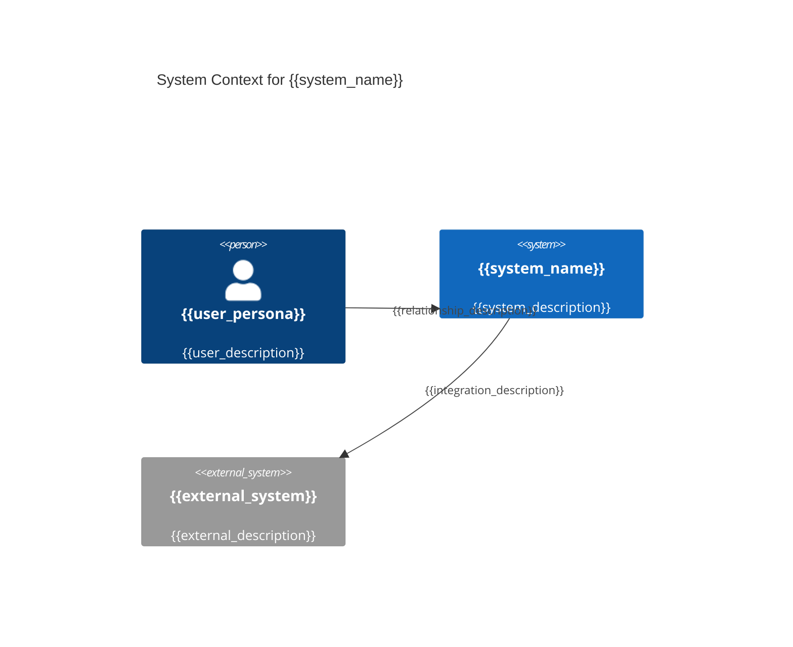
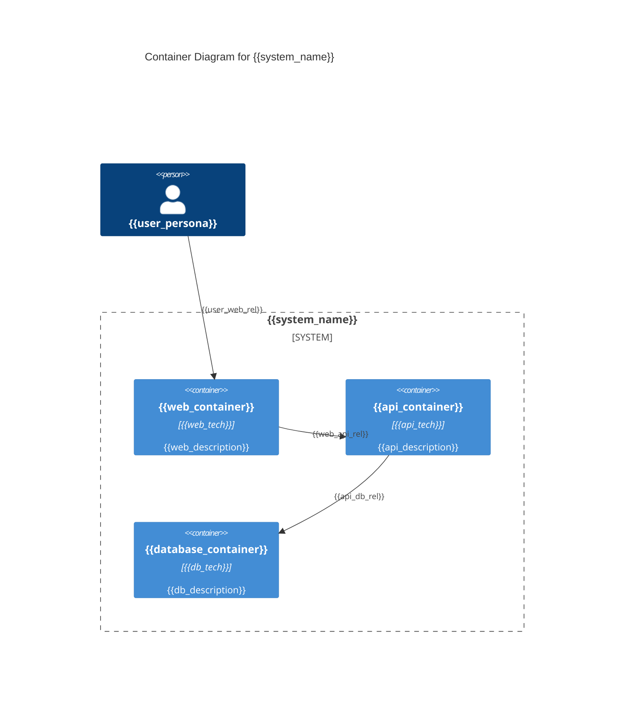
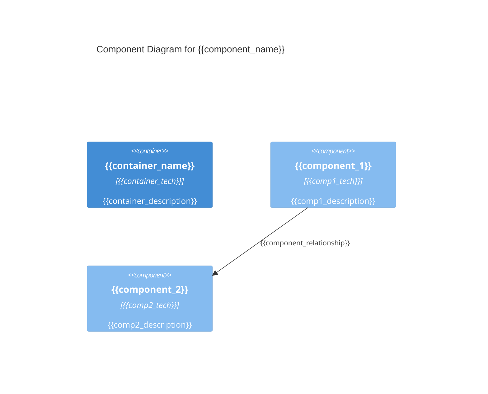

# Solution Architecture Document (SAD): {{system_name}}

## 1. Executive Summary

**Purpose**: Provide business-focused overview connecting architecture to business value and strategic objectives.

{{executive_summary}}

### Key Sections

- **Business Context**: {{business_context}}
- **Architectural Approach**: {{architectural_approach}}
- **Key Benefits**: {{key_benefits}}
- **Success Metrics**: {{success_metrics}}

---

## 2. Introduction

**Purpose**: Establish foundation and context for all architectural decisions throughout the document.

### 2.1 Definitions, Acronyms, Abbreviations

{{definitions_acronyms_abbreviations}}

### 2.2 Scope

{{scope_boundaries}}

**What's Included:**

- {{included_systems}}

**What's Excluded:**

- {{excluded_systems}}

### 2.3 Stakeholders

{{stakeholders}}

| Stakeholder | Role | Key Concerns |
|-------------|------|--------------|
| {{stakeholder_name}} | {{stakeholder_role}} | {{stakeholder_concerns}} |

### 2.4 PRD Requirements Mapping

{{prd_requirements_mapping}}

**Requirements Traceability:**

| PRD Requirement | Architectural Component | Implementation Approach |
|-----------------|------------------------|------------------------|
| {{requirement_id}} ({{requirement_description}}) | {{component_name}} | {{implementation_approach}} |

**Purpose**: Establish direct traceability from PRD business/system requirements to architectural decisions.

---

## 3. Context

**Purpose**: Establish comprehensive environmental understanding across all architectural domains.

### 3.1 Technology Strategy

{{technology_strategy}}

**Organizational Technology Direction:**

- {{tech_strategy_point_1}}
- {{tech_strategy_point_2}}

**Alignment with Architecture:**

- {{alignment_point_1}}
- {{alignment_point_2}}

### 3.2 Business Architecture

{{business_architecture}}

**Key Business Processes:**

- {{business_process_1}}
- {{business_process_2}}

**Business Objectives:**

- {{business_objective_1}}
- {{business_objective_2}}

### 3.3 Data Architecture

{{data_architecture}}

**Data Models:**

- {{data_model_1}}
- {{data_model_2}}

**Data Flows:**

- {{data_flow_1}}
- {{data_flow_2}}

**Data Governance:**

- {{governance_requirement_1}}
- {{governance_requirement_2}}

### 3.4 Infrastructure Strategy

{{infrastructure_strategy}}

**Organizational Infrastructure Direction:**

- {{org_infrastructure_1}}
- {{org_infrastructure_2}}

**Strategic Platform Decisions:**

- {{strategic_platform_1}}
- {{strategic_platform_2}}

### 3.5 Application Architecture

{{application_architecture}}

**Application Landscape:**

- {{application_1}}
- {{application_2}}

**Integration Points:**

- {{integration_point_1}}
- {{integration_point_2}}

### 3.6 Security Architecture

{{security_architecture}}

**Security Posture:**

- {{security_requirement_1}}
- {{security_requirement_2}}

**Compliance Requirements:**

- {{compliance_requirement_1}}
- {{compliance_requirement_2}}

---

## 4. Requirements

**Purpose**: Document comprehensive driving forces behind all architectural decisions.

### 4.1 Business Goals

{{business_goals}}

**Primary Objectives:**

1. {{business_goal_1}}
2. {{business_goal_2}}
3. {{business_goal_3}}

**Success Criteria:**

- {{success_criterion_1}}
- {{success_criterion_2}}

### 4.2 Functional Requirements

{{functional_requirements}}

**Core Functionality:**

| Requirement ID | Description | Priority | Architectural Impact |
|----------------|-------------|----------|---------------------|
| {{req_id}} | {{req_description}} | {{priority}} | {{arch_impact}} |

### 4.3 Non-Functional Requirements

{{non_functional_requirements}}

**Quality Attributes:**

| Quality Attribute | Requirement | Measurement | Architectural Approach |
|-------------------|-------------|-------------|----------------------|
| Performance | {{performance_req}} | {{performance_metric}} | {{performance_approach}} |
| Scalability | {{scalability_req}} | {{scalability_metric}} | {{scalability_approach}} |
| Security | {{security_req}} | {{security_metric}} | {{security_approach}} |
| Availability | {{availability_req}} | {{availability_metric}} | {{availability_approach}} |

### 4.4 Constraints

{{constraints}}

**Technical Constraints:**

- {{technical_constraint_1}}
- {{technical_constraint_2}}

**Business Constraints:**

- {{business_constraint_1}}
- {{business_constraint_2}}

**Resource Constraints:**

- {{resource_constraint_1}}
- {{resource_constraint_2}}

### 4.5 Assumptions

{{assumptions}}

**Technical Assumptions:**

- {{technical_assumption_1}}
- {{technical_assumption_2}}

**Business Assumptions:**

- {{business_assumption_1}}
- {{business_assumption_2}}

---

## 5. Baseline Architecture

**Purpose**: Document current state architecture to understand transformation scope and complexity.

### 5.1 Conceptual View

{{baseline_conceptual_view}}

**Current System Overview:**

- {{current_system_1}}
- {{current_system_2}}

### 5.2 Logical View

{{baseline_logical_view}}

**Current System Components:**

| Component | Current Purpose | Technology Stack | Condition | Migration Notes |
|-----------|----------------|------------------|-----------|-----------------|
| {{current_component}} | {{current_purpose}} | {{current_tech}} | {{condition}} | {{migration_notes}} |

### 5.3 Integration View

{{baseline_integration_view}}

**Current Integration Points:**

- {{integration_1}}
- {{integration_2}}

### 5.4 Physical/Deployment View

{{baseline_deployment_view}}

**Current Infrastructure:**

- {{infrastructure_1}}
- {{infrastructure_2}}

---

## 6. Target Architecture

**Purpose**: Define comprehensive future state architecture with clear implementation guidance.

### 6.1 Conceptual View (C4 Context Level)

{{target_conceptual_view}}

**System Context Diagram:**



**External Systems:**

- {{external_system_1}}: {{relationship_1}}
- {{external_system_2}}: {{relationship_2}}

### 6.2 Logical View (C4 Container/Component)

{{target_logical_view}}

**Container Diagram (C4 Level 2):**



**Component Diagram (C4 Level 3):**



**Key Components:**

| Component | Responsibility | Technology | Interfaces |
|-----------|---------------|------------|------------|
| {{component_name}} | {{responsibility}} | {{technology}} | {{interfaces}} |

### 6.3 Integration View

{{target_integration_view}}

**API Design:**

- {{api_1}}: {{api_purpose_1}}
- {{api_2}}: {{api_purpose_2}}

**Integration Patterns:**

- {{pattern_1}}: {{pattern_usage_1}}
- {{pattern_2}}: {{pattern_usage_2}}

### 6.4 Data View

{{target_data_view}}

**Data Architecture:**

- {{data_component_1}}: {{data_purpose_1}}
- {{data_component_2}}: {{data_purpose_2}}

**Data Flow:**

```mermaid
flowchart TD
    A[{{data_source}}] --> B[{{data_processor}}]
    B --> C[{{data_storage}}]
    C --> D[{{data_consumer}}]
```

### 6.5 Physical/Deployment View

{{target_deployment_view}}

**Deployment Architecture:**

- {{deployment_component_1}}: {{deployment_purpose_1}}
- {{deployment_component_2}}: {{deployment_purpose_2}}

**Infrastructure Mapping:**

```mermaid
graph TB
    subgraph "{{environment_name}}"
        subgraph "{{zone_1}}"
            A[{{component_1}}]
            B[{{component_2}}]
        end
        subgraph "{{zone_2}}"
            C[{{component_3}}]
            D[{{component_4}}]
        end
    end
```

### 6.6 Quality Attributes Implementation

{{quality_implementation}}

**Architecture Quality Approaches:**

| Quality Attribute | Implementation Strategy | Architectural Pattern | Validation Method |
|-------------------|------------------------|---------------------|-------------------|
| Performance | {{performance_strategy}} | {{performance_pattern}} | {{performance_validation}} |
| Scalability | {{scalability_strategy}} | {{scalability_pattern}} | {{scalability_validation}} |
| Security | {{security_strategy}} | {{security_pattern}} | {{security_validation}} |
| Availability | {{availability_strategy}} | {{availability_pattern}} | {{availability_validation}} |

### 6.7 Risks and Mitigations

{{risks_mitigations}}

| Risk | Impact | Probability | Mitigation Strategy |
|------|--------|-------------|-------------------|
| {{risk_1}} | {{impact_1}} | {{probability_1}} | {{mitigation_1}} |
| {{risk_2}} | {{impact_2}} | {{probability_2}} | {{mitigation_2}} |

### 6.8 Solution Strategy

{{solution_strategy}}

**Architectural Principles:**

1. {{principle_1}}: {{principle_description_1}}
2. {{principle_2}}: {{principle_description_2}}

**Technology Decisions:**

| Decision Area | Chosen Technology | Rationale | Trade-offs |
|---------------|-------------------|-----------|------------|
| {{decision_area_1}} | {{technology_1}} | {{rationale_1}} | {{tradeoffs_1}} |
| {{decision_area_2}} | {{technology_2}} | {{rationale_2}} | {{tradeoffs_2}} |

**Architecture Patterns:**

- {{pattern_1}}: {{pattern_rationale_1}}
- {{pattern_2}}: {{pattern_rationale_2}}

---

## 7. Transition/Migration

**Purpose**: Define clear implementation roadmap from current state to target architecture.

### 7.1 Migration Approach

{{migration_approach}}

**Migration Strategy:**

- {{strategy_element_1}}
- {{strategy_element_2}}

**Migration Principles:**

- {{principle_1}}
- {{principle_2}}

### 7.2 Migration Roadmap

{{migration_roadmap}}

**Implementation Phases:**

| Phase | Duration | Scope | Dependencies | Success Criteria |
|-------|----------|-------|--------------|------------------|
| {{phase_1}} | {{duration_1}} | {{scope_1}} | {{dependencies_1}} | {{criteria_1}} |
| {{phase_2}} | {{duration_2}} | {{scope_2}} | {{dependencies_2}} | {{criteria_2}} |

### 7.3 Implementation Guidance

{{implementation_guidance}}

**Epic Breakdown Guidance:**

| Architectural Component | Epic Mapping | Story Creation Focus |
|------------------------|--------------|---------------------|
| {{component_1}} | {{epic_guidance_1}} | {{story_focus_1}} |
| {{component_2}} | {{epic_guidance_2}} | {{story_focus_2}} |

**Development Standards:**

- {{dev_standard_1}}
- {{dev_standard_2}}

**API Design Guidelines:**

- {{api_guideline_1}}
- {{api_guideline_2}}

**Testing Alignment:**

- {{testing_alignment_1}}
- {{testing_alignment_2}}

---

## 8. Architectural Decisions

**Purpose**: Record significant decisions with comprehensive rationale and alternatives analysis.

### 8.1 Decision Log (ADR Format)

{{architectural_decisions}}

**Decision Template:**

#### ADR-001: {{decision_title}}

**Status**: {{status}} (Proposed/Accepted/Superseded)
**Date**: {{decision_date}}
**Deciders**: {{decision_makers}}

**Context:**
{{decision_context}}

**Decision:**
{{decision_made}}

**Consequences:**
**Positive:**

- {{positive_consequence_1}}
- {{positive_consequence_2}}

**Negative:**

- {{negative_consequence_1}}
- {{negative_consequence_2}}

**Alternatives Considered:**

- {{alternative_1}}: {{alternative_rationale_1}}
- {{alternative_2}}: {{alternative_rationale_2}}

---

## 9. Cross-Cutting Concerns

**Purpose**: Address system-wide aspects that affect multiple architectural components.

### 9.1 Security

{{security_concerns}}

**Cross-Cutting Security Implementation:**

- {{cross_cutting_security_1}}
- {{cross_cutting_security_2}}

**Security Integration Points:**

- {{security_integration_1}}
- {{security_integration_2}}

### 9.2 Scalability

{{scalability_concerns}}

**Scalability Strategy:**

- {{scalability_strategy_1}}
- {{scalability_strategy_2}}

**Scaling Patterns:**

- {{scaling_pattern_1}}
- {{scaling_pattern_2}}

### 9.3 Observability

{{observability_concerns}}

**Monitoring Strategy:**

- {{monitoring_approach_1}}
- {{monitoring_approach_2}}

**Logging Strategy:**

- {{logging_approach_1}}
- {{logging_approach_2}}

### 9.4 Fault Tolerance

{{fault_tolerance_concerns}}

**Resilience Patterns:**

- {{resilience_pattern_1}}
- {{resilience_pattern_2}}

**Error Handling Strategy:**

- {{error_handling_1}}
- {{error_handling_2}}

---

## 10. Quality Assurance

**Purpose**: Define comprehensive approach to validating architectural decisions and implementation quality.

### 10.1 Testing Strategy

{{testing_strategy}}

**Architecture Testing Approach:**

- {{arch_testing_1}}
- {{arch_testing_2}}

**Quality Gates:**

- {{quality_gate_1}}
- {{quality_gate_2}}

### 10.2 Test Automation Approach

{{test_automation}}

**Automation Strategy:**

- {{automation_approach_1}}
- {{automation_approach_2}}

**Testing Tools:**

- {{testing_tool_1}}: {{tool_purpose_1}}
- {{testing_tool_2}}: {{tool_purpose_2}}

### 10.3 Quality Metrics

{{quality_metrics}}

**Success Metrics:**

| Quality Aspect | Metric | Target | Measurement Method |
|----------------|---------|--------|-------------------|
| {{quality_1}} | {{metric_1}} | {{target_1}} | {{method_1}} |
| {{quality_2}} | {{metric_2}} | {{target_2}} | {{method_2}} |

---

## 11. Appendices

**Purpose**: Provide supplementary materials and detailed references.

### 11.1 Glossary

{{glossary}}

| Term | Definition |
|------|------------|
| {{term_1}} | {{definition_1}} |
| {{term_2}} | {{definition_2}} |

### 11.2 Diagrams

{{diagrams}}

**Diagram Index:**

- {{diagram_1}}: {{diagram_purpose_1}}
- {{diagram_2}}: {{diagram_purpose_2}}

### 11.3 Reference Materials

{{reference_materials}}

**Standards and Guidelines:**

- {{reference_1}}
- {{reference_2}}

**Related Documentation:**

- {{related_doc_1}}
- {{related_doc_2}}

---

**Document Status**: {{document_status}}
**Version**: {{version}}
**Last Updated**: {{last_updated}}
**Next Review**: {{next_review}}
