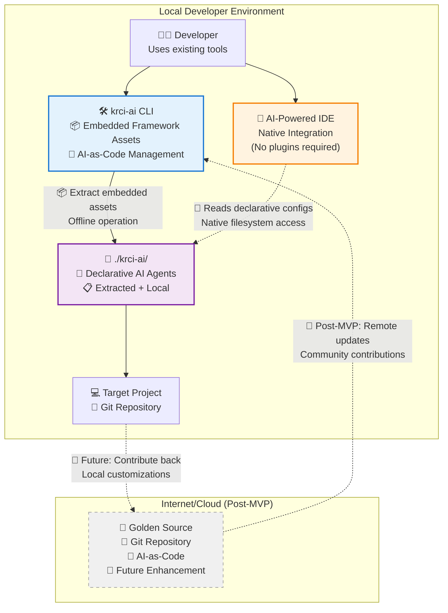

# KubeRocketAI

AI-as-Code framework for structuring AI-assisted software development. Define AI agents as version-controlled Markdown files with YAML frontmatter.

## Problem

You've figured out how to make AI agents understand your project. You've crafted the perfect prompts, built context-aware agents, and your AI-generated code actually works. **Now what?**

The real challenge isn't creating smart agents—it's **scaling that success** across your team, projects, and workflow.

### What Happens When It Actually Works

- **"How do I share this with my team?"** - You've spent weeks perfecting an agent configuration, but there's no clean way to distribute it beyond copy-pasting prompts in Slack
- **"Which version was working?"** - Your agent setup evolved over time, but when something breaks, you can't roll back to the version that was working last week
- **"I need this in my IDE, not just ChatGPT"** - Your perfect brainstorming agent lives in a web interface, but you need it integrated into your actual development workflow
- **"Can we run this in CI?"** - Your agents work great for interactive development, but you need them for code review, documentation generation, and automated analysis
- **"How do we maintain this across 10 repositories?"** - Each project needs slight variations, but managing separate configurations becomes a nightmare

### The Scaling Problem

- **No Distribution System**: Agents remain isolated to individuals or require manual sharing through ad-hoc methods
- **Version Control Gap**: Agent configurations evolve without proper versioning, making it impossible to track what works and what doesn't
- **Platform Lock-in**: Agents tied to specific tools can't be moved, adapted, or integrated into different parts of your workflow
- **Maintenance Overhead**: As your agent library grows, keeping configurations synchronized across projects becomes unmanageable
- **Quality Assurance**: No systematic way to validate that agents work correctly before deploying them across teams or into production workflows
- **Context Fragmentation**: Web-based AI tools lose critical project context, forcing manual re-explanation of architecture, patterns, and organizational standards for each interaction

## Solution

KubeRocketAI brings the proven **"Infrastructure-as-Code" model to AI agent management**. Teams define agents in version-controlled Markdown files that integrate seamlessly with existing development workflows, enabling the same declarative approach developers expect from modern CI/CD pipelines.

### Key Value Propositions

1. **Agent-as-Code Distribution**: Version-control and share your proven agent configurations just like you do with Infrastructure-as-Code
2. **Multi-Platform Injection**: Deploy the same agent definition to your IDE, CI pipeline, bundled for brainstorming, or wherever you need AI assistance
3. **Built-in Validation**: Validate agent configurations and dependencies before deployment, ensuring consistent behavior across environments
4. **Context-Preserving Bundling**: Package agents with full project context for web chat tools, maintaining architectural knowledge and organizational standards across platforms
5. **Scalable Team Workflows**: Maintain agent libraries across multiple projects and repositories without configuration hell

## Smart Context Bundling

**Two deployment modes for different contexts:**

### IDE Integration: Limited, Focused Context

Deploy agents directly into your development environment with project-specific context optimized for coding tasks.

### Web Chat: Full Context for Strategic Work

Bundle agents with complete project assets for brainstorming and requirements elicitation in high-context models (ChatGPT, Claude, Gemini Pro).

```bash
# IDE: Focused development context
krci-ai install --ide=cursor

# Web Chat: Complete project context for strategic sessions
krci-ai bundle --all --output brainstorm-context.md
```

## High Level Project Diagram

This diagram illustrates the AI-as-Code approach for AI agents, showing how KubeRocketAI enables declarative AI-as-Code management within existing developer workflows.



## Installation

### macOS - Homebrew (Recommended)

```bash
# Add the KubeRocketCI tap
brew tap KubeRocketCI/homebrew-tap

# Install krci-ai
brew install krci-ai
```

### Linux - Direct Download

```bash
# Download and extract latest release
curl -L "https://github.com/KubeRocketCI/kuberocketai/releases/latest/download/krci-ai_Linux_x86_64.tar.gz" | tar -xz
chmod +x krci-ai
sudo mv krci-ai /usr/local/bin/
```

### Windows - Direct Download

1. Download the latest release: [krci-ai_Windows_x86_64.zip](https://github.com/KubeRocketCI/kuberocketai/releases/latest/download/krci-ai_Windows_x86_64.zip)
2. Extract the zip file
3. Add the `krci-ai.exe` to your PATH or move it to a directory in your PATH

### Build from Source

```bash
git clone https://github.com/KubeRocketCI/kuberocketai.git
cd kuberocketai
make build
```

### Update & Uninstall

```bash
# Update via Homebrew
brew update && brew upgrade krci-ai

# Uninstall via Homebrew
brew uninstall krci-ai
```

## Usage

### Quick Start

```bash
# Install framework with IDE integration
krci-ai install --ide=cursor

# Validate your agent configurations
krci-ai validate --all

# Create context-aware bundles for web chat tools
krci-ai bundle --all --output project-context.md

# List available agents
krci-ai list agents

# Install with all IDE integrations
krci-ai install --all
```

## Success Metrics

KubeRocketAI succeeds when you can scale your AI workflow like you scale your infrastructure:

- **Agent Reusability**: Deploy proven configurations across multiple projects without manual setup
- **Quality Assurance**: Validate agent configurations before deployment to catch issues early
- **Version Control Integration**: Track what works, roll back when things break, collaborate on improvements
- **Platform Flexibility**: Use the same agent definitions for IDE development, CI automation, and brainstorming sessions

Our goal: Turn your AI agent expertise into scalable, maintainable infrastructure.

## Target Users

### Teams That Have Figured Out AI, But Need to Scale It

**You'll love this if you:**

- Have created effective AI agents but struggle to share them across your team
- Want to version-control your agent configurations just like you do with your infrastructure
- Need validation and quality assurance for agents before deploying them across projects
- Need the same agents working in multiple contexts: IDE, CI/CD, brainstorming, code review
- Maintain multiple repositories and are tired of keeping agent configurations in sync
- Have proven AI workflows but no systematic way to scale them across projects

**Perfect for:**

- **Senior AI Engineers**: Have mastered individual agent creation, now need enterprise-scale management
- **DevOps-Minded Teams**: Want to apply Infrastructure-as-Code principles to AI agent management
- **Multi-Project Teams**: Need consistent AI capabilities across different repositories and contexts
- **AI-First Organizations**: Ready to systematize their AI workflows beyond individual experimentation

## Contributing

See [CONTRIBUTING.md](CONTRIBUTING.md) for development setup and guidelines.

## License

Apache-2.0 License - see [LICENSE](LICENSE) for details.
