# KubeRocketAI

AI-as-Code framework for structuring AI-assisted software development. Define AI agents as version-controlled Markdown files with YAML frontmatter.

## Problem

Enterprise teams face critical challenges when scaling AI agents across development workflows:

- **Fragmented AI Tool Ecosystem**: Different AI tools (web interfaces, Cursor, Claude Code, VS Code) have separate configurations and capabilities, creating inconsistent experiences
- **Agent Portability Issues**: Agents work in one tool but can't be easily transferred or scaled across different codebases and team environments
- **Lack of Centralized Management**: No enterprise-wide approach to manage, version, and distribute AI agents and their capabilities
- **IDE-to-Web Context Gaps**: Agents available in web interfaces aren't accessible in IDEs, forcing developers to switch contexts
- **No Version Control for AI Logic**: Changes to agent prompts, tools, and capabilities happen without proper review, versioning, or audit trails
- **Enterprise Scaling Bottlenecks**: Difficult to quickly deploy proven agents across multiple projects and teams

## Solution

KubeRocketAI provides a **centralized golden library** of AI agents that can be version-controlled, reviewed, and deployed consistently across IDEs and projects. Agents are defined as simple Markdown files.

## High Level Project Diagram

This diagram illustrates the AI-as-Code approach for AI agents, showing how KubeRocketAI enables declarative AI-as-Code management within existing developer workflows.

```mermaid
graph TD
    subgraph "Local Developer Environment"
        Developer["👨‍💻 Developer<br/>Uses existing tools"]
        CLI["🛠️ krci-ai CLI<br/>📦 Embedded Framework Assets<br/>🔧 AI-as-Code Management"]
        IDE["🎨 AI-Powered IDE<br/>Native Integration<br/>(No plugins required)"]
        LocalFramework["📁 ./krci-ai/<br/>🔗 Declarative AI Agents<br/>📋 Extracted + Local"]
        TargetProject["💻 Target Project<br/>🔀 Git Repository"]
    end

    subgraph "Internet/Cloud (Post-MVP)"
        GoldenRepo["🏢 Golden Source<br/>🔗 Git Repository<br/>🤖 AI-as-Code<br/>🔮 Future Enhancement"]
    end

    Developer --> CLI
    Developer --> IDE
    CLI -->|"📦 Extract embedded assets<br/>Offline operation"| LocalFramework
    IDE -.->|"📖 Reads declarative configs<br/>Native filesystem access"| LocalFramework
    LocalFramework --> TargetProject
    GoldenRepo -.->|"🔮 Post-MVP: Remote updates<br/>Community contributions"| CLI
    TargetProject -.->|"🔄 Future: Contribute back<br/>Local customizations"| GoldenRepo

    style CLI fill:#e3f2fd,stroke:#1976d2,stroke-width:2px
    style IDE fill:#fff3e0,stroke:#f57c00,stroke-width:2px
    style GoldenRepo fill:#f0f0f0,stroke:#999999,stroke-width:1px,stroke-dasharray: 5 5
    style LocalFramework fill:#f3e5f5,stroke:#7b1fa2,stroke-width:2px
```



## Current Status

**In Development** - Core CLI tool and agent framework are being implemented.

### What's Available

- Basic CLI structure (`krci-ai`)
- Project documentation and architecture
- CI/CD pipeline for releases

### What's Planned

- Agent playbook with SDLC role definitions
- Two-tier validation system
- IDE integration support
- Multi-platform distribution

## Installation

### macOS - Homebrew (Recommended)

```bash
# Add the KubeRocketCI tap
brew tap KubeRocketCI/homebrew-tap

# Install krci-ai
brew install krci-ai
```

### Linux - Direct Download

```bash
# Download and extract latest release
curl -L "https://github.com/KubeRocketCI/kuberocketai/releases/latest/download/krci-ai_Linux_x86_64.tar.gz" | tar -xz
chmod +x krci-ai
sudo mv krci-ai /usr/local/bin/
```

### Windows - Direct Download

1. Download the latest release: [krci-ai_Windows_x86_64.zip](https://github.com/KubeRocketCI/kuberocketai/releases/latest/download/krci-ai_Windows_x86_64.zip)
2. Extract the zip file
3. Add the `krci-ai.exe` to your PATH or move it to a directory in your PATH

### Build from Source

```bash
git clone https://github.com/KubeRocketCI/kuberocketai.git
cd kuberocketai
make build
```

### Update & Uninstall

```bash
# Update via Homebrew
brew update && brew upgrade krci-ai

# Uninstall via Homebrew
brew uninstall krci-ai
```

## Usage

### Quick Start

```bash
# Install framework with IDE integration
krci-ai install --ide=cursor

# List available agents
krci-ai list agents

# Install with all IDE integrations
krci-ai install --all
```

### Common Use Cases

**1. Setting up AI-as-Code in existing project:**

```bash
cd my-project
krci-ai install --ide=claude --force
krci-ai list agents -v
```

**2. Enterprise team setup with all IDE support:**

```bash
krci-ai install --all
# Creates .krci-ai/, .cursor/rules/, .claude/commands/
```

**3. Discovering available agents after installation:**

```bash
krci-ai list agents
# Shows: developer, architect, qa agents with roles
```

## Target Users

- **Enterprise Development Teams**: Need transparent, auditable AI workflows
- **Individual Developers**: Want lightweight, customizable AI framework

## Contributing

See [CONTRIBUTING.md](CONTRIBUTING.md) for development setup and guidelines.

## License

Apache-2.0 License - see [LICENSE](LICENSE) for details.
