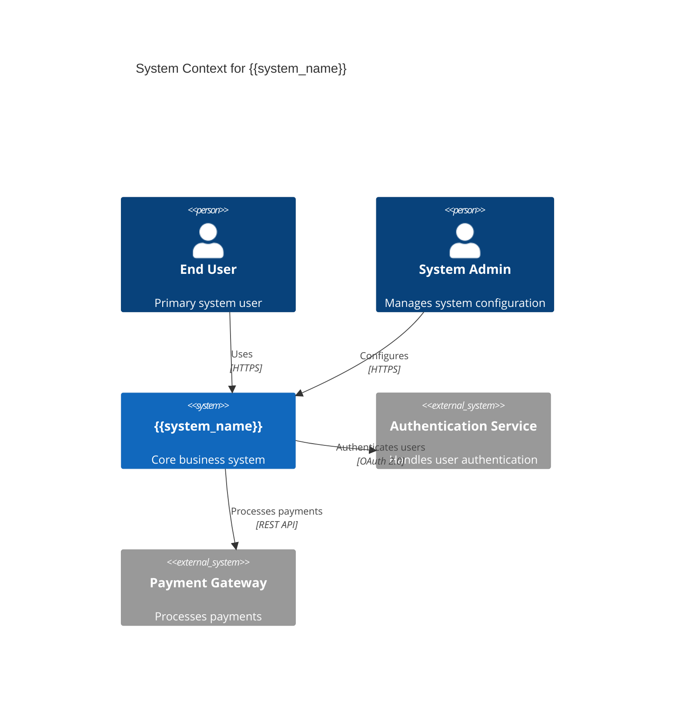
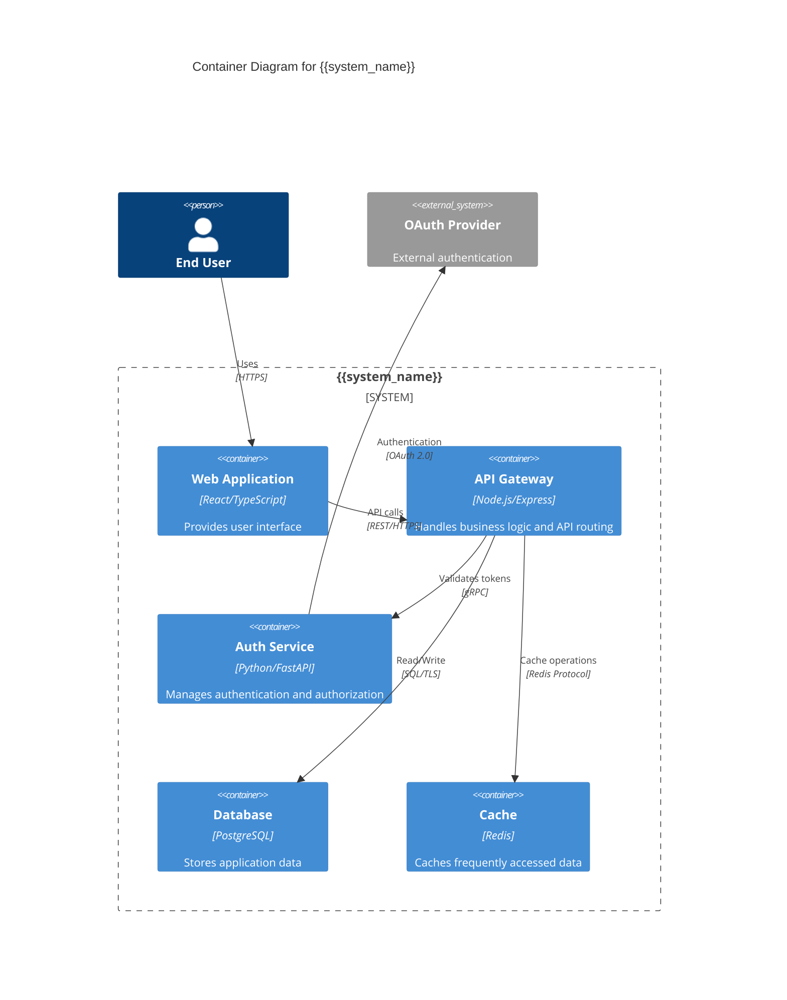
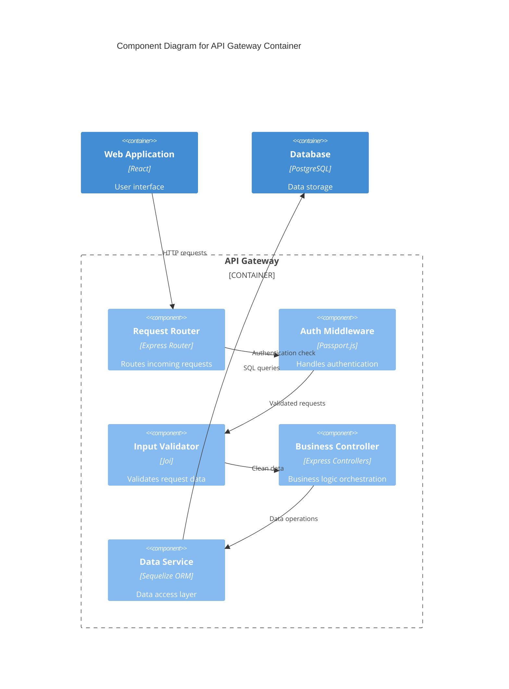
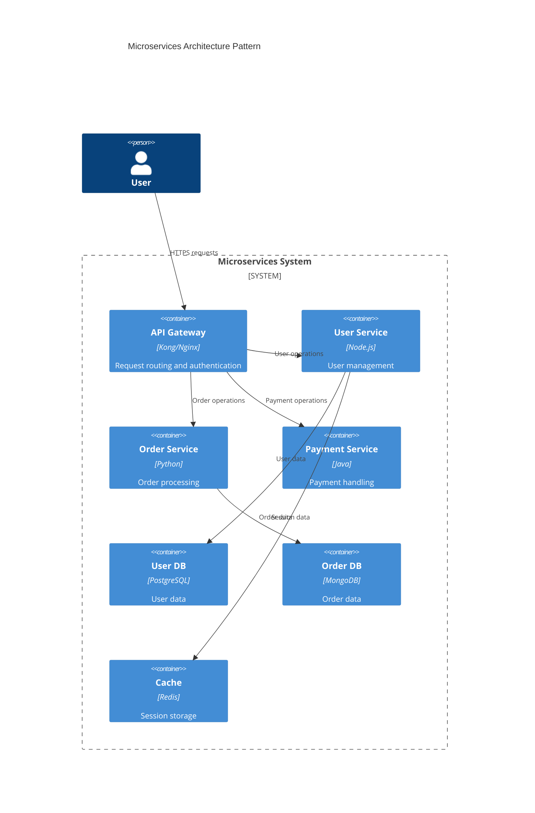
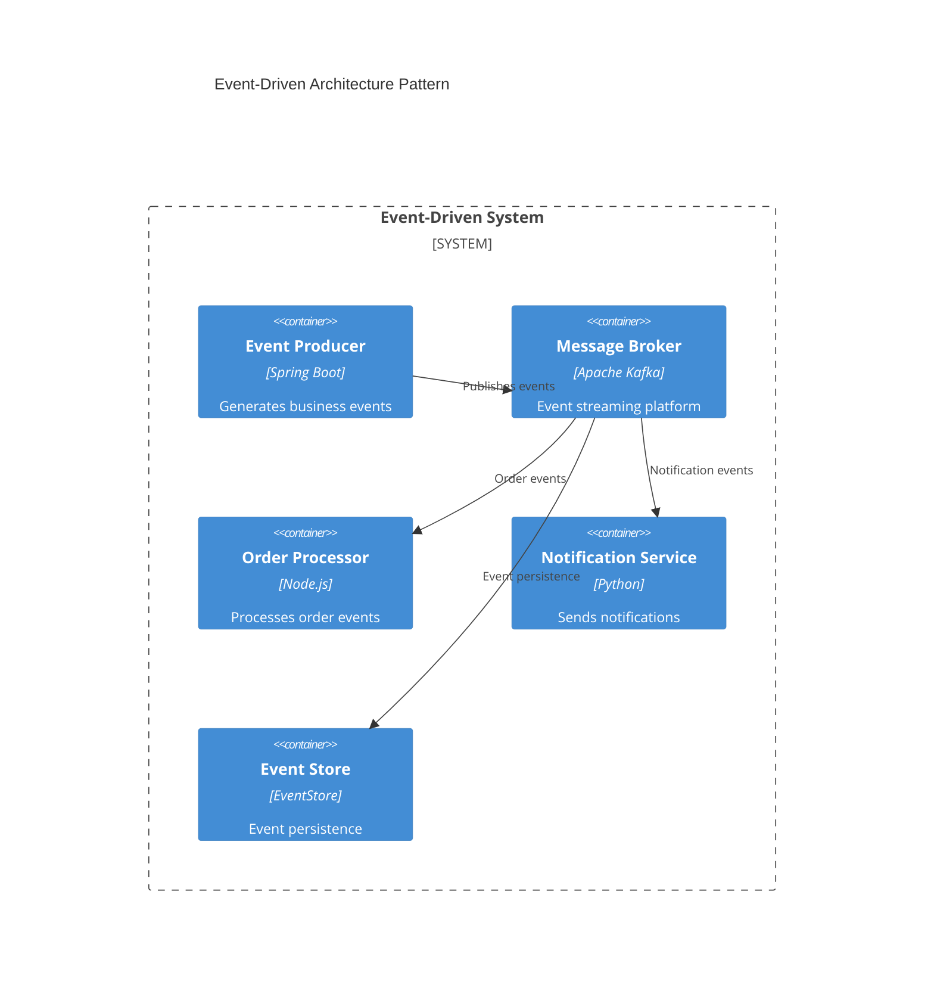
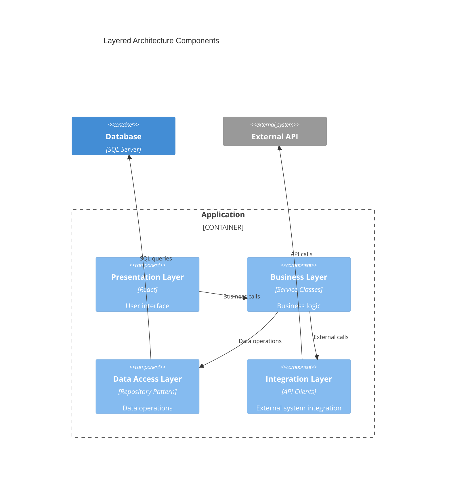

# C4 Model Guidelines for Solution Architecture Documents

## Overview
The C4 model provides a hierarchical approach to software architecture diagramming, moving from high-level context through containers and components to code. This guide defines how to apply C4 modeling within Solution Architecture Documents for clear visual communication.

---

## C4 Model Hierarchy

### Level 1: System Context Diagrams
**Purpose**: Show how your system fits into the wider world in terms of people and other systems.

**When to Use**: Required in SAD Section 6.1 (Conceptual View)

**Elements**:
- **People**: The human users of your software system
- **Software Systems**: Your software system and external systems it interacts with
- **Relationships**: How people and systems interact

**Mermaid Implementation**:


**Best Practices**:
- Keep to 5-10 systems maximum for readability
- Focus on external dependencies and user interactions
- Use descriptive relationship labels
- Include communication protocols where relevant

### Level 2: Container Diagrams
**Purpose**: Show the high-level technology choices and how responsibilities are distributed across containers.

**When to Use**: Required in SAD Section 6.2 (Logical View)

**Elements**:
- **Containers**: Deployable/executable units (web apps, databases, file systems)
- **Technologies**: Programming languages, frameworks, databases
- **Relationships**: How containers communicate

**Mermaid Implementation**:


**Best Practices**:
- Show major containers only (databases, web apps, services)
- Include technology stack information
- Indicate communication protocols
- Group related containers within system boundaries

### Level 3: Component Diagrams
**Purpose**: Show how a container is made up of components, their responsibilities, and technology details.

**When to Use**: Optional in SAD Section 6.2 for complex containers

**Elements**:
- **Components**: Major structural elements within a container
- **Responsibilities**: What each component does
- **Relationships**: How components collaborate

**Mermaid Implementation**:


**Best Practices**:
- Focus on significant components only
- Show clear responsibility separation
- Include frameworks and libraries used
- Indicate data flow direction

### Level 4: Code Diagrams
**Purpose**: Show implementation details at the code level.

**When to Use**: Generally not required in SAD documents (implementation detail)

**Note**: SAD documents focus on Levels 1-3 for architectural communication.

---

## SAD Integration Guidelines

### Section 6.1: System Context (C4 Level 1)
**Required Elements**:
- System boundary showing your software system
- External systems and dependencies
- User personas and their interactions
- Communication protocols and methods

**Template Variables to Replace**:
- `{{system_name}}`: Your software system name
- `{{user_persona}}`: Primary user types
- `{{external_system}}`: External dependencies
- `{{relationship_description}}`: How systems interact

### Section 6.2: Container View (C4 Level 2)
**Required Elements**:
- Major deployable containers
- Technology stack for each container
- Communication patterns between containers
- Data flow and integration points

**Template Variables to Replace**:
- `{{container_name}}`: Container identification
- `{{container_tech}}`: Technology stack
- `{{container_description}}`: Container purpose
- `{{communication_protocol}}`: How containers communicate

### Optional Component View (C4 Level 3)
**When to Include**:
- Complex containers with multiple responsibilities
- Critical business logic components
- Integration patterns that need clarification

**Focus Areas**:
- Business logic organization
- Data access patterns
- Security implementation
- Cross-cutting concern handling

---

## Diagram Quality Standards

### Visual Clarity Standards
- **Maximum Elements**: 10-12 elements per diagram for readability
- **Consistent Naming**: Use clear, descriptive names
- **Technology Labels**: Include relevant technology information
- **Relationship Clarity**: Use descriptive relationship labels

### Technical Accuracy Standards
- **Current State**: Diagrams reflect actual or planned architecture
- **Technology Alignment**: Technologies shown are actually used/planned
- **Integration Accuracy**: Communication patterns are technically correct
- **Scope Consistency**: Diagrams match the architectural scope

### SDLC Integration Standards
- **Epic Mapping**: Components shown map to Epic breakdown guidance
- **Implementation Ready**: Diagrams support development team understanding
- **Deployment Alignment**: Container view supports deployment planning
- **Testing Support**: Component visibility supports testing strategy

---

## Common Diagram Patterns

### Microservices Architecture Pattern


### Event-Driven Architecture Pattern


### Layered Architecture Pattern


---

## Mermaid Syntax Guidelines

### Basic Elements

#### Person
```mermaid
Person(alias, "Label", "Optional description")
```

#### System
```mermaid
System(alias, "System Name", "System description")
System_Ext(alias, "External System", "External system description")
```

#### Container
```mermaid
Container(alias, "Container Name", "Technology", "Container description")
```

#### Component
```mermaid
Component(alias, "Component Name", "Technology", "Component description")
```

#### Relationships
```mermaid
Rel(from, to, "Label")
Rel(from, to, "Label", "Optional technology/protocol")
```

### System Boundaries
```mermaid
System_Boundary(alias, "Boundary Name") {
    Container(container1, "Container 1", "Tech")
    Container(container2, "Container 2", "Tech")
}
```

### Container Boundaries
```mermaid
Container_Boundary(alias, "Container Name") {
    Component(comp1, "Component 1", "Tech")
    Component(comp2, "Component 2", "Tech")
}
```

---

## Validation Checklist

### Context Diagram Validation (Level 1)
- [ ] Shows system in context of users and external systems
- [ ] Maximum 10 external systems for clarity
- [ ] All major user personas included
- [ ] External dependencies clearly identified
- [ ] Communication protocols specified where relevant

### Container Diagram Validation (Level 2)
- [ ] Shows all major deployable units
- [ ] Technology stack specified for each container
- [ ] Communication patterns clear and accurate
- [ ] Data flow direction indicated
- [ ] System boundaries properly defined

### Component Diagram Validation (Level 3)
- [ ] Components have clear, single responsibilities
- [ ] Technology choices support component purposes
- [ ] Component interactions are technically feasible
- [ ] Business logic organization is clear
- [ ] Integration patterns are well-defined

### General Quality Validation
- [ ] Diagrams support Epic breakdown guidance
- [ ] Visual clarity maintained (not overcrowded)
- [ ] Consistent naming and styling
- [ ] Technically accurate and implementable
- [ ] Aligned with overall architecture strategy

---

## Integration with Epic/Story Development

### Epic Mapping Support
- **Container-to-Epic**: Each major container often maps to an Epic
- **Component-to-Story**: Components within containers map to user stories
- **Integration-to-Story**: Communication patterns become integration stories
- **Deployment-to-Story**: Container deployment becomes infrastructure stories

### Development Team Support
- **Technology Clarity**: Teams understand technology choices from diagrams
- **Integration Understanding**: Communication patterns guide API development
- **Testing Strategy**: Component isolation supports unit testing approach
- **Deployment Planning**: Container view supports DevOps planning

This C4 model guideline ensures consistent, clear visual architecture communication that supports effective SDLC integration and development team understanding.