# Architecture Overview

Understanding how KubeRocketAI works under the hood - the essential concepts for effective usage.

## System Architecture

### High-Level Design

KubeRocketAI follows a **local-first, embedded-assets** architecture that works completely offline:

```mermaid
graph TD
    CLI["🛠️ krci-ai CLI<br/>📦 Embedded Framework Assets"]
    IDE["🎨 AI-Powered IDE<br/>(Cursor, Claude Code, etc.)"]
    Framework["📁 .krci-ai/<br/>🔗 Local Framework<br/>📋 Extracted Assets"]
    Project["💻 Your Project<br/>🔀 Git Repository"]

    CLI -->|"📦 Extract embedded assets<br/>Offline operation"| Framework
    IDE -->|"📖 Read configurations<br/>Native filesystem access"| Framework
    Framework --> Project

    style CLI fill:#e3f2fd,stroke:#1976d2,stroke-width:2px,color:#111
    style IDE fill:#fff3e0,stroke:#f57c00,stroke-width:2px,color:#111
    style Framework fill:#f3e5f5,stroke:#7b1fa2,stroke-width:2px,color:#111
    style Project fill:#e8f5e9,stroke:#388e3c,stroke-width:2px,color:#111
```



**Key Design Principles:**

- **Offline-First**: No network dependencies for core operations
- **Embedded Assets**: Framework components shipped in CLI binary
- **Local Extraction**: Assets extracted to your project directory
- **IDE Agnostic**: Works with any AI-enhanced IDE through filesystem

## Framework Components

### 4-Component Architecture

KubeRocketAI organizes AI capabilities into 4 types of components:

```bash
.krci-ai/
├── agents/     # WHO - SDLC roles and personas
├── tasks/      # WHAT - Specific procedures and workflows
├── templates/  # HOW - Output formatting and structure
└── data/       # REFERENCE - Standards and best practices
```

#### 1. Agents (WHO) - SDLC Roles

**Six production-ready agents covering complete software development lifecycle:**

```yaml
# Example: .krci-ai/agents/pm.yaml
agent:
  identity:
    name: "Peter Manager"
    role: "Senior Product Manager"
    goal: "Drive product success through strategic planning"

  commands:
    create-prd: "Create comprehensive PRD"
    create-brief: "Create project brief"

  tasks:
    - ./.krci-ai/tasks/create-prd.md
    - ./.krci-ai/tasks/create-project-brief.md
```

**Available Agents:**

- **PM** (Product Manager) - Strategy, requirements, roadmap
- **PO** (Product Owner) - Backlog management, story creation
- **BA** (Business Analyst) - Requirements analysis, workflows
- **Architect** - Technical design, system architecture
- **Developer** - Code implementation, feature development
- **QA** - Testing, quality assurance, validation

#### 2. Tasks (WHAT) - Procedures

**Step-by-step procedures that agents execute:**

```markdown
# Example: .krci-ai/tasks/create-prd.md

## Description
Create comprehensive Product Requirements Document

## Instructions
1. Analyze project brief and business requirements
2. Define functional and non-functional requirements
3. Establish success criteria and acceptance tests
4. Format using PRD template

## Output Format
Use template: [prd-template.md](./.krci-ai/templates/prd-template.md)
```

#### 3. Templates (HOW) - Output Formatting

**Consistent, professional output formats:**

```markdown
# Example: .krci-ai/templates/prd-template.md

# Product Requirements Document: {{product_name}}

## Business Requirements
{{business_requirements}}

## System Requirements
{{system_requirements}}

## Acceptance Criteria
{{acceptance_criteria}}
```

#### 4. Data (REFERENCE) - Standards

**Organizational knowledge and best practices:**

```yaml
# Example: .krci-ai/data/coding-standards.yaml
standards:
  code_quality:
    - "Functions should have single responsibility"
    - "Use meaningful variable names"
    - "Include comprehensive error handling"

  architecture_patterns:
    - "Follow MVC pattern for web applications"
    - "Use dependency injection for testability"
```

## SDLC Framework Integration

### Artifact Flow

KubeRocketAI implements a **structured SDLC workflow** where each role creates specific artifacts that flow to the next stage:

```mermaid
graph TD
    Brief[📄 Project Brief<br/>Vision & Strategy] --> PRD[📋 PRD<br/>Product Requirements]
    PRD --> Epic[🎯 Epic<br/>High-level Feature]
    Epic --> Story[📖 Story<br/>User Requirement]

    PRD --> Arch[🏗️ Architecture<br/>System Design]
    Epic --> Arch
    Story --> Code[💻 Code<br/>Implementation]
    Arch --> Code

    Code --> Test[🧪 Test Result<br/>Quality Validation]
    Story --> Test

    Code --> MVP[🎉 MVP Delivered]
    Test --> MVP

    style Brief fill:#f0e68c,stroke:#2b2b2b,stroke-width:1.4px,color:#111,font-size:13px
    style PRD   fill:#f3e5f5,stroke:#2b2b2b,stroke-width:1.4px,color:#111,font-size:13px
    style Epic  fill:#e8f5e8,stroke:#2b2b2b,stroke-width:1.4px,color:#111,font-size:13px
    style Story fill:#fff3e0,stroke:#2b2b2b,stroke-width:1.4px,color:#111,font-size:13px
    style Arch  fill:#e0f2f1,stroke:#2b2b2b,stroke-width:1.4px,color:#111,font-size:13px
    style Code  fill:#f1f8e9,stroke:#2b2b2b,stroke-width:1.4px,color:#111,font-size:13px
    style Test  fill:#fff9c4,stroke:#2b2b2b,stroke-width:1.4px,color:#111,font-size:13px
    style MVP   fill:#ffebee,stroke:#2b2b2b,stroke-width:1.4px,color:#111,font-size:13px
```



**Artifact Dependencies:**

- **Project Brief** → Foundation for all other artifacts
- **PRD** → Drives Epic creation and Architecture design
- **Epic** → Breaks down into Stories and informs Architecture
- **Story** → Provides implementation requirements for Code
- **Architecture** → Guides Code structure and patterns
- **Code + Test** → Results in delivered MVP

### Role Handoffs

**Clear handoff points between SDLC roles:**

1. **PM → BA**: Project Brief to refined requirements
2. **BA → PO**: Requirements to prioritized backlog
3. **PO → Architect**: Epics to technical design
4. **Architect → Developer**: Design to implementation
5. **Developer → QA**: Code to quality validation
6. **QA → MVP**: Validated features to production

## Deployment Modes

### IDE Integration Mode

**Lightweight, development-focused context:**

```bash
krci-ai install --ide=cursor

# Creates IDE-specific integration files:
# - Cursor: .cursor/rules/*.mdc
# - Claude Code: .claude/commands/*.md
# - VS Code: .github/chatmodes/*.chatmode.md
```

**Optimized for:**

- Daily development tasks
- Code implementation and review
- Quick consultations during coding
- Context-aware assistance

### Web Chat Bundle Mode

**Complete project context for strategic work:**

```bash
krci-ai bundle --all --output strategy-session.md

# Creates single file with:
# - All agent definitions
# - Complete project context
# - Organizational standards
# - Architecture decisions
```

**Optimized for:**

- Strategic planning sessions
- Requirements brainstorming
- Architecture discussions
- Stakeholder presentations

## Technical Implementation

### CLI Architecture

**Go-based CLI with embedded assets:**

```go
// Assets embedded at compile time
//go:embed assets/framework/core/*
var embeddedAssets embed.FS

// Extracted to project directory
func installFramework() {
    extractAssets(embeddedAssets, ".krci-ai/")
}
```

**Key Technical Features:**

- **Cross-Platform**: Windows, macOS, Linux support
- **Offline Operation**: No network dependencies
- **Embedded Distribution**: Framework ships in binary
- **Validation Engine**: Built-in configuration validation
- **Multi-IDE Support**: Polymorphic IDE integration

### File System Structure

**Local framework organization:**

```bash
.krci-ai/
├── agents/
│   ├── pm.yaml         # Product Manager agent
│   ├── po.yaml         # Product Owner agent
│   ├── architect.yaml  # System Architect agent
│   ├── dev.yaml        # Developer agent
│   └── qa.yaml         # QA Engineer agent
├── tasks/
│   ├── create-prd.md
│   ├── create-story.md
│   └── implement-feature.md
├── templates/
│   ├── prd-template.md
│   ├── story-template.md
│   └── code-review-template.md
└── data/
    ├── coding-standards.yaml
    ├── architecture-principles.yaml
    └── quality-metrics.yaml
```

## Validation & Quality

### Built-in Validation

**Comprehensive validation system:**

```bash
krci-ai validate --all
```

**Validation includes:**

- YAML schema compliance
- Template variable completion
- Dependency satisfaction
- File reference integrity
- Agent configuration correctness

### Quality Gates

**Ensure framework integrity:**

- Agent definitions must be complete
- Task procedures must reference valid templates
- Templates must have all required variables
- Data files must follow schema standards

## Extensibility

### Custom Agents

**Add organization-specific agents:**

```yaml
# .krci-ai/agents/custom-security.yaml
agent:
  identity:
    name: "Security Engineer"
    role: "Application Security"
  commands:
    security-review: "Perform security assessment"
  tasks:
    - ./.krci-ai/tasks/security-review.md
```

### Custom Templates

**Organization-specific output formats:**

```markdown
# .krci-ai/templates/security-report-template.md

# Security Assessment: {{application_name}}

## Threat Model
{{threat_analysis}}

## Vulnerabilities
{{vulnerability_assessment}}

## Recommendations
{{security_recommendations}}
```

---

**Next Steps:**

- **Implementation Details**: See [Quick Start](quick-start.md) for hands-on setup
- **Concepts**: Review [Core Concepts](concepts.md) for strategic understanding
- **Contribution**: Check [Contributing](contributing.md) for customization and extension
