# 2. High Level Architecture

## Technical Summary

The KubeRocketAI framework is architected as a monolithic CLI tool, krci-ai, built in Golang. This tool manages the KubeRocketAI Declarative Agentic Framework—a collection of version-controlled components (agents, tasks, templates, data) defined in Markdown files using a declarative, "AI-as-Code" methodology. The system is designed for local-first execution, integrating seamlessly with a developer's IDE and existing CI/CD pipeline. The core functionality enables developers to install a standardized "golden source" playbook by extracting embedded framework assets from the CLI binary and validate their local customizations against a set of predefined schemas, ensuring both consistency and flexibility while maintaining complete offline operation for MVP deployment.

## High Level Overview

- **Architectural Style**: Monolithic CLI Application. This approach provides a single, unified entry point (krci-ai) for all framework interactions, simplifying distribution and user experience as per NFR3.

- **Repository Structure**: Monorepo. The entire project, including the krci-ai Go source code and the KubeRocketAI Declarative Agentic Framework components, will reside in a single GitHub repository. This simplifies dependency management and ensures that the tool and its core content are versioned together.

- **Framework Sourcing**: The "Golden Source" framework components are embedded directly within the krci-ai binary using Go's embed functionality, creating a self-contained, isolated artifact for MVP deployment. This ensures simplicity, predictable behavior, and complete offline operation. The architecture is designed to support post-MVP evolution where the CLI can install or update framework components from remote repositories, enabling continuous updates and domain-specific customizations (e.g., for Healthcare, Finance) while maintaining backward compatibility with the embedded approach.

- **Primary User Interaction**: The primary interaction is through the krci-ai CLI. Developers will use commands like install to set up the framework and validate to check its integrity. The framework components are designed to be used directly within AI-powered IDEs.

## High Level Project Diagram

This diagram illustrates the AI-as-Code approach for AI agents, showing how KubeRocketAI enables declarative AI-as-Code management within existing developer workflows.

```mermaid
graph TD
    subgraph "Local Developer Environment"
        Developer["👨‍💻 Developer<br/>Uses existing tools"]
        CLI["🛠️ krci-ai CLI<br/>📦 Embedded Framework Assets<br/>🔧 AI-as-Code Management"]
        IDE["🎨 AI-Powered IDE<br/>Native Integration<br/>(No plugins required)"]
        LocalFramework["📁 ./krci-ai/<br/>🔗 Declarative AI Agents<br/>📋 Extracted + Local"]
        TargetProject["💻 Target Project<br/>🔀 Git Repository"]
    end

    subgraph "Internet/Cloud (Post-MVP)"
        GoldenRepo["🏢 Golden Source<br/>🔗 Git Repository<br/>🤖 AI-as-Code<br/>🔮 Future Enhancement"]
    end

    Developer --> CLI
    Developer --> IDE
    CLI -->|"📦 Extract embedded assets<br/>Offline operation"| LocalFramework
    IDE -.->|"📖 Reads declarative configs<br/>Native filesystem access"| LocalFramework
    LocalFramework --> TargetProject
    GoldenRepo -.->|"🔮 Post-MVP: Remote updates<br/>Community contributions"| CLI
    TargetProject -.->|"🔄 Future: Contribute back<br/>Local customizations"| GoldenRepo

    style Developer fill:#e8f5e8,stroke:#388e3c,stroke-width:2px,color:#111
    style CLI fill:#e3f2fd,stroke:#1976d2,stroke-width:2px,color:#111
    style IDE fill:#fff3e0,stroke:#f57c00,stroke-width:2px,color:#111
    style LocalFramework fill:#f3e5f5,stroke:#7b1fa2,stroke-width:2px,color:#111
    style TargetProject fill:#fff9c4,stroke:#fbc02d,stroke-width:2px,color:#111
    style GoldenRepo fill:#f0f0f0,stroke:#999999,stroke-width:1px,stroke-dasharray:5 5,color:#111
```

### Detailed Architecture Diagram

The following comprehensive diagram shows the complete KubeRocketAI Declarative Agentic Framework architecture, illustrating the interaction between centralized repositories, local framework components, CLI orchestration, validation layers, and progressive complexity levels.

```mermaid
graph TB
    subgraph "Post-MVP: Enterprise/Organization Level"
        CentralRepo["🏢 Central Git Repository<br/>🔮 Future: Golden Source Framework<br/>- Shared Agents<br/>- Common Tasks<br/>- Standard Templates<br/>- Organization Data"]

        subgraph "Domain-Specific Repositories"
            HealthRepo["🏥 Healthcare Framework<br/>🔮 Future: Domain Agents & Assets"]
            FinanceRepo["💰 Finance Framework<br/>🔮 Future: Domain Agents & Assets"]
            CustomRepo["🔧 Custom Framework<br/>🔮 Future: Specialized Assets"]
        end
    end

    subgraph "Developer Workstation"
        subgraph "CLI Tool Layer"
            CLI["🛠️ krci-ai CLI<br/>📦 Embedded Framework Assets<br/>- Extract Framework<br/>- Validate Components<br/>- Manage Dependencies"]

            subgraph "Validation Architecture"
                StaticVal["📋 Static Validation<br/>Design-Time<br/>Token-Free"]
                RuntimeVal["⚡ Runtime Validation<br/>LLM Execution<br/>Critical Issues Only"]
            end
        end

        subgraph "Local Project Codebase"
            LocalFramework["📁 ./krci-ai/ Local Framework"]

            subgraph "Framework Components"
                Agents["🤖 agents/<br/>- Embedded (from CLI)<br/>- Local (project-specific)"]
                Tasks["📋 tasks/<br/>- Reusable workflows<br/>- Custom procedures"]
                Templates["📄 templates/<br/>- Output formatting<br/>- Documentation structure"]
                Data["📊 data/<br/>- Knowledge base<br/>- Constraints & specs"]
            end

            ProjectCode["💻 Project Source Code<br/>Business Logic"]
        end

        subgraph "IDE Integration"
            IDE["🎨 AI-Powered IDE<br/>Cursor, Claude, Windsurf"]
            LLMExecution["🧠 LLM Execution<br/>- Reads framework components<br/>- Processes user requests<br/>- Generates outputs"]
        end
    end

    subgraph "Progressive Complexity Levels"
        Level1["Level 1: Agent Only<br/>Conversational"]
        Level2["Level 2: + Tasks<br/>Structured Workflows"]
        Level3["Level 3: + Templates<br/>Formatted Output"]
        Level4["Level 4: + Data<br/>Knowledge-Driven"]
    end

    %% MVP: Embedded Asset Extraction
    CLI -->|"📦 Extract embedded assets<br/>Offline operation"| LocalFramework
    CLI --> StaticVal

    %% Post-MVP: Remote Installation & Population Flow
    CentralRepo -.->|"🔮 Post-MVP: Remote updates"| CLI
    HealthRepo -.->|"🔮 Post-MVP: Domain-specific"| CLI
    FinanceRepo -.->|"🔮 Post-MVP: Domain-specific"| CLI
    CustomRepo -.->|"🔮 Post-MVP: Community assets"| CLI

    %% Framework component relationships
    LocalFramework --> Agents
    LocalFramework --> Tasks
    LocalFramework --> Templates
    LocalFramework --> Data

    %% IDE integration
    IDE --> LocalFramework
    IDE --> LLMExecution
    LLMExecution --> RuntimeVal

    %% Progressive complexity
    Level1 --> Level2
    Level2 --> Level3
    Level3 --> Level4

    %% Framework components support progressive complexity
    Agents --> Level1
    Tasks --> Level2
    Templates --> Level3
    Data --> Level4

    style CLI fill:#e3f2fd,stroke:#1976d2,stroke-width:2px,color:#111
    style IDE fill:#fff3e0,stroke:#f57c00,stroke-width:2px,color:#111
    style CentralRepo fill:#f0f0f0,stroke:#999999,stroke-width:1px,stroke-dasharray:5 5,color:#111
    style LocalFramework fill:#f3e5f5,stroke:#7b1fa2,stroke-width:2px,color:#111
    style StaticVal fill:#ffebee,stroke:#d32f2f,stroke-width:2px,color:#111
    style RuntimeVal fill:#e0f2f1,stroke:#00796b,stroke-width:2px,color:#111
    style Agents fill:#f3f3f3,stroke:#555555,stroke-width:1px,color:#111
    style Tasks fill:#f3f3f3,stroke:#555555,stroke-width:1px,color:#111
    style Templates fill:#f3f3f3,stroke:#555555,stroke-width:1px,color:#111
    style Data fill:#f3f3f3,stroke:#555555,stroke-width:1px,color:#111
    style ProjectCode fill:#fff9c4,stroke:#fbc02d,stroke-width:2px,color:#111
    style LLMExecution fill:#e0f7fa,stroke:#00796b,stroke-width:2px,color:#111
    style Level1 fill:#e1f5fe,stroke:#1976d2,stroke-width:2px,color:#111
    style Level2 fill:#f3e5f5,stroke:#7b1fa2,stroke-width:2px,color:#111
    style Level3 fill:#e8f5e8,stroke:#388e3c,stroke-width:2px,color:#111
    style Level4 fill:#fff3e0,stroke:#f57c00,stroke-width:2px,color:#111
    style HealthRepo fill:#f3f3f3,stroke:#555555,stroke-width:1px,color:#111
    style FinanceRepo fill:#f3f3f3,stroke:#555555,stroke-width:1px,color:#111
    style CustomRepo fill:#f3f3f3,stroke:#555555,stroke-width:1px,color:#111
```

**Key Architectural Elements:**

- **📦 MVP Embedded Assets**: Framework components are embedded directly in the CLI binary, enabling complete offline operation and eliminating external dependencies for MVP deployment
- **🛠️ CLI Orchestration**: The krci-ai CLI manages the complete framework lifecycle, from embedded asset extraction to validation, ensuring component integrity through two-tier validation
- **📁 Local Framework**: Each project maintains its own `./krci-ai/` directory containing both embedded components (extracted from CLI) and project-specific customizations
- **🎨 IDE Integration**: AI-powered IDEs consume framework components through standard filesystem access, requiring no proprietary APIs or plugins
- **📊 Progressive Complexity**: The architecture supports four levels of sophistication, enabling teams to start with simple conversational agents and evolve to knowledge-driven expert systems
- **🔄 Validation Flow**: Static validation occurs at design-time (token-free) while runtime validation focuses on critical issues only, optimizing LLM performance
- **🔮 Post-MVP Evolution**: Future versions will support centralized repositories, domain-specific frameworks, and community contributions while maintaining backward compatibility

## Architectural Context

The KubeRocketAI architecture implements a **declarative, file-based approach** to AI agent management, fundamentally different from traditional imperative or platform-dependent solutions. This architectural choice enables **portability, version control, and progressive complexity** while maintaining system simplicity.

### System Boundaries and Responsibilities

- **CLI Tool (krci-ai)**: Manages framework lifecycle (install, validate, update), performs static analysis, and ensures component integrity
- **Framework Components**: Declarative definitions in Markdown files that specify agent behavior, task workflows, output templates, and reference data
- **IDE Integration**: Consumes framework components through standard file system access, no proprietary APIs or plugins required
- **Version Control**: Git manages all framework assets, enabling collaborative development and audit trails

### Declarative Architecture Benefits

- **Transparency**: All AI behavior is explicitly defined in human-readable files
- **Portability**: Framework components work across different IDEs and environments
- **Scalability**: Start with simple agents, progressively add complexity without refactoring
- **Auditability**: Every change is tracked through version control systems
- **Collaboration**: Teams can share, customize, and extend framework components

*Detailed component schemas and interaction patterns are specified in the Data Models document.*

## Architectural and Design Patterns

- **AI-as-Code Systems**: This is the core pattern of the framework. Agent definitions, prompts, workflows, and domain-specific logic are stored as declarative, version-controlled Markdown files. This treats AI configuration as code, making it transparent, auditable, and easy to manage, following software engineering best practices.

  **Dual-Level AI-as-Code Architecture**: AI-as-Code operates at two complementary levels in the KubeRocketAI ecosystem:

  1. **Golden Library Level**: The framework assets embedded within the CLI tool itself are version-controlled in their source repositories (Central Git Repository, Healthcare Framework, Finance Framework, etc.). This ensures that the "golden source" components follow version control principles for organizational consistency and controlled evolution.

  2. **Project Level**: When the CLI installs framework assets to a user's `./krci-ai/` directory, these assets become part of the user's version-controlled project repository. Users commit these assets alongside their application code, enabling AI-as-Code workflows where AI configurations are managed with the same discipline as application code.

  This dual approach ensures that both shared organizational knowledge and project-specific AI configurations benefit from AI-as-Code practices, creating a complete version-controlled AI management lifecycle.

- **Declarative Configuration**: The YAML frontmatter within the Markdown files provides a declarative way to define the schema, dependencies, and metadata for all playbook assets. This separates configuration from the imperative logic.

- **Monolithic CLI**: A single, self-contained executable provides all the necessary functionality. This simplifies installation and usage for the end-user.

- **Declarative Extensibility for the SDLC**: The framework is designed for extensibility across the entire software development lifecycle (SDLC). This is achieved declaratively through the framework components themselves—a collection of version-controlled files defining agents, tasks, templates, and data that can be customized. Teams can leverage these assets to execute and automate complex workflows throughout development, testing, deployment, and operations. This file-based approach avoids a traditional, compiled plugin system, keeping the framework tool-agnostic. The precise integration patterns for broader SDLC automation will be solidified after the alpha release.

- **Auditability and Security**: All changes to framework assets are tracked via version control, enabling full audit trails. The framework enforces schema validation and can be extended to support role-based access or digital signatures for critical assets.

- **Pluggable Asset Types**: New agent, task, template, or data types can be introduced by adding new schema definitions and corresponding Markdown files, without requiring changes to the CLI binary.

- **Two-Tier Validation Architecture**: A fundamental architectural pattern that ensures framework integrity through complementary validation layers:
  - **Static Validation (Design-Time)**: The CLI performs comprehensive, token-free validation including dependency graph construction, schema compliance, and reference integrity checking before deployment
  - **Runtime Validation (Execution-Time)**: LLMs perform minimal validation focused on critical issue detection with graceful degradation, preserving tokens for productive work
  - **Architectural Benefits**: This approach balances system reliability with performance optimization, enabling confident deployment while maintaining efficient LLM interactions

- **Progressive Complexity Architecture**: The framework enables teams to start simple and scale systematically without architectural refactoring. Teams begin with basic conversational agents and progressively add structured workflows, consistent output formatting, and domain knowledge as their needs evolve. This approach eliminates the typical "rewrite to scale" problem common in AI systems.

- **Scalability and Performance**: The monolithic CLI and file-based approach are optimized for both small teams and large organizations.

- **Error Handling**: The CLI is designed with straightforward error handling, prioritizing clear, actionable feedback for developers. Errors such as invalid playbook assets, schema validation failures, or command misuse are reported with descriptive messages and suggested resolutions. Since the tool operates locally and does not impact production systems directly, error handling focuses on developer productivity and rapid troubleshooting rather than complex recovery or rollback mechanisms.

- **Interoperability and Integration**: The framework is designed for one-way interoperability with the top-5 IDEs that offer advanced AI capabilities, aligning with each IDE's conventions for agent handling and automation. For the MVP, KubeRocketAI outputs assets and instructions in standardized formats (Markdown, YAML) that can be directly consumed or referenced by supported IDEs. There are no inbound integration points or plugins required—developers use a CLI command with a user-friendly, colorized interface to generate and deliver the SDLC AI agent framework into their local codebase. The top-5 IDEs targeted for support are:
  1. **Cursor** – AI-native IDE built on VS Code, with deep agent and context support.
  2. **Windsurf** (formerly Codeium) – AI-first IDE with advanced agentic workflows and JetBrains plugin support.
  3. **GitHub Copilot in VS Code** – The most widely adopted AI coding assistant, deeply integrated into Visual Studio Code.
  4. **Claude Code** – Anthropic's official IDE, designed for agent-based workflows and natural language coding.
  5. **JetBrains IDEs** (IntelliJ IDEA, PyCharm, WebStorm, etc.) – With plugins like Copilot and Windsurf, JetBrains IDEs are widely used in professional environments and support advanced AI features.

Future phases may introduce deeper or bi-directional integrations as needed.

## Architectural Demonstration: SDLC Role Agents

The framework's architectural patterns are demonstrated through a comprehensive set of SDLC role agents that showcase the declarative "AI-as-Code" approach. While methodology-agnostic by design, these agents illustrate how the framework can automate complex development workflows across different organizational approaches (Agile, Waterfall, DevOps, etc.) without constraining future extensions.

| Agile Role Agent | Primary Automation Value |
|------------------|--------------------------|
| Product Owner / Product Manager | Refines backlog items, prioritises features, and generates PRDs from stakeholder input |
| Scrum Master | Generates sprint plans, retrospectives, and resolves team impediments through automated task orchestration |
| Software Architect | Designs scalable solutions, updates architecture documents, and ensures technical consistency across services |
| Developer Engineer | Writes, reviews, and refactors code based on user stories while adhering to coding standards |
| QA Specialist | Creates test strategies, generates automated test cases, and validates acceptance criteria for each backlog item |
| Business Analyst | Converts business goals into detailed functional requirements and user journey maps |

**Architectural Benefits Demonstrated:**

- **Progressive Complexity**: These agents demonstrate all four complexity levels, from simple conversational Product Owners to knowledge-driven Software Architects
- **Component Reusability**: Shared tasks (like "create-documentation") are used across multiple agent roles, showcasing framework composability
- **Validation Architecture**: Each agent validates its outputs through the two-tier validation system, ensuring reliable automation
- **Methodology Neutrality**: Teams can extend or replace these with Kanban, Waterfall, or domain-specific roles by adding new Markdown assets and schemas—no CLI code change required

## Post-MVP Remote Assets Evolution

The MVP architecture uses embedded framework assets for simplicity, reliability, and offline operation. Post-MVP versions will introduce remote asset capabilities while maintaining backward compatibility with the embedded approach.
