# 4. Data Models

<!-- TOC -->
- [Overview](#overview)
- [4.1 Core Concepts & Architecture](#41-core-concepts--architecture)
  - [4.1.1 Executive Summary](#411-executive-summary)
  - [4.1.2 Core Components Framework](#412-core-components-framework)
  - [4.1.3 Core Concepts](#413-core-concepts)
  - [4.1.4 Data Model Design Principles](#414-data-model-design-principles)
  - [4.1.5 Data Models Constraints](#415-data-models-constraints)
- [4.2 Components Definition and Schema](#42-components-definition-and-schema)
  - [4.2.1 Agent Data Model](#421-agent-data-model)
  - [4.2.2 Task Data Model](#422-task-data-model)
  - [4.2.3 Template Data Model](#423-template-data-model)
  - [4.2.4 Data Data Model](#424-data-data-model)
  - [4.2.5 Framework Validation Requirements](#425-framework-validation-requirements)
- [4.3 Implementation Examples](#43-implementation-examples)
  - [4.3.1 Progressive Complexity Patterns](#431-progressive-complexity-patterns)
  - [4.3.2 Connection Patterns](#432-connection-patterns)
  - [4.3.3 Organization Strategies](#433-organization-strategies)
  - [4.3.4 Real-World Scenarios](#434-real-world-scenarios)
  - [4.3.5 Best Practices](#435-best-practices)
- [4.6 Conclusion](#46-conclusion)
<!-- /TOC -->

## Overview

This document provides the complete data model framework for KubeRocketAI, consolidating core concepts, technical specifications, and practical implementation patterns into a single comprehensive reference. Unlike traditional database-centric data models that focus on entity relationships and storage schemas, the KubeRocketAI Data Models represent a behavioral framework for AI agent interactions and workflow orchestration.

**Framework Structure:**

- **Agents** (WHO) - Personas with behavioral instructions
- **Tasks** (WHAT) - Procedural workflow instructions
- **Templates** (HOW) - Output formatting structures
- **Data** (REFERENCE) - Static knowledge and constraints

**Architecture Document Context**: This data model serves as the foundational blueprint for system behavior rather than data storage, defining how AI agents process information, make decisions, and generate outputs within the KubeRocketAI ecosystem. The following sections progressively build from conceptual understanding through technical specifications to practical implementation guidance.

---

## 4.1 Core Concepts & Architecture

This section covers the foundational concepts, component framework, design principles, and constraints.

### 4.1.1 Executive Summary

The KubeRocketAI Data Models provide a structured framework for building AI agents through four interconnected components: **Agents** (WHO), **Tasks** (WHAT), **Templates** (HOW), and **Data** (REFERENCE). This framework enables progressive complexity from simple conversational agents to sophisticated knowledge-driven workflows.

**Quick Start:**

- Start with simple **Agent-only** (conversational mode)
- Add **Tasks** for structured workflows
- Add **Templates** for consistent formatting
- Add **Data** for knowledge and constraints

The progressive nature of this framework addresses a critical architectural challenge: how to build AI systems that can start simple but scale to enterprise complexity without architectural refactoring.

### 4.1.2 Core Components Framework

The framework uses four components that work together in a hierarchy.

| Component | Purpose | Role | Reference Pattern |
|-----------|---------|------|------------------|
| **Agents** | **WHO** | Persona with behavioral instructions | References **Data** for guidelines |
| **Tasks** | **WHAT** | Procedural workflow instructions | References **Data** + **Templates** |
| **Templates** | **HOW** | Output formatting structures | Referenced **by Tasks only** |
| **Data** | **REFERENCE** | Static knowledge and constraints | Referenced by **Agents** + **Tasks** |

#### Component Relationship Diagram

The following UML diagram illustrates the relationships and interactions between the four framework components:


**Key Relationships**:

- **Agent → Task**: Agents expose Task capabilities through command mappings
- **Agent → Data**: Agents reference Data for behavioral guidelines and principles
- **Task → Data**: Tasks reference Data for technical constraints and specifications
- **Task → Template**: Tasks reference Templates for consistent output formatting

**Progressive Complexity Integration**: The diagram shows how each component corresponds to a level in the progressive complexity model, enabling teams to start with basic Agent functionality and gradually add Task workflows, Template formatting, and Data knowledge as needed.

### 4.1.3 Core Concepts

The following concepts define how AI agents operate within this framework.

#### What is an AI Agent?

An `Agent` represents a **role** (like "software architect" or "developer") with:

1. **Natural Language Understanding** - Processes human instructions
2. **Reasoning Capability** - Thinks about what to do (ReAct pattern)
3. **Tool Usage** - Takes actions using available tools
4. **Memory** - Remembers context and previous interactions

#### The ReAct Pattern

**Think → Act → Observe → Repeat** - The fundamental reasoning loop where agents:

- **Think**: Analyze the situation and plan next steps
- **Act**: Execute actions using available tools
- **Observe**: Process results and feedback
- **Repeat**: Continue until objective is achieved

**Framework Integration**: The ReAct pattern maps directly to KubeRocketAI components:

```text
THINK Phase → Agent Component
├─ Agent principles guide reasoning approach
├─ Agent activation_prompt provides context
└─ Agent commands determine available actions

ACT Phase → Task Component
├─ Task instructions define step-by-step execution
├─ Task references access Data (constraints)
└─ Task references access Templates (formatting)

OBSERVE Phase → Data Component
├─ Data provides validation criteria
├─ Data contains success/failure patterns
└─ Data offers feedback mechanisms

REPEAT Phase → Framework Orchestration
├─ Agent memory maintains context
├─ Task completion triggers next actions
└─ Data updates inform future iterations
```

This integration ensures that AI reasoning follows a structured, predictable pattern while maintaining flexibility for complex problem-solving.

#### Framework Design Flow: From Concept to Implementation

This design flow separates concerns for independent development and maintenance.

**The KubeRocketAI framework follows a deliberate design flow:**

```text
1. AGENT (WHO) - Define persona and behavioral principles
   ↓
2. COMMANDS - Map natural language to specific capabilities
   ↓
3. TASKS (WHAT) - Define procedural workflows for each capability
   ↓
4. TEMPLATES (HOW) - Structure consistent output formatting
   ↓
5. DATA (REFERENCE) - Provide knowledge and constraints
   ↓
6. VALIDATION - Ensure dependencies and references are intact
   ↓
7. EXECUTION - LLM processes user request through this framework
```

**Key Design Insight**: Each component serves a specific purpose in the LLM execution pipeline:

- **Agent** provides **context and personality** for the LLM
- **Tasks** provide **structured workflows** for the LLM to follow
- **Templates** provide **consistent formatting** for LLM outputs
- **Data** provides **knowledge and constraints** for LLM decision-making
- **Validation** ensures **reliable execution** by checking dependencies

#### Component Interaction Model

**The framework creates a dependency hierarchy:**

```text
Agent (Level 1: Core Identity)
├─ References Data (Behavioral Guidelines)
├─ Exposes Commands (User Interface)
└─ Commands → Tasks (Capability Mapping)

Task (Level 2: Procedural Logic)
├─ References Data (Technical Constraints)
├─ References Templates (Output Formatting)
└─ Provides Instructions (Step-by-step workflow)

Template (Level 3: Output Structure)
├─ Defines Variables (Dynamic Content)
└─ Provides Format (Consistent Presentation)

Data (Level 4: Knowledge Base)
├─ Behavioral Data → Referenced by Agents
└─ Technical Data → Referenced by Tasks
```

**Execution Flow Example:**

```text
User: "Design a REST API"
↓
Agent: software-architect (provides context: experienced, security-focused)
↓
Command: *design uses create-api-design
↓
Task: create-api-design (loads procedural workflow)
↓
References: [api-standards.yaml](./.krci-ai/data/api-standards.yaml) (loads constraints)
↓
Template: [api-design.md](./.krci-ai/templates/api-design.md) (loads output format)
↓
LLM: Executes with full context, constraints, and formatting
```

#### Progressive Complexity Philosophy

The framework supports progressive enhancement where **each level adds capability**:

- **Level 1**: Agent-only (pure conversational) - **Personality + Reasoning**
- **Level 2**: Agent + Tasks (structured workflows) - **+ Procedural Logic**
- **Level 3**: Agent + Tasks + Templates (formatted output) - **+ Consistent Formatting**
- **Level 4**: Agent + Tasks + Templates + Data (knowledge-driven) - **+ Domain Knowledge**

See the following table with the progressive complexity:

| Use Case | Agent | Task | Template | Data |
|----------|-------|------|----------|------|
| Pure conversation | ✅ | ❌ | ❌ | Optional |
| Structured workflow | ✅ | ✅ | Optional | Optional |
| Formatted output | ✅ | ✅ | ✅ | Optional |
| Knowledge-driven | ✅ | ✅ | ✅ | ✅ |

### 4.1.4 Data Model Design Principles

These principles govern component interactions and system behavior.

#### Design Principles

- **Separation of Concerns**: Each component has distinct purpose and data structure
- **Composability**: Components mix and match for different use cases
- **Reusability**: Tasks and Templates shared across multiple agents
- **Progressive Complexity**: Start simple, add complexity as needed
- **User Freedom**: Flexible organization within required structure

#### Component Interaction Rules

1. **Agent Reference Rule**: Agents reference Data only (behavioral guidance)
2. **Task Reference Rule**: Tasks reference Data (constraints) + Templates (formatting)
3. **Template Reference Rule**: Templates referenced by Tasks only, never Agents
4. **Data Reference Rule**: Data referenced by both Agents and Tasks (different purposes)

### 4.1.5 Data Models Constraints

Constraints are enforced through validation to maintain system integrity.

#### C1: Agent vs Task Instructions

**Rule**: `Agent` defines HOW to think, `Task` defines WHAT to do

- **Agent Principles**: Personal beliefs, values, approach philosophy
- **Task Instructions**: Procedural steps, workflow sequence, process

```yaml
# ✅ CORRECT: Agent defines behavioral approach
agent:
  identity:
    name: example-agent
    id: example-agent-v1
    version: "1.0.0"
    description: "Example agent for demonstration"
    role: "Example Role"
    goal: "Demonstrate proper agent structure"
  principles:
    - "Always prioritize security and scalability"
    - "Ask clarifying questions when requirements are unclear"
```

```markdown
<!-- ✅ CORRECT: Task defines procedural workflow -->

# Task: Example Task

## Description
Example task for demonstration

## Instructions

1. Analyze requirements document
2. Create architecture diagram
3. Document design decisions
```

#### C2: Agent-Task Assignment Model

**Rule**: Agent-centric model where agents expose task capabilities through commands and optional task file paths

```yaml
agent:
  identity:
    name: "Example Agent"
    id: "example-agent-v1"
    version: "1.0.0"
    description: "Example agent with capabilities"
    role: "Example Role"
    goal: "Demonstrate command structure"
  activation_prompt:
    - "<SEE RECOMMENDATIONS in section 4.2.1>"
  principles:
    - "Follow best practices"
    - "Ask clarifying questions"
    - "Provide clear explanations"
  commands:
    help: "Show available commands"
    chat: "Default consultation mode"
    exit: "Exit persona command"
    analyze: "Analyze requirements"
    design: "Create system design"
  tasks:
    - "./.krci-ai/tasks/analyze-requirements.md"
    - "./.krci-ai/tasks/create-system-design.md"
```

#### C3: Command Interface

**Rule**: Structured command interface with required commands and validation constraints

```yaml
commands:
  help: "Show available commands"          # Required command
  chat: "(Default) Open consultation"     # Required command
  exit: "Exit persona command"             # Required command
  design: "Create system design"           # Optional commands (5-200 chars)
```

**Command Interface Requirements:**

- **Required Commands**: `help`, `chat`, `exit` must always be present
- **Command Count**: Minimum 3 (required), maximum 20 total
- **Description Length**: 5-200 characters for each command
- **Command Names**: Any human-readable keys (no special patterns required)
- **No Special Prefixes**: Commands don't require `*` prefix in current implementation

#### C4: Template Reference Pattern

**Rule**: Templates MUST be referenced in Tasks, NEVER in Agents

```markdown
<!-- ✅ CORRECT: Template reference in Task -->

# Task: Analyze Requirements

## Description
Extract and analyze business requirements

## Instructions

1. Extract requirements from document
2. Format output using [requirements-output.md](./.krci-ai/templates/requirements-output.md)
```

```yaml
# ❌ INCORRECT: Template reference in Agent
agent:
  principles:
    - "Always use [output.md](./.krci-ai/templates/output.md)" # WRONG!
```

**Why This Matters:**

- **Separation of Concerns**: Agent = identity/behavior, Task = actions/output
- **Composability**: Any agent can execute any task
- **Flexibility**: Same agent can produce different formats for different tasks

#### C5: Data Reference Pattern

**Rule**: Data can be referenced by BOTH Agents and Tasks (different purposes)

| Component | Data Type | Purpose |
|-----------|-----------|---------|
| **Agent** | Behavioral Data | Guidelines, principles, standards |
| **Task** | Technical Data | Specifications, schemas, constraints |

```yaml
# Agent references behavioral data
agent:
  identity:
    name: example-agent
    id: example-agent-v1
    version: "1.0.0"
    description: "Example agent with data references"
    role: "Example Role"
    goal: "Demonstrate data reference patterns"
  principles:
    - "Follow design principles from [architecture-principles.md](./.krci-ai/data/docs/architecture-principles.md)"
```

Task references technical data:

```markdown
# Task: Example Task

## Description
Example task with data references

## Instructions

1. Follow API spec in [user-api.yaml](./.krci-ai/data/specs/apis/user-api.yaml)
```

#### C6: Reference Pattern Format

**Rule**: Use ONLY inline markdown links `[filename](path/to/file)` - NO separate sections

```markdown
<!-- ✅ CORRECT: Inline references -->
# Task: Create API

## Description
Create REST API following specification

## Instructions

1. Follow spec in [api.yaml](./.krci-ai/data/specs/api.yaml)
2. Format using [output.md](./.krci-ai/templates/output.md)
```

```markdown
<!-- ❌ INCORRECT: Separate references section -->

# Task: Create API

## Description
Create API with separate references (WRONG)

## Instructions

1. Follow the specification
2. Format using the template

## References  <!-- ❌ REDUNDANT! -->
- data/specs/api.yaml
- templates/output.md
```

#### C7: Static Dependency Validation

**Rule**: Agent-Task dependencies MUST be statically validated at framework design-time

**Validation Requirements:**

1. **Agent Task List Validation**: All tasks listed in `agent.tasks` must exist as files
2. **Command Mapping Validation**: All commands that reference `task-name: description` must reference valid tasks
3. **Reference Integrity**: All `[filename](path/to/file)` references must point to existing files
4. **Circular Dependency Prevention**: No circular references between components

```yaml
# ✅ VALID: Agent task dependencies exist
agent:
  identity:
    name: valid-agent
    id: valid-agent-v1
    version: "1.0.0"
    description: "Agent with valid task dependencies"
    role: "Example Role"
    goal: "Demonstrate valid dependencies"
  commands:
    analyze: 'analyze-requirements: Analyze requirements'
  tasks:
    - "./.krci-ai/tasks/analyze-requirements.md"
    - "./.krci-ai/tasks/create-design.md"

# ❌ INVALID: Referenced task doesn't exist
agent:
  identity:
    name: invalid-agent
    id: invalid-agent-v1
    version: "1.0.0"
    description: "Agent with invalid task dependencies"
    role: "Example Role"
    goal: "Demonstrate invalid dependencies"
  commands:
    analyze: 'missing-task: Analyze requirements'  # File not found!
```

**Static Validation Checklist:**

- [ ] All agent.tasks entries have corresponding task files
- [ ] All command mappings reference existing tasks
- [ ] All `[filename](path)` references point to existing files
- [ ] No circular references in component dependency chain
- [ ] Dependency chain depth is not too deep (up to 3 levels)
- [ ] Target context size is too large (up to 100000 ? tokens)
- [ ] All required fields present in each component type

#### C8: LLM Runtime Validation Responsibility

**Rule**: LLMs MUST validate dependencies and handle missing references gracefully during execution

**LLM Validation Protocol:**

1. **Pre-Execution Dependency Check**: Before executing any agent command, validate all required dependencies
2. **Reference Resolution**: Resolve all `[filename](path)` references and handle missing files gracefully
3. **Graceful Degradation**: Continue execution with clear error messages for missing dependencies
4. **Context Preservation**: Maintain execution context even when some references fail

```yaml
# LLM Execution Flow Example
agent: software-architect
command: *design uses create-system-design

# LLM Pre-Execution Checks:
# 1. ✅ Task 'create-system-design' exists
# 2. ✅ Referenced template exists
# 3. ⚠️  Referenced data file missing → proceed with warning
# 4. ✅ All required agent principles loaded
```

**LLM Error Handling Patterns:**

Shoule be minimal, out of LLM scope, that's why we want to have static validation.

- **Missing Task**: "Task 'missing-task' not found. Available tasks: [list]. Please select an alternative."
- **Missing Reference**: "Referenced file '[missing.md](path/to/missing.md)' not found. Proceeding with available context."
- **Circular Reference**: "Circular dependency detected in reference chain. Breaking at [point] to continue execution."

**LLM Validation Guidelines:**

- **Pre-Execution Validation**: Always validate components before execution
- **Graceful Error Handling**: Continue with available resources when possible
- **Clear User Communication**: Provide specific, actionable error messages
- **Context Preservation**: Maintain execution state during failures
- **Recovery Facilitation**: Suggest alternatives when primary path fails
- **Progress Tracking**: Show what succeeded and what failed
- **Fallback Strategies**: Have backup approaches for common failures

## 4.2 Components Definition and Schema

This section provides component definitions and specifications. For **MVP phase**, only Agent and Task components have formal schemas, while Template and Data components use flexible formats.

### 4.2.1 Agent Data Model

The Agent component represents the most critical architectural element, as it defines the behavioral foundation upon which all other components operate. The schema below captures both the identity and behavioral aspects that enable effective AI agent personas.

#### Canonical Agent Schema

```yaml
agent:
  identity:
    name: string                  # Friendly user name (pattern: ^[A-Z][a-zA-Z0-9 .'-]{1,49}$)
    icon: string                  # Optional icon (emoji or short string, max 4 chars)
    id: string                    # Machine-readable unique identifier with version
    version: string               # Schema version (semantic versioning)
    description: string           # Brief description (10-150 characters)
    role: string                  # Job title or function (5-100 characters)
    goal: string                  # Ultimate objective (10-200 characters)
  activation_prompt:              # Array of persona activation instructions
    - string                      # 1-10 items, each 10-300 characters
  principles:                     # Behavioral guidelines and values
    - string                      # 3-10 items, each 10-200 characters
  customization: string           # Custom bootstrap instructions (default: "", takes precedence)
  commands:                       # Available command mappings (3-20 commands)
    help: string                  # Required - "Show available commands"
    chat: string                  # Required - "(Default) [Domain] consultation"
    exit: string                  # Required - "Exit persona command"
    [command_name]: string        # Additional commands (5-200 characters)
  tasks:                          # Optional - List of task file paths
    - ./.krci-ai/tasks/[name].md  # Must match ./.krci-ai/tasks/*.md pattern
```

#### Agent Field Specifications

| Field | Type | Required | Purpose | Guidelines |
|-------|------|----------|---------|------------|
| `identity.name` | string | ✅ | Friendly user name | Pattern: `^[A-Z][a-zA-Z0-9 .'-]{1,49}$` (e.g., "Winston", "John Doe") |
| `identity.icon` | string | ❌ | Optional icon | Emoji or short string, max 4 characters |
| `identity.id` | string | ✅ | Unique machine identifier | Pattern: `^[a-z][a-z0-9]*(-[a-z0-9]+)*-v[0-9]+$` (e.g., "architect-v1") |
| `identity.version` | string | ✅ | Schema version | Semantic versioning pattern (e.g., "1.0.0") |
| `identity.description` | string | ✅ | Purpose summary | 10-150 characters |
| `identity.role` | string | ✅ | Professional role | 5-100 characters (e.g., "Senior Software Architect") |
| `identity.goal` | string | ✅ | Primary objective | 10-200 characters, action-oriented statement |
| `activation_prompt` | array[string] | ✅ | Persona activation instructions | 1-10 items, each 10-300 characters |
| `principles` | array[string] | ✅ | Behavioral guidelines | 3-10 items, each 10-200 characters |
| `customization` | string | ✅ | Custom bootstrap instructions | Required, default: "", takes precedence over standard activation |
| `commands` | object | ✅ | Command mappings | 3-20 commands, must include help/chat/exit |
| `commands.help` | string | ✅ | Help command | Required, 5-200 characters |
| `commands.chat` | string | ✅ | Default chat | Required, 5-200 characters |
| `commands.exit` | string | ✅ | Exit command | Required, 5-200 characters |
| `tasks` | array[string] | ❌ | Task file paths | Optional, must match `./.krci-ai/tasks/*.md` pattern |

#### ⚠️ **Critical Activation Prompt Pattern**

**IMPORTANT**: All KubeRocketAI agents MUST use this activation prompt pattern for consistent behavior:

```yaml
activation_prompt:
  - "ALWAYS execute agent.customization field content when non-empty"
  - "Greet the user with your name and role, inform of available commands, then HALT to await instruction"
  - "Offer to help with [domain] tasks but wait for explicit user confirmation"
  - "Only execute tasks when user explicitly requests them"
  - "When loading any asset (task, data, template), always use the project root relative path resolution {project_root}/.krci-ai/{task,data,template}/*.md"
```

**Why This Pattern is Critical:**

- **🤝 Consistent Greeting**: Users know what to expect from any agent
- **⏸️ Controlled Execution**: Prevents agents from auto-executing without permission
- **🔒 Explicit Consent**: Ensures user maintains control over agent actions
- **🗂️ Path Resolution**: Standardizes file loading behavior across agents
- **🎛️ Customization Control**: Customization field takes precedence over standard activation

**Usage in Agent Definition:**

Replace `[domain]` with the agent's specific domain (e.g., "product owner", "architectural", "development").

#### Agent Reference Patterns

**Command Mapping Syntax:**

```yaml
commands:
  # Required commands (always present)
  help: "Show available commands"
  chat: "(Default) Architectural consultation"
  exit: "Exit persona command"

  # Custom commands (5-200 characters each)
  analyze: "analyze-requirements: Analyze requirements"
  design: "create-system-design: Create system design"
  review: "review-architecture: Review architecture"
```

**Command Requirements:**

- **Minimum 3 commands**: `help`, `chat`, `exit` (all required)
- **Maximum 20 commands**: Additional commands are optional
- **Command names**: Any human-readable keys (no special patterns required)
- **Description length**: 5-200 characters per command
- **Task mapping**: Commands can reference tasks but no specific syntax required

**Behavioral Data References (Allowed):**

```yaml
principles:
  - "Follow design principles from [architecture-principles.md](./.krci-ai/data/docs/architecture-principles.md)"
  - "Apply security guidelines from [security-framework.md](./.krci-ai/data/docs/security-framework.md)"
```

**Template References (Forbidden):**

```yaml
principles:
  - "Always use [output.md](./.krci-ai/templates/output.md)" # ❌ WRONG!
```

### 4.2.2 Task Data Model

While Agents define behavioral patterns, Tasks provide the procedural logic that translates intentions into actionable workflows. The Task schema emphasizes simplicity and clarity, ensuring that procedural instructions remain maintainable and auditable.

#### Canonical Task Schema

**Tasks are simple markdown files** with frontmatter for metadata and instructions in markdown format:

```markdown
# Task: {task name}

## Description
{What this task accomplishes}

## Instructions
{Step-by-step procedural workflow with inline references}

1. {First step}
2. {Second step}
3. {etc.}
```

#### Task Field Specifications

| Field | Type | Required | Purpose | Guidelines |
|-------|------|----------|---------|------------|
| `task` | string (frontmatter) | ✅ | Task identifier | Use kebab-case (e.g., "analyze-requirements") |
| `description` | string (frontmatter) | ✅ | Task purpose | Brief summary of what task accomplishes |
| **Markdown Content** | markdown | ✅ | Task documentation | ## Instructions with step-by-step workflow |
| **Inline References** | markdown | Optional | File references | Use `[filename](./.krci-ai/path/to/file)` markdown links |

#### Task Reference Patterns

**Technical Data + Template References (Allowed):**

```markdown
# Task: Create User API

## Instructions

1. Follow API specification in [user-api.yaml](./.krci-ai/data/specs/apis/user-api.yaml)
2. Validate against schema in [user.json](./.krci-ai/data/specs/schemas/user.json)
3. Format output using [api-documentation.md](./.krci-ai/templates/api-documentation.md)
```

**Behavioral References (Discouraged):**

```markdown
# Task: Example Task

## Instructions

1. Always ask clarifying questions  <!-- ❌ Behavioral - belongs in Agent -->
2. Prefer proven technologies       <!-- ❌ Behavioral - belongs in Agent -->
```

### 4.2.3 Template Data Model

Templates bridge the gap between task execution and consistent output formatting. For the **MVP phase**, templates are **simple markdown files** that provide structure and guidance for LLM-generated content.

#### MVP Template Approach

**Templates are plain markdown files** (`.md`) containing:

- **Static Content**: Fixed text and formatting
- **Variable Placeholders**: `{{variable_name}}` for dynamic content
- **Sections**: Organized content structure
- **Guidance Comments**: Optional hints for LLM content generation

#### Template File Structure

```markdown
<!-- Optional: Template metadata as markdown comments -->
<!-- Template: api-documentation -->
<!-- Purpose: Standard API documentation format -->

# API Documentation: {{api_name}}

## Overview
{{api_description}}

## Authentication
{{authentication_method}}

## Endpoints

### {{endpoint_name}}
{{endpoint_details}}

## Error Handling
{{error_handling_strategy}}

## Examples
{{usage_examples}}
```

**Key MVP Principles**:

- **Simple markdown files** - no complex schemas or metadata
- **LLM-friendly structure** - clear sections and variable hints
- **Flexible content generation** - LLMs fill variables naturally
- **Easy to create and modify** - standard markdown editing tools

#### Template Variable Conventions

| Variable Type | Format | Example | Usage |
|---------------|--------|---------|-------|
| **Simple Values** | `{{name}}` | `{{project_name}}` | Single values |
| **Lists** | `{{items}}` | `{{requirements}}` | Bullet points or numbered lists |
| **Sections** | `{{section}}` | `{{api_endpoints}}` | Large content blocks |
| **Optional** | `{{optional}}` | `{{security_notes}}` | May be empty |

#### Template Example

```markdown
# Requirements Analysis: {{project_name}}

**Project Overview**
{{project_description}}

**Functional Requirements**
{{functional_requirements}}

**Non-Functional Requirements**
{{nonfunctional_requirements}}

**Technical Constraints**
{{technical_constraints}}

**Identified Gaps**
{{missing_requirements}}

**Recommendations**
{{recommendations}}

**Next Steps**
{{next_steps}}
```

### 4.2.4 Data Data Model

Data provides the knowledge foundation for Agent behavior and Task execution. For the **MVP phase**, data files have **no strict format** and can be in any format suitable for the content.

#### MVP Data Approach

**Data files are flexible format files** with no validation or strict structure:

- **Any File Format**: `.md`, `.yaml`, `.json`, `.txt`, `.csv`, etc.
- **No Validation**: No schema enforcement during MVP phase
- **Content-Based Organization**: Organize by purpose and usage
- **Future Extensibility**: File extension-based validation can be added later

#### Data Organization Examples

```bash
data/
├── docs/
│   ├── architecture-principles.md     # Behavioral guidelines
│   ├── security-framework.md         # Security standards
│   └── coding-standards.txt          # Development guidelines
├── specs/
│   ├── api-standards.yaml            # API specifications
│   ├── design-patterns.json          # Design patterns
│   └── performance-requirements.csv  # Performance metrics
└── examples/
    ├── reference-implementation.md   # Code examples
    └── configuration-samples.yaml   # Config templates
```

#### Data Types and Organization

| Data Type | Purpose | File Location | Referenced By |
|-----------|---------|---------------|---------------|
| **Documentation** | Behavioral guidelines | `data/docs/` | Agents (principles) |
| **Specifications** | Technical constraints | `data/specs/` | Tasks (instructions) |
| **Schemas** | Data structures (MVP: flexible format) | `data/schemas/` | Tasks (instructions) |
| **Examples** | Reference implementations | `data/examples/` | Tasks (instructions) |

#### Data File Formats

**MVP Phase**: No format restrictions - use whatever format suits your content:

- **Markdown (.md)**: Documentation, guidelines, principles
- **YAML (.yaml/.yml)**: Specifications, configurations, schemas
- **JSON (.json)**: Structured data, API schemas
- **Text (.txt)**: Simple reference data, plain text content
- **CSV (.csv)**: Tabular data, metrics, lists
- **Any other format**: No restrictions in MVP phase

**Future Enhancement**: File extension-based validation can be added post-MVP to ensure data quality and consistency.

---

### 4.2.5 Framework Validation Requirements

Validation operates at two levels: static analysis and runtime validation. The following diagram illustrates the comprehensive two-tier validation system that ensures framework integrity:

```mermaid
graph TB
    subgraph "Static Validation (Design-Time)"
        CLI[CLI Tool<br/>krci-ai validate<br/>🔍 Pre-deployment]
        SV1[Schema Compliance<br/>Agent & Task validation]
        SV2[Reference Integrity<br/>ref:path resolution]
        SV3[Constraint Checking<br/>C1-C8 rule enforcement]
        SV4[Dependency Graph<br/>Circular dependency detection]
        VR[Validation Report<br/>📊 Violations & Recommendations]
    end

    subgraph "Runtime Validation (Execution-Time)"
        LLM[LLM Execution<br/>🤖 During agent interaction]
        RV1[Missing References<br/>Template/Data failures]
        RV2[Graceful Degradation<br/>Continue with available components]
        RV3[Context Preservation<br/>Maintain conversation state]
        ER[Error Reporting<br/>🚨 Critical issue notification]
    end

    subgraph "Validation Outcomes"
        VG[Validation Graph<br/>📈 Dependency visualization]
        VH[Violation Highlighting<br/>⚠️ Actionable fixes]
        QA[Quality Assurance<br/>✅ Framework integrity]
    end

    CLI --> SV1 & SV2 & SV3 & SV4
    SV1 & SV2 & SV3 & SV4 --> VR
    VR --> VG & VH

    LLM --> RV1 & RV2 & RV3
    RV1 & RV2 & RV3 --> ER

    VG & VH & QA --> |ensures| LLM

    style CLI fill:#e3f2fd
    style LLM fill:#fff3e0
    style QA fill:#e8f5e8
```



#### Validation Architecture

The framework requires **two-tier validation** to ensure architectural integrity:

1. Static Validation (CLI Tool):

- **Pre-deployment validation** by CLI static analysis (token-free)
- **Dependency graph construction** and visualization
- **Violation highlighting** with actionable recommendations
- **Component integrity verification** and compliance checking

2. LLM Runtime Critical Issue Detection:

- **Minimal validation** to preserve tokens for productive work
- **Critical issue detection** only (missing dependencies, broken references)
- **Graceful degradation** for missing components
- **Context preservation** during failures

#### Framework Validation Matrix

| Decision | Validation Rule | Static Check (CLI) | LLM Runtime Check (Dependency Failures) | Violation Impact |
|----------|-----------------|--------------------|-----------------------------------------|------------------|
| **C1** | Agent-Task Separation | ✅ Scan for procedural steps in agents | ❌ Uses validated framework | Framework integrity violation |
| **C2** | Agent-Task Assignment | ✅ Verify command mappings exist | ⚠️ Report if task missing during execution | Broken user workflows |
| **C3** | Command Interface | ✅ Check `*help` and `*chat` commands | ❌ Uses validated framework | Poor user experience |
| **C4** | Template Reference Pattern | ✅ Flag template refs in agents | ❌ Uses validated framework | Component boundary violation |
| **C5** | Data Reference Pattern | ✅ Validate reference types | ⚠️ Report if data reference fails during use | Incorrect data usage |
| **C6** | Reference Format | ✅ Validate `[filename](path)` syntax | ⚠️ Report if reference fails to resolve during use | Broken references |
| **C7** | Static Dependencies | ✅ Build dependency graph | ⚠️ Report if template reference fails during use | Runtime failure risk |
| **C8** | LLM Runtime Validation | ✅ Check validation protocols | ✅ Report dependency failures during execution | Poor error handling |

#### Static Validation Requirements

**CLI Tool Capabilities:**

```bash
# Framework validation (comprehensive, token-free)
krci-ai validate --output validation-report.json

# Dependency graph generation
krci-ai validate --graph --output dependency-graph.svg

# Violation detection with highlighting
krci-ai validate --check-violations --highlight

# Component integrity verification
krci-ai validate --integrity --verbose
```

**Expected Static Validations:**

1. **Reference Integrity**: All `[filename](path)` references resolve to existing files
2. **Component Boundaries**: No architectural decision violations
3. **Dependency Cycles**: No circular dependencies in component references
4. **Schema Compliance**: Agent and Task components match schemas (MVP: Template/Data are flexible)
5. **File Structure**: Proper organization and naming conventions

#### LLM Runtime Critical Issue Detection

**LLM Runtime Protocol (Minimal):**

1. **Use Framework Components**:

- CLI tool has validated framework structure
- LLM works with standard agents, tasks, templates, data
- No additional validation overhead during execution

2. **Report Dependency Failures Only**:

- Report if requested task missing during execution
- Report if `[template.md](path)` fails to resolve during use
- Report if `[data.yaml](path)` fails to resolve during use
- Continue execution when possible, clear error when not

3. **Focus on Productive Work**:

- Minimal validation overhead
- Clear dependency failure reporting
- Token efficiency priority

#### Dependency Graph Visualization

**CLI Tool Generates:**

```text
Agent: software-architect
├── Commands
│   ├── *help → (built-in)
│   ├── *chat → (built-in)
│   ├── *analyze uses analyze-requirements
│   └── *design uses create-system-design
├── Tasks
│   ├── analyze-requirements
│   │   └── → refs: templates/requirements-analysis.md
│   └── create-system-design
│       ├── → refs: data/docs/architecture-patterns.md
│       ├── → refs: data/specs/design-standards.yaml
│       └── → refs: templates/system-design.md
└── Data References
    ├── Behavioral: data/docs/architecture-principles.md
    └── Technical: data/specs/design-standards.yaml
```

#### Violation Highlighting Examples

**Static Validation Output:**

```bash
❌ VIOLATION: C4 - Template Reference in Agent
File: agents/architect.yaml:15
Issue: Agent contains template reference
Fix: Move template reference to task instructions

⚠️  WARNING: C7 - Missing Reference Target
File: tasks/analyze-requirements.md:5
Issue: Referenced template not found
Fix: Create template or update reference path
```

**Implementation Requirement**: All KubeRocketAI framework implementations **MUST** provide CLI static validation capabilities and LLM runtime critical issue detection as specified in this matrix.

---

## 4.3 Implementation Examples

This section demonstrates real-world implementations across different complexity levels and use cases.

### 4.3.1 Progressive Complexity Patterns

The framework supports four complexity levels, each building on the previous one.

#### Progressive Complexity Flow

The following diagram illustrates the natural progression from simple conversational agents to sophisticated knowledge-driven systems:

```mermaid
flowchart TD
    L1[Level 1: Agent Only<br/>Conversational Interface<br/>🎯 Pure Conversation] --> L2[Level 2: Agent + Tasks<br/>Structured Workflows<br/>🎯 Procedural Logic]
    L2 --> L3[Level 3: Agent + Tasks + Templates<br/>Formatted Output<br/>🎯 Professional Presentation]
    L3 --> L4[Level 4: Agent + Tasks + Templates + Data<br/>Knowledge-Driven<br/>🎯 Expert Systems]

    L1 -.->|Use Cases| UC1[Exploration<br/>Quick Prototypes<br/>General Consultation]
    L2 -.->|Use Cases| UC2[Structured Analysis<br/>Repeatable Workflows<br/>Process Automation]
    L3 -.->|Use Cases| UC3[Professional Documentation<br/>Consistent Reporting<br/>Brand Compliance]
    L4 -.->|Use Cases| UC4[Expert Systems<br/>Domain Knowledge<br/>Enterprise Solutions]

    style L1 fill:#e1f5fe
    style L2 fill:#f3e5f5
    style L3 fill:#e8f5e8
    style L4 fill:#fff3e0
```



#### Level 1: Agent-Only (Conversational)

**Use Case**: General consultation and advice
**Components**: Agent only
**Interaction**: Pure conversational interface

```yaml
# File: agents/consultant.yaml
agent:
  identity:
    name: "Senior Consultant"
    icon: "💼"
    id: "consultant-v1"
    version: "1.0.0"
    description: "Provides expert consultation and advice"
    role: "Senior Consultant"
    goal: "Provide expert consultation and advice"
  activation_prompt:
    - "<SEE RECOMMENDATIONS in section 4.2.1>"
  principles:
    - "Always ask clarifying questions to understand the full context"
    - "Provide evidence-based recommendations with clear rationale"
    - "Focus on practical solutions that can be implemented"
  customization: |
    Always start conversations by asking about the user's specific industry context.
    Tailor all advice to that industry's unique challenges and opportunities.
  commands:
    help: "Show available commands"
    chat: "(Default) Expert consultation"
    exit: "Exit consultation mode"
```

#### Level 2: Agent + Tasks (Structured Workflows)

**Use Case**: Structured analysis and design work
**Components**: Agent + Tasks
**Interaction**: Command-driven workflows

```yaml
# File: agents/architect.yaml
agent:
  identity:
    name: "Winston"
    icon: "🏗️"
    id: "software-architect-v1"
    version: "1.0.0"
    description: "Designs scalable and secure software architectures"
    role: "Senior Software Architect"
    goal: "Design scalable, secure system architectures"
  activation_prompt:
    - "<SEE RECOMMENDATIONS in section 4.2.1>"
  principles:
    - "Always prioritize scalability and security as primary concerns"
    - "Ask clarifying questions when requirements are unclear"
    - "Design for failure and plan for component resilience"
  customization: ""  # Default empty value - no custom bootstrap behavior
  commands:
    help: "Show available commands"
    chat: "(Default) Architectural consultation"
    exit: "Exit architect mode"
    analyze: "Analyze requirements"
    design: "Create system design"
  tasks:
    - "./.krci-ai/tasks/analyze-requirements.md"
    - "./.krci-ai/tasks/create-system-design.md"
```

```markdown
<!-- File: tasks/analyze-requirements.md -->
# Task: Analyze Requirements

## Description
Extract and analyze business requirements from documents

## Instructions

1. Review the input document thoroughly
2. Extract functional and non-functional requirements
3. Identify gaps and missing requirements
4. Generate recommendations for completeness
5. Provide analysis in natural language format
```

#### Level 3: Agent + Tasks + Templates (Formatted Output)

**Use Case**: Consistent documentation and reporting
**Components**: Agent + Tasks + Templates

```markdown
<!-- File: tasks/analyze-requirements.md (Enhanced) -->
# Task: Analyze Requirements

## Description
Extract and analyze business requirements from documents

## Instructions

1. Review the input document thoroughly
2. Extract functional and non-functional requirements
3. Identify gaps and missing requirements
4. Generate recommendations for completeness
5. Format output using [requirements-analysis.md](./.krci-ai/templates/requirements-analysis.md)
```

```markdown
<!-- File: templates/requirements-analysis.md -->
# Requirements Analysis: {{project_name}}

## Project Overview
{{project_description}}

## Functional Requirements
{{functional_requirements}}

## Non-Functional Requirements
{{nonfunctional_requirements}}

## Identified Gaps
{{missing_requirements}}

## Recommendations
{{recommendations}}

## Next Steps
{{next_steps}}
```

#### Level 4: Agent + Tasks + Templates + Data (Knowledge-Driven)

**Use Case**: Expert-level work with domain knowledge and standards
**Components**: All four component types

```yaml
# File: agents/architect.yaml (Enhanced)
agent:
  identity:
    name: "Winston"
    icon: "🏗️"
    id: "software-architect-v1"
    version: "1.0.0"
    description: "Designs scalable and secure software architectures"
    role: "Senior Software Architect"
    goal: "Design scalable, secure system architectures"
  activation_prompt:
    - "<SEE RECOMMENDATIONS in section 4.2.1>"
  principles:
    - "Always prioritize scalability and security as primary concerns"
    - "Ask clarifying questions when requirements are unclear"
    - "Follow design principles from [architecture-principles.md](./.krci-ai/data/docs/architecture-principles.md)"
    - "Apply security guidelines from [security-framework.md](./.krci-ai/data/docs/security-framework.md)"
  customization: ""  # Default empty value - no custom bootstrap behavior
  commands:
    help: "Show available commands"
    chat: "(Default) Architectural consultation"
    exit: "Exit architect mode"
    analyze: "Analyze requirements"
    design: "Create system design"
  tasks:
    - "./.krci-ai/tasks/analyze-requirements.md"
    - "./.krci-ai/tasks/create-system-design.md"
```

```markdown
<!-- File: tasks/create-system-design.md (Enhanced) -->
# Task: Create System Design

## Description
Design system architecture from requirements

## Instructions

1. Analyze requirements and constraints
2. Apply architectural patterns from [architecture-patterns.md](./.krci-ai/data/docs/architecture-patterns.md)
3. Identify system components and interfaces
4. Validate against design standards in [design-standards.yaml](./.krci-ai/data/specs/design-standards.yaml)
5. Format output using [system-design.md](./.krci-ai/templates/system-design.md)
```

```markdown
<!-- File: data/docs/architecture-principles.md -->
# Architecture Design Principles

1. **Scalability First**: Design for growth from day one
2. **Security by Design**: Implement security at every layer
3. **Fault Tolerance**: Plan for component failures
4. **Observability**: Build in monitoring and logging
```

```yaml
# File: data/specs/design-standards.yaml
performance_requirements:
  response_time_max: 200ms
  throughput_min: 1000_rps
  availability: 99.9%

security_requirements:
  authentication: required
  authorization: rbac
  encryption: tls_1_3
  audit_logging: enabled
```

### 4.3.2 Connection Patterns

These patterns show how agents, tasks, templates, and data combine in different configurations.

#### Single Agent, Multiple Tasks

**Pattern**: One agent capable of multiple related functions
**Benefit**: Consistent expertise across different workflows

```yaml
# Agent exposes multiple capabilities
agent:
  identity:
    name: "Full-Stack Developer"
    icon: "💻"
    id: "full-stack-developer-v1"
    version: "1.0.0"
    description: "Full-stack developer with comprehensive capabilities"
    role: "Full-Stack Developer"
    goal: "Develop complete applications with high quality"
  activation_prompt:
    - "<SEE RECOMMENDATIONS in section 4.2.1>"
  principles:
    - "Write clean, maintainable code"
    - "Follow test-driven development practices"
    - "Provide constructive code reviews"
  customization: ""  # Default empty value - no custom bootstrap behavior
  commands:
    help: "Show available commands"
    chat: "(Default) Development consultation"
    exit: "Exit developer mode"
    implement: "implement-feature: Write code"
    test: "write-tests: Write tests"
    review: "review-code: Review code"
    refactor: "refactor-code: Improve code"
  tasks:
    - "./.krci-ai/tasks/implement-feature.md"
    - "./.krci-ai/tasks/write-tests.md"
    - "./.krci-ai/tasks/review-code.md"
    - "./.krci-ai/tasks/refactor-code.md"
```

#### Multiple Agents, Shared Tasks

**Pattern**: Different agents executing the same workflows
**Benefit**: Same process with different perspectives

```yaml
# Junior developer
agent:
  identity:
    name: "Junior Developer"
    icon: "🌱"
    id: "junior-developer-v1"
    version: "1.0.0"
    description: "Junior developer focused on learning"
    role: "Junior Developer"
    goal: "Learn and implement features following best practices"
  activation_prompt:
    - "<SEE RECOMMENDATIONS in section 4.2.1>"
  principles:
    - "Always ask for help when uncertain"
    - "Focus on learning and following best practices"
    - "Document your learning process"
  customization: ""  # Default empty value - no custom bootstrap behavior
  commands:
    help: "Show available commands"
    chat: "(Default) Learning consultation"
    exit: "Exit junior developer mode"
    implement: "implement-feature: Write code"

# Senior developer
agent:
  identity:
    name: "Senior Developer"
    icon: "👨‍💼"
    id: "senior-developer-v1"
    version: "1.0.0"
    description: "Senior developer with mentoring capabilities"
    role: "Senior Developer"
    goal: "Deliver features while mentoring team members"
  activation_prompt:
    - "<SEE RECOMMENDATIONS in section 4.2.1>"
  principles:
    - "Mentor others and share knowledge"
    - "Balance technical debt with feature delivery"
    - "Lead by example in code quality"
  customization: ""  # Default empty value - no custom bootstrap behavior
  commands:
    help: "Show available commands"
    chat: "(Default) Senior consultation"
    exit: "Exit senior developer mode"
    implement: "implement-feature: Write code"

# Same task, different agent perspectives
task: implement-feature  # Shared by both agents
```

#### Task Chains and Dependencies

**Pattern**: Tasks that build on each other
**Benefit**: Complex workflows broken into manageable steps

```yaml
# Sequential task execution
agent:
  identity:
    name: "Design Specialist"
    icon: "🎨"
    id: "design-specialist-v1"
    version: "1.0.0"
    description: "Specialist in complete design workflows"
    role: "Design Specialist"
    goal: "Execute comprehensive design processes"
  activation_prompt:
    - "<SEE RECOMMENDATIONS in section 4.2.1>"
  principles:
    - "Always analyze before designing"
    - "Ensure design decisions are well-documented"
    - "Validate designs against requirements"
  customization: ""  # Default empty value - no custom bootstrap behavior
  commands:
    help: "Show available commands"
    chat: "(Default) Design consultation"
    exit: "Exit design specialist mode"
    full-design: "analyze-then-design: Complete design process"

```markdown
<!-- File: tasks/analyze-then-design.md -->
# Task: Analyze Then Design

## Description
Complete analysis and design workflow

## Instructions

1. Execute requirements analysis first
2. Use analysis results for system design
3. Validate design against requirements
4. Format combined output using [complete-design.md](./.krci-ai/templates/complete-design.md)
```

### 4.3.3 Organization Strategies

The framework supports both flat and hierarchical organization approaches.

#### Flat Structure (Simple Projects)

```bash
.krci-ai/
├── agents/
│   ├── consultant.yaml
│   └── architect.yaml
├── tasks/
│   ├── analyze-requirements.md
│   └── create-design.md
├── templates/
│   └── requirements-analysis.md
└── data/
    └── docs/
        └── principles.md
```

#### Hierarchical Structure (Complex Projects)

```bash
.krci-ai/
├── agents/
│   ├── development/
│   │   ├── junior-developer.yaml
│   │   └── senior-developer.yaml
│   └── architecture/
│       └── software-architect.yaml
├── tasks/
│   ├── analysis/
│   │   ├── analyze-requirements.md
│   │   └── analyze-performance.md
│   └── design/
│       ├── create-system-design.md
│       └── create-api-design.md
├── templates/
│   ├── analysis/
│   │   └── requirements-analysis.md
│   └── design/
│       └── system-design.md
└── data/
    ├── docs/
    │   ├── architecture-principles.md
    │   └── coding-standards.md
    └── specs/
        ├── apis/
        │   └── user-api.yaml
        └── schemas/
            └── user.json
```

### 4.3.4 Real-World Scenarios

These scenarios show complete business requirements across different domains.

#### E-commerce Platform Development

**Scenario**: Building a complete e-commerce platform
**Agents**: Business Analyst, Software Architect, Full-Stack Developer, DevOps Engineer
**Workflow**: Requirements → Architecture → Implementation → Deployment

```yaml
# Business analyst for requirements
agent:
  identity:
    name: "Business Analyst"
    icon: "📊"
    id: "business-analyst-v1"
    version: "1.0.0"
    description: "Business analyst for requirements gathering"
    role: "Business Analyst"
    goal: "Gather and analyze business requirements"
  activation_prompt:
    - "<SEE RECOMMENDATIONS in section 4.2.1>"
  principles:
    - "Focus on understanding business value and user needs"
    - "Ask probing questions to uncover hidden requirements"
    - "Document requirements clearly and comprehensively"
  customization: ""  # Default empty value - no custom bootstrap behavior
  commands:
    help: "Show available commands"
    chat: "(Default) Business analysis consultation"
    exit: "Exit business analyst mode"
    gather: "gather-requirements: Gather requirements"
    analyze: "analyze-business-requirements: Analyze requirements"

# Software architect for design
agent:
  identity:
    name: "Software Architect"
    icon: "🏗️"
    id: "software-architect-v1"
    version: "1.0.0"
    description: "Software architect for system design"
    role: "Software Architect"
    goal: "Design scalable system architectures"
  activation_prompt:
    - "<SEE RECOMMENDATIONS in section 4.2.1>"
  principles:
    - "Design for scalability and performance"
    - "Ensure security at every architectural layer"
    - "Balance complexity with maintainability"
  customization: ""  # Default empty value - no custom bootstrap behavior
  commands:
    help: "Show available commands"
    chat: "(Default) Architecture consultation"
    exit: "Exit architect mode"
    design: "design-ecommerce-system: Create system design"
    review: "review-architecture: Review architecture"

# Developer for implementation
agent:
  identity:
    name: "Full-Stack Developer"
    icon: "💻"
    id: "full-stack-developer-v1"
    version: "1.0.0"
    description: "Full-stack developer for implementation"
    role: "Full-Stack Developer"
    goal: "Implement features with comprehensive testing"
  activation_prompt:
    - "<SEE RECOMMENDATIONS in section 4.2.1>"
  principles:
    - "Write clean, well-tested code"
    - "Follow established architectural patterns"
    - "Ensure comprehensive test coverage"
  customization: ""  # Default empty value - no custom bootstrap behavior
  commands:
    help: "Show available commands"
    chat: "(Default) Development consultation"
    exit: "Exit developer mode"
    implement: "implement-ecommerce-feature: Implement feature"
    test: "write-comprehensive-tests: Write tests"
```

#### API Development Project

**Scenario**: Creating a RESTful API with documentation
**Components**: All four types working together

```yaml
# API developer agent
agent:
  identity:
    name: "API Developer"
    icon: "🔌"
    id: "api-developer-v1"
    version: "1.0.0"
    description: "API developer specializing in REST APIs"
    role: "API Developer"
    goal: "Design and implement high-quality REST APIs"
  activation_prompt:
    - "<SEE RECOMMENDATIONS in section 4.2.1>"
  principles:
    - "Follow REST principles from [rest-principles.md](./.krci-ai/data/docs/rest-principles.md)"
    - "Ensure comprehensive API documentation"
    - "Design APIs with security and performance in mind"
  customization: ""  # Default empty value - no custom bootstrap behavior
  commands:
    help: "Show available commands"
    chat: "(Default) API development consultation"
    exit: "Exit API developer mode"
    design: "design-rest-api: Design API"
    implement: "implement-rest-api: Implement API"
    document: "document-api: Document API"
```

```markdown
<!-- File: tasks/design-rest-api.md -->
# Task: Design REST API

## Description
Design RESTful API following best practices

## Instructions

1. Analyze requirements for API endpoints
2. Apply REST principles from [rest-principles.md](./.krci-ai/data/docs/rest-principles.md)
3. Define API specification using [openapi-template.yaml](./.krci-ai/data/specs/openapi-template.yaml)
4. Format output using [api-design.md](./.krci-ai/templates/api-design.md)
```

```markdown
<!-- ./.krci-ai/templates/api-design.md -->
# API documentation template

# File: templates/api-design.md

# API Design: {{api_name}}

## Overview

{{api_description}}

## Endpoints

{{endpoints}}

## Authentication

{{authentication_method}}

## Error Handling

{{error_handling_strategy}}

```

### 4.3.5 Best Practices

These practices focus on decisions that impact system maintainability and performance.

#### Component Design

1. **Agents**: Focus on persona and behavioral guidelines
2. **Tasks**: Keep instructions procedural and actionable
3. **Templates**: Design for reusability across tasks
4. **Data**: Organize by purpose and access patterns

#### Reference Management

1. **Use Inline References**: Always embed references in context
2. **Avoid Circular References**: Ensure clean dependency chains
3. **Version Control**: Track changes to referenced files
4. **Validate References**: Ensure all referenced files exist

#### Testing and Validation

1. **Agent Testing**: Verify persona consistency across interactions
2. **Task Testing**: Validate workflow completeness and accuracy
3. **Template Testing**: Ensure all variables are properly handled
4. **Data Testing**: Verify referenced files are accessible and valid

---

## 4.6 Conclusion

The KubeRocketAI Data Models framework separates AI agent behavior (Agents), procedures (Tasks), output formatting (Templates), and knowledge (Data) into discrete, reusable components. Teams start with simple conversational agents and progressively add structured workflows, consistent formatting, and domain knowledge without architectural refactoring. Static validation prevents broken dependencies at design-time while LLMs handle graceful degradation during runtime execution. Component references use inline `[filename](path/to/file)` markdown links with templates referenced only by tasks and data referenced by both agents and tasks. This framework enables building AI systems that scale from prototypes to enterprise platforms while maintaining clean separation of concerns.
