# 5. Components

<!-- TOC -->
- [5.1 Components](#51-components)
  - [5.1.1 Command Interface](#511-command-interface)
  - [5.1.2 Framework Engine](#512-framework-engine)
  - [5.1.3 Asset Management](#513-asset-management)
  - [5.1.4 Validation System](#514-validation-system)
  - [5.1.5 Integration Layer](#515-integration-layer)
  - [5.1.6 Utility Services](#516-utility-services)
- [5.2 Component Architecture Overview](#52-component-architecture-overview)
  - [5.2.1 CLI System Decomposition](#521-cli-system-decomposition)
  - [5.2.2 CLI Component Hierarchy](#522-cli-component-hierarchy)
  - [5.2.3 Component Design Principles](#523-component-design-principles)
- [5.3 Component Interactions](#53-component-interactions)
  - [5.3.1 CLI Command Flow](#531-cli-command-flow)
  - [5.3.2 Framework Processing Pipeline](#532-framework-processing-pipeline)
  - [5.3.3 AI-as-Code Enablement Patterns](#533-ai-as-code-enablement-patterns)
- [5.4 Implementation Details](#54-implementation-details)
  - [5.4.1 Framework Processing Flow](#541-framework-processing-flow)
  - [5.4.2 Framework Installation Architecture](#542-framework-installation-architecture)
- [5.5 Conclusion](#55-conclusion)
<!-- /TOC -->

This section defines the internal software components of the KubeRocketAI CLI tool (`krci-ai`) and how they work together to enable AI-as-Code workflows for AI agents. This component architecture serves as the structural blueprint for implementing the monolithic CLI tool that installs and manages declarative AI framework components. This document focuses specifically on the internal software architecture of the CLI tool itself, not the framework components (Agents, Tasks, Templates, Data) which are covered in the [Data Models](./04-data-models.md) document.

This diagram below depicts the internal component architecture of the `krci-ai` CLI tool as a monolithic binary with six primary components. The **Framework Engine** serves as the central orchestrator, coordinating operations across **Asset Management**, **Validation System**, and **Integration Layer** components. The **Command Interface** provides the entry point for user interactions, while **Utility Services** offer cross-cutting concerns like error handling and logging. External system boundaries are clearly defined, with the **Integration Layer** managing optional IDE adapter connections through a dotted line interface.

```mermaid
graph TB
    subgraph "krci-ai CLI Tool"
        CLI["🎯 Command Interface<br/>User commands & routing<br/>CLI argument processing"]
        CORE["🏗️ Framework Engine<br/>Asset processing & validation<br/>Component orchestration"]
        STORAGE["💾 Asset Management<br/>Embedded assets & file system<br/>Asset loading & persistence"]
        VALIDATION["✅ Validation System<br/>Schema & reference validation<br/>Template syntax checking"]
        INTEGRATION["🔗 Integration Layer<br/>IDE adapters & configuration<br/>External system interfaces"]
        UTILITIES["⚙️ Utility Services<br/>Error handling & logging<br/>Configuration management"]
    end

    subgraph "External Systems"
        User["👤 User<br/>CLI Commands"]
        FileSystem["📁 File System<br/>.krci-ai/ directory"]
        IDE["💻 AI-Powered IDE<br/>Cursor, Claude, etc."]
    end

    %% Primary flows
    User --> CLI
    CLI --> CORE
    CORE --> STORAGE
    CORE --> VALIDATION
    CORE --> INTEGRATION
    UTILITIES --> CORE

    %% External interactions
    STORAGE --> FileSystem
    INTEGRATION -.-> IDE
    FileSystem --> IDE
    IDE --> User

    %% Styling
    style CLI fill:#e3f2fd,stroke:#1976d2,stroke-width:2px
    style CORE fill:#fff3e0,stroke:#f57c00,stroke-width:2px
    style STORAGE fill:#e8f5e8,stroke:#388e3c,stroke-width:2px
    style VALIDATION fill:#e0f2f1,stroke:#00796b,stroke-width:2px
    style INTEGRATION fill:#fff9c4,stroke:#f57f17,stroke-width:2px,stroke-dasharray: 5 5
    style UTILITIES fill:#ffebee,stroke:#d32f2f,stroke-width:2px
```



Component Responsibility is defined as follows:

| Component | Primary Responsibility | Key Interactions |
|-----------|----------------------|------------------|
| **Command Interface** | CLI parsing & routing | → Framework Engine |
| **Framework Engine** | Orchestrate all operations | → All other components |
| **Asset Management** | Embedded assets & file operations | ↔ File System |
| **Validation System** | Schema & reference validation | ← Framework Engine |
| **Integration Layer** | IDE setup & configuration | ↔ External IDEs |
| **Utility Services** | Error handling & logging | ← All components |

This structural diagram below illustrates the primary dependencies and data flows between internal components and external systems. The Framework Engine maintains direct dependencies on Asset Management, Validation System, and Integration Layer components, while receiving support services from the Utility Services component. External dependencies are isolated through dedicated interface components, with Asset Management connecting to embedded resources and file system operations. The Integration Layer abstracts IDE-specific implementations, supporting multiple AI-powered development environments without tight coupling to the core architecture.


---

## 5.1 Components

With the global architecture established, we now examine each component in detail to understand their specific responsibilities and interfaces within the monolithic CLI tool.

### 5.1.1 Command Interface

The Command Interface is the primary user interaction layer that translates CLI commands into framework operations. It provides the command surface that developers use to install, validate, and configure the AI agent framework for AI-as-Code workflows. The component implements a hierarchical command structure similar to kubectl or helm, making it familiar to developers already using infrastructure tools.

**Core Commands:**

```bash
krci-ai install                     # Install framework to ./krci-ai/
krci-ai validate                    # Validate framework integrity
krci-ai install --ide cursor        # Configure IDE integration
```

**Architectural Role:**

- Translates user commands into Framework Engine operations
- Provides consistent CLI UX with colorized output and progress feedback
- Implements smart error handling with actionable suggestions
- Supports both interactive and scriptable operation modes

### 5.1.2 Framework Engine

The Framework Engine is the central orchestrator that coordinates all framework operations and manages the complete lifecycle from installation to validation. It implements the core business logic that transforms user commands into coordinated operations across Asset Management, Validation, and Integration components. The engine ensures atomic operations with transaction-like semantics—installations either succeed completely or fail cleanly with no partial states.

Operation Flow:

- Install:  Load Assets → Static Validation → Install → Configure IDE → Final Check
- Validate: Load Components → Static + Runtime Validation → Generate Report

**Architectural Role:**

- Coordinates all component interactions and enforces operation sequencing
- Implements two-tier validation architecture (static + runtime)
- Provides atomic operation boundaries with rollback capabilities
- Manages state transitions and ensures system consistency

### 5.1.3 Asset Management

Asset Management handles the discovery, loading, and installation of framework components (agents, tasks, templates, data) from embedded resources to the local filesystem. It implements a hybrid model that supports both shared "golden source" assets from organizational repositories and project-specific local customizations. The component embeds framework assets directly in the CLI binary to eliminate dependency management while supporting external repositories for updates.

Directory Structure:

```bash
./krci-ai/
├── agents/shared/     # Organizational agents
├── agents/local/      # Project-specific agents
├── tasks/shared/      # Shared workflows
├── tasks/local/       # Local workflows
└── config/           # Framework configuration
```

**Architectural Role:**

- Manages framework asset lifecycle from discovery to installation
- Resolves tension between organizational consistency and project flexibility
- Provides embedded asset distribution with optional external updates
- Ensures cross-platform compatibility and secure file operations

### 5.1.4 Validation System

The Validation System implements a two-tier validation architecture that ensures framework integrity through both static (design-time) and runtime (execution-time) validation. Static validation catches structural errors cheaply without LLM involvement, while runtime validation focuses on critical issues that can only be detected during execution. This approach optimizes both reliability and performance by using the right validation strategy for each type of error.

Two-Tier Strategy:

- Static (Design-Time):    Schema validation, reference integrity, dependency graphs
- Runtime (Execution):     Critical issue detection, context-aware validation

Progressive Validation:

- Level 1: Agent schema only
- Level 2: + Task relationships
- Level 3: + Template syntax
- Level 4: + Data dependencies

**Architectural Role:**

- Prevents runtime failures through comprehensive static analysis
- Optimizes LLM token usage by deferring only critical validation to runtime
- Builds dependency graphs to prevent circular references and missing components
- Provides educational error reporting with actionable suggestions

### 5.1.5 Integration Layer

The Integration Layer provides seamless integration between KubeRocketAI and AI-powered IDEs through file-based configuration rather than proprietary APIs or plugins. It automatically detects the development environment and generates IDE-specific configuration files that optimize framework component discovery and AI agent performance. The component treats IDE integration as an optional enhancement that doesn't affect core framework functionality.

Supported IDEs:

- Cursor:        .cursorrules + filesystem access
- Windsurf:      Codeium settings + filesystem access
- VS Code:       Copilot settings + filesystem access
- Claude Code:   Native agent support + filesystem access

**Architectural Role:**

- Enables native IDE integration without requiring custom plugins
- Automatically detects and configures supported AI-powered development environments
- Generates IDE-specific configuration templates for optimal framework integration
- Maintains non-destructive updates that respect existing developer configurations

### 5.1.6 Utility Services

Utility Services provides cross-cutting concerns that support all other components with consistent error handling, logging, configuration management, and user experience features. It centralizes common functionality to prevent fragmentation and ensures uniform behavior across all user interactions. The component transforms CLI operations from basic command execution into rich, educational experiences with colorized output, progress tracking, and contextual error guidance.

Core Services:

- Error Handling:    Structured errors with actionable suggestions
- Logging:           Multi-level, contextual logging for debugging and audit
- Configuration:     YAML-based config with smart defaults
- Progress Tracking: Real-time feedback for long-running operations
- User Experience:   Colorized output, tables, interactive prompts

**Architectural Role:**

- Provides foundational services that enable consistent user experience across all components
- Implements educational error reporting that guides users toward resolution
- Manages CLI configuration and user preferences with platform-aware defaults
- Delivers rich terminal experience with colors, progress indicators, and structured output

---

## 5.2 Component Architecture Overview

Having defined the individual components, we now examine how they are organized and structured to support the CLI tool's architectural principles and AI-as-Code approach.

### 5.2.1 CLI System Decomposition

The krci-ai CLI tool is decomposed into six discrete components that implement a layered architecture supporting the AI-as-Code approach for AI agents. The decomposition follows the principle of separation of concerns, with each component having a specific architectural responsibility. The components are organized into three layers: Interface (Command Interface), Business Logic (Framework Engine), and Infrastructure (Asset Management, Validation, Integration, Utilities).

Component Layers:

- Interface Layer: Command Interface (user interaction)
- Business Layer: Framework Engine (orchestration & business logic)
- Infrastructure: Asset Management, Validation, Integration, Utilities

This decomposition enables independent evolution of each layer while maintaining clear architectural boundaries and responsibilities.

### 5.2.2 CLI Component Hierarchy

The component hierarchy organizes components into layers that support the CLI tool's operations for enabling AI-as-Code workflows with AI agents. The hierarchy follows the operational lifecycle of Install → Validate → Configure, with each layer supporting declarative operations on framework assets. Components at higher levels orchestrate operations across lower levels to ensure consistent framework management.

CLI Operational Hierarchy:

```text
User Commands     →  Command Interface    (CLI entry point)
                  ↓
Core Operations   →  Framework Engine     (install/validate/configure)
                  ↓
Asset Lifecycle   →  Asset Management     (framework components)
Integrity         →  Validation System    (static + runtime validation)
Environment       →  Integration Layer    (IDE configuration)
Foundation        →  Utility Services     (cross-cutting concerns)
```

This hierarchy ensures that all operations support declarative configuration, proper validation, and consistent framework installation to enable AI-as-Code workflows.

### 5.2.3 Component Design Principles

The component architecture follows five core design principles that guide architectural decisions for CLI tools and AI framework management. These principles ensure consistency, maintainability, and support for AI-as-Code workflows while supporting the progressive complexity model.

**Design Principles:**

- **Separation of Concerns**: Each component has a single, well-defined architectural responsibility with clear boundaries
- **AI-as-Code Enablement**: All components support declarative framework installation and configuration to enable AI-as-Code workflows
- **Progressive Complexity**: Components support Level 1-4 framework evolution without architectural refactoring
- **Developer Experience**: Components prioritize usability and educational feedback over implementation simplicity
- **Platform Independence**: Components work consistently across development environments without vendor lock-in

**Implementation Guidelines:**

- Interface-based design for loose coupling and testability
- Embedded distribution for simplicity with extensibility for advanced scenarios
- File-based integration to avoid proprietary APIs and plugin dependencies
- Two-tier validation for optimal performance and reliability balance

---

## 5.3 Component Interactions

Understanding individual components and their architectural organization leads us to examine how these components collaborate to deliver the complete CLI functionality through coordinated interactions.

### 5.3.1 CLI Command Flow

CLI commands flow through the component system in a structured pipeline from user input to final output. The Command Interface parses and routes commands to the Framework Engine, which orchestrates operations across infrastructure components. Each step ensures proper validation and provides user feedback through Utility Services.

**Command Processing Flow:**

```text
User Input → Command Interface → Framework Engine → Infrastructure Components
    ↓              ↓                     ↓                      ↓
  Parse         Route to            Orchestrate            Execute & Report
  Validate      Engine              Operations             Results
  Route         Operations          Coordinate             Status
```

**Example - Install Command:**

1. Command Interface: Parse `krci-ai install --ide cursor`
2. Framework Engine: Coordinate install operation sequence
3. Asset Management: Load and install framework components
4. Validation System: Validate installation integrity
5. Integration Layer: Configure Cursor IDE settings
6. Utility Services: Display success status and next steps

### 5.3.2 Framework Processing Pipeline

The framework processing pipeline transforms framework assets from embedded or external sources into validated, executable components ready for AI agent use. The pipeline implements the progressive complexity model, supporting Level 1-4 framework configurations through coordinated component interactions.

**Processing Pipeline Stages:**

```text
Asset Discovery → Asset Loading → Static Validation → Installation → Runtime Validation
       ↓               ↓                ↓               ↓              ↓
   Find embedded    Parse YAML      Schema check     File system    Critical issues
   and external     frontmatter     Reference        operations     Context-aware
   assets           Extract refs    integrity        Permissions    validation
```

**Component Collaboration:**

- **Asset Management**: Discovers and loads framework components from multiple sources
- **Validation System**: Performs two-tier validation (static then runtime)
- **Framework Engine**: Orchestrates pipeline flow and handles error recovery
- **Integration Layer**: Configures IDE environment for framework discovery
- **Utility Services**: Provides progress feedback and error reporting throughout pipeline

The pipeline ensures that only validated, properly referenced framework components are made available to AI agents.

### 5.3.3 AI-as-Code Enablement Patterns

The CLI components enable AI-as-Code workflows at two complementary levels: the golden library bundled within the CLI and the user's project codebase. This dual-level approach ensures that AI-as-Code principles apply throughout the entire framework lifecycle, from organizational asset management to individual project deployment.

**Dual-Level AI-as-Code Architecture:**

**Level 1: Golden Library AI-as-Code (CLI Internal)**

- Framework assets embedded in CLI are version-controlled in their source repositories
- Organizational standards (Central Repository, Healthcare/Finance frameworks) follow AI-as-Code principles
- Changes to golden library components tracked through Git workflows and releases
- Component versioning enables controlled evolution of shared organizational knowledge

**Level 2: Project Codebase AI-as-Code (User Installation)**

- CLI installs framework assets to user's `./krci-ai/` directory as version-controlled files
- Users commit AI configurations alongside application code in their project repository
- Local customizations and project-specific agents managed through standard Git workflows
- Teams can review, modify, and improve AI configurations using familiar development processes

**AI-as-Code Enablement Patterns:**

- **Declarative Installation**: Framework components are installed to ./krci-ai/ directory based on declarative specifications
- **Version-Controlled Foundation**: CLI installs framework assets that users commit to their project repository
- **Dual-Source Management**: Both golden library (embedded) and project-specific (local) assets follow AI-as-Code principles
- **Audit Trail Foundation**: Component interactions generate installation logs for tracking and debugging
- **Local State Management**: Framework Engine ensures consistent installation of framework components
- **Change Tracking**: Asset Management provides version information for both embedded and installed components

**Framework Installation Flow:**

```text
Level 1: Golden Library AI-as-Code
Framework Repository → CLI Build → Embedded Assets → CLI Release
         ↓                ↓              ↓             ↓
    Org standards     Bundle assets   Version control   Distributed CLI
    Git workflows     Static embed    Release tags      AI-as-Code ready

Level 2: Project Codebase AI-as-Code
Embedded Assets → Asset Management → Local Installation → Project Git
       ↓                ↓                ↓                 ↓
   Load embedded    Validate assets   ./krci-ai/        User commits
   Extract files    Check integrity   Local files       Version control
   Golden source    Apply config      Customization     AI-as-Code
```

This dual-pattern enables teams to manage AI agents with AI-as-Code principles at both organizational (golden library) and project (local installation) levels, creating a complete version-controlled AI management lifecycle.

---

## 5.4 Implementation Details

With the component interactions defined, we now provide implementation-specific details including processing flows and sequence diagrams for key operational scenarios.

### 5.4.1 Framework Processing Flow

The framework processing flow defines the detailed execution sequence for CLI operations, showing how components interact to transform user commands into framework state changes. The flow implements error recovery at each stage and maintains audit trails for AI-as-Code compliance.

**Detailed Processing Sequence:**

```text
1. Command Parsing (Command Interface)
   ├─ Parse CLI arguments and flags
   ├─ Validate command syntax and parameters
   └─ Route to Framework Engine with validated request

2. Operation Orchestration (Framework Engine)
   ├─ Load current framework state from Asset Management
   ├─ Plan operation sequence based on command type
   ├─ Coordinate component interactions with error handling
   └─ Maintain operation state for rollback capability

3. Asset Processing (Asset Management + Validation)
   ├─ Discover and load required framework components
   ├─ Perform static validation (schema, references, dependencies)
   ├─ Install/update components in ./krci-ai/ directory
   └─ Execute runtime validation for critical issues

4. Environment Integration (Integration Layer + Utilities)
   ├─ Detect and configure target IDE environment
   ├─ Generate IDE-specific configuration files
   ├─ Update framework metadata and audit logs
   └─ Provide user feedback and next-step guidance
```

Each stage maintains transactional semantics, enabling rollback on failure while preserving system consistency.

### 5.4.2 Framework Installation Architecture

The framework installation architecture defines how components collaborate to enable AI-as-Code workflows for AI agent management. The architecture ensures that framework installation creates the foundation for declarative, auditable, and version-controlled AI agent management, following established patterns from infrastructure management.

**Framework Operation Sequences:**

**Install Operation (`krci-ai install`):**

```text
User → Command Interface → Framework Engine → Asset Management → Validation → Integration
 │            │                   │                 │               │            │
 │      Parse command       Orchestrate        Load embedded      Static       Configure IDE
 │      Validate args       operation         components         validation    Generate configs
 │      Route request       Plan sequence      Create ./krci-ai/  Check refs    Update settings
 │                         Error recovery     Set permissions    Build deps    Audit logs
```

**Configure Operation (`krci-ai install --ide cursor`):**

```text
User → Command Interface → Framework Engine → Integration Layer → Validation → Utilities
 │            │                   │                │                │            │
 │      Parse --ide flag    Verify framework    Detect Cursor      Validate     Display status
 │      Validate IDE type   Check installation  Generate rules     IDE config   Show next steps
 │      Route to engine     Coordinate config   Update settings    Audit trail  Success message
```

**Architectural Benefits:**

- **Declarative Installation**: Framework installation based on declarative specifications, not imperative commands
- **Version Control Foundation**: Framework components installed to enable version-controlled AI workflows
- **Audit Trail**: Complete installation history for compliance and debugging
- **Consistent State**: Reliable framework installation and configuration across environments

---

## 5.5 Conclusion

This component architecture provides the structural foundation for implementing the KubeRocketAI CLI tool as a monolithic application that enables AI-as-Code workflows for AI agents. The component design ensures clear separation of concerns, maintainable code organization, and effective support for the declarative AI framework installation and management capabilities.

The architecture supports the progressive complexity model while maintaining simplicity in the CLI tool's internal structure, enabling developers to build a robust, scalable, and maintainable solution for AI-as-Code workflows.
