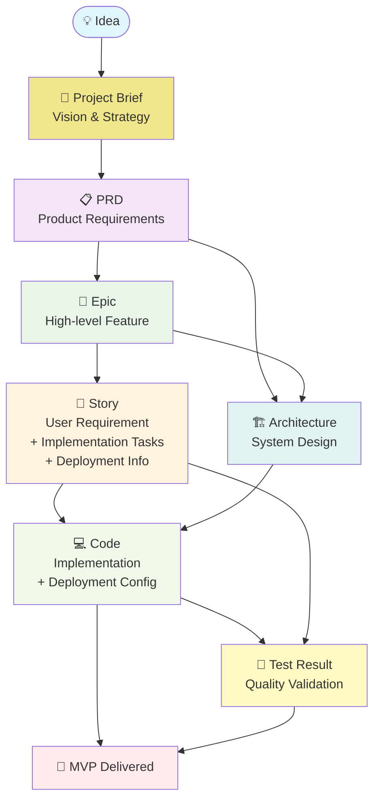
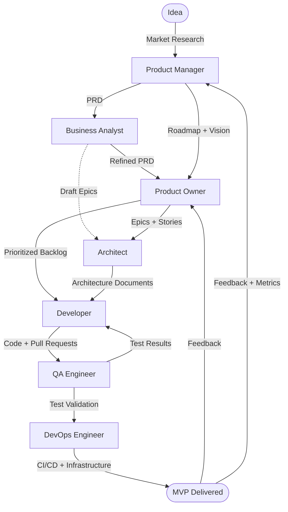
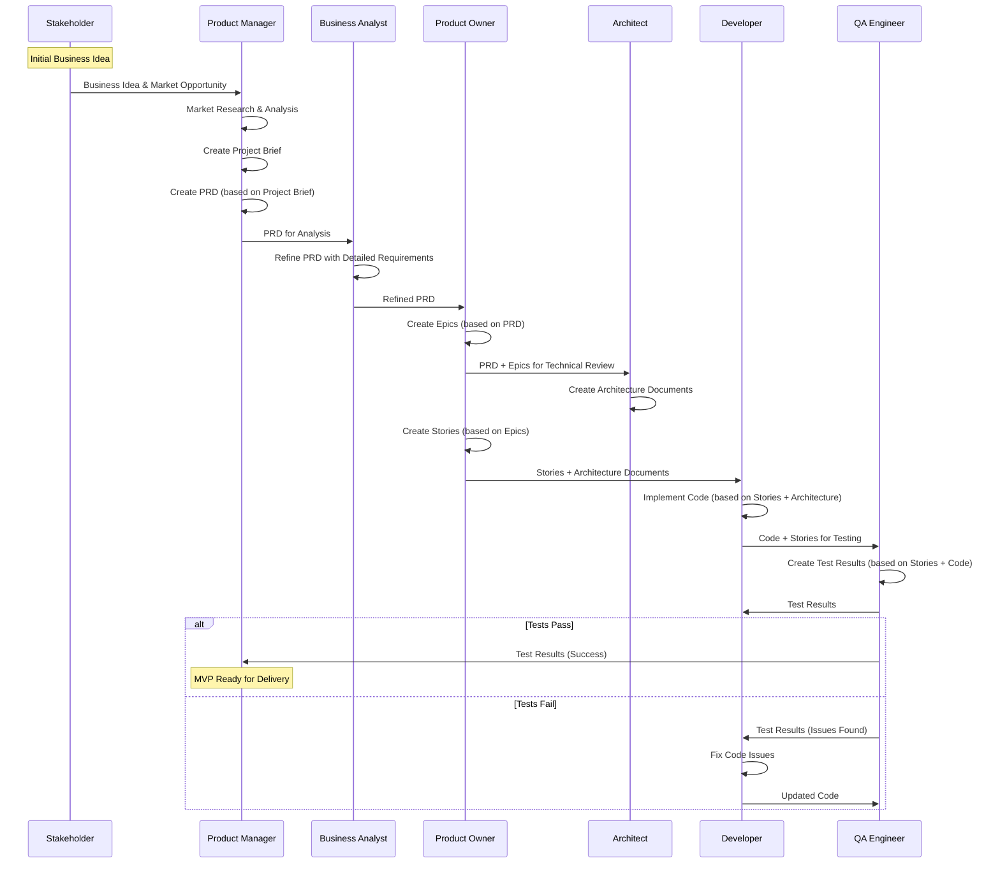
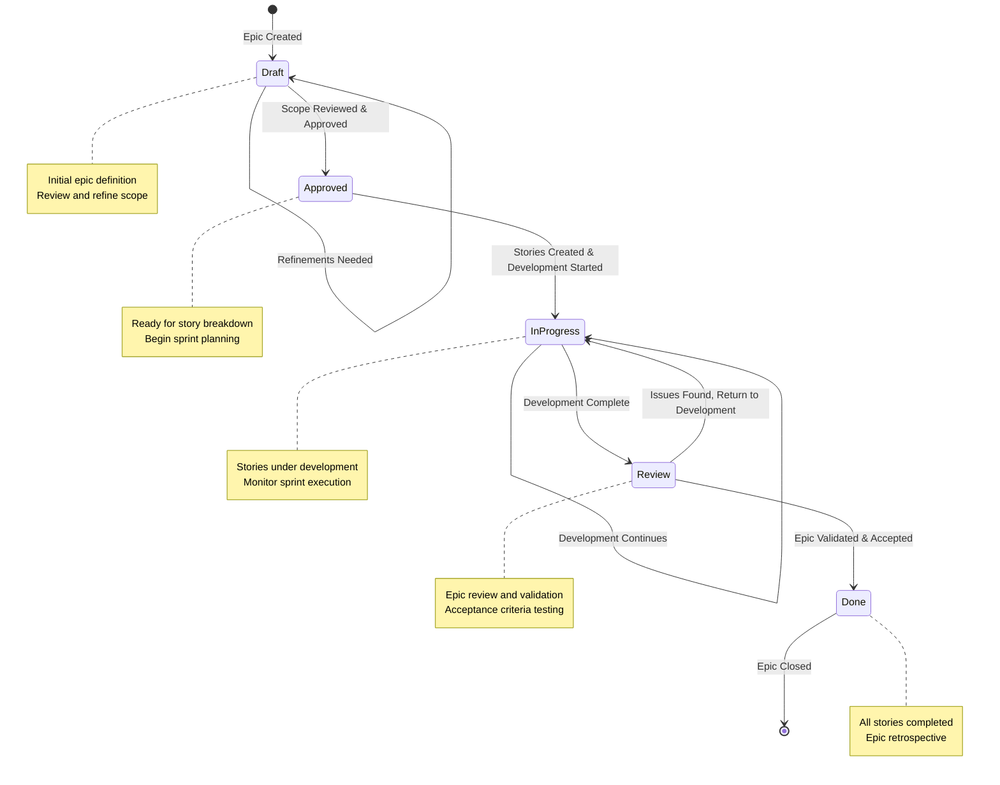

# 13. SDLC Framework

This lightweight SDLC framework provides a structured approach for AI agents to collaborate in software development. The framework is filesystem-based, natural language oriented, and designed for agent-to-agent communication through well-defined artifacts.

## 13.1 Core Principles

- **Filesystem-First**: All artifacts stored in filesystem, no APIs or events
- **Agent Discovery**: Agents know where to find artifacts through organized directory structure and naming conventions
- **Natural Language**: Human-readable artifacts that agents can process
- **Simple Dependencies**: Clear but minimal artifact relationships
- **Validation**: Static checkers ensure artifact quality, and filesystem integrity

## 13.2 Roles

### Core Roles

| Role | ID | Responsibilities | Input | Output |
|------|----|--------------------|--------|--------|
| **Product Manager** | `product-manager` | Strategic direction, market research, roadmap | Market insights, stakeholder feedback | PRD, roadmap, success metrics |
| **Product Owner** | `product-owner` | Backlog management, sprint planning, story refinement | PRD, roadmap, feedback | Epics, stories, prioritized backlog |
| **Business Analyst** | `business-analyst` | Requirements gathering, workflow design, documentation | Stakeholder inputs, vision | Refined PRD, workflows, acceptance criteria |
| **Architect** | `architect` | System design, technical feasibility, architecture patterns | Epics, requirements, constraints | Architecture documents, technical specifications |
| **Developer** | `developer` | Code implementation, feature development, code reviews | Stories, tasks, architecture specs | Code, pull requests, implementation |
| **QA Engineer** | `qa-engineer` | Testing, quality validation, bug reporting | Stories, code, test cases | Test results, bug reports, quality metrics |
| **DevOps Engineer** | `devops-engineer` | CI/CD, infrastructure, deployment, monitoring | Code, architecture, requirements | Deployment configs, infrastructure, monitoring |

### Role Combinations

For smaller teams, roles can be combined:

- **PO+DM**: Product Owner handles delivery management
- **Dev+QA**: Developer handles basic testing
- **Arch+DevOps**: Architect handles infrastructure decisions

## 13.3 Artifact System

### Artifact Types

**Format**: All artifacts are **Markdown files** (.md) with YAML frontmatter for metadata. This ensures human readability and natural language processing by AI agents.

#### Artifact Relationship Diagram

The SDLC framework creates a structured dependency chain where each artifact builds upon previous work, ensuring traceability from initial concept to delivered product. Ideas flow through strategic planning (PRD), feature definition (Epics), user requirements (Stories), and implementation tasks, while technical artifacts like Architecture guide the development process. Code implementation draws from multiple sources including Stories, Tasks, and Architecture documents to ensure comprehensive coverage. Quality validation through Testing and infrastructure setup via Deployment configurations complete the cycle before MVP delivery. This dependency model ensures that every artifact has clear inputs and produces valuable outputs for downstream activities.

The following diagram shows how SDLC artifacts depend on each other, forming a clear hierarchy from vision to implementation:



Artifact Dependencies Explained:

- **Project Brief**: Root artifact defining project vision, problem statement, and success metrics (no dependencies)
- **PRD**: Product requirements derived from project vision (depends on Project Brief)
- **Epic**: High-level features derived from PRD requirements (depends on PRD). Files should follow the naming convention `{epic_number}-epic-{slug}.md`, e.g., `01-epic-user-authentication.md`.
- **Story**: Breaks down Epic into user-focused requirements with implementation tasks and deployment info (depends on Epic). Files should follow the naming convention `{epic_number}.{story_number}.story.md`, e.g., `01.01.story.md`.
- **Architecture**: Technical design informed by PRD and Epics (depends on PRD, Epic)
- **Code**: Implementation with deployment configurations guided by Stories and Architecture (depends on Story, Architecture)
- **Test Result**: Quality validation of Stories and Code (depends on Story, Code)
- **MVP**: Final deliverable combining all artifacts (depends on Code, Test)

#### Consolidated Artifact Reference

| Artifact Name | Path | Owner | Depends On   | Next Documents | Purpose |
|---------------|------|-------|--------------|----------------|---------|
| **Project Brief** | `/docs/prd/` | `product-manager` | None | PRD | Define project vision, problem statement, target users, and success metrics |
| **PRD** | `/docs/prd/` | `product-manager` | Project Brief | Epic, Architecture | Define product vision, requirements, and success criteria |
| **Architecture Document** | `/docs/architecture/` | `architect` | PRD, Epic | Code | Comprehensive system design with baseline/target architecture, technical decisions, and Epic/Story implementation guidance |
| **Epic** | `/docs/epics/` | `product-owner` | PRD | Story, Architecture | High-level feature or business objective. Files named as `{epic_number}-epic-{slug}.md` for consistency. |
| **Story** | `/docs/stories/` | `product-owner` | Epic | Code, Test | User-focused requirement with acceptance criteria and implementation tasks. Files named as `{epic_number}.{story_number}.story.md` using two-digit format for proper sorting and Epic-Story traceability (e.g., `01.01.story.md`, `01.02.story.md`). |
| **Code** | `-` | `developer` | Story, Architecture | Test, MVP | Implementation artifacts following coding standards |
| **Test Result** | `/docs/tests/` | `qa-engineer` | Story, Code | MVP | Quality validation with test execution results and metrics |

### Artifact Format

All artifacts are **Markdown files** (.md) with natural language content that agents can process and humans can review.

## 13.4 Business Process Flow

### Primary Flow



### Handoff Points

1. **Idea → Product Manager**: Market research and validation
2. **Product Manager → Business Analyst**: PRD creation and refinement
3. **Business Analyst → Product Owner**: Requirements to backlog items
4. **Product Owner → Architect**: Technical feasibility assessment
5. **Architect → Developer**: Implementation guidance
6. **Developer → QA Engineer**: Quality validation
7. **QA Engineer → DevOps Engineer**: Deployment readiness
8. **DevOps Engineer → MVP**: Live system delivery

### Quality Gates

- **Project Brief Approval**: Project vision and strategy approved
- **PRD Approval**: Business requirements validated
- **Architecture Review**: Technical design approved
- **Code Review**: Implementation quality checked
- **Test Validation**: Quality criteria met
- **Deployment Readiness**: Production criteria satisfied

## 13.5 Configuration

### Framework Structure

The SDLC Framework follows a simple directory structure:

```bash
/docs/
├── prd/                          # Product vision & requirements
│   ├── project-brief.md          # Project vision & strategy
│   ├── prd.md                    # Product requirements
│   └── roadmap.md # Implementation roadmap & timeline
├── epics/                        # High-level features
│   └── 01-epic-user-authentication.md # Epic file named as {epic_number}-epic-{slug}.md
├── stories/                      # User stories with implementation tasks and deployment info
│   └── 01.01.story.md            # Story file named as {epic_number}.{story_number}.story.md
├── architecture/                 # Complete system design & documentation
│   ├── adr/                      # Architecture Decision Records
│   │   └── 001-example-decision.md # ADR files for architectural decisions
│   ├── 01-introduction.md        # System overview & scope
│   ├── 02-high-level-architecture.md # Core system design
│   ├── 03-tech-stack.md          # Technology choices & rationale
│   ├── 04-data-models.md         # Data structures & relationships
│   ├── 05-components.md          # System components & interfaces
│   ├── 06-distribution-and-release-management.md # Deployment architecture
│   ├── 07-error-handling-strategy.md # Error management approach
│   ├── 08-security.md            # Security architecture & controls
│   ├── 09-coding-standards.md    # Development standards & practices
│   ├── 11-source-tree.md         # Code organization structure
│   ├── 12-nfr.md                 # Non-functional requirements
│   ├── 13-sdlc-framework.md      # Development process framework
│   └── 99-appendix-sad.md        # Software Architecture Document appendix
└── tests/                        # Quality validation
    └── test-results-001.md
```

## 13.6 Artifact Creation

### Role Responsibilities

Each SDLC role is responsible for creating specific artifacts:

| SDLC Role | Primary Responsibilities | Artifact Outputs |
|-----------|-------------------------|------------------|
| **Product Manager** | Strategic planning, market research | Project Brief, PRD, Roadmap |
| **Product Owner** | Backlog management, story definition | Epics, Stories |
| **Business Analyst** | Requirements analysis, workflow design | Refined PRD, Workflows |
| **Architect** | System design, technical decisions | Architecture Documents |
| **Developer** | Implementation, code development | Code, Implementation |
| **QA Engineer** | Testing, quality assurance | Test Results, Quality Reports |
| **DevOps Engineer** | Infrastructure, deployment (as part of code and stories) | Deployment configs within code repository |

## 13.7 End-to-End Scenario: Idea to Code

This section demonstrates the complete artifact flow from initial idea through to implementation, showing how each role contributes and transfers artifacts to the next stage of the SDLC process.

### Artifact Transfer Sequence

The following sequence diagram illustrates how artifacts are created and transferred between roles in a typical end-to-end scenario:



This scenario demonstrates how artifacts evolve and transform:

1. **Stakeholder Idea** → **Project Brief**: Product Manager captures business vision and strategy
2. **Project Brief** → **PRD**: Product Manager defines detailed product requirements
3. **PRD** → **Refined PRD**: Business Analyst adds detailed workflows and acceptance criteria
4. **Refined PRD** → **Epics**: Product Owner breaks down requirements into high-level features
5. **PRD + Epics** → **Architecture**: Architect designs system to support features
6. **Epics** → **Stories**: Product Owner creates user-focused requirements with implementation tasks
7. **Stories + Architecture** → **Code**: Developer implements features following design
8. **Stories + Code** → **Test Results**: QA Engineer validates implementation against requirements
9. **Validated Code + Test Results** → **MVP**: Ready for delivery

### Key Success Factors

- **Clear Handoffs**: Each role has defined inputs and outputs
- **Artifact Traceability**: Every artifact traces back to business requirements
- **Quality Gates**: Testing validates implementation against original stories
- **Iterative Refinement**: Feedback loops enable continuous improvement
- **Documentation Trail**: Complete audit trail from idea to implementation

## 13.8 Artifact Templates

This section defines the standard templates for core SDLC artifacts, ensuring consistency across all project documentation and enabling AI-assisted content generation.

### 13.8.1 Project Brief Template

**Purpose**: Define the essential foundation for product development by answering why, who, what success looks like, and what constraints shape the solution.

**Owner**: Product Manager

**Dependencies**: None (root artifact)

**File Naming**: `project-brief.md`

**Template Structure**:

```markdown
# Project Brief: {{project_name}}

## Executive Summary
{{executive_summary}}

## Problem Statement
{{problem_statement}}

## Opportunity
{{opportunity}}

## Target Users
{{target_users}}

## Success Metrics
{{success_metrics}}

## Constraints
{{constraints}}

## Key Risks
{{key_risks}}
```

**Template Details**:

#### Field Definitions

| Field | Description | Example | Required |
|-------|-------------|---------|----------|
| `{{project_name}}` | Project identifier | `Multi-Factor Authentication System` | ✅ |
| `{{executive_summary}}` | High-level project overview combining problem, solution, and expected outcome | `Our SaaS platform experiences 2,500 password-related support tickets monthly, consuming 15% of support resources and frustrating users. We will implement biometric authentication and social login options to reduce password dependency, targeting 80% reduction in support tickets and $50K annual savings. This 3-month initiative serves 10,000+ monthly active users and requires Auth0 integration with a $25K budget.` | ✅ |
| `{{problem_statement}}` | Specific pain point driving this project with scope boundaries | `Users frequently forget passwords leading to 15% of support tickets and account lockouts (2,500/month). Focus on authentication workflow only, excluding password policy management or user registration processes.` | ✅ |
| `{{opportunity}}` | Quantified business value plus high-level solution approach | `Reducing password-related support tickets by 80% would save $50K annually and improve user satisfaction scores by 25%. Implement biometric authentication and social login options to reduce password dependency.` | ✅ |
| `{{target_users}}` | Specific user segments who have this problem with usage patterns | `SaaS platform users (10,000+ monthly active users) who access the platform 3+ times per week. Primary segment: business professionals aged 25-45 accessing from mobile devices (60%) and desktop (40%).` | ✅ |
| `{{success_metrics}}` | How we'll measure if we've solved the problem with specific timelines | `Reduce password-related support tickets by 80% within 3 months, maintain 99.9% uptime, achieve 70% user adoption of new auth methods within 6 months, improve login success rate from 85% to 95%.` | ✅ |
| `{{constraints}}` | Resource, technical, and assumption factors that limit the solution | `Must integrate with existing Auth0 setup, 3-month timeline, $25K budget, maximum 2 developers assigned. Assumes current mobile app architecture supports biometric APIs and users have compatible devices.` | ✅ |
| `{{key_risks}}` | Major risks that could derail the project with impact assessment | `User adoption resistance (HIGH): Users may prefer familiar passwords. Auth0 API changes (MEDIUM): Potential breaking changes during integration. Biometric compatibility (MEDIUM): Older devices may not support all features. Timeline risk (HIGH): Integration complexity may exceed estimates.` | ✅ |

#### Critical Success Factors

**Each field must answer a fundamental question:**

1. **Executive Summary** → "What is this project about?" (The complete picture)
2. **Problem Statement** → "Why are we doing this?" (The pain + scope)
3. **Opportunity** → "Why is this worth doing?" (The gain + approach)
4. **Target Users** → "Who are we doing this for?" (The beneficiary + patterns)
5. **Success Metrics** → "How do we know we succeeded?" (The measurement + timeline)
6. **Constraints** → "What limits what we can do?" (The boundaries + assumptions)
7. **Key Risks** → "What could go wrong?" (The threats + impact)

#### Best Practices

1. **Executive Summary First**: Write a compelling 3-4 sentence overview that captures the essence of the entire project
2. **Be Specific**: Use concrete numbers, timelines, and user segments with demographic details
3. **Be Quantifiable**: Include metrics that can be measured objectively with baseline measurements
4. **Be Actionable**: Provide information that enables the PRD author to make informed decisions
5. **Be Focused**: Each field should provide unique, non-redundant information that drives the project forward
6. **Be Realistic**: Constraints should reflect actual limitations, assumptions, and team capabilities
7. **Risk Assessment**: Identify risks with impact levels (HIGH/MEDIUM/LOW) and mitigation awareness
8. **Scope Boundaries**: Clearly define what's included and excluded to prevent scope creep

#### What's NOT Included (Intentionally)

- **Detailed Solutions**: Technical implementation belongs in PRD and Architecture documents
- **Implementation Details**: Step-by-step execution covered in later SDLC phases
- **Comprehensive Risk Analysis**: Detailed risk management plans belong in project management documents
- **Feature Specifications**: Detailed feature lists belong in PRD and Epic documents
- **Budget Breakdown**: Detailed cost analysis belongs in project management documents

**This enhanced template drives action rather than documentation, focusing on the essential information needed to move the product forward while ensuring critical risks and scope boundaries are clearly understood.**

### 13.8.2 PRD Template

**Purpose**: Define comprehensive product requirements that enable Epic and Story creation by translating Project Brief vision into actionable development specifications.

**Owner**: Product Manager / Business Analyst

**Dependencies**: Project Brief

**File Naming**: `prd.md`

**Template Structure**:

```markdown
# Product Requirements Document: {{product_name}}

## Product Overview
{{product_overview}}

## Business Requirements
{{business_requirements}}

## System Requirements
{{system_requirements}}

## Timeline & Implementation Sequence
{{timeline_implementation_sequence}}

## Acceptance Criteria
{{acceptance_criteria}}
```

**Template Details**:

#### Field Definitions

| Field | Description | Example | Required |
|-------|-------------|---------|----------|
| `{{product_name}}` | Product identifier linked to Project Brief | `Multi-Factor Authentication System` | ✅ |
| `{{product_overview}}` | Context, scope, and strategic goals connecting to Project Brief | `This PRD implements the authentication solution defined in the Project Brief. Strategic Goals: Enable 15-minute user setup, achieve 80% reduction in support tickets, maintain high CI/CD pipeline pass rate. Scope includes login/logout workflows and password recovery. Excludes user registration which will be addressed in future iterations.` | ✅ |
| `{{business_requirements}}` | Numbered business requirements combining user needs and business logic | `BR1: Users must login using biometric authentication (fingerprint/face) with <3 second response time. BR2: Users can view complete login history with timestamps and device information. BR3: System enforces maximum 3 failed login attempts before 15-minute lockout. BR4: Social login automatically creates user account with email verification. BR5: Password reset tokens expire in 24 hours with email notification.` | ✅ |
| `{{system_requirements}}` | Numbered non-functional requirements and technical assumptions | `NFR1: System must support 1000 concurrent users with <3 second response times. NFR2: System must maintain 99.9% uptime with Auth0 integration. NFR3: Biometric templates must be encrypted at rest with AES-256. NFR4: API rate limiting at 100 requests/minute per user. Technical Assumptions: Auth0 infrastructure integration required, iOS 14+ and Android 10+ compatibility, modern browser support.` | ✅ |
| `{{timeline_implementation_sequence}}` | MVP timeline, feature prioritization, dependencies, and roadmap | `MVP Delivery: August 29, 2025. Key Milestones: Schema definition (June), CLI development (July), Agent implementation (August). MVP Requirements: BR1, BR2, BR5, NFR1, NFR2. Future Iterations: BR3, BR4, NFR3, NFR4. Implementation Dependencies: BR1 (user login) must precede BR2 (login history), NFR1 (performance) must be validated before NFR2 (scale testing). Post-MVP Roadmap: Q4 2025 enhanced authentication, Q1 2026 enterprise features.` | ✅ |
| `{{acceptance_criteria}}` | How to validate requirements with MVP success criteria | `Requirements Validation: Each BR/NFR must pass specific acceptance tests. BR1 validated through biometric accuracy testing (99.5% success rate). NFR1 validated through load testing (1000 concurrent users). MVP Success Criteria: User completes biometric login in <3 seconds, system passes security audit, CI/CD pipeline achieves 95% pass rate for AI-generated commits.` | ✅ |

#### Critical Success Factors

**Each section enables specific Epic/Story creation:**

1. **Product Overview** → Epic scope definition, strategic context, and prioritization guidance
2. **Business Requirements (BR1, BR2...)** → User-focused Epics, user stories, and business logic stories
3. **System Requirements (NFR1, NFR2...)** → Technical Epics, infrastructure stories, and architecture constraints
4. **Timeline & Implementation Sequence** → Epic sequencing, sprint planning, dependency management, and release scheduling
5. **Acceptance Criteria** → Epic completion criteria, testing stories, and MVP validation approach

#### Best Practices

1. **Reference Project Brief**: Always link back to the originating Project Brief for strategic context
2. **Numbered Requirements**: Use BR1, BR2, BR3... for business requirements and NFR1, NFR2, NFR3... for system requirements
3. **Be Specific and Testable**: Every requirement should be verifiable through testing with clear acceptance criteria
4. **Comprehensive Business Requirements**: Combine user needs AND business logic in BR section (user actions + system behavior)
5. **Technical Assumptions**: Include architecture decisions and technical constraints in NFR section
6. **Define Boundaries**: Clearly state what's included and excluded from scope in Product Overview
7. **Strategic Goals**: Include success metrics and strategic objectives from Project Brief
8. **Direct Story Mapping**: Each BR/NFR should map directly to one or more user stories
9. **Timeline Planning**: Define clear MVP boundaries, implementation dependencies, and milestone dates
10. **Epic Sequencing**: Provide dependency information that enables proper Epic and Sprint planning
11. **MVP Focus**: Emphasize MVP success criteria in Acceptance Criteria section

#### What's NOT Included (Intentionally)

- **Detailed Epic/Story Breakdown**: Specific Epic and Story definitions belong in Epic and Story documents
- **Technical Architecture**: Detailed system design and component architecture belong in Architecture documents
- **Detailed UI/UX Specifications**: Interface mockups and user experience flows belong in Design documents
- **Resource Planning**: Team assignments, budget details, and capacity planning belong in Project Management documents
- **Detailed Testing Procedures**: Specific test cases and testing scripts belong in QA documentation
- **Deployment Instructions**: Step-by-step operations and infrastructure setup belong in DevOps documentation
- **Code Implementation**: Actual code, APIs, and technical implementation belong in Developer documentation

**This PRD template drives Epic and Story creation rather than documentation, focusing on the essential requirements needed for successful product development.**

### 13.8.3 Epic Template

**Purpose**: Define high-level features and business objectives with clear delivery guidance, providing strategic direction and implementation roadmap for development teams.

**Owner**: Product Owner

**Dependencies**: PRD

**File Naming**: `{epic_number}-epic-{slug}.md` (e.g., `01-epic-user-management.md`)

**Template Structure**:

```markdown
# Epic {{epic_number}}: {{epic_title}}

## Status

| Field                | Value                    |
|----------------------|--------------------------|
| Status               | {{status}}               |
| Priority             | {{priority}}             |
| Epic Owner           | {{owner}}                |
| Timeline             | {{timeline}}             |

## Epic Goal

{{epic_goal}}

## Epic Overview

{{epic_overview}}

## PRD Requirements

{{prd_requirements}}

## User Scenarios

{{user_scenarios}}

## Success Criteria

{{success_criteria}}

## Deliverables

{{deliverables}}

## Technical Tasks

{{technical_tasks}}

## Dependencies

{{dependencies}}

## Risk Mitigation

{{risk_mitigation}}

## Definition of Done

{{definition_of_done}}

## Architecture Alignment

{{architecture_alignment}}

## Estimated Effort

{{estimated_effort}}
```

**Template Details**:

#### Field Definitions

| Field | Description | Example | Required |
|-------|-------------|---------|----------|
| `{{epic_number}}` | Epic identifier matching filename | `01` | ✅ |
| `{{epic_title}}` | Brief descriptive title | `Install Command and Update Management` | ✅ |
| `{{status}}` | Current epic status | `Draft`, `Approved`, `In Progress`, `Review`, `Done` | ✅ |
| `{{priority}}` | Business priority | `High`, `Medium`, `Low` | ✅ |
| `{{owner}}` | Epic owner/champion | `Product Owner`, `John Doe` | ✅ |
| `{{timeline}}` | Expected duration | `Week 4`, `Q2 2025`, `3 months` | ✅ |
| `{{epic_goal}}` | Clear, measurable outcome | `Enable offline framework installation and bundle-based update management, allowing users to easily extract and install embedded KubeRocketAI framework components from the CLI binary.` | ✅ |
| `{{epic_overview}}` | Strategic context and direction | `This epic focuses on the offline installation mechanism that allows users to extract framework assets embedded in the CLI binary into their local projects, combined with intelligent update detection and guided update processes.` | ✅ |
| `{{prd_requirements}}` | PRD requirements this Epic addresses | `Addresses BR1 (offline installation), BR2 (update detection), NFR1 (cross-platform compatibility), NFR2 (performance requirements). Links to specific business requirements for traceability and testing validation.` | ✅ |
| `{{user_scenarios}}` | Main user workflows that become Stories | `User installs framework assets offline when network unavailable. User receives update notification and follows guided update process. User resolves version mismatch with clear instructions. Each scenario maps to 1-2 user stories.` | ✅ |
| `{{success_criteria}}` | Specific, testable outcomes | `- [ ] krci-ai install successfully extracts embedded framework assets<br>- [ ] Installation works completely offline<br>- [ ] Version mismatch detection works reliably` | ✅ |
| `{{deliverables}}` | Organized components by purpose | `### 1. Install Command<br>**Purpose**: Offline framework installation<br>**Components**: CLI command, asset extraction, backup functionality` | ✅ |
| `{{technical_tasks}}` | Specific implementation steps | `- Implement embedded asset extraction using Go embed<br>- Build file system management for local organization<br>- Add GitHub releases API integration` | ✅ |
| `{{dependencies}}` | Required prerequisites | `- Core engine and validation system (from Epic 2)<br>- Go embed functionality for asset extraction<br>- Package manager integration (brew, chocolatey)` | ✅ |
| `{{risk_mitigation}}` | Risk management strategies | `**Asset Extraction Risk**: Validate embedded assets during CLI build process<br>**Data Loss Risk**: Always backup before installation/updates` | ✅ |
| `{{definition_of_done}}` | Comprehensive completion criteria | `- Install command reliably extracts embedded framework assets<br>- Installation works completely offline<br>- Update detection identifies available CLI versions<br>- Backup/restore functionality protects user customizations` | ✅ |
| `{{architecture_alignment}}` | System consistency | `This epic maintains the local-first architecture with embedded asset distribution while adding intelligent update detection, following the bundle-based distribution model.` | ✅ |
| `{{estimated_effort}}` | Timeline and complexity | `**Duration**: 1 week (Week 4)<br>**Complexity**: Medium (Asset extraction, API integration)<br>**Risk Level**: Low (Offline core operations)` | ✅ |

#### Status Lifecycle

The Epic follows a structured lifecycle from initial creation through completion:



| Status | Description | Next Actions |
|--------|-------------|--------------|
| **Draft** | Initial epic definition | Review and refine scope |
| **Approved** | Ready for story breakdown and development planning | Create user stories and begin sprint planning |
| **In Progress** | Stories under development | Monitor story progress and sprint execution |
| **Review** | Pending final approval | Conduct epic review and validation |
| **Done** | All stories completed | Epic retrospective and lessons learned |

#### Best Practices

1. **Epic Numbering**: Use 2-digit format for clear identification (e.g., `01`, `02`)
2. **Clear Goals**: Write specific, measurable outcomes that define success
3. **Strategic Context**: Provide Epic Overview that connects to broader strategy and business value
4. **PRD Traceability**: Explicitly reference which BR/NFR requirements this Epic addresses for requirements management
5. **User-Centric Scenarios**: Define user workflows that directly map to Story creation and acceptance criteria
6. **Success Criteria**: Define specific, testable checkboxes that validate epic completion
7. **Deliverable Organization**: Structure deliverables by purpose with clear components
8. **Technical Depth**: Include specific implementation tasks that guide development teams
9. **Risk Management**: Proactively identify risks and mitigation strategies
10. **Comprehensive Done**: Define completion criteria that include both technical and process requirements
11. **Architecture Consistency**: Ensure epic aligns with system architecture and design principles
12. **Realistic Estimation**: Provide timeline, complexity, and risk assessment for planning

### 13.8.4 Story Template

**Purpose**: Define user-focused requirements with implementation tasks and acceptance criteria, providing complete traceability from business need to technical implementation.

**Owner**: Product Owner

**Dependencies**: Epic

**File Naming**: `{epic_number}.{story_number}.story.md` (e.g., `01.01.story.md`)

**Template Structure**:

```markdown
# Story {{story_number}}: {{story_title}}

## Status

| Field                  | Value                       |
|------------------------|-----------------------------|
| Status                 | {{status}}                  |
| Epic                   | {{epic_reference}}          |
| Priority               | {{priority}}                |
| Estimated Story Points | {{story_points}}            |
| Jira                   | {{jira_ticket}}             |

## Dependencies

{{dependencies}}

## Story

**As a** {{persona}},
**I want** {{goal}},
**so that** {{business_value}}.

## Acceptance Criteria

{{acceptance_criteria}}

## Dev Notes

{{dev_notes}}

## Tasks/Subtasks

{{tasks_subtasks}}

## Dev Agent Record

{{dev_agent_record}}
```

**Template Details**:

#### Field Definitions

| Field | Description | Example | Required |
|-------|-------------|---------|----------|
| `{{story_number}}` | Story identifier matching filename | `01.01` | ✅ |
| `{{story_title}}` | Brief descriptive title | `User Registration` | ✅ |
| `{{status}}` | Current story status | `Draft`, `In Progress`, `Done` | ✅ |
| `{{epic_reference}}` | Reference to parent epic | `01-epic-user-management.md` | ✅ |
| `{{priority}}` | Business priority | `High`, `Medium`, `Low` | ✅ |
| `{{story_points}}` | Effort estimation | `3`, `5`, `8` | ✅ |
| `{{jira_ticket}}` | External ticket reference | `PROJ-123` | ❌ |
| `{{dependencies}}` | Required prerequisites | `- **Stories 1.1-1.8 Complete**: Core agent definitions and CLI infrastructure required<br>- **ADR-012**: Agent Customization Field Enhancement decision implemented` | ✅ |
| `{{persona}}` | User type or role | `Framework Developer`, `registered user`, `admin` | ✅ |
| `{{goal}}` | What user wants to achieve | `support the new mandatory customization field in agent schemas` | ✅ |
| `{{business_value}}` | Why this matters | `the new version enforces schema compliance while developers can manually migrate existing agents` | ✅ |
| `{{acceptance_criteria}}` | Testable conditions | Numbered list of specific, testable conditions with clear validation criteria | ✅ |
| `{{tasks_subtasks}}` | Implementation checklist | `- [x] Task 1: Update Agent JSON Schema (AC: 1, 2, 3, 4)<br>  - [x] Add mandatory customization field to agent JSON schema<br>  - [x] Update schema validation logic to require customization field<br>  - [x] Test schema validation with agents including and missing customization field` | ✅ |
| `{{dev_notes}}` | Comprehensive context | `### Previous Story Insights<br>Implementation context and architectural decisions<br>### Data Models<br>Technical specifications and requirements<br>### File Locations<br>Specific implementation guidance` | ✅ |
| `{{dev_agent_record}}` | AI agent tracking | `### Agent Model Used: James - Full Stack Developer (dev-v1)<br>### Completion Notes List<br>Implementation summary and technical foundation` | ✅ |

#### Status Lifecycle

| Status | Description | Next Actions |
|--------|-------------|--------------|
| **Draft** | Initial story definition | Review and refine requirements |
| **Ready** | Approved for development | Assign to developer |
| **In Progress** | Under active development | Continue implementation |
| **Review** | Pending approval | Conduct code/design review |
| **Testing** | Quality assurance phase | Execute test cases |
| **Done** | Completed and verified | Move to production |

#### Best Practices

1. **Story Numbering**: Use 2-digit format linking to parent epic (e.g., `01.01`, `01.02`)
2. **User Story Format**: Always use "As a... I want... so that..." structure
3. **Dependencies First**: List story and technical dependencies before the story definition
4. **Acceptance Criteria**: Write numbered, specific, and testable conditions with clear validation criteria
5. **Tasks/Subtasks Checklist**: Use checkbox format with task groups and specific sub-tasks
6. **Acceptance Criteria Mapping**: Link tasks to acceptance criteria (AC: 1, 2, 3, 4)
7. **Progress Tracking**: Use [x] for completed items, [ ] for pending items
8. **Comprehensive Dev Notes**: Include business context, technical specifications, file locations, and implementation guidance
9. **AI Agent Tracking**: Document which AI agent implemented the story and completion notes
10. **Traceability**: Maintain clear links to parent epic, related stories, and architectural decisions

### 13.8.5 Architecture Document Template

**Purpose**: Define comprehensive system architecture, providing technical design guidance that bridges PRD requirements to Epic/Story implementation.

**Owner**: Architect

**Dependencies**: PRD, Epic

**File Naming**:

- **Single File**: `architecture.md`
- **Multiple Files**: `01-executive-summary.md`, `02-introduction.md`, `06-target-architecture.md`, etc.

**Architecture Template Options**:

- **Current Project Structure**: Use existing architecture organization (01-introduction.md, 02-high-level-architecture.md, etc.) for consistency with current documentation
- **Enterprise SAD Template**: See [99. Appendix: Solution Architecture Document Template](./99-appendix-sad.md) for comprehensive enterprise architecture documentation with PRD traceability and Epic breakdown guidance
- **Hybrid Approach**: Extend current structure with additional SAD template sections as needed (requirements mapping, baseline architecture, etc.)

**Template Selection Guidance**:

- **Framework/Tool Projects**: Use current structure (suitable for CLI tools and frameworks)
- **Enterprise Projects**: Use full SAD template structure (suitable for complex business systems)
- **Growing Projects**: Start with current structure, migrate to SAD template as complexity increases

### 13.8.6 Test Results Template

**Purpose**: Document quality validation outcomes and provide clear testing status for Story and Code artifacts.

**Owner**: QA Engineer

**Dependencies**: Story, Code

**File Naming**: `test-results-{story-number}.md` (e.g., `test-results-01.01.md`)

**Template Structure**:

```markdown
# Test Results: {{story_reference}}

## Test Summary
| Field | Value |
|-------|-------|
| Story | {{story_reference}} |
| Test Date | {{test_date}} |
| Tester | {{tester_name}} |
| Overall Status | {{overall_status}} |

## Test Execution
### Acceptance Criteria Validation
{{acceptance_criteria_results}}

### Test Cases
| Test Case | Expected Result | Actual Result | Status |
|-----------|----------------|---------------|--------|
| {{test_case}} | {{expected}} | {{actual}} | {{status}} |

## Quality Metrics
- **Pass Rate**: {{pass_rate}}%
- **Defects Found**: {{defects_count}}
- **Coverage**: {{coverage_percentage}}%

## Issues & Recommendations
{{issues_recommendations}}
```

### 13.8.7 Code Implementation Standards

**Purpose**: Define consistent coding practices and implementation guidance for Developer role.

**Owner**: Developer (with Architect input)

**Dependencies**: Story, Architecture

**Standards Coverage**:

```markdown
# Code Implementation Standards

## File Organization
- Follow repository structure defined in Architecture Document
- Implement features according to Story acceptance criteria
- Maintain clear separation of concerns

## Quality Requirements
- Code coverage: Minimum 80% for new features
- Documentation: All public APIs documented
- Testing: Unit tests for all business logic
- Security: Follow OWASP guidelines

## Implementation Checklist
- [ ] Code implements all Story acceptance criteria
- [ ] Unit tests written and passing
- [ ] Code review completed
- [ ] Security scan passed
- [ ] Documentation updated
```

## 13.9 Framework Implementation Requirements

Based on the KubeRocketAI 4-component architecture, the following implementation structure supports the SDLC artifact flow:

### Required Components

**Agent Structure** (WHO - SDLC Roles):

```yaml
agent:
  identity:
    name: "Product Manager"
    id: "product-manager-v1"
    role: "Strategic product direction"
    goal: "Define product vision and roadmap"
  commands:
    help: "Show available commands"
    chat: "(Default) Product consultation"
    exit: "Exit persona command"
    create-brief: "Create project brief"
    create-prd: "Create product requirements document"
  tasks:
    - "./.krci-ai/tasks/create-project-brief.md"
    - "./.krci-ai/tasks/create-prd.md"
```

**Task Structure** (WHAT - SDLC Procedures):

```markdown
# Task: Create Project Brief

## Description
Create comprehensive project brief defining vision, problem statement, and success metrics

## Instructions
1. Analyze stakeholder requirements and market opportunity
2. Define problem statement and target users
3. Establish success metrics and constraints
4. Format output using [project-brief-template.md](./.krci-ai/templates/project-brief-template.md)
```

**Template Structure** (HOW - Output Format):

```markdown
# Project Brief: {{project_name}}

## Executive Summary
{{executive_summary}}

## Problem Statement
{{problem_description}}

## Target Users
{{target_users}}

## Success Metrics
{{success_metrics}}
```

**Data Structure** (REFERENCE - Standards):

```yaml
# data/sdlc-standards.yaml
standards:
  artifact_requirements:
    - "All artifacts must be in Markdown format"
    - "Dependencies must be clearly documented"
    - "Acceptance criteria must be testable"
  quality_gates:
    - "PRD approval required before Epic creation"
    - "Architecture review required before implementation"
    - "Test validation required before MVP delivery"
```

### Required Filesystem Structure

```bash
.krci-ai/
├── agents/
│   ├── product-manager.yaml
│   ├── product-owner.yaml
│   ├── architect.yaml
│   ├── developer.yaml
│   └── qa-engineer.yaml
├── tasks/
│   ├── create-project-brief.md
│   ├── create-prd.md
│   ├── create-epic.md
│   ├── create-story.md
│   ├── create-architecture.md
│   └── create-tests.md
├── templates/
│   ├── project-brief-template.md
│   ├── prd-template.md
│   ├── epic-template.md
│   ├── story-template.md
│   ├── architecture-template.md
│   └── test-results-template.md
└── data/
    ├── sdlc-standards.yaml
    ├── coding-standards.yaml
    └── architecture-principles.yaml
```

### Integration Points

- **Agent Commands** map to SDLC artifact creation tasks
- **Task Instructions** follow artifact dependency flow (Brief → PRD → Epic → Story → Code → Test → MVP)
- **Templates** ensure consistent artifact formatting across teams
- **Data Standards** enforce quality gates and validation requirements

This implementation enables AI-assisted SDLC artifact creation while maintaining the dependency flow and quality standards defined in this framework.

## 13.10 Framework Governance

### Quality Gates Enforcement

**Artifact Quality Validation**:

- All templates must be completed with no `{{variable}}` placeholders remaining
- Dependencies must be satisfied before proceeding to next artifact
- Quality criteria in each template must be met

**Escalation Process**:

1. **Artifact Issues**: If artifact is incomplete → Return to owner for completion
2. **Requirement Changes**: If PRD changes → Update dependent artifacts (Epic, Architecture, Story)
3. **Technical Blockers**: If Architecture infeasible → Escalate to Product Manager for scope adjustment

### Change Management

**Requirement Changes**:

- **Minor Changes**: Update affected artifacts and continue
- **Major Changes**: Re-validate entire artifact chain from PRD forward
- **Scope Changes**: Require Product Manager approval and impact assessment

**Version Control**:

- All artifacts tracked through Git version control
- Changes tracked through commit history and directory organization
- Dependencies updated when upstream artifacts change

### Common Issues & Resolutions

| Issue | Cause | Resolution |
|-------|-------|------------|
| **Epic creation blocked** | PRD incomplete or unclear | Return to Product Manager for PRD completion |
| **Story blocked by Architecture** | Architecture not yet defined | Complete Architecture Document before Story creation |
| **Implementation blocked** | Story acceptance criteria unclear | Return to Product Owner for Story refinement |
| **Testing blocked** | Code incomplete | Ensure Developer completes all Story requirements |
| **Agent confusion** | Template variables not filled | Validate all templates using provided checklists |

### Success Metrics

**Framework Effectiveness**:

- **Artifact Completion Rate**: >95% of artifacts completed without rework
- **Dependency Satisfaction**: All dependencies resolved before proceeding
- **Quality Gate Pass Rate**: >90% of artifacts pass quality gates on first review
- **Time to Value**: Consistent delivery timeline from Project Brief to MVP

This governance framework ensures smooth operation while maintaining the lightweight nature of the SDLC process.
