# 13. SDLC Framework

This lightweight SDLC framework provides a structured approach for AI agents to collaborate in software development. The framework is filesystem-based, natural language oriented, and designed for agent-to-agent communication through well-defined artifacts.

## 13.1 Core Principles

- **Filesystem-First**: All artifacts stored in filesystem, no APIs or events
- **Agent Discovery**: Agents know where to find artifacts through organized directory structure and naming conventions
- **Natural Language**: Human-readable artifacts that agents can process
- **Simple Dependencies**: Clear but minimal artifact relationships
- **Validation**: Static checkers ensure artifact quality, and filesystem integrity

## 13.2 Roles

### Core Roles

| Role | ID | Responsibilities | Input | Output |
|------|----|--------------------|--------|--------|
| **Product Manager** | `product-manager` | Strategic direction, market research, roadmap | Market insights, stakeholder feedback | PRD, roadmap, success metrics |
| **Product Owner** | `product-owner` | Backlog management, sprint planning, story refinement | PRD, roadmap, feedback | Epics, stories, prioritized backlog |
| **Business Analyst** | `business-analyst` | Requirements gathering, workflow design, documentation | Stakeholder inputs, vision | Refined PRD, workflows, acceptance criteria |
| **Architect** | `architect` | System design, technical feasibility, architecture patterns | Epics, requirements, constraints | Architecture documents, technical specifications |
| **Developer** | `developer` | Code implementation, feature development, code reviews | Stories, tasks, architecture specs | Code, pull requests, implementation |
| **QA Engineer** | `qa-engineer` | Testing, quality validation, bug reporting | Stories, code, test cases | Test results, bug reports, quality metrics |
| **DevOps Engineer** | `devops-engineer` | CI/CD, infrastructure, deployment, monitoring | Code, architecture, requirements | Deployment configs, infrastructure, monitoring |
| **Product Marketing Manager** | `product-marketing-manager` | Go-to-market strategy, sales enablement, promotional materials | PRD, MVP, market research | Marketing brief, pitch decks, sales materials, launch campaigns |

### Role Combinations

For smaller teams, roles can be combined:

- **PO+DM**: Product Owner handles delivery management
- **Dev+QA**: Developer handles basic testing
- **Arch+DevOps**: Architect handles infrastructure decisions

## 13.3 Artifact System

### Artifact Types

**Format**: All artifacts are **Markdown files** (.md) with YAML frontmatter for metadata. This ensures human readability and natural language processing by AI agents.

#### Artifact Relationship Diagram

The SDLC framework creates a structured dependency chain where each artifact builds upon previous work, ensuring traceability from initial concept to delivered product. Ideas flow through strategic planning (PRD), feature definition (Epics), user requirements (Stories), and implementation tasks, while technical artifacts like Architecture guide the development process. Code implementation draws from multiple sources including Stories, Tasks, and Architecture documents to ensure comprehensive coverage. Quality validation through Testing and infrastructure setup via Deployment configurations complete the cycle before MVP delivery. This dependency model ensures that every artifact has clear inputs and produces valuable outputs for downstream activities.

The following diagram shows how SDLC artifacts depend on each other, forming a clear hierarchy from vision to implementation:

```mermaid
graph TD
    Idea([💡 Idea]) --> Brief[📄 Project Brief<br/>Vision & Strategy]
    Brief --> PRD[📋 PRD<br/>Product Requirements]
    PRD --> Epic[🎯 Epic<br/>High-level Feature]
    Epic --> Story[📖 Story<br/>User Requirement<br/>+ Implementation Tasks<br/>+ Deployment Info]

    PRD --> Arch[🏗️ Architecture<br/>System Design]
    Epic --> Arch
    Story --> Code[💻 Code<br/>Implementation<br/>+ Deployment Config]
    Arch --> Code

    Code --> Test[🧪 Test Result<br/>Quality Validation]
    Story --> Test

    Code --> MVP[🎉 MVP Delivered]
    Test --> MVP

    PRD --> Marketing[🚀 Marketing Brief<br/>Go-to-Market Strategy]
    MVP --> Marketing
    Marketing --> Launch[📢 Launch Materials<br/>Promotional Campaign]
    Marketing --> Sales[💼 Sales Enablement<br/>Revenue Tools]
    Launch --> Success[📈 Market Success]
    Sales --> Success

    style Idea fill:#e1f5fe,stroke:#333,color:#000
    style Brief fill:#f0e68c,stroke:#333,color:#000
    style PRD fill:#f3e5f5,stroke:#333,color:#000
    style Epic fill:#e8f5e8,stroke:#333,color:#000
    style Story fill:#fff3e0,stroke:#333,color:#000
    style Arch fill:#e0f2f1,stroke:#333,color:#000
    style Code fill:#f1f8e9,stroke:#333,color:#000
    style Test fill:#fff9c4,stroke:#333,color:#000
    style MVP fill:#ffebee,stroke:#333,color:#000
    style Marketing fill:#e8f4fd,stroke:#333,color:#000
    style Launch fill:#fef3e2,stroke:#333,color:#000
    style Sales fill:#f0f9f0,stroke:#333,color:#000
    style Success fill:#fdf2f8,stroke:#333,color:#000
```



Artifact Dependencies Explained:

- **Project Brief**: Root artifact defining project vision, problem statement, and success metrics (no dependencies)
- **PRD**: Product requirements derived from project vision (depends on Project Brief)
- **Epic**: High-level features derived from PRD requirements (depends on PRD). Files should follow the naming convention `{epic_number}-epic-{slug}.md`, e.g., `01-epic-user-authentication.md`.
- **Story**: Breaks down Epic into user-focused requirements with implementation tasks and deployment info (depends on Epic). Files should follow the naming convention `{epic_number}.{story_number}.story.md`, e.g., `01.01.story.md`.
- **Architecture**: Technical design informed by PRD and Epics (depends on PRD, Epic)
- **Code**: Implementation with deployment configurations guided by Stories and Architecture (depends on Story, Architecture)
- **Test Result**: Quality validation of Stories and Code (depends on Story, Code)
- **MVP**: Final deliverable combining all artifacts (depends on Code, Test)
- **Marketing Brief**: Go-to-market strategy and positioning (depends on PRD, MVP)
- **Launch Materials**: Promotional campaign content and assets (depends on Marketing Brief)
- **Sales Enablement**: Sales tools and revenue generation materials (depends on Marketing Brief)
- **Market Success**: Achieved market adoption and business results (depends on Launch Materials, Sales Enablement)

#### Consolidated Artifact Reference

| Artifact Name | Path | Owner | Depends On   | Next Documents | Purpose |
|---------------|------|-------|--------------|----------------|---------|
| **Project Brief** | `/docs/prd/` | `product-manager` | None | PRD | Define project vision, problem statement, target users, and success metrics |
| **PRD** | `/docs/prd/` | `product-manager` | Project Brief | Epic, Architecture | Define product vision, requirements, and success criteria |
| **Architecture Document** | `/docs/architecture/` | `architect` | PRD, Epic | Code | Comprehensive system design with baseline/target architecture, technical decisions, and Epic/Story implementation guidance |
| **Epic** | `/docs/epics/` | `product-owner` | PRD | Story, Architecture | High-level feature or business objective. Files named as `{epic_number}-epic-{slug}.md` for consistency. |
| **Story** | `/docs/stories/` | `product-owner` | Epic | Code, Test | User-focused requirement with acceptance criteria and implementation tasks. Files named as `{epic_number}.{story_number}.story.md` using two-digit format for proper sorting and Epic-Story traceability (e.g., `01.01.story.md`, `01.02.story.md`). |
| **Code** | `-` | `developer` | Story, Architecture | Test, MVP | Implementation artifacts following coding standards |
| **Test Result** | `/docs/tests/` | `qa-engineer` | Story, Code | MVP | Quality validation with test execution results and metrics |
| **Marketing Brief** | `/docs/marketing/` | `product-marketing-manager` | PRD, MVP | Launch Materials, Sales Enablement | Go-to-market strategy, positioning, and marketing campaigns |
| **Launch Materials** | `/docs/marketing/` | `product-marketing-manager` | Marketing Brief | Market Success | Promotional content, press releases, and campaign assets |
| **Sales Enablement** | `/docs/marketing/` | `product-marketing-manager` | Marketing Brief | Market Success | Sales tools, training materials, and revenue generation resources |

### Artifact Format

All artifacts are **Markdown files** (.md) with natural language content that agents can process and humans can review.

## 13.4 Business Process Flow

### Primary Flow


### Handoff Points

1. **Idea → Product Manager**: Market research and validation
2. **Product Manager → Business Analyst**: PRD creation and refinement
3. **Business Analyst → Product Owner**: Requirements to backlog items
4. **Product Owner → Architect**: Technical feasibility assessment
5. **Architect → Developer**: Implementation guidance
6. **Developer → QA Engineer**: Quality validation
7. **QA Engineer → DevOps Engineer**: Deployment readiness
8. **DevOps Engineer → MVP**: Live system delivery
9. **Product Manager → Product Marketing Manager**: Go-to-market strategy development
10. **MVP → Product Marketing Manager**: Product demonstration and marketing material creation
11. **Product Marketing Manager → Market Success**: Revenue generation and customer acquisition

### Quality Gates

- **Project Brief Approval**: Project vision and strategy approved
- **PRD Approval**: Business requirements validated
- **Architecture Review**: Technical design approved
- **Code Review**: Implementation quality checked
- **Test Validation**: Quality criteria met
- **Deployment Readiness**: Production criteria satisfied
- **Marketing Brief Approval**: Go-to-market strategy validated
- **Launch Materials Review**: Promotional content quality assured
- **Sales Enablement Validation**: Revenue generation tools verified

## 13.5 Configuration

### Framework Structure

The SDLC Framework follows a simple directory structure:

```bash
/docs/
├── prd/                          # Product vision & requirements
│   ├── project-brief.md          # Project vision & strategy
│   ├── prd.md                    # Product requirements
│   └── roadmap.md # Implementation roadmap & timeline
├── epics/                        # High-level features
│   └── 01-epic-user-authentication.md # Epic file named as {epic_number}-epic-{slug}.md
├── stories/                      # User stories with implementation tasks and deployment info
│   └── 01.01.story.md            # Story file named as {epic_number}.{story_number}.story.md
├── architecture/                 # Complete system design & documentation
│   ├── adr/                      # Architecture Decision Records
│   │   └── 001-example-decision.md # ADR files for architectural decisions
│   ├── 01-introduction.md        # System overview & scope
│   ├── 02-high-level-architecture.md # Core system design
│   ├── 03-tech-stack.md          # Technology choices & rationale
│   ├── 04-data-models.md         # Data structures & relationships
│   ├── 05-components.md          # System components & interfaces
│   ├── 06-distribution-and-release-management.md # Deployment architecture
│   ├── 07-error-handling-strategy.md # Error management approach
│   ├── 08-security.md            # Security architecture & controls
│   ├── 09-coding-standards.md    # Development standards & practices
│   ├── 11-source-tree.md         # Code organization structure
│   ├── 12-nfr.md                 # Non-functional requirements
│   ├── 13-sdlc-framework.md      # Development process framework
│   └── 99-appendix-sad.md        # Software Architecture Document appendix
└── tests/                        # Quality validation
    └── test-results-001.md
```

## 13.6 Artifact Creation

### Role Responsibilities

Each SDLC role is responsible for creating specific artifacts:

| SDLC Role | Primary Responsibilities | Artifact Outputs |
|-----------|-------------------------|------------------|
| **Product Manager** | Strategic planning, market research | Project Brief, PRD, Roadmap |
| **Product Owner** | Backlog management, story definition | Epics, Stories |
| **Business Analyst** | Requirements analysis, workflow design | Refined PRD, Workflows |
| **Architect** | System design, technical decisions | Architecture Documents |
| **Developer** | Implementation, code development | Code, Implementation |
| **QA Engineer** | Testing, quality assurance | Test Results, Quality Reports |
| **DevOps Engineer** | Infrastructure, deployment (as part of code and stories) | Deployment configs within code repository |

## 13.7 End-to-End Scenario: Idea to Code

This section demonstrates the complete artifact flow from initial idea through to implementation, showing how each role contributes and transfers artifacts to the next stage of the SDLC process.

### Artifact Transfer Sequence

The following sequence diagram illustrates how artifacts are created and transferred between roles in a typical end-to-end scenario:


This scenario demonstrates how artifacts evolve and transform:

1. **Stakeholder Idea** → **Project Brief**: Product Manager captures business vision and strategy
2. **Project Brief** → **PRD**: Product Manager defines detailed product requirements
3. **PRD** → **Refined PRD**: Business Analyst adds detailed workflows and acceptance criteria
4. **Refined PRD** → **Epics**: Product Owner breaks down requirements into high-level features
5. **PRD + Epics** → **Architecture**: Architect designs system to support features
6. **Epics** → **Stories**: Product Owner creates user-focused requirements with implementation tasks
7. **Stories + Architecture** → **Code**: Developer implements features following design
8. **Stories + Code** → **Test Results**: QA Engineer validates implementation against requirements
9. **Validated Code + Test Results** → **MVP**: Ready for delivery

### Key Success Factors

- **Clear Handoffs**: Each role has defined inputs and outputs
- **Artifact Traceability**: Every artifact traces back to business requirements
- **Quality Gates**: Testing validates implementation against original stories
- **Iterative Refinement**: Feedback loops enable continuous improvement
- **Documentation Trail**: Complete audit trail from idea to implementation

## 13.8 Artifact Templates

The templates are already implemented as a part of framework, so this section has been removed.

## 13.9 Framework Implementation Requirements

Based on the KubeRocketAI 4-component architecture, the following implementation structure supports the SDLC artifact flow:

### Required Components

**Agent Structure** (WHO - SDLC Roles):

```yaml
agent:
  identity:
    name: "Product Manager"
    id: "product-manager-v1"
    role: "Strategic product direction"
    goal: "Define product vision and roadmap"
  commands:
    help: "Show available commands"
    chat: "(Default) Product consultation"
    exit: "Exit persona command"
    create-brief: "Create project brief"
    create-prd: "Create product requirements document"
  tasks:
    - "./.krci-ai/tasks/create-project-brief.md"
    - "./.krci-ai/tasks/create-prd.md"
```

**Task Structure** (WHAT - SDLC Procedures):

```markdown
# Task: Create Project Brief

## Description
Create comprehensive project brief defining vision, problem statement, and success metrics

## Instructions
1. Analyze stakeholder requirements and market opportunity
2. Define problem statement and target users
3. Establish success metrics and constraints
4. Format output using [project-brief-template.md](./.krci-ai/templates/project-brief-template.md)
```

**Template Structure** (HOW - Output Format):

```markdown
# Project Brief: {{project_name}}

## Executive Summary
{{executive_summary}}

## Problem Statement
{{problem_description}}

## Target Users
{{target_users}}

## Success Metrics
{{success_metrics}}
```

**Data Structure** (REFERENCE - Standards):

```yaml
# data/sdlc-standards.yaml
standards:
  artifact_requirements:
    - "All artifacts must be in Markdown format"
    - "Dependencies must be clearly documented"
    - "Acceptance criteria must be testable"
  quality_gates:
    - "PRD approval required before Epic creation"
    - "Architecture review required before implementation"
    - "Test validation required before MVP delivery"
```

### Required Filesystem Structure

```bash
.krci-ai/
├── agents/
│   ├── product-manager.yaml
│   ├── product-owner.yaml
│   ├── architect.yaml
│   ├── developer.yaml
│   └── qa-engineer.yaml
├── tasks/
│   ├── create-project-brief.md
│   ├── create-prd.md
│   ├── create-epic.md
│   ├── create-story.md
│   ├── create-architecture.md
│   └── create-tests.md
├── templates/
│   ├── project-brief-template.md
│   ├── prd-template.md
│   ├── epic-template.md
│   ├── story-template.md
│   ├── architecture-template.md
│   └── test-results-template.md
└── data/
    ├── sdlc-standards.yaml
    ├── coding-standards.yaml
    └── architecture-principles.yaml
```

### Integration Points

- **Agent Commands** map to SDLC artifact creation tasks
- **Task Instructions** follow artifact dependency flow (Brief → PRD → Epic → Story → Code → Test → MVP)
- **Templates** ensure consistent artifact formatting across teams
- **Data Standards** enforce quality gates and validation requirements

This implementation enables AI-assisted SDLC artifact creation while maintaining the dependency flow and quality standards defined in this framework.

## 13.10 Framework Governance

### Quality Gates Enforcement

**Artifact Quality Validation**:

- All templates must be completed with no `{{variable}}` placeholders remaining
- Dependencies must be satisfied before proceeding to next artifact
- Quality criteria in each template must be met

**Escalation Process**:

1. **Artifact Issues**: If artifact is incomplete → Return to owner for completion
2. **Requirement Changes**: If PRD changes → Update dependent artifacts (Epic, Architecture, Story)
3. **Technical Blockers**: If Architecture infeasible → Escalate to Product Manager for scope adjustment

### Change Management

**Requirement Changes**:

- **Minor Changes**: Update affected artifacts and continue
- **Major Changes**: Re-validate entire artifact chain from PRD forward
- **Scope Changes**: Require Product Manager approval and impact assessment

**Version Control**:

- All artifacts tracked through Git version control
- Changes tracked through commit history and directory organization
- Dependencies updated when upstream artifacts change

### Common Issues & Resolutions

| Issue | Cause | Resolution |
|-------|-------|------------|
| **Epic creation blocked** | PRD incomplete or unclear | Return to Product Manager for PRD completion |
| **Story blocked by Architecture** | Architecture not yet defined | Complete Architecture Document before Story creation |
| **Implementation blocked** | Story acceptance criteria unclear | Return to Product Owner for Story refinement |
| **Testing blocked** | Code incomplete | Ensure Developer completes all Story requirements |
| **Agent confusion** | Template variables not filled | Validate all templates using provided checklists |

### Success Metrics

**Framework Effectiveness**:

- **Artifact Completion Rate**: >95% of artifacts completed without rework
- **Dependency Satisfaction**: All dependencies resolved before proceeding
- **Quality Gate Pass Rate**: >90% of artifacts pass quality gates on first review
- **Time to Value**: Consistent delivery timeline from Project Brief to MVP

This governance framework ensures smooth operation while maintaining the lightweight nature of the SDLC process.
