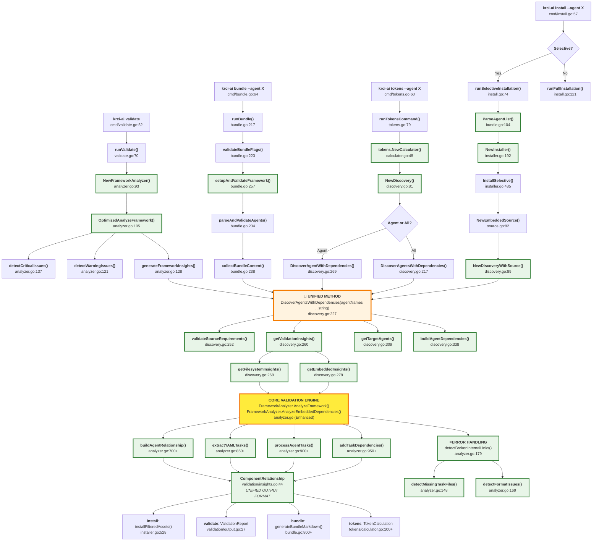

# KubeRocketAI Development Architecture Guide

## **Unified Discovery Method Architecture**

The following diagram shows the improved architecture after unifying the discovery methods, eliminating code duplication while maintaining all functionality:

