# KubeRocketAI Epic Structure

This directory contains the epic definitions for the KubeRocketAI project, organized according to the Roadmap phases (docs/prd/roadmap.md).

## Epic Overview

| Epic | Phase | Duration | Status | Goal | Key Deliverables |
|------|-------|----------|--------|------|------------------|
| [Epic 1: KubeRocketAI Baseline](epic-1-kuberocketai-baseline.md) | Phase 1 | Week 1 | ✅ **COMPLETE** | KubeRocketAI Baseline | Core agents + Basic CLI |
| [Epic 2: Core Engine (Week 2-3)](epic-2-core-engine.md) | Phase 2 | Week 2-3 | ✅ **COMPLETE** | Core Engine | Asset processing + Validation |
| [Epic 3: Install Command and Update Management (Week 4)](epic-3-install-command.md) | Phase 3 | Week 4 | ✅ **COMPLETE** | Install Command | Framework distribution |
| [Epic 4: IDE Integration (Week 5)](epic-4-ide-integration.md) | Phase 4 | Week 5 | ✅ **COMPLETE** | IDE Integration | Automated configuration |
| [Epic 5: Bundle Management](epic-5-bundle-management.md) | Phase 5 | Week 6 | ✅ **COMPLETE** | Bundle Management | Web platform integration |
| [Epic 6: Local Agent Components](epic-6-local-agent-components.md) | Phase 6 | 3 Days | ✅ **COMPLETE** | Local Components | Project-specific customization |
| [Epic 7: Token Management](epic-7-token-management.md) | Phase 7 | 1 Week | 🚧 **IN PROGRESS** | Token Management | Context limit analysis |
| [Epic 8: Selective Installation](epic-8-selective-installation.md) | Phase 8 | 1 Week | ✅ **COMPLETE** | Selective Installation | Granular agent installation |
| [Epic 9: Dogfooding KubeRocketAI](epic-9-dogfooding-kuberocketai.md) | Phase 9 | Q3 2025 | 📋 **PLANNING** | Framework Adoption | Repository integration |
| [Epic 10: MCP Server Management](epic-10-mcp-server-management.md) | Phase 10 | 1 Week | ✅ **READY** | MCP Discovery | Infrastructure dependency visibility |

## Current Status Summary

**Completed Epics (7/10):**

- Epic 1-6: Full foundation through local customization capabilities
- Epic 8: Selective Installation - Granular agent installation complete
- All core functionality delivered including CLI, validation, installation, IDE integration, bundling, local components, and selective installation

**In Progress:**

- Epic 7: Token Management (In Progress) - Token analysis and context limit optimization

**Ready for Development:**

- Epic 10: MCP Server Management (Ready) - Infrastructure dependency discovery through CLI commands

**Planning:**

- Epic 9: Dogfooding KubeRocketAI (Planning) - Repository integration and adoption

## Epic Dependencies

```mermaid
graph LR
    E1[Epic 1<br/>KubeRocketAI Baseline<br/>✅ COMPLETE] --> E2[Epic 2<br/>Core Engine<br/>✅ COMPLETE]
    E2 --> E3[Epic 3<br/>Install Command<br/>✅ COMPLETE]
    E3 --> E4[Epic 4<br/>IDE Integration<br/>✅ COMPLETE]
    E4 --> E5[Epic 5<br/>Bundle Management<br/>✅ COMPLETE]
    E5 --> E6[Epic 6<br/>Local Components<br/>✅ COMPLETE]
    E6 --> E7[Epic 7<br/>Token Management<br/>🚧 IN PROGRESS]
    E3 --> E8[Epic 8<br/>Selective Installation<br/>✅ COMPLETE]
    E8 --> E9[Epic 9<br/>Dogfooding<br/>📋 PLANNING]
    E2 --> E10[Epic 10<br/>MCP Management<br/>✅ READY]

    style E1 fill:#e8f5e9,stroke:#388e3c,stroke-width:2px,color:#111
    style E2 fill:#e8f5e9,stroke:#388e3c,stroke-width:2px,color:#111
    style E3 fill:#e8f5e9,stroke:#388e3c,stroke-width:2px,color:#111
    style E4 fill:#e8f5e9,stroke:#388e3c,stroke-width:2px,color:#111
    style E5 fill:#e8f5e9,stroke:#388e3c,stroke-width:2px,color:#111
    style E6 fill:#e8f5e9,stroke:#388e3c,stroke-width:2px,color:#111
    style E7 fill:#fff3e0,stroke:#f57c00,stroke-width:2px,color:#111
    style E8 fill:#e8f5e9,stroke:#388e3c,stroke-width:2px,color:#111
    style E9 fill:#e3f2fd,stroke:#1976d2,stroke-width:2px,color:#111
    style E10 fill:#e8f5e9,stroke:#4caf50,stroke-width:2px,color:#111
```

