# KubeRocketAI Epic Structure

This directory contains the epic definitions for the KubeRocketAI project, organized according to the Roadmap phases (docs/prd/roadmap.md).

## Epic Overview

| Epic | Phase | Duration | Status | Goal | Key Deliverables |
|------|-------|----------|--------|------|------------------|
| [Epic 1: KubeRocketAI Baseline](epic-1-kuberocketai-baseline.md) | Phase 1 | Week 1 | ✅ **COMPLETE** | KubeRocketAI Baseline | Core agents + Basic CLI |
| [Epic 2: Core Engine (Week 2-3)](epic-2-core-engine.md) | Phase 2 | Week 2-3 | ✅ **COMPLETE** | Core Engine | Asset processing + Validation |
| [Epic 3: Install Command and Update Management (Week 4)](epic-3-install-command.md) | Phase 3 | Week 4 | ✅ **COMPLETE** | Install Command | Framework distribution |
| [Epic 4: IDE Integration (Week 5)](epic-4-ide-integration.md) | Phase 4 | Week 5 | ✅ **COMPLETE** | IDE Integration | Automated configuration |
| [Epic 5: Bundle Management](epic-5-bundle-management.md) | Phase 5 | Week 6 | ✅ **COMPLETE** | Bundle Management | Web platform integration |
| [Epic 6: Local Agent Components](epic-6-local-agent-components.md) | Phase 6 | 3 Days | ✅ **COMPLETE** | Local Components | Project-specific customization |
| [Epic 7: Token Management](epic-7-token-management.md) | Phase 7 | 1 Week | ⏸️ **NOT STARTED** | Token Management | Context limit analysis |
| [Epic 8: Selective Installation](epic-8-selective-installation.md) | Phase 8 | 1 Week | 🚧 **IN PROGRESS** | Selective Installation | Granular agent installation |

## Current Status Summary

**Completed Epics (6/8):**

- Epic 1-6: Full foundation through local customization capabilities
- All core functionality delivered including CLI, validation, installation, IDE integration, bundling, and local components

**In Progress:**

- Epic 8: Selective Installation (In Progress) - Granular agent installation capabilities following bundle command patterns

**Pending:**

- Epic 7: Token Management (Not Started) - Token analysis and context limit optimization awaiting implementation

## Epic Dependencies

```mermaid
graph LR
    E1[Epic 1<br/>KubeRocketAI Baseline<br/>✅ COMPLETE] --> E2[Epic 2<br/>Core Engine<br/>✅ COMPLETE]
    E2 --> E3[Epic 3<br/>Install Command<br/>✅ COMPLETE]
    E3 --> E4[Epic 4<br/>IDE Integration<br/>✅ COMPLETE]
    E4 --> E5[Epic 5<br/>Bundle Management<br/>✅ COMPLETE]
    E5 --> E6[Epic 6<br/>Local Components<br/>✅ COMPLETE]
    E6 --> E7[Epic 7<br/>Token Management<br/>⏸️ NOT STARTED]
    E3 --> E8[Epic 8<br/>Selective Installation<br/>🚧 IN PROGRESS]
```

